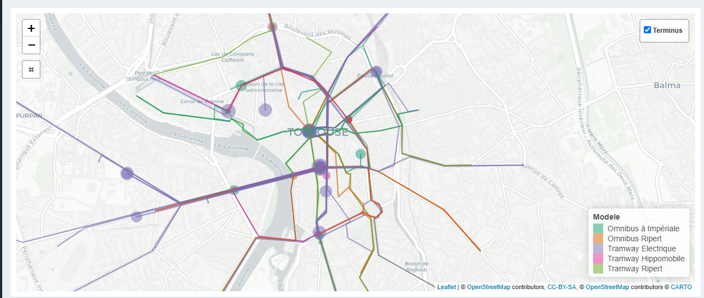
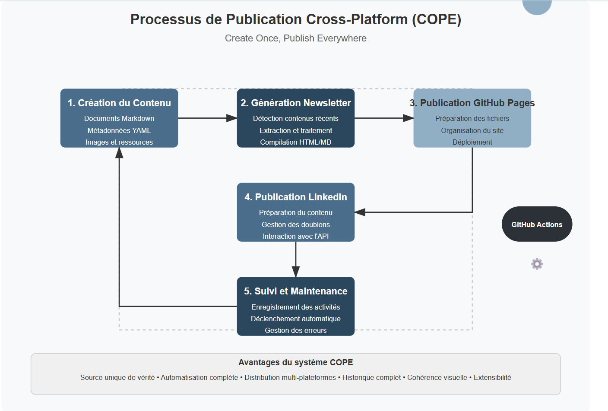

Newsletter

Archives

# Newsletter Portfolio

03/04/2025

Découvrez mes derniers projets et réalisations dans cette newsletter hebdomadaire.

### Récits visuels, horizons numériques :

### Chaque newsletter, un voyage entre données, créativité et découvertes

## approche-integree-creation

Une Approche Intégrée de Création de Contenus Image Représentative Concept Fondamental Une démarche de création qui transcende les frontières traditionnelles entre différents médias et disciplines. Principes Directeurs Synergie Multidisciplinaire Fus...

En savoir plus

## avatar-lartet

Avatar Edouard Lartet : Agent Conversationnel Historique Présentation du Projet Un agent conversationnel basé sur un personnage historique, démontrant l'application des techniques de traitement du langage naturel (NLP) pour créer des expériences inte...

En savoir plus

## blog-scientifique

Blog Scientifique : ARCHAEDYN Image Représentative Contexte du Projet Un projet de recherche archéologique innovant explorant les dynamiques territoriales sur 7 millénaires. Objectifs de Recherche Analyser l'occupation humaine Étudier les transformat...

En savoir plus

## creation-contenus

Création de Contenus Une Approche Multidisciplinaire Image de Référence Approche Intégrée Une démarche qui combine différentes disciplines et médias pour créer des expériences narratives riches et engageantes. Services Principaux 1. Narration Multimé...

En savoir plus

## archeologie-numerique

Archéologie Numérique : Dynamiques Territoriales Présentation du Projet Un projet innovant qui transforme des données archéologiques en récit dynamique, illustrant comment le data storytelling peut révéler des insights historiques complexes. Méthodol...

En savoir plus

## cope-process-documentation

title: Processus de Publication Cross-Platform (COPE - Create Once, Publish Everywhere) description: author: Alexia Fontaine date: 2025-03-28 type: summary image: /img/Process_COPE.png Processus de Publication Cross-Platform (COPE - Create Once, Publ...

En savoir plus

## approche-integree-creation

# Une Approche Intégrée de Création de Contenus

## Image Représentative

## Concept Fondamental

Une démarche de création qui transcende les frontières traditionnelles entre différents médias et disciplines.

## Principes Directeurs

### Synergie Multidisciplinaire

  * Fusion de différentes disciplines
  * Création de contenus riches et cohérents
  * Décloisonnement des approches créatives

## Dimensions de l'Intégration

### 1\. Convergence des Médias

  * Combinaison de :
  * Texte
  * Image
  * Vidéo
  * Modèles 3D
  * Design interactif

### 2\. Approche Holistique

  * Chaque média enrichit les autres
  * Création d'expériences immersives
  * Narration transmédia

## Stratégies de Création

### Interdisciplinarité

  * Croisement des compétences
  * Dialogue entre différents domaines
  * Innovation par la diversité

### Processus Créatif

  1. Conceptualisation
  2. Exploration multisensorielle
  3. Intégration des perspectives
  4. Raffinement itératif

## Compétences Mobilisées

### Techniques

  * Design graphique
  * Développement web
  * Photographie
  * Modélisation 3D
  * Traitement multimédia

### Créatives

  * Storytelling
  * Narration visuelle
  * Design thinking
  * Communication transmedia

## Exemples de Projets

  * wolSia (projet IA et data-driven)
  * Trésor d'Eauze (patrimoine numérique)
  * Séries photographiques
  * Projets de médiation culturelle

## Philosophie de Création

> "La créativité naît à l'intersection des disciplines, là où les frontières deviennent floues et les possibilités infinies."

## Impact et Vision

  * Création de contenus innovants
  * Expériences utilisateur immersives
  * Narration riche et multidimensionnelle
  * Dépassement des approches traditionnelles

## Outils et Technologies

  * Suite Adobe
  * Outils de modélisation 3D
  * Plateformes de développement web
  * Logiciels de traitement multimédia

## Conclusion

Une approche qui transforme la création de contenus en un écosystème dynamique et interconnecté.

Retour en haut

## avatar-lartet

# Avatar Edouard Lartet : Agent Conversationnel Historique

## Présentation du Projet

Un agent conversationnel basé sur un personnage historique, démontrant l'application des techniques de traitement du langage naturel (NLP) pour créer des expériences interactives et éducatives.

## Objectifs

  * Créer une expérience de médiation culturelle innovante
  * Utiliser l'IA pour rendre l'histoire accessible
  * Permettre des interactions immersives avec un personnage historique

## Technologies Utilisées

  * Intelligence Artificielle
  * NLP (Traitement du Langage Naturel)
  * Personnalisation
  * Python

## Capture d'Écran

## Lien du Projet

[Interagir avec l'Avatar Edouard Lartet](https://avatar-lartet.streamlit.app/)

## Concept

Exploration des possibilités de l'IA générative dans : \- La médiation culturelle \- L'apprentissage personnalisé \- La transmission de connaissances historiques

## Fonctionnalités Principales

  * Conversation contextuelle basée sur l'histoire de Edouard Lartet
  * Réponses adaptatives et personnalisées
  * Capacité à partager des informations historiques détaillées

## Compétences Mises en Œuvre

  * Développement d'agents conversationnels
  * Modélisation de personnalités historiques
  * Techniques avancées de NLP
  * Conception d'expériences interactives éducatives

Retour en haut

## blog-scientifique

# Blog Scientifique : ARCHAEDYN

## Image Représentative

## Contexte du Projet

Un projet de recherche archéologique innovant explorant les dynamiques territoriales sur 7 millénaires.

## Objectifs de Recherche

  * Analyser l'occupation humaine
  * Étudier les transformations territoriales
  * Comprendre l'évolution historique des espaces

## Méthodologie de Recherche

### Approche Interdisciplinaire

  * Archéologie
  * Cartographie historique
  * Analyse spatiale
  * Systèmes d'Information Géographique (SIG)

### Techniques d'Analyse

  1. **Analyse cartographique détaillée**
  2. Reconstruction des territoires historiques
  3. Étude des mutations spatiales
  4. Cartographie comparative

  5. **Études archéologiques comparatives**

  6. Analyse des vestiges
  7. Comparaison inter-sites
  8. Reconstruction des dynamiques d'occupation

  9. **Modélisation des Données Spatiales**

  10. Utilisation d'outils SIG avancés
  11. Création de modèles spatiaux
  12. Analyse des transformations territoriales

## Compétences Mises en Œuvre

  * Recherche archéologique
  * Analyse géospatiale
  * Traitement de données historiques
  * Modélisation cartographique
  * Systèmes d'Information Géographique

## Périodes Étudiées

  * Néolithique
  * Périodes intermédiaires
  * Moyen Âge

## Impact Scientifique

  * Compréhension approfondie des dynamiques territoriales
  * Nouvelle perspective sur l'occupation humaine
  * Méthodologie innovante d'analyse historique

## Lien vers la Publication

[Article complet sur ArchNum](https://archnum.hypotheses.org/175)

## Philosophie de Recherche

> "Chaque trace, chaque vestige est un fragment d'un récit territorial plus large."

## Conclusion

Un projet qui transcende la simple étude archéologique pour proposer une vision dynamique et vivante de l'histoire territoriale.

Retour en haut

## creation-contenus

# Création de Contenus

## Une Approche Multidisciplinaire

### Image de Référence

### Approche Intégrée

Une démarche qui combine différentes disciplines et médias pour créer des expériences narratives riches et engageantes.

### Services Principaux

#### 1\. Narration Multimédia

  * Création d'expériences combinant :
  * Texte
  * Image
  * Modèles 3D
  * Design
  * Objectif : Raconter des histoires immersives

#### 2\. Documentation Créative

  * Dépassement du simple archivage
  * Proposition d'une interprétation :
  * Sensible
  * Esthétique
  * Contextuelle

#### 3\. Identité et Branding

  * Développement d'identités visuelles complètes
  * Du logo à la charte éditoriale
  * Exemple de projet : wolSia

### Projet Phare : wolSia

#### Exploration Technologique

  * IA Générative
  * NLP (Traitement du Langage Naturel)
  * Agents Conversationnels
  * Data Science

#### Composantes Principales

  1. Agent Conversationnel Intelligent
  2. Interaction contextuelle
  3. Modèles de traitement du langage naturel

  4. Simulateur de Personnalité

  5. Techniques d'apprentissage automatique
  6. Génération de profils dynamiques

  7. Quiz Interactif

  8. Systèmes de questions-réponses adaptatifs
  9. Ajustement en fonction des réponses

### Technologies Clés

  * Python
  * Streamlit
  * Machine Learning
  * NLP
  * Traitement de Données

### Applications

  * FAQ interactive intelligente
  * Avatar Edouard Lartet
  * Prototype de suivi documentaire
  * Prototype de suivi pédagogique
  * Quiz NumPy

### Philosophie de Création

Transformer des technologies complexes en expériences utilisateur innovantes, personnalisées et engageantes.

### Liens des Projets

  * [FAQ Interactive](https://faq-desinfection.onrender.com/)
  * [Avatar Lartet](https://avatar-lartet.streamlit.app/)
  * [Suivi Documentaire](https://suividoc.streamlit.app/)
  * [Suivi Pédagogique](https://suivi-pedago.streamlit.app/)
  * [Quiz NumPy](https://quiz-numpy.streamlit.app/)

Retour en haut

## archeologie-numerique

# Archéologie Numérique : Dynamiques Territoriales

## Présentation du Projet

Un projet innovant qui transforme des données archéologiques en récit dynamique, illustrant comment le data storytelling peut révéler des insights historiques complexes.

## Méthodologie

  * Analyse de données géospatiales historiques
  * Cartographie interactive des dynamiques territoriales
  * Narration contextuelle basée sur des données

## Technologies Utilisées

  * Data Storytelling
  * Recherche Historique
  * Visualisation de Données

## Capture d'Écran

## Lien du Projet

[Découvrir le Projet Archéologie Numérique](https://slowsia.shinyapps.io/tramTls/)

## Description Détaillée

Ce projet démontre comment les données historiques peuvent être transformées en récits visuels et interactifs, offrant une nouvelle perspective sur l'évolution des territoires à travers les siècles.

## Compétences Mises en Œuvre

  * Analyse de données spatiales
  * Cartographie historique
  * Storytelling data-driven
  * Visualisation de données complexes

Retour en haut

## cope-process-documentation

* * *

title: Processus de Publication Cross-Platform (COPE - Create Once, Publish Everywhere) description:  author: Alexia Fontaine date: 2025-03-28 type: summary image: /img/Process_COPE.png

* * *

# Processus de Publication Cross-Platform (COPE - Create Once, Publish Everywhere)

## 1\. Création du Contenu (Source Unique)

  * **Rédaction de documents Markdown dans le portfolio**
  * Création/mise à jour des fichiers .md dans le dossier "docs" du dépôt portfolio - Utilisation du format frontmatter YAML pour les métadonnées (titre, description, tags) - Inclusion d'images et autres médias dans le dossier "img"

## 2\. Génération Automatique de la Newsletter

  * **Détection des contenus récents**
  * Scan des fichiers Markdown modifiés récemment - Filtrage en fonction de la date de modification (7 derniers jours) - Sélection des projets les plus récents (limité à 6)
  * **Extraction et traitement du contenu**
  * Analyse du frontmatter YAML pour extraire les métadonnées - Conversion du Markdown en HTML - Génération de résumés pour chaque projet (limités à 250 caractères) - Récupération des images associées aux projets
  * **Compilation en format standardisé**
  * Création d'un document Markdown unifié avec tous les projets - Génération d'un document HTML avec mise en page responsive - Structuration avec cartes de projets, sections détaillées et table des matières - Application d'un design cohérent (CSS personnalisé)

## 3\. Publication sur GitHub Pages

  * **Préparation des fichiers**
  * Génération des fichiers HTML/Markdown dans le dossier de sortie - Copie des ressources requises (images) - Création de liens symboliques vers la dernière newsletter
  * **Organisation du site**
  * Création d'une page d'index redirigeant vers la dernière newsletter - Génération d'une page d'archives listant toutes les newsletters - Ajout de fichiers de configuration (.nojekyll)
  * **Déploiement**
  * Création d'un commit avec les nouveaux fichiers - Déploiement vers la branche gh-pages - Configuration pour l'accès public

## 4\. Publication sur LinkedIn

  * **Préparation du contenu pour LinkedIn**
  * Extraction du titre et de la date de la newsletter - Récupération des titres des projets pour créer un sommaire - Formatage du contenu selon les bonnes pratiques LinkedIn (emojis, mise en forme) - Ajout de hashtags pertinents
  * **Gestion des doublons et limitations**
  * Génération d'un hash pour identifier les contenus uniques - Vérification pour éviter les publications en double - Ajout d'horodatage pour rendre le contenu unique si nécessaire - Gestion des limites de taux d'API (rate limits) avec backoff exponentiel
  * **Interaction avec l'API LinkedIn**
  * Authentification via token d'accès - Construction de la requête API avec le texte et l'URL - Gestion des erreurs et tentatives multiples - Traitement des différents codes de réponse

## 5\. Suivi et Maintenance

  * **Enregistrement des activités**
  * Journalisation détaillée des actions (logging) - Création d'un fichier de suivi des publications - Commits automatiques pour tracer l'historique des publications
  * **Mécanismes de déclenchement**
  * Exécution planifiée hebdomadaire (tous les lundis) - Possibilité de déclenchement manuel - Chaînage des workflows (le second s'exécute après le premier)
  * **Gestion des erreurs**
  * Détection et rapport des problèmes - Mécanismes de reprise sur erreur - Statuts d'achèvement conditionnels

Cette architecture COPE permet de : 1. Maintenir une source unique de vérité (fichiers Markdown) 2.

**Mots-clés:** architecture, publications, complètement, automatiser, publication

Le système est également extensible pour intégrer d'autres plateformes de publication (Twitter, Medium, etc.) en suivant le même modèle modulaire.

**Mots-clés:** publication, plateformes, extensible, modulaire, également

Retour en haut

## Restons connectés !

N'hésitez pas à me contacter pour discuter de projets ou simplement échanger sur nos domaines d'intérêt communs.

[Portfolio](https://portfolio-af-v2.netlify.app/) [LinkedIn](https://www.linkedin.com/in/alexiafontaine)

© 2025 - Newsletter générée automatiquement depuis mon portfolio GitHub - Alexia Fontaine tous drois réservés
