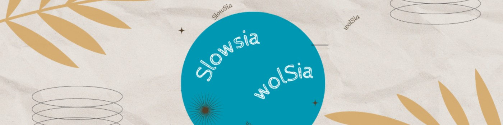
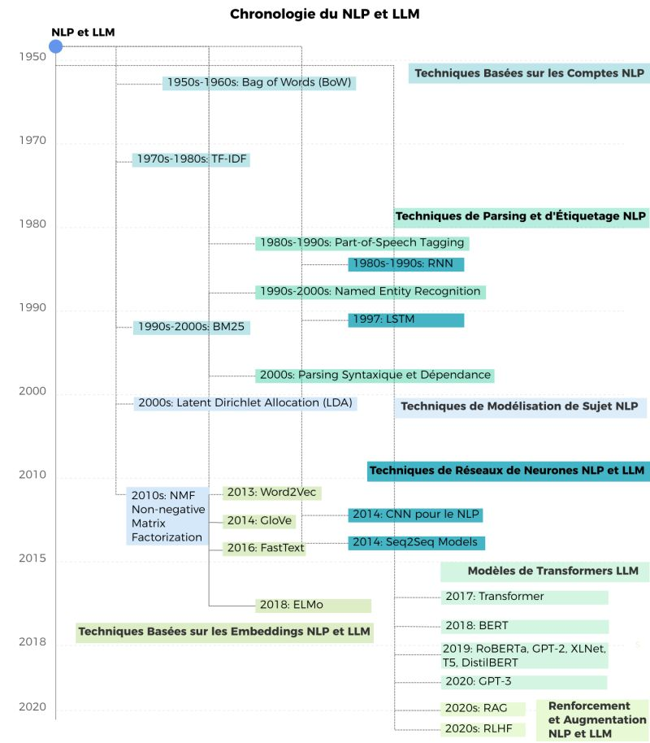

# 📰 Newsletter Portfolio - 07/04/2025

## Récits visuels, horizons numériques : Un voyage entre créativité et innovation 🚀

---

### 📌 math-humanities-article



#### math-humanities-article


#### Créer des ponts entre mathématiques et sciences humaines : un dialogue dynamique


#### Introduction

La relation entre mathématiques et sciences humaines a longtemps été perçue comme antagoniste, les deux domaines étant souvent présentés comme des pôles opposés de la recherche intellectuelle. Pourtant, cette dichotomie est de plus en plus remise en question par des approches innovantes qui révèlent comment ces champs apparemment disparates peuvent s'enrichir mutuellement.


#### La cartographie de la connaissance

À l'intersection de ces domaines émerge ce que l'on pourrait appeler une "Cartographie Dynamique Systémique" (CDS) - une approche qui transforme les représentations statiques en récits vivants. Cette méthode considère les territoires non pas simplement comme des espaces à observer, mais comme des sujets à comprendre :

- Les territoires deviennent des organismes
- Les données dialoguent entre elles
- Les interactions forment le cœur de la compréhension

#### Data storytelling : au-delà des chiffres

Un exemple puissant de cette intégration est le data storytelling, qui transforme des statistiques brutes en récits significatifs. Prenons l'exemple d'un jeu de données sur l'archéologie de Paris :

<strong>Distribution des découvertes archéologiques par période historique :</strong>
- Antiquité : 778 découvertes
- Moyen Âge : 639 découvertes
- Temps modernes : 430 découvertes

Au-delà de ces chiffres bruts se trouvent des insights plus profonds :
1. Paris n'a pratiquement aucune trace préhistorique, suggérant soit un développement tardif, soit un effacement par l'urbanisation
2. La concentration massive de découvertes antiques et médiévales révèle des couches urbaines successives, chaque période construisant littéralement sur les traces des précédentes


#### Modélisation mathématique en sciences humaines

Le véritable pont entre mathématiques et sciences humaines émerge dans la projection probabiliste - une méthode combinant l'analyse de données historiques avec la modélisation statistique pour suggérer de potentielles découvertes futures.

Cette approche illustre comment les fonctions mathématiques servent les sciences humaines :
- Conversion des réalités qualitatives en données
- Création de systèmes de représentation
- Révélation de patterns cachés
- Projection de possibilités futures

La formule mathématique n'est pas une fin en soi mais un moyen - un langage qui éclaire plutôt que de remplacer l'interprétation humaine.


#### Un territoire mathématique

Dans ce nouveau paradigme, une carte devient plus qu'une image statique. Grâce à la modélisation mathématique, nous pouvons transformer la cartographie :

| Carte traditionnelle | Cartographie mathématique |
|-----------------|--------------------------|
| Image statique | Système dynamique |
| Représentation passive | Récit interactif |
| Informations limitées | Narration multidimensionnelle |

Le territoire n'est plus un objet à observer mais un sujet capable d'évolution. Les interstices mathématiques deviennent des espaces où :
- Les données interagissent
- Les potentiels émergent
- Les transformations s'inventent


#### Conclusion : un nouveau dialogue

Les mathématiques et les sciences humaines sont loin d'être antagonistes. Elles forment plutôt un duo complémentaire puissant :

<strong>Les mathématiques apportent :</strong>
- Un langage précis
- Des outils d'analyse rigoureux
- La capacité à modéliser des phénomènes complexes

<strong>Les sciences humaines contribuent :</strong>
- Le contexte
- La profondeur interprétative
- La compréhension des nuances humaines

La clé réside dans l'interdisciplinarité. Comme le suggérerait Edgar Morin, nous avons besoin d'une "pensée complexe" - dépassant les frontières disciplinaires vers une compréhension holistique. Les mathématiques n'écrivent pas l'histoire, elles l'éclairent, tandis que les sciences humaines apportent le sens et le contexte qui donnent leur signification aux chiffres.

Dans ce dialogue permanent, nous découvrons non pas une opposition mais une opportunité - un nouveau langage pour comprendre notre monde dans toute sa précision quantitative et sa profondeur qualitative.

[Retour en haut](#)


---

### 📌 système-suivi-classement-documentaire


#### système-suivi-classement-documentaire


#### Système de Suivi et Classement Documentaire


#### Contexte du Projet

Ce projet présente une solution de gestion documentaire développée en Python, démontrant une approche moderne et flexible de l'organisation et du suivi de documents.


#### Fonctionnalités Clés


#### 1. Génération Automatique de Métadonnées

Le cœur de l'application réside dans sa capacité à générer automatiquement des tags intelligents :

- Analyse contextuelle des documents
- Catégorisation dynamique
- Extraction de mots-clés pertinents
```python
def generate_tags(category, description):
    # Génération intelligente de tags basés sur la catégorie et le contenu
    tags = set(random.sample(CATEGORY_TAGS.get(category, []), 3))

```


#### 2. Visualisation Avancée

Utilisation de Plotly pour des visualisations interactives :

- Graphique en donut des catégories de documents
- Analyse des statuts documentaires
- Exploration des tags les plus fréquents

#### 3. Architecture Flexible

- Approche modulaire
- Chargement dynamique des documents
- Possibilité d'évolution vers des solutions de base de données plus complexes

#### Technologies Utilisées

- Python
- Streamlit : Interface utilisateur web
- Pandas : Manipulation de données
- Plotly : Visualisations interactives

#### Principes Techniques

1. Génération contextuelle de métadonnées
1. Catégorisation dynamique
1. Visualisation interactive
1. Flexibilité d'adaptation

#### Exemple de Génération de Tags

Un document "Rapport financier 2023" pourrait générer des tags comme :

- administration
- finances
- comptabilité
- budget
- 2023

#### Perspectives d'Évolution

- Intégration de bases de données avancées
- Authentification utilisateur
- Moteur de recherche plus sophistiqué
- Analyse prédictive des documents

#### Conclusion

Ce projet illustre une approche moderne de gestion documentaire, combinant intelligence artificielle "légère", visualisation de données et flexibilité architecturale.


#### Lien du Projet

[Explorer l'Application de Suivi Documentaire](https://suividoc.streamlit.app/)

[Explorer l'Application de Suivi Documentaire](https://suividoc.streamlit.app/)

[Retour en haut](#)


---

### 📌 optimisation-générateur-Newsletter


#### optimisation-générateur-Newsletter


#### Optimisation du Générateur de Newsletter Multiplateforme


#### Contexte

Dans le cadre du projet de portfolio numérique, nous avons développé un système automatisé de génération de newsletter qui s'adapte à différentes plateformes, notamment LinkedIn.


#### Objectifs Principaux

- Automatiser la création de contenus
- Générer des publications adaptées à différents canaux
- Préserver la richesse et la structure des projets

#### Améliorations Clés


#### 1. Conversion HTML vers Markdown LinkedIn

- Extraction intelligente des projets à partir du HTML
- Conservation de la structure des sections
- Gestion dynamique des emojis
- Préservation des liens hypertextes

#### 2. Mise en Page Dynamique

- Utilisation d'emojis thématiques
- Structuration flexible des contenus
- Gestion des différents types de contenus (paragraphes, listes)

#### 3. Personnalisation des Publications

- Génération de titres accrocheurs
- Extraction automatique de résumés
- Création de hashtags pertinents

#### Fonctionnalités Techniques


#### Parsing HTML

- Utilisation de BeautifulSoup pour l'extraction de contenu
- Analyse structurée des éléments HTML
- Conversion intelligente en Markdown

#### Gestion des Projets

- Extraction des métadonnées
- Récupération dynamique des images
- Génération de résumés contextuels

#### Bénéfices

- Publication automatique et cohérente
- Gain de temps dans la création de contenu
- Adaptabilité à différentes plateformes
- Conservation de la richesse éditoriale

#### Perspectives d'Amélioration

- Intégration d'API de publication
- Personnalisation avancée des contenus
- Analyse des performances des publications

#### Conclusion

Un système de génération de newsletter qui allie technologie et créativité, transformant la diffusion de contenu numérique.

Projet développé par Alexia Fontaine - 2025

[Retour en haut](#)


---

### 📌 photographie-photogrammetrie


#### photographie-photogrammetrie


#### Photographie et Photogrammétrie : Deux Approches de l'Image

La photographie et la photogrammétrie sont deux techniques différentes liées à l'image :

- La photographie est l'art et la technique de capturer des images fixes à l'aide d'un appareil photographique. Elle vise principalement à représenter visuellement des scènes, des personnes, des objets.
- La photogrammétrie est une technique scientifique qui consiste à effectuer des mesures et des relevés précis à partir de photographies. Elle est souvent utilisée dans des domaines comme la cartographie, l'architecture, l'archéologie et la topographie pour créer des modèles 3D ou des plans détaillés.
La <strong>photographie</strong> est l'art et la technique de capturer des images fixes à l'aide d'un appareil photographique. Elle vise principalement à représenter visuellement des scènes, des personnes, des objets.

La <strong>photogrammétrie</strong> est une technique scientifique qui consiste à effectuer des mesures et des relevés précis à partir de photographies. Elle est souvent utilisée dans des domaines comme la cartographie, l'architecture, l'archéologie et la topographie pour créer des modèles 3D ou des plans détaillés.


#### Points Communs et Différences

Bien que ces deux techniques utilisent la photographie comme base, leurs objectifs et approches diffèrent fondamentalement :

- Photographie : Expression artistique et documentaire
- Photogrammétrie : Précision scientifique et technique de mesure
Chaque approche répond à des besoins distincts mais complémentaires dans la capture et l'interprétation visuelle du monde.

[Retour en haut](#)


---

### 📌 photogrammetrie


#### photogrammetrie


#### Photogrammétrie : Art de la Modélisation 3D


#### Essence de la Technique

Une méthode de création de modèles 3D précis à partir de photographies, préservant la géométrie et les textures des objets.


#### Processus Détaillé


#### 1. Acquisition des Images

- Prises de vue multi-angles
- Attention méticuleuse à l'éclairage
- Couverture complète de l'objet
- Techniques de superposition
- Résolution des images
- Uniformité de l'éclairage
- Recouvrement des prises de vue
- Qualité optique

#### 2. Traitement Informatique

1. Alignement précis des photos
1. Détection des points communs
1. Génération d'un nuage de points dense
1. Création du maillage 3D
1. Application des textures
- Logiciels spécialisés
- Algorithmes de reconstruction
- Traitement d'image avancé
- Intelligence artificielle

#### 3. Optimisation et Partage

- Nettoyage du modèle
- Simplification du maillage
- Optimisation des textures
- Export dans différents formats

#### Applications


#### Domaines de Valorisation

- Patrimoine culturel
- Archéologie
- Conservation de collections
- Médiation culturelle
- Recherche scientifique

#### Exemples de Réalisations

- Slit Gong (objet ethnologique)
- Bague à sceau
- Bague aux camées
- Objets archéologiques du Trésor d'Eauze

#### Outils et Logiciels

- Agisoft Metashape
- Reality Capture
- Blender
- Capture photogrammétrique avancée

#### Philosophie de la Préservation

"Chaque objet a une histoire. La photogrammétrie permet de la capturer avec précision et sensibilité."


#### Compétences Techniques

- Photographie documentaire
- Traitement d'image
- Modélisation 3D
- Conservation numérique
- Médiation culturelle

#### Impact

- Préservation numérique
- Documentation détaillée
- Accessibilité du patrimoine
- Recherche interdisciplinaire

#### Défis et Innovation

- Précision technique
- Capture de la complexité
- Respect de l'intégrité de l'objet
- Innovation constante
[Retour en haut](#)


---

### 📌 evolution-nlp-llm-article



#### evolution-nlp-llm-article


#### Visualisation de l'évolution des techniques NLP et LLM


#### Introduction

Nous avons travaillé sur la visualisation de l'évolution des techniques de Traitement du Langage Naturel (NLP) et des Grands Modèles de Langage (LLM) à travers le temps. À partir d'un fichier DOT initial décrivant la relation entre différentes technologies, nous avons créé plusieurs visualisations pour représenter cette évolution de manière claire et informative.


#### Étapes du processus

1. Conversion initiale du fichier DOT en diagramme Mermaid
   Nous avons d'abord transformé la structure DOT en un diagramme Mermaid qui préservait l'organisation horizontale des éléments.
1. Création d'une version SVG horizontale
   Ensuite, nous avons développé une version SVG du diagramme qui offrait plus de contrôle sur le style et la présentation des éléments.
1. Adaptation à un format vertical
   À la demande d'une orientation verticale, nous avons réorganisé le diagramme SVG pour qu'il se développe de haut en bas.
1. Création d'un dendrogramme chronologique
   Finalement, nous avons conçu un dendrogramme qui intègre une chronologie, permettant de visualiser l'évolution temporelle des différentes techniques.
<strong>Conversion initiale du fichier DOT en diagramme Mermaid</strong><br/>
   Nous avons d'abord transformé la structure DOT en un diagramme Mermaid qui préservait l'organisation horizontale des éléments.

<strong>Création d'une version SVG horizontale</strong><br/>
   Ensuite, nous avons développé une version SVG du diagramme qui offrait plus de contrôle sur le style et la présentation des éléments.

<strong>Adaptation à un format vertical</strong><br/>
   À la demande d'une orientation verticale, nous avons réorganisé le diagramme SVG pour qu'il se développe de haut en bas.

<strong>Création d'un dendrogramme chronologique</strong><br/>
   Finalement, nous avons conçu un dendrogramme qui intègre une chronologie, permettant de visualiser l'évolution temporelle des différentes techniques.


#### Visualisation finale

Notre visualisation finale prend la forme d'un dendrogramme chronologique qui:

- Représente le temps sur un axe vertical, de 1950 à 2020
- Organise les techniques par catégories fonctionnelles
- Différencie par couleur les technologies spécifiques au NLP, aux LLM, ou communes aux deux
- Montre clairement la progression et l'évolution des techniques au fil du temps
Cette chronologie met en évidence plusieurs tendances importantes:

- Les premières techniques (années 1950-1990) étaient principalement axées sur le NLP fondamental
- Les années 2000 ont vu l'émergence de techniques plus sophistiquées de modélisation et d'analyse
- L'arrivée des Transformers en 2017 marque un tournant majeur vers les LLM
- La période récente (2019-2020) est dominée par les modèles dérivés des Transformers
- Les dernières avancées incluent des techniques d'augmentation comme RAG et RLHF


#### Conclusion

Cette visualisation permet de mieux comprendre l'évolution des technologies du langage et offre une perspective claire sur la progression des techniques NLP vers les modèles LLM modernes. Elle illustre comment les avancées successives ont construit les fondations sur lesquelles reposent les capacités impressionnantes des systèmes d'IA linguistique actuels.

Le passage des techniques basées sur les comptages statistiques simples (BoW, TF-IDF) vers des représentations vectorielles (Word2Vec, GloVe), puis vers des architectures neuronales complexes (RNN, LSTM) et finalement aux Transformers, montre une progression fascinante qui a révolutionné notre capacité à traiter et générer du langage naturel.

[Retour en haut](#)


---

## 💡 Philosophie de l'Innovation

> "L'innovation naît à l'intersection des disciplines, là où la créativité rencontre la technologie."

## 📱 Restons connectés !

**Envie d'explorer de nouveaux horizons numériques ?**

— [Portfolio Complet](https://portfolio-af-v2.netlify.app/)  
— [Me Contacter sur LinkedIn](https://www.linkedin.com/in/alexiafontaine)

#Innovation #TechCreative #DataScience #DigitalTransformation #CreativeTech

© 2025 Alexia Fontaine - Tous droits réservés