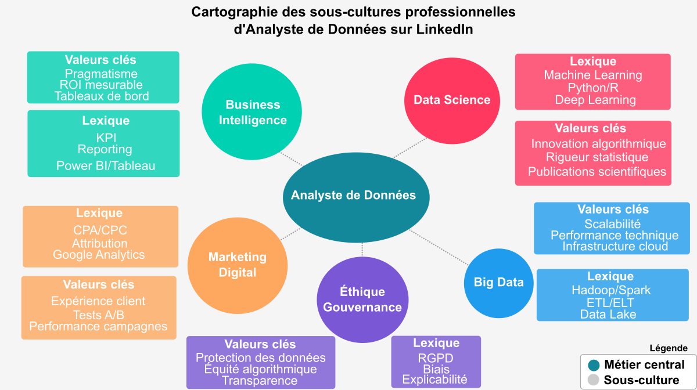

# 📰 Newsletter Portfolio - 18/04/2025

## Récits visuels, horizons numériques : Un voyage entre créativité et innovation 🚀

---

### 📈 Méréologie comme cadre d'analyse

#### Méréologie comme cadre d'analyse

Demande de prompt : définition et applications de la méréologie

#### Origines et définition

La méréologie, théorie formelle des relations entre les parties et le tout, trouve ses racines dans les travaux du philosophe et logicien polonais Stanisław Leśniewski, qui développa cette approche dans les années 1910-1920. Cependant, l'étude des relations partie-tout était déjà présente dans la pensée d'Aristote et a été explorée plus tard par des philosophes comme Edmund Husserl dans ses "Recherches logiques" (1900-1901) et Alfred North Whitehead.

D'autres contributions significatives incluent les travaux de Peter Simons ("Parts: A Study in Ontology", 1987) et Nelson Goodman ("The Structure of Appearance", 1951), qui ont étendu et formalisé davantage cette théorie logique.

#### Applications dans l'analyse culturelle

Dans le domaine de l'analyse culturelle, l'approche méréologique offre un cadre conceptuel permettant d'examiner comment les éléments culturels fonctionnent simultanément comme entités autonomes et comme composantes de systèmes plus larges. Cette perspective s'avère particulièrement utile pour comprendre:

- Les relations entre pratiques culturelles individuelles et systèmes globaux
- L'intégration des sous-cultures dans des cultures plus étendues
- La manière dont les artefacts culturels acquièrent des significations différentes selon les contextes
Ce cadre théorique permet d'analyser efficacement les processus d'hybridation culturelle en montrant comment des éléments issus de différents ensembles peuvent être recombinés pour former de nouvelles totalités culturelles.

#### La méréologie en linguistique cognitive

La linguistique cognitive utilise la méréologie pour étudier comment nous conceptualisons et exprimons les relations partie-tout dans le langage. On peut distinguer plusieurs types de relations méréologiques dans les expressions linguistiques:

1. Relations partie-objet physique: "le toit de la maison", "la poignée de la porte"
1. Relations membre-collection: "un joueur de l'équipe", "une carte du jeu"
1. Relations portion-masse: "une tranche de pain", "une goutte d'eau"
Ces expressions reflètent notre conceptualisation cognitive des ensembles et peuvent varier considérablement d'une langue à l'autre, certaines utilisant des classificateurs spécifiques ou des constructions grammaticales distinctes.

#### Applications en ontologie informatique

Dans le domaine de l'informatique, la méréologie est fondamentale pour la construction d'ontologies comme SNOMED CT (Systematized Nomenclature of Medicine -- Clinical Terms), l'une des plus importantes ontologies médicales. Les relations méréologiques y sont utilisées pour:

- Structurer hiérarchiquement les concepts médicaux
- Faciliter le raisonnement automatique
- Permettre des requêtes complexes dans les dossiers médicaux électroniques
Par exemple, l'ontologie établit des relations comme "le ventricule gauche est une partie du cœur" ou "la fièvre est une partie du syndrome grippal", fournissant ainsi une base pour l'inférence automatisée.

#### Analyse méréologique des archives visuelles

L'application de la méréologie à l'analyse des archives visuelles constitue un domaine particulièrement innovant. Cette approche permet d'étudier:

1. La relation entre l'image individuelle et la collection: Une image isolée possède sa propre signification, mais acquiert des dimensions supplémentaires lorsqu'elle est mise en relation avec d'autres images.
1. Les sous-ensembles significatifs: Comment certains groupements d'images constituent des "parties" cohérentes qui transmettent un message spécifique au sein de l'ensemble plus large.
1. Les éléments visuels récurrents: La façon dont certains motifs deviennent des unités méréologiques structurant la collection.
<strong>La relation entre l'image individuelle et la collection</strong>: Une image isolée possède sa propre signification, mais acquiert des dimensions supplémentaires lorsqu'elle est mise en relation avec d'autres images.

<strong>Les sous-ensembles significatifs</strong>: Comment certains groupements d'images constituent des "parties" cohérentes qui transmettent un message spécifique au sein de l'ensemble plus large.

<strong>Les éléments visuels récurrents</strong>: La façon dont certains motifs deviennent des unités méréologiques structurant la collection.

#### Le raisonnement métavisuel

Le raisonnement métavisuel, qui consiste à analyser les relations entre les images au-delà de leur contenu individuel, s'appuie sur plusieurs opérations:

- Catégorisation: Identifier les principes d'organisation des images
- Contextualisation: Replacer chaque image dans son rapport aux autres
- Abstraction: Dégager des motifs invisibles au niveau de l'image individuelle

#### Opérations rhétoriques dans l'analyse scientifique des archives visuelles

Pour produire des informations scientifiques à partir d'une collection d'images, plusieurs opérations rhétoriques sont employées:

1. Juxtaposition: Révéler des similarités ou différences par la mise en parallèle
1. Série et séquence: Organiser les images pour dégager des tendances ou ruptures
1. Synecdoque visuelle: Utiliser certaines images comme représentatives d'ensembles plus larges
1. Métaphore structurelle: Employer des structures conceptuelles pour représenter les relations entre images
1. Échantillonnage représentatif: Sélectionner des sous-ensembles reflétant les propriétés de la collection entière
Ces opérations transforment une accumulation d'images en un corpus structuré produisant des connaissances scientifiques sur les phénomènes visuels, les pratiques culturelles ou les évolutions historiques qu'elles documentent.

#### Conclusion

La méréologie, née dans le domaine de la logique formelle, s'est révélée être un cadre conceptuel exceptionnellement fertile pour diverses disciplines. Son application à l'analyse culturelle, à la linguistique cognitive, à l'ontologie informatique et particulièrement à l'étude des archives visuelles démontre sa puissance pour comprendre les relations complexes entre les parties et les ensembles dans de multiples domaines de la connaissance.

En offrant une méthodologie pour analyser comment les significations émergent non seulement des éléments individuels mais aussi de leurs interactions, la méréologie constitue un outil précieux pour la recherche contemporaine dans les sciences humaines et sociales, ainsi que dans le domaine des technologies de l'information.

<em>contenu généré par une IA générative</em>

[Retour en haut](#)

---

### 📌 OPENEDITION : carnet HYPOTHESES - Blog scientifique Archnum

#### OPENEDITION : carnet HYPOTHESES - Blog scientifique Archnum

#### OpenEdition, le portail de la communication scientifique en SHS

<em><strong>OpenEdition</strong> est un portail de ressources électroniques en sciences humaines et sociales.</em>
[Pour en savoir plus](https://www.openedition.org/)

[Pour en savoir plus](https://www.openedition.org/)

Il s'agit d'une <em>vaste librairie en ligne</em>, regroupant <strong>en accès libre des ressources numériques de communication scientifique.</strong>
<em>A une époque où la défiance systématique (et souvent justifiée) envers les médias pose de vrais problèmes d'accès à l'information et de démocratie, </em><em>ce dispositif est <u>une bouffée d'oxygène</u></em><em>.</em>

<strong>Hypothèses</strong> constitue l'une de ses plateformes avec pour finalité la publication en ligne : il s'agit de mettre à disposition au plus grand nombre les recherches, les avancées, les questionnements scientifiques actuels, et gratuitement!

#### Présentation de la plateforme de publication Hypothèses

Par sa vocation de publication en ligne, [Hypothèses](https://hypotheses.org) utilise le [BLOG](https://fr.wikipedia.org/wiki/Blog) pour rendre compte d'<strong>un très grand nombre d'actualités scientifiques</strong> :

[Hypothèses](https://hypotheses.org)

[BLOG](https://fr.wikipedia.org/wiki/Blog)

Elle est ouverte prioritairement à la recherche académique mais la recherche indépendante y a aussi sa place, ce qui en fait <strong>un espace de reflexions riches et diversifiés</strong>.

Nous espérons participer à <strong>ce mouvement de partage des savoirs et des connaissances</strong> par notre petit blog <strong>ARCHNUM</strong> dont le but au départ était de rendre compte des pratiques numériques en archéologie ; et qui a évolué aujourd'hui vers la thématique Data et ses applications.

[VISITER LE BLOG ARCHNUM](https://archnum.hypotheses.org/)

[VISITER LE BLOG ARCHNUM](https://archnum.hypotheses.org/)

[Retour en haut](#)

---

### 📌 Méthodologie Narrative de Traitement de Données

#### Méthodologie Narrative de Traitement de Données

Chaque ensemble de données raconte une histoire. Mon approche consiste à écouter ces récits, à comprendre leurs nuances et leurs implications culturelles sous-jacentes.

Au-delà des chiffres, je recherche les fils conducteurs qui relient les données aux expériences humaines, aux dynamiques organisationnelles et aux évolutions sociétales.

Chaque donnée est située dans son écosystème : professionnel, culturel, historique. Cette approche permet de révéler des insights qui dépassent l'analyse statistique traditionnelle.

[Retour en haut](#)

---

### 📌 Apprentissage automatique

#### Apprentissage automatique

Les systèmes d'apprentissage automatique (<em>machine learning</em>) sont des technologies qui permettent aux ordinateurs d'apprendre à partir de données et d'améliorer leurs performances sur des tâches spécifiques sans être explicitement programmés.

Voici un aperçu des concepts clés et des types de systèmes d'apprentissage automatique :

#### 1. Types d'apprentissage

- Apprentissage supervisé : Le modèle est entraîné sur un ensemble de données étiquetées, où chaque entrée est associée à une sortie. L'objectif est de prédire la sortie pour de nouvelles données. Exemples : classification, régression.
- Apprentissage non supervisé : Le modèle travaille avec des données non étiquetées et cherche à identifier des structures ou des motifs. Exemples : clustering, réduction de dimensionnalité.
- Apprentissage par renforcement : Un agent apprend à prendre des décisions en interagissant avec un environnement et en recevant des récompenses ou des pénalités en fonction de ses actions.

#### 2. Algorithmes courants

- Régression linéaire : Utilisé pour prédire une variable continue.
- Arbres de décision : Utilisés pour la classification et la régression, ces modèles prennent des décisions basées sur des règles dérivées des données.
- SVM (Support Vector Machines) : Utilisé pour la classification, il cherche à trouver l'hyperplan qui sépare les classes avec le maximum de marge.
- Réseaux de neurones : Modèles inspirés du cerveau humain, utilisés pour des tâches complexes comme la reconnaissance d'images et le traitement du langage naturel.
- K-means : Un algorithme de clustering qui regroupe les données en k clusters basés sur la similarité.

#### 3. Exemples d'applications

- Vision par ordinateur : Reconnaissance d'images, détection d'objets.
- Traitement du langage naturel : Chatbots, traduction automatique, analyse de sentiments.
- Systèmes de recommandation : Recommandations de produits ou de contenu.
- Finance : Détection de fraudes, prévisions de marché.
- Santé : Diagnostic médical, analyse d'images médicales.
etc.

#### 5. Défis

- Biais et équité : Assurer que les modèles ne reproduisent pas des biais présents dans les données.
- Interprétabilité : Comprendre comment et pourquoi un modèle prend des décisions.
- Surapprentissage : Éviter que le modèle ne s'adapte trop aux données d'entraînement, ce qui nuit à sa performance sur de nouvelles données.
Les systèmes d'apprentissage automatique sont en constante évolution et trouvent des applications dans de nombreux domaines, transformant la manière dont nous traitons et analysons les données.

<em>contenu généré par une IA générative</em>

[Retour en haut](#)

---

### 🎭 Comment les analystes de données contribuent à décoder la culture organisationnelle ?

#### Comment les analystes de données contribuent à décoder la culture organisationnelle ?

#### Une analyse culturelle depuis les posts LinkedIn

Tous ces métiers de la Data porte à confusion, le paysage semble flou tant leur place dans les organisations est tout aussi récente et en cours de structuration (peut-être pas pour les grands groupes) : il est clair que cet écosystème se met en place.

De ce constat, nous avons ciblé notre réflexion sur le métier d'Analyste de Données (se rapportant à notre profil) et plus particulièrement, nous avons voulu connaître <strong>l'application d'une analyse culturelle sur ce métier.</strong>

#### Etude de cas sur le métier d'Analyste de Données

En extrayant les posts (français) sur LinkedIn, en référence au terme d'analyste de données, nous avons pu illustrer comment différentes sous-cultures de ce métier contribuent actuellement à façonner la culture organisationnelle des entreprises.

<em>[Approche bottom-up assistée par IA générative]</em>

#### Des approches variées selon les sous-cultures du métier

On notera par cette infographie la diversité des méthodes employées selon les différentes sous-cultures professionnelles du métier d'analyste de données.

Cette cartographie de ces sous-cultures révèle cinq profils distincts, chacun apportant une perspective à l'analyse culturelle en entreprise.

#### Business Intelligence : mesurer pour comprendre

<em>Cas concret : Au sein de grands groupes, les analystes BI créent des tableaux de bord mesurant l'adoption des valeurs RSE par département.</em>

Cette approche quantitative permet de révéler les silos culturels entre équipes traditionnelles et initiatives innovantes, offrant ainsi une base factuelle pour adapter la communication interne et mesurer l'impact des formations sur l'évolution culturelle.

#### Data Science : prédire les transformations culturelles

<em>Cas concret : Dans le contexte d'une fusion d'entreprise, les data scientists utilisent le traitement du langage naturel (NLP) pour analyser les communications internes.</em>

Cette méthode sophistiquée permet d'identifier la persistance des cultures d'origine, de prédire l'adhésion aux nouvelles valeurs par analyse de sentiment, et de proposer des interventions ciblées basées sur des clusters de profils d'employés.

#### Marketing Digital : aligner valeurs internes et externes

<em>Cas concret : Les analystes marketing corrèlent l'engagement des employés sur l'intranet aux valeurs de marque par exemple.</em>

En comparant le langage utilisé en interne avec celui des campagnes publiques, ils détectent les désalignements culturels et peuvent identifier des ambassadeurs internes selon leur adhésion démontrée aux valeurs de l'entreprise.

#### Big Data : cartographier l'évolution culturelle

<em>Cas concret : Les ingénieurs Big Data créent des data lakes intégrant emails, documents et données collaboratives sur plusieurs années.</em>

Cette approche permet de cartographier l'évolution des valeurs entre différents sites, pays et départements, fournissant des insights précieux sur la perméabilité culturelle entre équipes et l'impact des réorganisations.

#### Éthique & Gouvernance : évaluer la maturité éthique

<em>Cas concret : Les Data Protection Officers développent des indices de maturité éthique par équipe et région.</em>

Ils analysent les écarts entre la culture déclarée et les pratiques réelles de gestion des données clients, identifient les résistances culturelles aux normes RGPD et évaluent les besoins en formation sur l'éthique des données.

#### Défis méthodologiques et éthiques

L'extraction et l'analyse des données culturelles posent ici néanmoins certains défis.

L'accès aux données sur des plateformes comme LinkedIn est restreint et coûteux, nécessitant souvent des approches alternatives comme l'échantillonnage qualitatif ou les entretiens directs. Par ailleurs, les questions de confidentialité et de respect des conditions d'utilisation des plateformes doivent être prises en compte dans toute démarche d'analyse culturelle : raison pour laquelle nous avons défini l'extraction sur un terme très large comme "analyste de données".

<strong>Là encore, il s'agissait d'explorer un vaste ensemble de données comme l'est une plateforme LinkedIn qui est assez <u>révélateur de nos pratiques de travail</u>.</strong>

Et notre principale conclusion sur ce rapide tour d'horizon est qu'<strong>il semble assez opportun d'identifier les leviers de transformation culturelle les plus pertinents et d'accompagner efficacement les évolutions stratégiques des entreprises dans un contexte économique et social en perpétuelle mutation.</strong>

#### L'analyse culturelle en entreprise par les méthodes informatiques

L'analyse culturelle assistée par des méthodes informatiques représente donc aujourd'hui un levier stratégique pour les organisations souhaitant mieux comprendre leurs valeurs et convictions partagées.

En exploitant des techniques d'analyse de données avancées, les entreprises peuvent désormais interpréter et corréler divers artefacts culturels (procédures, décisions, compétences et comportements) pour obtenir une vision plus précise de leur culture organisationnelle.

[Retour en haut](#)

---

### 🤖 Comment lire Reliquiae Aquitanicae ? Avatar Edouard Lartet : Agent Conversationnel Historique

#### Comment lire Reliquiae Aquitanicae ? Avatar Edouard Lartet : Agent Conversationnel Historique

#### Présentation du Projet "Avatar Lartet"

 <em>Un agent conversationnel basé sur un personnage historique, démontrant l'application des techniques de traitement du langage naturel (NLP) pour </em><em>créer une expérience interactive et éducative sur une oeuvre litteraire ancienne.</em>**

<em>Reliquiae Aquitanicae</em> est une oeuvre majeure en archéolgie préhistorique (et en paléontologie), d'une part, elle démontre la préhistoire comme une discipline scientifique rigoureuse et, d'autre part, elle participe à interroger les origines de l'homme, à une époque où celles-ci se fondent d'abord sur un texte religieux comme la Bible.

Cette publication, dirigée par Édouard Lartet et Henry Christy, dans les années 1865-1875, représente donc l'une des premières études scientifiques systématiques des vestiges préhistoriques du Périgord et des régions avoisinantes du sud de la France.

#### Objectifs

Le but est bien d'interroger <strong>notre manière de lire face à des oeuvres anciennes</strong> : notre rapport à la lecture a été particulièrement modifié par le numérique, et bien qu'il ne soit jamais simple de les aborder, perdre cette <em>"confrontation"</em> entre cet objet médiatisé que représente ici l'ouvrage scientifique et ceux qui le lisent serait préjudiciable, à mon sens, à <strong>notre capacité à transmettre.</strong>

Autrement dit, la lecture et son pendant l'esprit critique sont <strong>des formes de <em>mise en présence</em></strong> : il s'agit soit d'une proposition, soit d'une nécessité, d'exercer sa pensée. (<em>Vaste débat que la mise en présence du texte...</em>)

Il nous a semblé alors intéressant de créer cette sorte d'affontement (intellectuel et pacifiste!) à travers ces objectifs :

- Créer une expérience de médiation culturelle basée sur une partie du texte de Reliquiae Aquitanicae,
- Utiliser l'IA pour rendre cette histoire accessible à travers un apprentissage personnalisé,
- Permettre des interactions immersives avec un personnage historique, représenté par cet avatar, dans une notion de transmission de connaissances historiques.

#### Cadre de l'analyse

Au même titre que n'importe quelle analyse, celle-ci se base sur une méthodologie pour répondre à une problématique.

Nous avons fait appel à différents outils conceptuels comme <strong>l'ontologie et l'analyse méréologique pour organiser les informations du texte original.</strong>

<strong>L'objectif principal était une intégration explicite de l'ontologie et de la méréologie dans le processus de génération des réponses proposées par le modèle d'apprentissage.</strong>

Pourquoi ? <strong>Notre hypothèse de travail était de tester à une petite échelle si ces structures de contrôle pouvaient limiter les hallucinations (incohérences et anachronismes) en encadrant la "créativité" du modèle.</strong>

Si cette démarche vous intéresse, je vous renvoie vers mon carnet HYPOTHESES sur la plateforme OpenEdition à l'article suivant : [Architecture conceptuelle d’un avatar historique : analyse textuelle intégrant une ontologie et analyse méréologique](https://archnum.hypotheses.org/1432)

[Architecture conceptuelle d’un avatar historique : analyse textuelle intégrant une ontologie et analyse méréologique](https://archnum.hypotheses.org/1432)

#### Technologies Utilisées

- Traitement du Langage Naturel
- Python
- Streamlit

#### Lien du Projet

Il s'agit d'un prototype pour tester la création d'une base de connaissances à partir de fichiers d'ontologie et de méréologie, celui-ci sera amené à encore évoluer.

[Interagir avec l'Avatar Edouard Lartet](https://avatar-lartet.streamlit.app/)

[Interagir avec l'Avatar Edouard Lartet](https://avatar-lartet.streamlit.app/)

<em>Note: il faut un compte STREAMLIT et le temps de chargement peut être assez long.</em>

#### Fonctionnalités Principales

- Conversation contextuelle basée sur l'ouvrage d'Edouard Lartet et Henry Christy
- Réponses adaptatives et personnalisées (personnalisation contextuelle)
- Capacité à partager des informations historiques détaillées

#### Compétences mises en oeuvre

Il y a aussi de notre part l'idée d'une exploration des possibilités de l'IA générative dans ces outils :

- Développement d'agents conversationnels
- Modélisation de personnalités historiques
- Techniques avancées de NLP
- Conception d'expériences interactives éducatives

#### Référence

Lartet &amp; Christy 1865-1875, Lartet É., Christy H., Reliquiae Aquitanicae: being contributions to the archaeology and palaeontology of Perigord and the adjoining provinces of southern France; edited by Thomas Rupert Jones, London/Paris/Leipzig, Williams &amp; Norgate/J.B. Baillière/A. Brockhaus, 1865-1875, 204 p., 79 pl. h.-t.

[Retour en haut](#)

---

## 💡 Philosophie de l'Innovation

> "L'innovation naît à l'intersection des disciplines, là où la créativité rencontre la technologie."

## 📱 Restons connectés !

**Envie d'explorer de nouveaux horizons numériques ?**

— [Portfolio Complet](https://portfolio-af-v2.netlify.app/)  
— [Me Contacter sur LinkedIn](https://www.linkedin.com/in/alexiafontaine)

#Innovation #TechCreative #DataScience #DigitalTransformation #CreativeTech

© 2025 Alexia Fontaine - Tous droits réservés