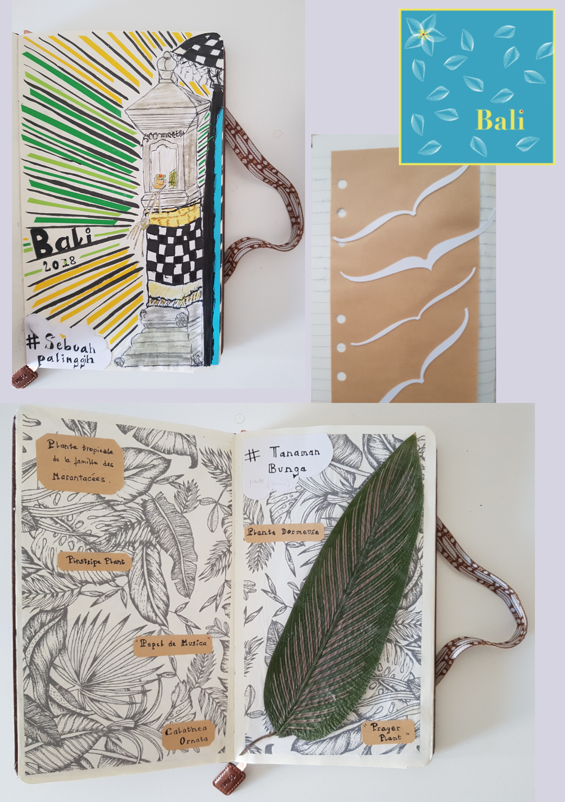

# 📰 Newsletter Portfolio - 02/05/2025

## Récits visuels, horizons numériques : Un voyage entre créativité et innovation 🚀

---

### 📌 OPENEDITION : carnet HYPOTHESES - Blog scientifique Archnum


#### OPENEDITION : carnet HYPOTHESES - Blog scientifique Archnum


#### OpenEdition, le portail de la communication scientifique en SHS

<em><strong>OpenEdition</strong> est un portail de ressources électroniques en sciences humaines et sociales.</em>
[Pour en savoir plus](https://www.openedition.org/)

[Pour en savoir plus](https://www.openedition.org/)

Il s'agit d'une <em>vaste librairie en ligne</em>, regroupant <strong>en accès libre des ressources numériques de communication scientifique.</strong>
<em>A une époque où la défiance systématique (et souvent justifiée) envers les médias pose de vrais problèmes d'accès à l'information et de démocratie, </em><em>ce dispositif est <u>une bouffée d'oxygène</u></em><em>.</em>

<strong>Hypothèses</strong> constitue l'une de ses plateformes avec pour finalité la publication en ligne : il s'agit de mettre à disposition au plus grand nombre les recherches, les avancées, les questionnements scientifiques actuels, et gratuitement!


#### Présentation de la plateforme de publication Hypothèses

Par sa vocation de publication en ligne, [Hypothèses](https://hypotheses.org) utilise le [BLOG](https://fr.wikipedia.org/wiki/Blog) pour rendre compte d'<strong>un très grand nombre d'actualités scientifiques</strong> :

[Hypothèses](https://hypotheses.org)

[BLOG](https://fr.wikipedia.org/wiki/Blog)

Elle est ouverte prioritairement à la recherche académique mais la recherche indépendante y a aussi sa place, ce qui en fait <strong>un espace de reflexions riches et diversifiés</strong>.

Nous espérons participer à <strong>ce mouvement de partage des savoirs et des connaissances</strong> par notre petit blog <strong>ARCHNUM</strong> dont le but au départ était de rendre compte des pratiques numériques en archéologie ; et qui a évolué aujourd'hui vers la thématique Data et ses applications.

[VISITER LE BLOG ARCHNUM](https://archnum.hypotheses.org/)

[VISITER LE BLOG ARCHNUM](https://archnum.hypotheses.org/)

[Retour en haut](#)


---

### 📌 Prototype CRM Relations Entreprises


#### Prototype CRM Relations Entreprises


#### Présentation

Une application de démonstration pour la gestion de la relation client (CRM), spécialement conçue pour le suivi des partenariats avec les entreprises, offrant une interface intuitive et des fonctionnalités complètes d'analyse et de reporting.


#### Fonctionnalités Principales

- Gestion centralisée des entreprises partenaires et prospects
- Suivi détaillé des interactions et communications
- Planification et gestion d'événements professionnels
- Publication et suivi des offres d'emploi, stages et alternances
- Tableaux de bord analytiques et rapports personnalisables

#### Technologies Utilisées

- Python (Streamlit)
- Pandas pour la manipulation des données
- Plotly et Matplotlib pour les visualisations
- Stockage de données CSV (extensible à des bases de données)
- Interface responsive avec CSS personnalisé


#### Lien du Projet

[Explorer Démo CRM Relations Entreprises](https://crm-relations.streamlit.app/)

[Explorer Démo CRM Relations Entreprises](https://crm-relations.streamlit.app/)

[Retour en haut](#)


---

### 📌 L'Art des Mots et des Données


#### L'Art des Mots et des Données


#### Transformation des Données en Récits


#### Concept Fondamental

L'écriture comme un outil alchimique de transformation des données complexes en récits captivants et accessibles.


#### Dimensions de la Transformation


#### 1. Décryptage

- Analyser les couches cachées des données
- Identifier les narrations sous-jacentes
- Extraire les insights significatifs

#### 2. Contextualisation

- Ancrer les données dans des réalités humaines
- Révéler les contextes sociaux et culturels
- Donner du sens aux chiffres

#### 3. Narration

- Construire des récits fluides et engageants
- Traduire le technique en accessible
- Créer des connexions émotionnelles

#### Processus Méthodologique


#### Analyse Rigoureuse

- Décorticage statistique précis
- Identification des tendances
- Exploration des corrélations complexes

#### Contextualisation Narrative

- Intégration des dimensions humaines
- Mise en perspective historique
- Exploration des implications culturelles

#### Visualisation Éloquente

- Transformation graphique des données
- Création de représentations intuitives
- Design d'information performant

#### Communication Stratégique

- Adaptation aux différents publics
- Vulgarisation scientifique
- Transmission claire et impactante

#### Compétences Clés


#### Techniques

- Analyse de données avancée
- Rédaction scientifique
- Visualisation de données
- Traitement statistique

#### Créatives

- Storytelling
- Narration interdisciplinaire
- Design de l'information
- Communication visuelle

#### Philosophie

"Les données sont des mots en attente, les mots sont des données vivantes."


#### Applications

- Rapports analytiques
- Articles de recherche
- Présentations stratégiques
- Contenus de médiation scientifique

#### Impact

- Rendre l'information accessible
- Démocratiser la compréhension complexe
- Inspirer par la clarté
[Retour en haut](#)


---

### 🤖 Comment lire Reliquiae Aquitanicae ? Avatar Edouard Lartet : Agent Conversationnel Historique


#### Comment lire Reliquiae Aquitanicae ? Avatar Edouard Lartet : Agent Conversationnel Historique


#### Présentation du Projet "Avatar Lartet"

 <em>Un agent conversationnel basé sur un personnage historique, démontrant l'application des techniques de traitement du langage naturel (NLP) pour </em><em>créer une expérience interactive et éducative sur une oeuvre litteraire ancienne.</em>**

<em>Reliquiae Aquitanicae</em> est une oeuvre majeure en archéolgie préhistorique (et en paléontologie), d'une part, elle démontre la préhistoire comme une discipline scientifique rigoureuse et, d'autre part, elle participe à interroger les origines de l'homme, à une époque où celles-ci se fondent d'abord sur un texte religieux comme la Bible.

Cette publication, dirigée par Édouard Lartet et Henry Christy, dans les années 1865-1875, représente donc l'une des premières études scientifiques systématiques des vestiges préhistoriques du Périgord et des régions avoisinantes du sud de la France.


#### Objectifs

Le but est bien d'interroger <strong>notre manière de lire face à des oeuvres anciennes</strong> : notre rapport à la lecture a été particulièrement modifié par le numérique, et bien qu'il ne soit jamais simple de les aborder, perdre cette <em>"confrontation"</em> entre cet objet médiatisé que représente ici l'ouvrage scientifique et ceux qui le lisent serait préjudiciable, à mon sens, à <strong>notre capacité à transmettre.</strong>

Autrement dit, la lecture et son pendant l'esprit critique sont <strong>des formes de <em>mise en présence</em></strong> : il s'agit soit d'une proposition, soit d'une nécessité, d'exercer sa pensée. (<em>Vaste débat que la mise en présence du texte...</em>)

Il nous a semblé alors intéressant de créer cette sorte d'affontement (intellectuel et pacifiste!) à travers ces objectifs :

- Créer une expérience de médiation culturelle basée sur une partie du texte de Reliquiae Aquitanicae,
- Utiliser l'IA pour rendre cette histoire accessible à travers un apprentissage personnalisé,
- Permettre des interactions immersives avec un personnage historique, représenté par cet avatar, dans une notion de transmission de connaissances historiques.

#### Cadre de l'analyse

Au même titre que n'importe quelle analyse, celle-ci se base sur une méthodologie pour répondre à une problématique.

Nous avons fait appel à différents outils conceptuels comme <strong>l'ontologie et l'analyse méréologique pour organiser les informations du texte original.</strong>

<strong>L'objectif principal était une intégration explicite de l'ontologie et de la méréologie dans le processus de génération des réponses proposées par le modèle d'apprentissage.</strong>

Pourquoi ? <strong>Notre hypothèse de travail était de tester à une petite échelle si ces structures de contrôle pouvaient limiter les hallucinations (incohérences et anachronismes) en encadrant la "créativité" du modèle.</strong>

Si cette démarche vous intéresse, je vous renvoie vers mon carnet HYPOTHESES sur la plateforme OpenEdition à l'article suivant : [Architecture conceptuelle d’un avatar historique : analyse textuelle intégrant une ontologie et analyse méréologique](https://archnum.hypotheses.org/1432)

[Architecture conceptuelle d’un avatar historique : analyse textuelle intégrant une ontologie et analyse méréologique](https://archnum.hypotheses.org/1432)


#### Technologies Utilisées

- Traitement du Langage Naturel
- Python
- Streamlit

#### Lien du Projet

Il s'agit d'un prototype pour tester la création d'une base de connaissances à partir de fichiers d'ontologie et de méréologie, celui-ci sera amené à encore évoluer.

[Interagir avec l'Avatar Edouard Lartet](https://avatar-lartet.streamlit.app/)

[Interagir avec l'Avatar Edouard Lartet](https://avatar-lartet.streamlit.app/)

<em>Note: il faut un compte STREAMLIT et le temps de chargement peut être assez long.</em>


#### Fonctionnalités Principales

- Conversation contextuelle basée sur l'ouvrage d'Edouard Lartet et Henry Christy
- Réponses adaptatives et personnalisées (personnalisation contextuelle)
- Capacité à partager des informations historiques détaillées

#### Compétences mises en oeuvre

Il y a aussi de notre part l'idée d'une exploration des possibilités de l'IA générative dans ces outils :

- Développement d'agents conversationnels
- Modélisation de personnalités historiques
- Techniques avancées de NLP
- Conception d'expériences interactives éducatives

#### Référence

Lartet &amp; Christy 1865-1875, Lartet É., Christy H., Reliquiae Aquitanicae: being contributions to the archaeology and palaeontology of Perigord and the adjoining provinces of southern France; edited by Thomas Rupert Jones, London/Paris/Leipzig, Williams &amp; Norgate/J.B. Baillière/A. Brockhaus, 1865-1875, 204 p., 79 pl. h.-t.

[Retour en haut](#)


---

### 📌 Mini-buzz avec Cluely


#### Mini-buzz avec Cluely


#### Cluely : de ton entretien d'embauche à ton rancard !

La vidéo présente ce jeune entrepreneur, Roy Lee, qui fait le buzz actuellement pour avoir triché sur des entretiens d'embauche, et qui se met ici en scène, se faisant mousser auprès de son <em>date</em> du moment grâce à son outil <em>Cluely</em> : un outil IA pour <em>“cheat on everything.”</em> [<em>"tricher sur tout"</em> - leur slogan (?!)]

[](https://twitter.com/im_roy_lee/status/1914061483149001132)
<em>lien dans l'image</em>

[](https://twitter.com/im_roy_lee/status/1914061483149001132)

L'histoire fait sourire... alala ces Américains (ou les hommes en général), l'autodérison dont fait preuve la nouvelle génération est plus qu'appréciable, bien que <em>sous la blague le pavé</em> : son bluff interpelle car son outil IA reste basé sur de l'apprentissage automatique, rien de révolutionnaire, mais le principe assumé de tricher pour réussir pose question ou devrait poser question.

Notre propos n'est pas de philosopher sur le caractère ethique de la tricherie, <strong>tout le monde triche dans la vie</strong>.

La <em>vraie vie</em>, c'est d'ailleurs ce que démontre magistralement Roy Lee dans sa vidéo de teasing avec son rancard : <strong>l'IA est finalement parfaitement intégrable à <em>la vie normale</em> (jolie projection pour sa promotion de produit!)</strong>

...Ces tours de <em>hold-up mental</em> sont fascinants.

Mais c'est en tombant sur l'historique de [l'association AURORE](https://www.aurore.asso.fr/association) qui aide les personnes les plus fragiles, et privées de <em>vie normale</em>, que la démarche m'a semblé plus difficile, dans les deux cas.

[l'association AURORE](https://www.aurore.asso.fr/association)

Fondée en 1872 à Paris et reconnue d'utilité publique en 1875, les statuts de cette association sont ainsi définis :

[ref](https://www.aurore.asso.fr/historique)

Là où je veux en venir... bien que cabossée, notre consicence sociétale (notre pacte social) se fonde aussi sur ces principes d'honnêteté et de labeur, depuis au moins le 19ème siècle.

Même si je me base d'un point de vue "vieux continent", les Etats-Unis partage aussi ces mêmes principes.

Alors prolongeons cette lecture vers la période trouble que traverse actuellement ce pays dans sa recherche identitaire : <strong>dans un système plombé par un racisme dit systémique, finalement pourquoi être honnête et dans l'effort? Dans ce cas, on doit aussi en déduire que, dans sa logique, la fin justifie les moyens.</strong>

...C'est un pari à 5.3 millions de dollars et cet étudiant vient de Columbia. Et on comprend aussi pourquoi il a été suspendu par son université.

Les forces idéologiques que font émerger les outils IA sont conséquents, ces crises identitaires ne sont pas propres aux Etats-Unis, nos repères peuvent sembler modifiés, on aurait tort de les voir uniquement comme de simples produits en plus dans notre panoplie.

Roy Lee compare d'ailleurs son outil à la calculatrice ou au correcteur orthographique (<em>c'est déjà moins glamour!</em>) mais il a raison sur ce point : nous déléguons ces tâches cognitives à des machines et plus personne aujourd'hui n'y voit à redire (...dans une vie normale)

Conclusion : l'outil IA n'est vraiment pas un problème dans nos vies.

[Retour en haut](#)


---

### 🤖 Optimisation d'un avatar conversationnel pour l'archéologie préhistorique



#### Optimisation d'un avatar conversationnel pour l'archéologie préhistorique


#### Introduction

Cet article résume un processus d'amélioration d'un système d'IA conversationnel nommé "Lartet", conçu pour simuler les interactions avec Édouard Lartet, un paléontologue et préhistorien français du 19ème siècle. Le système utilise une architecture d'apprentissage automatique pour générer des réponses informées à partir de passages de l'ouvrage "Reliquiae Aquitanicae".


#### Défis identifiés

L'analyse des logs et des réponses générées a permis d'identifier plusieurs défis:

1. Répétition de contenus: Le système intégrait le même passage dans différentes sections
1. Problèmes de traduction: La traduction automatique anglais-français produisait des textes incohérents
1. Hallucinations et substitutions inappropriées: Les noms propres étaient systématiquement remplacés par "mon collègue"
1. Absence d'utilisation de l'ontologie et de la méréologie: Malgré des structures de données riches, ces éléments n'étaient pas intégrés
1. Réponses non adaptées à certaines questions sensibles: Le système ne traitait pas correctement les questions sur Henry Christy

#### Solutions développées


#### 1. Amélioration de l'extraction d'informations

La fonction <code>extract_structured_info</code> a été optimisée pour éviter les doublons entre catégories:

```python


#### Éviter les doublons entre catégories

all_items = set()
for category in list(info.keys()):
    unique_items = []
    for item in info[category]:
        item_hash = hash(item)
        if item_hash not in all_items:
            all_items.add(item_hash)
            unique_items.append(item)
    info[category] = unique_items
```


#### 2. Gestion des questions sensibles

Une fonction spécifique a été implémentée pour traiter les questions sur Henry Christy:

<code>python
def get_christy_collaboration_response(self):
    """Fournit une réponse prédéfinie sur la collaboration avec Christy"""
    if self.language == "fr":
        return """
Je préfère ne pas m'étendre sur mes relations personnelles ou professionnelles...
"""</code>


#### 3. Restructuration du générateur de questions suggérées

La fonction <code>get_default_question</code> a été entièrement réécrite pour offrir des suggestions pertinentes sans mentionner Henry Christy:

```python
def get_default_question(self, user_input: str) -&gt; str:
    """Retourne une question par défaut basée sur la requête utilisateur."""
    query_lower = user_input.lower()

```


#### 4. Amélioration de la cohérence linguistique

Le système a été modifié pour présenter clairement les extraits en anglais tout en maintenant une structure en français:

```python


#### Note explicative sur la langue

response_parts.append("## Note sur la langue")
response_parts.append("Bien que mes publications scientifiques fussent rédigées en anglais, je vous présente ici une synthèse en français de mes travaux.")
```


#### 5. Intégration de l'ontologie et de la méréologie

Des fonctions ont été ajoutées pour exploiter les structures ontologiques et méréologiques:

<code>python
def initialize_knowledge_base(self):
    """Charge et structure l'ontologie et la méréologie"""
    self.structured_ontology = {}
    self.structured_mereology = {}
    # Traitement des données...</code>


#### Résultats

Les modifications ont permis d'obtenir:

1. Des réponses plus cohérentes et sans répétitions
1. Une meilleure présentation des extraits originaux
1. Une gestion appropriée des questions sensibles
1. Une exploitation plus riche des connaissances structurées

#### Conclusion

Ce processus d'optimisation illustre les défis spécifiques de la création d'avatars historiques utilisant le RAG. Il souligne l'importance d'une adaptation fine des mécanismes de génération et de vérification pour produire des interactions authentiques et informatives.

L'amélioration de ce système démontre comment les techniques d'IA contemporaines peuvent être adaptées pour préserver et transmettre le patrimoine scientifique historique de manière interactive et engageante.

[Retour en haut](#)


---

## 💡 Philosophie de l'Innovation

> "L'innovation naît à l'intersection des disciplines, là où la créativité rencontre la technologie."

## 📱 Restons connectés !

**Envie d'explorer de nouveaux horizons numériques ?**

— [Portfolio Complet](https://portfolio-af-v2.netlify.app/)  
— [Me Contacter sur LinkedIn](https://www.linkedin.com/in/alexiafontaine)

#Innovation #TechCreative #DataScience #DigitalTransformation #CreativeTech

© 2025 Alexia Fontaine - Tous droits réservés