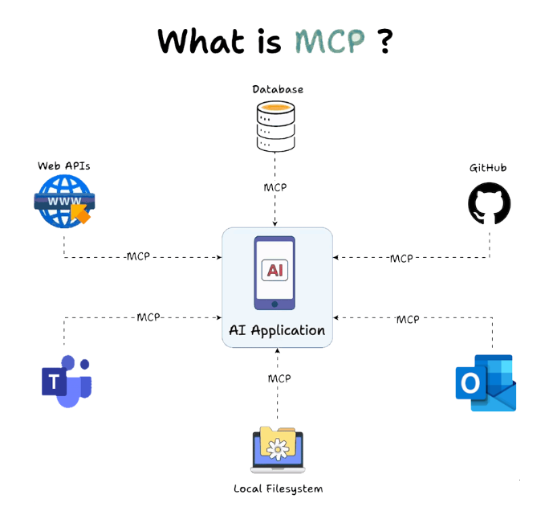
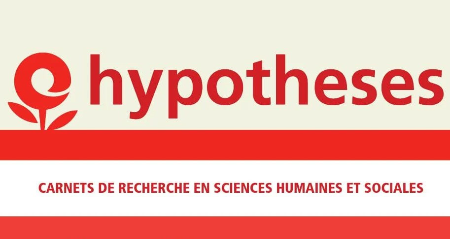

# 📰 Newsletter Portfolio - 09/05/2025

## Récits visuels, horizons numériques : Chaque newsletter, un voyage entre données, créativité et découvertes 🚀

---

### 📌 Model Context Protocol

#### Model Context Protocol

On pourrait traduire cela par **Procotole de Contexte de Modèle**, et en d'autres termes, il s'agit d'un moyen standardisé permettant aux applications ou à des sources de données externes de les connecter à vos modèles IA.

Vous pouvez accéder à la documentation : [Model Context Protocol Documentation](https://modelcontextprotocol.io/introduction)

*L'exemple le plus parlant serait par exemple de connecter votre projet GITHUB à votre LLM habituel (ChatGPT, Claude, Mistral, etc.)*

...Vous voyez le potentiel en termes d'intégration ?!

Cela fait en tout cas son effet dans le domaine, il s'agit ici aussi d'une architecture modulaire et cette facilité d'accès aux connaissances s'annonce prometteuse.

*source : Techcommunity, [article du 27/03/2025 de Sharda_Kaur](https://techcommunity.microsoft.com/blog/educatordeveloperblog/unleashing-the-power-of-model-context-protocol-mcp-a-game-changer-in-ai-integrat/4397564)*

Evidemment, les entreprises du secteur vous propose déjà tout clé en main, pratique et sécurisant, mais il faut aussi garder en tête que ces solutions sont une délégation supplémentaire par cette possibilité d'accéder à des informations en temps réel.

On rentre clairement dans le domaine des DevOps... et du cloud. Il s'agit plus d'architecture, de gestion de projet, d'équipe, de moyens : l'IA oblige à restructurer l'organisation du travail pour avoir les résultats escomptés ; il est évident que tout dépendra à chaque fois des besoins, mais la montée en compétences est clairement élévée.

[Retour en haut](#)

---

### 📌 l'art du réseau social

{width=100px}

#### l'art du réseau social

Je suis toujours surprise par la qualité de certains posts sur les réseaux sociaux, reflet de nos sociétés etc. Et on le sait tous pourtant : *"...si c'est gratuit, c'est nous le produit !"*

Cette piqure de rappel ne remet absolument pas en cause mon usage des réseaux sociaux, je joue le jeu comme tout le monde, et dans ces flux d'informations, j'adopte comme tout à chacun *ma stratégie de comm'* !

Les enjeux sont pourtant non-négligeables puisque nous fournissons, gratuitement, à notre tour, tous ces contenus.

Il me semble que la réutilisation des contenus serait une solution équitable pour maintenir une présence numérique avec moins de contraintes.

Sachant qu'un contenu à une durée de vue d'une heure environ sur un réseau social, cet ordre de grandeur rend le sujet concret.

#### Choix de réutiliser les contenus

En me basant sur un format de portfolio, j'organise mon profil numérique.

Cet outil de présentation professionnelle est un moyen de documentation et de réflexion sur son parcours avec la possibilité de le mettre à jour de manière continue : compétences, expériences et projets sont ainsi mises en avant.

Cette structuration des contenus me permet ensuite de développer une application pour *"mettre en vitrine"* mes contenus.

#### Developper son application

Ainsi, en appliquant [le processus COPE - newsletter 03/04/2025](https://siasia-dev.github.io/portfolio-newsletter/newsletter_20250403.html#project-cope-process-documentation), nous avons opté pour une newsletter.

De cette manière, nous répondions à cette injonction de présence sur les réseaux sociaux tout en gardant un "cadre" et éviter l'éparpillement avec les réseaux sociaux.

#### Garder la main sur ses contenus

Et surtout, cela me permet de garder une copie de mes contenus et d'assurer l'historique de mon activité sur les réseaux sociaux.

[Retour en haut](#)

---

### 📌 Résumé // Lev MANOVTICH, *The Science of Culture ?* in *Cultural Analysis*

L'analyse culturelle s'intéresse aux modèles qui peuvent être dérivés de l'analyse de vastes ensembles de données culturelles.
[Lien vers l'ouvrage en ligne : *Cultural Analysis*](https://direct.mit.edu/books/monograph/4966/Cultural-Analytics)

**#analyse_quantitative #big_data #medias**

L'analyse culturelle s'intéresse aux modèles qui peuvent être dérivés de l'analyse de vastes ensembles de données culturelles. 

[Lien vers l'ouvrage en ligne : *Cultural Analysis*](https://direct.mit.edu/books/monograph/4966/Cultural-Analytics)

Une de ses conclusions qui nous a semblé intéressante par ces analyses de masse de données (Big Data) est la partie "illusoire"de nos comportements actuels :

*"L'idée qu'un groupe ou une personne a des comportements et des goûts culturels cohérents avait du sens dans les sociétés anciennes et modernes. Mais avec les nombreux choix culturels disponibles aujourd'hui, nous pourrions découvrir que l'idée d'un goût stable ou d'une « personnalité culturelle » stable est une illusion."*

*"L'idée qu'un groupe ou une personne a des comportements et des goûts culturels cohérents avait du sens dans les sociétés anciennes et modernes. Mais avec les nombreux choix culturels disponibles aujourd'hui, nous pourrions découvrir que l'idée d'un goût stable ou d'une « personnalité culturelle » stable est une illusion."*

➡️l'illusion du goût
➡️la classification n'est toujours pas l'explication
➡️Nouveau paradigme? D'où l'importance "*And here the concepts and methods of sampling, feature extraction, and exploratory data analysis are more important than data size*"

### Structures cognitives & structures sociales

Nos structures cognitives sont celles de nos structures sociales (La distinction, 1979)

Pour reprendre R.MOURIEUX, *"Entre réalisme populaire et l'idéalisme bourgeois se situe le goût moyen des couches moyennes, fait de refus des extrêmes et de mimétisme de l'immédiat supérieur"* 1.https://www.persee.fr/doc/sotra_0038-0296_1980_num_22_4_1655_t1_0475_0000_2

<iframe width="560" height="315" src="https://www.youtube.com/embed/sf5ZGiqW7NI?si=FHGqM68HN5XPgqk6" title="YouTube video player" frameborder="0" allow="accelerometer; autoplay; clipboard-write; encrypted-media; gyroscope; picture-in-picture; web-share" referrerpolicy="strict-origin-when-cross-origin" allowfullscreen></iframe>

---

### Les séries de Claude Monet (1840-1926)

*Du 22 septembre 2010 au 24 janvier 2011 - Paris, Galeries nationales du Grand Palais*

➡️ Notons aussi le rapport entre *expérience sensible & image* (**une image est une densité de probabilités dans un espace de plus grande dimension**) Remarquez que dès le potron-minet, la lumière sur la pierre d'une façade de cathédrale reste une expérience sensible comparable à l'image - les séries de MONET ça ne fait pas de mal non plus ! 🙂

*Posté sur Linkedin du 28 mars 2025*

[Retour en haut](#)

---

### 📌 OPENEDITION : carnet HYPOTHESES - Blog scientifique Archnum 

#### OPENEDITION : carnet HYPOTHESES - Blog scientifique Archnum 

#### OpenEdition, le portail de la communication scientifique en SHS

***OpenEdition** est un portail de ressources électroniques en sciences humaines et sociales.*
[Pour en savoir plus](https://www.openedition.org/)

Il s'agit d'une *vaste librairie en ligne*, regroupant **en accès libre des ressources numériques de communication scientifique.** 
*A une époque où la défiance systématique (et souvent justifiée) envers les médias pose de vrais problèmes d'accès à l'information et de démocratie,* *ce dispositif est <u>une bouffée d'oxygène</u>*.

**Hypothèses** constitue l'une de ses plateformes avec pour finalité la publication en ligne : il s'agit de mettre à disposition au plus grand nombre les recherches, les avancées, les questionnements scientifiques actuels, et gratuitement!

#### Démocratiser l'accès aux savoirs et aux connaissances est très clairement l'un de leurs enjeux.

### Présentation de la plateforme de publication Hypothèses

Par sa vocation de publication en ligne, [Hypothèses](https://hypotheses.org) utilise le [BLOG](https://fr.wikipedia.org/wiki/Blog) pour rendre compte d'**un très grand nombre d'actualités scientifiques** :

  <iframe id="Hypotheses - OpenEdition" title="Hypotheses - OpenEdition" width="800" height="600" src="https://hypotheses.org/about-hypotheses">
  </iframe>

Elle est ouverte prioritairement à la recherche académique mais la recherche indépendante y a aussi sa place, ce qui en fait **un espace de reflexions riches et diversifiés**.

Nous espérons participer à **ce mouvement de partage des savoirs et des connaissances** par notre petit blog **ARCHNUM** dont le but au départ était de rendre compte des pratiques numériques en archéologie ; et qui a évolué aujourd'hui vers la thématique Data et ses applications.

[VISITER LE BLOG *ARCHNUM*](https://archnum.hypotheses.org/)

[Retour en haut](#)

---

### 📌 Journal d'Apprentissage - Recherche d'Emploi

#### Journal d'Apprentissage - Recherche d'Emploi

### Présentation

Une demo pour du suivi personnalisé dans l'accompagnement des chercheurs d'emploi dans leur parcours d'apprentissage et de développement professionnel, offrant un espace structuré pour documenter leur progression et optimiser leur démarche.

### Fonctionnalités Principales

- Journal d'apprentissage réflexif et structuré
- Suivi détaillé des candidatures et entretiens
- Évaluation et progression des compétences clés
- Gestion d'objectifs et plans d'action personnalisés
- Profil professionnel complet et évolutif
- Accès à des ressources et conseils ciblés

### Technologies Utilisées

- Python (Streamlit)
- Pandas pour l'analyse de données
- Plotly pour les visualisations interactives
- Stockage JSON pour les données utilisateur
- Interface responsive avec CSS personnalisé

#### Capture d'Écran

### Lien du Projet

[Explorer l'Application Journal d'Apprentissage](https://app-atelier-emploi.streamlit.app/)

[Retour en haut](#)

---

### 📌 Architecture Modulaire à Base de Contenu

#### Architecture Modulaire à Base de Contenu

## Architecture Modulaire à Base de Contenu

L'**Architecture Modulaire à Base de Contenu** (ou "Content-Driven Modular Architecture") représente une approche moderne et flexible pour concevoir des sites web et des applications. Cette méthodologie place le contenu au centre du processus de développement, en le séparant strictement de la présentation.

**Mots-clés:** développement, architecture, contentdriven, méthodologie, applications

## Principes fondamentaux

Cette architecture repose sur plusieurs principes clés qui la rendent particulièrement efficace pour les sites riches en contenu comme les portfolios et les blogs :

**Mots-clés:** architecture, portfolios, principes, plusieurs

Le contenu est stocké dans des fichiers indépendants (souvent au format Markdown) avec des métadonnées standardisées (frontmatter), complètement séparés du code HTML, CSS et JavaScript qui définit leur présentation. Cette séparation permet à chaque aspect d'évoluer indépendamment.

**Mots-clés:** standardisées, indépendance, présentation

Les sections et composants peuvent être facilement réutilisés, réorganisés ou recombinés pour créer de nouvelles pages ou expériences. Cette flexibilité permet d'assembler rapidement différentes vues à partir des mêmes éléments de base.

**Mots-clés:** expériences, réorganisation, flexibilité

Modifier un contenu n'exige pas de toucher au code HTML principal. Les rédacteurs de contenu peuvent se concentrer uniquement sur les fichiers Markdown pertinents, sans risquer d'altérer la structure ou le fonctionnement du site.

**Mots-clés:** fonctionnement, pertinents, concentrer, uniquement, rédacteurs

Ajouter une nouvelle section est aussi simple que de créer un nouveau fichier Markdown. Cette approche réduit considérablement la friction pour enrichir le site avec de nouveaux contenus.

**Mots-clés:**  contenus

## Implémentation pratique

Pour les composants simples, le Markdown pur suffit généralement. Cependant, pour les composants plus complexes comme les grilles de compétences, les cartes de services, ou les processus multi-étapes, l'HTML embarqué dans Markdown offre le meilleur compromis :

Cette approche hybride permet de préserver le rendu visuel des composants complexes tout en profitant pleinement de la modularité du système.

**Mots-clés:** multiétapes, compétences, composants, markdown, modularité, composants, complexes

## Avantages à long terme

Au-delà des bénéfices immédiats, cette architecture offre des avantages substantiels sur le long terme :

- **Transitions technologiques facilitées** - Le contenu peut être conservé même si le framework ou la technologie de présentation change
- **Versionning efficace** - Les modifications de contenu sont clairement visibles dans les commits Git
- **Possibilités de migration accrues** - Le contenu peut être facilement exporté vers d'autres systèmes
- **Optimisation du workflow** - Les designers et développeurs peuvent travailler sur l'interface pendant que les rédacteurs créent le contenu

Cette architecture représente une évolution naturelle des systèmes de gestion de contenu traditionnels, offrant davantage de flexibilité tout en conservant une structure claire et organisée.

**Mots-clés:** architecture, flexibilité

### 1. Séparation du contenu et de la présentation

Le contenu est stocké dans des fichiers indépendants (souvent au format Markdown) avec des métadonnées standardisées (frontmatter), complètement séparés du code HTML, CSS et JavaScript qui définit leur présentation. Cette séparation permet à chaque aspect d'évoluer indépendamment.

**Mots-clés:** indépendance, standardisés, présentation

### 2. Composabilité

Les sections et composants peuvent être facilement réutilisés, réorganisés ou recombinés pour créer de nouvelles pages ou expériences. Cette flexibilité permet d'assembler rapidement différentes vues à partir des mêmes éléments de base.

**Mots-clés:** flexibilité

### 3. Maintenabilité

Modifier un contenu n'exige pas de toucher au code HTML principal. Les rédacteurs de contenu peuvent se concentrer uniquement sur les fichiers Markdown pertinents, sans risquer d'altérer la structure ou le fonctionnement du site.

**Mots-clés:** pertinents, rédacteurs

### 4. Évolutivité

Ajouter une nouvelle section est aussi simple que de créer un nouveau fichier Markdown. Cette approche réduit considérablement la friction pour enrichir le site avec de nouveaux contenus.

**Mots-clés:** enrichir, contenus

[Retour en haut](#)

---

## 💡 Philosophie de l'Innovation

> "L'innovation naît à l'intersection des disciplines, là où la créativité rencontre la technologie."

## 📱 Restons connectés !

**Envie d'explorer de nouveaux horizons numériques ?**

— [Portfolio Complet](https://portfolio-af-v2.netlify.app/)  
— [Me Contacter sur LinkedIn](https://www.linkedin.com/in/alexiafontaine)

#Innovation #TechCreative #DataScience #DigitalTransformation #CreativeTech

© 2025 Alexia Fontaine - Tous droits réservés