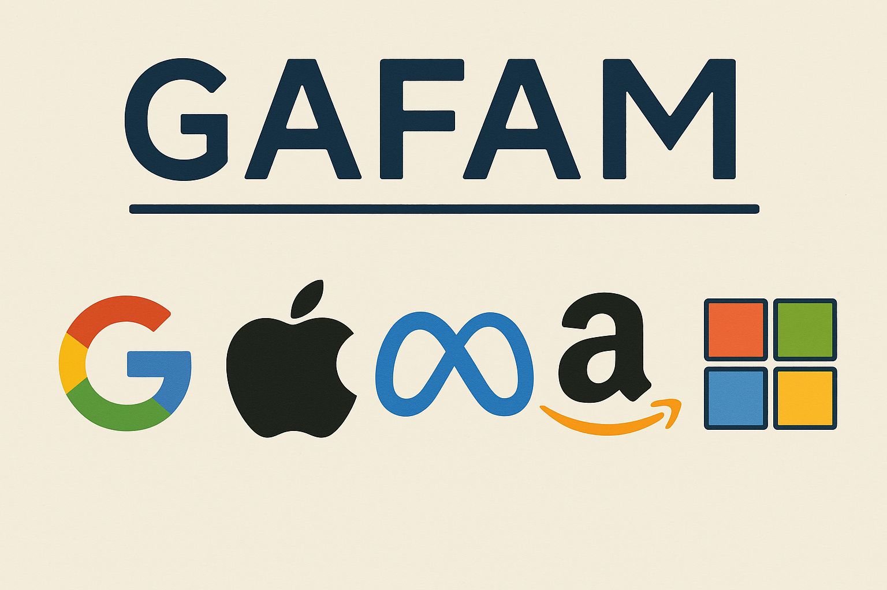
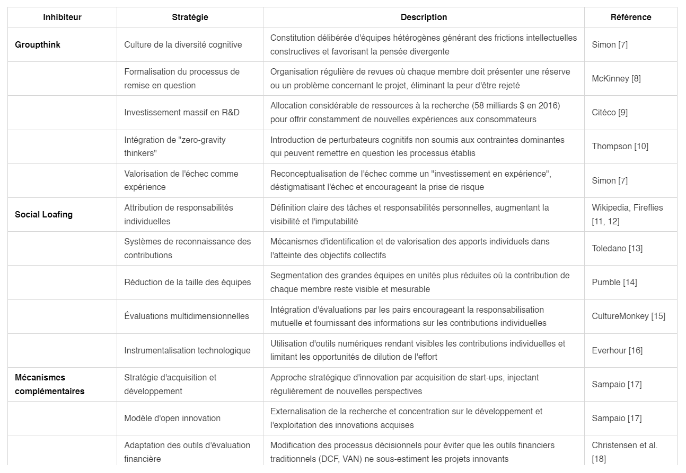

# 📰 Newsletter Portfolio - 16/05/2025

## Récits visuels, horizons numériques : Chaque newsletter, un voyage entre données, créativité et découvertes 🚀

---

### 📌 Les stratégies des GAFAM contre les inhibiteurs d'innovation : analyse du groupthink et du social loafing

#### Stratégies des GAFAM contre les inhibiteurs d'innovation : analyse de communication de groupe par les pratiques de pensée de groupe et de paresse sociale

##### Démarche adoptée

Etant donné qu'il s'agit d'une analyse documentaire, c'est à dire que nous ne faisons ni appel à des données personnelles ni à des données sensibles, nous avons opté pour un article par modèle génératif de type LLM : tâche de synthèse sur laquelle ces modèles performent.

- La question prompt a été la suivante : *Comment les GAFAM contrent les "innovation killers" comme la pensée de groupe et la paresse sociale?*

Nous avons vérifié, dans un second temps, chacune des références citées dans la bibliographie (à la fin de cet article, voir la partie Webographie). Notre intérêt s'est porté sur la nature de ces dernières :

- **Une forme de découverte** sur des auteurs que nous ne connaissions pas, ce qui peut être un gain de temps intéressant, notamment sur les bases théoriques de ces pratiques et de l'économie numérique en général, d'une part,

- Et d'autre part, **la critique de ces références** qui s'impose, puisque les choix opérés par l'IA ne sont pas explicites. On relèvera :

- le poids plus important des *"analyses sectorielles"* par rapport aux analyses académiques, soit plus de la moitié des contenus (marqués par des astérisques dans la webographie ; y sont inclus les contenus générés par des IA)

- et la nature publicitaire de ces contenus sectoriels :
  - le référencement web influant sur cette sélection,
  - et le choix appuyé de contenus d'*"influenceurs"* (avec deux erreurs sur le nom). Nous reconnaissons que la référence [4] interroge puisque l'auteur donne son retour d'expérience sur la pensée de groupe en publiant sur LinkeIn qui reste un réseau social professionnel.

Nous justifions le choix du mot contenu au lieu d'article car nous savons seulement que ce modèle d'apprentissage source le web pour obtenir cette liste de références (Comment? Pourquoi? *ndlr ...Les abonnés absents*)

Pourtant, une critique de ces mêmes références est proposée aussi par le modèle lui-même (4. Discussion), et de manière plutôt appropriée, ce qui rend au moins le propos cohérent vis-à-vis de l'analyse demandée. Mais la conclusion (5. Conclusion) remet cela en question.

Ces écosystèmes particuliers que sont les GAFAM semblent avoir trouvé les "bonnes méthodes" organisationnelles pour les rendre innovantes : c'est un fait.

Dans cette analyse de communication de groupe, le management mis en avant pour atteindre cet objectif répond encore aujourd'hui à cet impératif, bien qu'il soulève d'autres questions respectives à ces deux pratiques comme l'influence et la surveillance.

Toutefois, il faut distinguer l'enchevêtrement de ces objets techniques dans cette notion d'innovation : il y a moins de *"complots en vue"* que de *"profits en vue"* et **des capacités de traitements de données à gérer.** *(ndlr ...moins romanesque mais plus intéressant)*

##### PARTIE GENEREE PAR IA

##### Résumé

À travers une analyse documentaire, l'article identifie et catégorise les approches adoptées par ces entreprises pour maintenir leur capacité d'innovation malgré leur taille et leur complexité organisationnelle. Les résultats montrent que les GAFAM ont développé des systèmes sophistiqués comprenant notamment la diversification cognitive des équipes, la formalisation du processus de remise en question, et des mécanismes de responsabilisation individuelle.

#### 1. Introduction

Dans l'économie numérique contemporaine, l'innovation représente un avantage compétitif crucial pour les organisations technologiques [1]. Cependant, deux phénomènes psychosociaux peuvent significativement entraver les processus d'innovation au sein des grandes structures organisationnelles : le groupthink et le social loafing.

Le ***groupthink***, concept initialement développé par **Irving Janis** en 1972, **désigne cette tendance des groupes à rechercher le consensus au détriment de l'exploration d'alternatives** [2]. Le psychologue l'a défini comme *"un mode de pensée dont les personnes s'engagent lorsqu'elles sont profondément impliquées dans un groupe cohésif, lorsque la recherche d'unanimité des membres prime sur leur motivation à évaluer de façon réaliste les lignes d'action alternatives"* [3]. **Ce phénomène conduit généralement à une détérioration de l'efficacité mentale, de l'appréciation de la réalité et du jugement moral** [4].

Parallèlement, le ***social loafing***, ou **effet Ringelmann**, représente **cette tendance des individus à fournir moins d'efforts lorsqu'ils travaillent en groupe que lorsqu'ils travaillent seuls** [5]. Ce phénomène s'accentue proportionnellement à la taille du groupe, **diluant la responsabilité et l'imputabilité individuelles** [6].

Les GAFAM, en tant qu'organisations ayant atteint une taille critique et une position dominante dans l'économie numérique, constituent un terrain d'étude particulièrement pertinent pour **analyser comment des entreprises peuvent contrer ces inhibiteurs d'innovation**. Cette recherche vise à identifier, catégoriser et analyser les stratégies déployées par ces entreprises pour maintenir leur dynamique d'innovation malgré les défis inhérents à leur taille et à leur structure.

#### 2. Méthodologie

Cette étude adopte une approche qualitative basée sur l'analyse documentaire de sources primaires et secondaires portant sur les pratiques organisationnelles des GAFAM. Les données ont été recueillies à partir d'articles scientifiques, de rapports d'entreprise, et d'analyses sectorielles publiées entre 2010 et 2025.

L'analyse thématique a permis d'identifier et de catégoriser les stratégies selon qu'elles visent à contrer le groupthink ou le social loafing, puis de les regrouper en patterns organisationnels cohérents.

#### 3. Résultats

Le tableau ci-dessous présente une synthèse des stratégies déployées par les GAFAM pour contrer les inhibiteurs d'innovation que sont le groupthink et le social loafing.

**Tableau 1 : Synthèse des stratégies des GAFAM contre les inhibiteurs d'innovation**

#### 4. Discussion

L'analyse des stratégies déployées par les GAFAM révèle une approche multidimensionnelle et systémique de lutte contre les inhibiteurs d'innovation.**Ces organisations semblent avoir développé une compréhension approfondie des mécanismes psychosociaux qui entravent l'innovation et ont conçu des contre-mesures spécifiques à chaque phénomène**.

Concernant le ***groupthink***, les stratégies identifiées visent principalement à introduire de la discordance cognitive et à légitimer la dissension. En institutionnalisant le doute et la remise en question,**les GAFAM créent un environnement où la diversité des perspectives est non seulement tolérée mais activement encouragée.**

Quant au ***social loafing***, les approches adoptées ciblent directement la restauration de la visibilité et de la responsabilité individuelles au sein du collectif. **En réduisant la taille des équipes, en clarifiant les responsabilités et en instrumentalisant la transparence, ces organisations limitent les opportunités de dilution de l'effort individuel.**

Il est intéressant de noter que ces stratégies ne se limitent pas à des ajustements mineurs, mais constituent **des transformations profondes du fonctionnement organisationnel**.

**Les GAFAM semblent avoir intégré la lutte contre ces inhibiteurs d'innovation à leur ADN organisationnel, plutôt que de les traiter comme des problèmes périphériques.**

Cette étude présente certaines limitations, notamment en ce qui concerne **l'accès aux pratiques internes réelles des GAFAM.** Les données analysées proviennent principalement de sources secondaires et publiques, ce qui peut limiter notre compréhension des mécanismes plus subtils et informels mis en œuvre par ces organisations.

#### 5. Conclusion

Cette recherche a permis d'identifier et d'analyser les stratégies déployées par les GAFAM pour contrer deux inhibiteurs majeurs d'innovation : le *groupthink* et le *social loafing*. Les résultats démontrent que ces organisations ont développé des approches sophistiquées et multidimensionnelles qui transforment ces défis potentiels en opportunités d'innovation.

Les implications théoriques de cette étude concernent principalement notre compréhension des mécanismes d'innovation dans les grandes organisations technologiques. Les stratégies identifiées suggèrent que l'innovation à grande échelle nécessite des interventions délibérées pour contrer les tendances psychosociales naturelles qui émergent dans les groupes humains.

Sur le plan pratique, cette recherche offre des pistes concrètes pour les organisations qui cherchent à maintenir ou stimuler leur capacité d'innovation malgré leur croissance. Les stratégies identifiées peuvent être adaptées à divers contextes organisationnels, au-delà du secteur technologique.

Des recherches futures pourraient explorer plus en profondeur l'efficacité relative de ces différentes stratégies, ainsi que leur applicabilité dans d'autres secteurs d'activité ou contextes culturels.

#### Webographie

[1] Miguel de Bustos, J. C. [Les GAFAM : stratégies et enjeux de régulation.](https://youtu.be/UarvuutSrMQ?si=be1fhNRdRaHGSwSw)  Colloque CRICIS 2018: Numérisation généralisée de la société

[2] Janis, I. L. (1972). [Victims of groupthink: A psychological study of foreign-policy decisions and fiascoes.](https://archive.org/details/janis_groupthink) Houghton Mifflin.

[3] **McKinney, P. (2021). [Groupthink Kills Innovation.](https://killerinnovations.com/groupthink-kills-innovation/) Podcast - Killer Innovations.

[4] **Sampaio de Melo Junior, C. (2018). [Groupthink is the ultimate innovation killer. LinkedIn.](https://www.linkedin.com/pulse/groupthink-ultimate-innovation-killer-cleuton-sampaio-de-melo-junior/)

[5] Ringelmann, M. (1913). Recherches sur les moteurs animés: Travail de l'homme. Annales de l'Institut National Agronomique, 12, 1-40.

[6] Latané, B., Williams, K., & Harkins, S. (1979). [Many hands make light the work: The causes and consequences of social loafing.](https://doi.org/10.1037/0022-3514.37.6.822) Journal of Personality and Social Psychology, 37(6), 822-832.

[7] **Simon, S. (2021). [Killers of innovation](https://roomforideas.org/theory-and-insights/innovation-killers/). Room For Ideas.

[8] **McKinney, P. (2022). If You Want To Innovate Then Avoid The Herd: Groupthink Leads to Bad Decisions. Phil McKinney - Innovation Mentor and Coach.

[9] Citéco. (2020). [Les GAFAM, ces champions du numérique parfois compliqués à dompter.](https://www.citeco.fr/les-gafam-0) Cité de l'Économie.

[10] ~~Thompson, L.~~ **BARTON RABE C. (2006). [The Innovation Killer.](https://www.harpercollinsleadership.com/9780814429624/the-innovation-killer/) HarperCollins Leadership.

[11] Wikipedia. (2024). [Social loafing](https://en.wikipedia.org/wiki/Social_loafing).

[12] *Fireflies. (2023). [What Is Social Loafing and How to Avoid It in the Workplace.](https://fireflies.ai/blog/social-loafing)

[13] **~~Toledano, J.~~ PETIT R. (2021). [Comment lutter contre la paresse sociale du management collaboratif? International Leader.](https://international-leader.com/comment-lutter-contre-la-paresse-sociale-du-management-collaboratif/)

[14] *Pumble. (2023).[Social Loafing: Definition, Examples, and Tips on Preventing It.](https://pumble.com/blog/social-loafing/#:~:text=%E2%80%9CSocial%20loafing%20is%20actually%20a,group%20to%20have%20decreased%20productivity.)

[15] *CultureMonkey. (2025). [What is social loafing at work: Causes and top strategies to curb it as a leader in 2024](https://www.culturemonkey.io/employee-engagement/social-loafing/#:~:text=When%20employees%20don't%20receive,value%20and%20motivation%20among%20employees.).

[16] *Everhour. (2025). [Social Loafing: Causes, Effects, and Prevention Tips for 2025.](https://everhour.com/blog/social-loafing/)

[17] *The Future Shapers. (2021). The Dark side of innovation - Killers of Innovation Part 3 - The Team and the Individual.

[18] Christensen, C. M., Kaufman, S. P., & Shih, W. C. (2008). [Innovation Killers: How Financial Tools Destroy Your Capacity to Do New Things.](https://hbr.org/2008/01/innovation-killers-how-financial-tools-destroy-your-capacity-to-do-new-things) Harvard Business Review.

---

### 📌 Processus COPE - Génération Automatique de la Newsletter

#### Processus COPE - Génération Automatique de la Newsletter

Ce système représente une implémentation de la stratégie COPE (Create Once, Publish Everywhere) pour la syndication de contenu. Voici une analyse détaillée de toutes les étapes et sous-étapes du processus:

**A. Création du Contenu (Source Unique)**
   ***Rédaction de documents Markdown dans le portfolio***
      - Création/mise à jour des fichiers .md dans le dossier "docs" du dépôt portfolio
      - Utilisation du format frontmatter YAML pour les métadonnées (titre, description, tags)
      - Inclusion d'images et autres médias dans le dossier "img"

**B. Génération Automatique de la Newsletter**
    ***Détection des contenus récents***
      - Scan des fichiers Markdown modifiés récemment
      - Filtrage en fonction de la date de modification (7 derniers jours)
      - Sélection des projets les plus récents (limité à 6)
    ***Extraction et traitement du contenu***
      - Analyse du frontmatter YAML pour extraire les métadonnées
      - Conversion du Markdown en HTML
      - Génération de résumés pour chaque projet (limités à 250 caractères)
      - Récupération des images associées aux projets
    ***Compilation en format standardisé***
      - Création d'un document Markdown unifié avec tous les projets
      - Génération d'un document HTML avec mise en page responsive
      - Structuration avec cartes de projets, sections détaillées et table des matières
      - Application d'un design cohérent (CSS personnalisé)

**C. Publication sur GitHub Pages**
      ***Préparation des fichiers***
        - Génération des fichiers HTML/Markdown dans le dossier de sortie
        - Copie des ressources requises (images)
        - Création de liens symboliques vers la dernière newsletter
      ***Organisation du site***
        - Création d'une page d'index redirigeant vers la dernière newsletter
        - Génération d'une page d'archives listant toutes les newsletters
        - Ajout de fichiers de configuration (.nojekyll)
      ***Déploiement***
        - Création d'un commit avec les nouveaux fichiers
        - Déploiement vers la branche gh-pages
        - Configuration pour l'accès public

Cette architecture COPE permet de :

1. Maintenir une source unique de vérité (fichiers Markdown)
2. Automatiser complètement le processus de publication
3. Distribuer le contenu sur plusieurs plateformes sans effort manuel
4. Conserver un historique complet des publications
5. Assurer la cohérence éditoriale sur toutes les plateformes

---

### 📌 Architecture Modulaire à Base de Contenu

#### Architecture MODULAIRE - Création du Portfolio

Ce site statique représente une implémentation de l'architecture modulaire pour la syndication de contenu que nous avons mis en place. Voici une analyse détaillée de toutes les étapes et sous-étapes du processus:

**A. Création du Contenu (Source Unique)**
   ***Rédaction de documents Markdown dans le portfolio***
      - Création/mise à jour des fichiers .md dans le dossier "docs" du dépôt portfolio
      - Utilisation du format frontmatter YAML pour les métadonnées (titre, description, tags)
      - Inclusion d'images et autres médias dans le dossier "img"

**B. Génération Automatique du site web**
    ***Compilation en format standardisé***
      - Création d'un document Markdown unifié avec tous les projets
      - Génération d'un document HTML avec mise en page responsive
      - Structuration avec cartes de projets, sections détaillées et table des matières
      - Application d'un design cohérent (CSS personnalisé)

**C. Publication sur GitHub Pages**
      ***Préparation des fichiers***
        - Génération des fichiers HTML/Markdown dans le dossier de sortie
        - Copie des ressources requises (images)
      ***Organisation du site***
        - Création d'une page d'index redirigeant vers la dernière newsletter
      ***Déploiement***
        - Création d'un commit avec les nouveaux fichiers
        - Déploiement vers la branche gh-pages
        - Déploiement vers Netlify

Cette architecture MODULAIRE permet de :

1. Maintenir une source unique de vérité (fichiers Markdown)
2. Stocker les fichiers Markdown comme des base de données
3. Distribuer le contenu sur plusieurs plateformes sans effort manuel
4. Conserver un historique complet des publications
5. Assurer la cohérence éditoriale sur les plateformes

---

### 📌 Processus COPE - Create Once, Publish Everywhere

#### Processus COPE

Ce système représente une implémentation de la stratégie COPE (*"Create Once, Publish Everywhere"*) pour la syndication de contenu et la publication multiplateforme. Voici une analyse détaillée de toutes les étapes et sous-étapes du processus:

**A. Création du Contenu (Source Unique)**
   ***Rédaction de documents Markdown dans le portfolio***
      - Création/mise à jour des fichiers .md dans le dossier "docs" du dépôt portfolio
      - Utilisation du format frontmatter YAML pour les métadonnées (titre, description, tags)
      - Inclusion d'images et autres médias dans le dossier "img"

**B. Publication multiplateforme**
    ***Compilation en format standardisé***
      - Génération d'un site statique : PORTFOLIO
      - Génération d'un site statique issu du PORTFOLIO : NEWSLETTER
      - Hébergement des sites sur GitHub Pages

Cette architecture COPE permet de :

1. Maintenir une source unique de vérité (fichiers Markdown)
2. Automatiser complètement le processus de publication
3. Distribuer le contenu sur plusieurs plateformes sans effort manuel
4. Conserver un historique complet des publications
5. Assurer la cohérence éditoriale sur toutes les plateformes

---

### 📊 Quiz Interactif NumPy : Apprentissage interactif en Data Science

#### Présentation du Projet "Quiz Numpy"

Un quiz interactif conçu pour tester et approfondir les connaissances en manipulation de données avec NumPy, illustrant une approche innovante d'apprentissage technologique.

La librairie NumPy est un incontournable des sciences de données, impossible de ne pas connaître : **projet open-source**, <u>cela implique que vous être libres d'utiliser cet librairie comme bon vous semble</u> (*petit rappel sur les fondements de l'informatique, partage & liberté*)

Notre propos se veut donc très modeste : développer une application qui génère les questions et réponses basées sur la documentation de Numpy.

#### Objectifs

- Tester les compétences en manipulation de données
- Fournir un apprentissage ludique et interactif
- Renforcer la compréhension des concepts NumPy

#### Technologies Utilisées

- Python
- NumPy
- Modèle d'apprentissage
- E-learning
- Interfaces interactives

#### Lien du Projet

[Tester vos compétences avec le Quiz NumPy](https://quiz-numpy.streamlit.app/)

#### Concept Pédagogique

Combinaison de l'apprentissage ludique avec des concepts techniques avancés de manipulation de données.

#### Fonctionnalités Principales

- Questions interactives sur NumPy
- Feedback immédiat
- Progression adaptative
- Couverture complète des concepts clés

#### Approche Pédagogique

- Apprentissage par l'interaction
- Mise en pratique immédiate des concepts
- Adaptation du niveau de difficulté
- Engagement actif de l'apprenant

#### Compétences Mises en Œuvre

- Développement d'outils éducatifs interactifs
- Conception d'interfaces pédagogiques
- Maîtrise technique de NumPy
- Conception de systèmes d'apprentissage adaptatifs

---

### 🏛️ Patrimoine Numérique : La Messe Saint Grégoire

#### Présentation du Projet

Un projet de valorisation du patrimoine culturel associant photographie, rédaction de contenus historiques et conception d'expériences interactives pour rendre accessibles des trésors culturels.

Nous proposons simplement un contenu de présentation de l'oeuvre d'art de la messe Saint Grégoire.

#### Objectifs

- Préservation et médiation culturelle
- Création de ponts entre tradition et innovation
- Exploration numérique du patrimoine historique

#### Capture d'Écran

#### Lien du Projet

[Consulter La Messe Saint Grégoire](https://messe-st-gregoire.netlify.app/)

#### Description Détaillée

Cette initiative démontre comment les technologies numériques peuvent servir la préservation et la médiation culturelle, en transformant un élément patrimonial en une expérience interactive et accessible.

#### Approche

- Documentation visuelle approfondie
- Contextualisation historique
- Création d'une expérience numérique immersive

---

## 💡 Philosophie de l'Innovation

> "L'innovation naît à l'intersection des disciplines, là où la créativité rencontre la technologie."

## 📱 Restons connectés !

**Envie d'explorer de nouveaux horizons numériques ?**

— [Portfolio Complet](https://portfolio-af-v2.netlify.app/)  
— [Me Contacter sur LinkedIn](https://www.linkedin.com/in/alexiafontaine)

#Innovation #TechCreative #DataScience #DigitalTransformation #CreativeTech

© 2025 Alexia Fontaine - Tous droits réservés