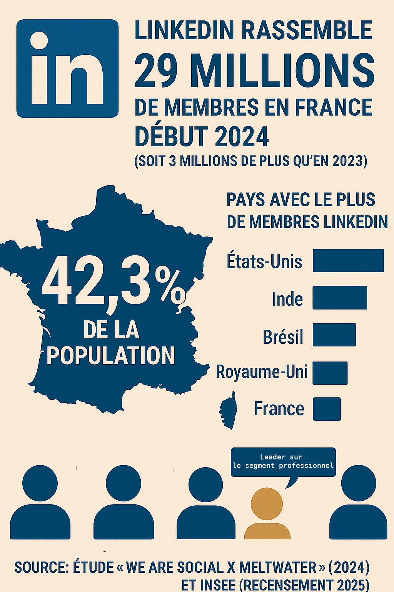
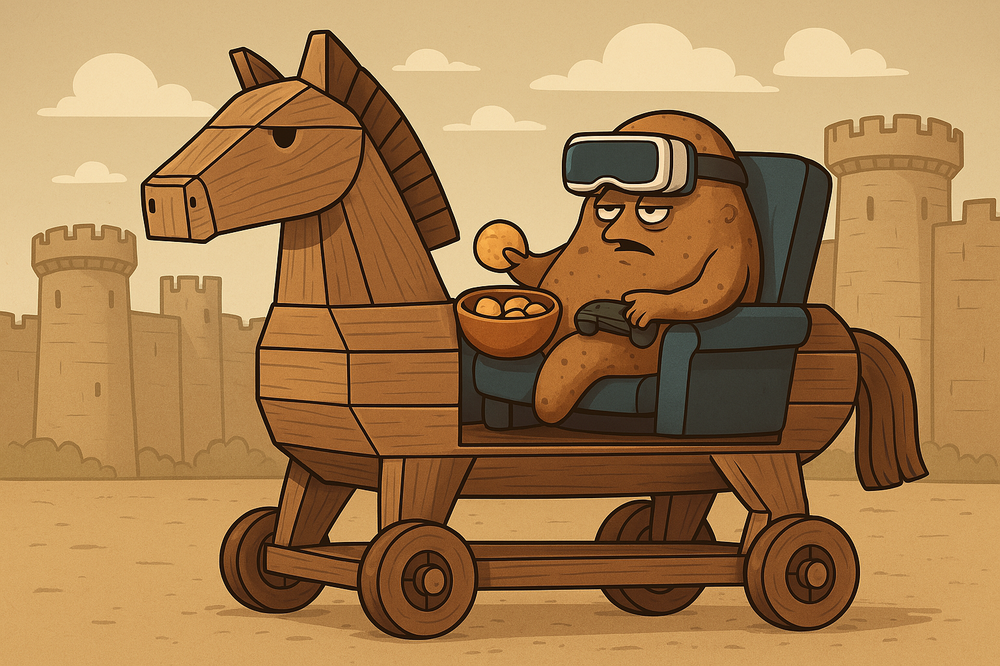
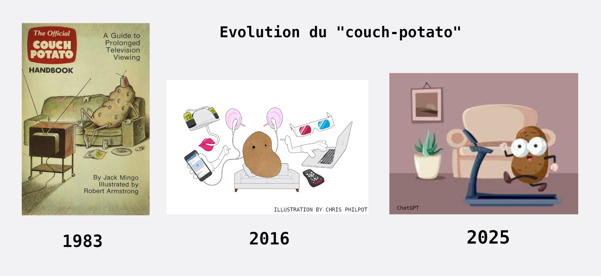
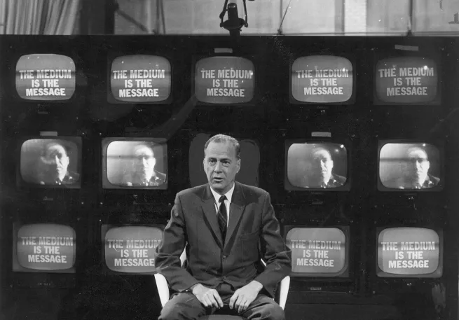
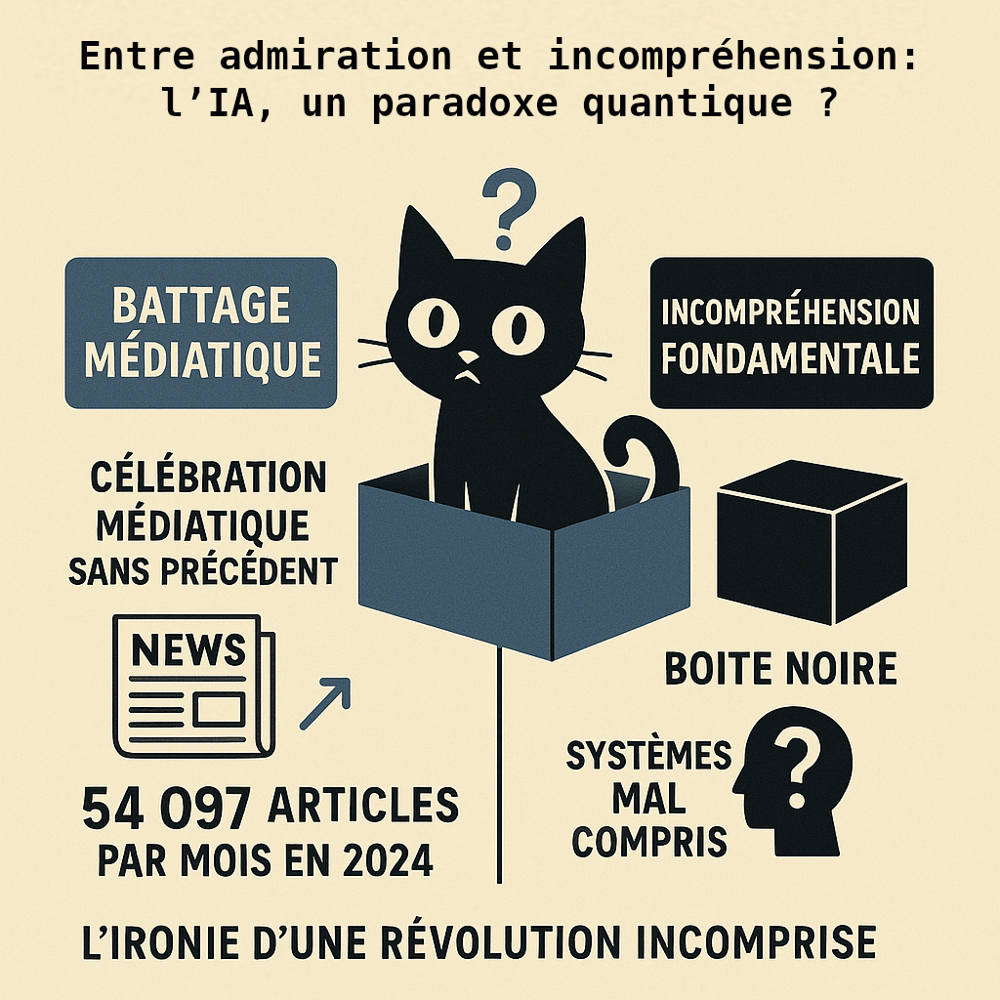
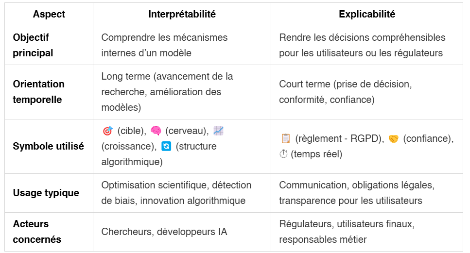
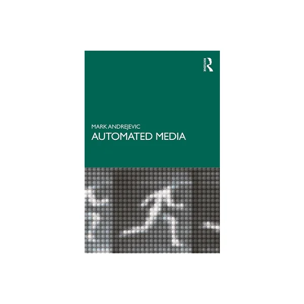

# 📰 Newsletter Portfolio - 13/06/2025

## Récits visuels, horizons numériques : Un voyage entre créativité et innovation 🚀

---

### 📌 La place de LinkedIn en France



#### La place de LinkedIn en France

[La place de LinkedIn en France](#)

#### 📱2ème réseau social en France mais...

LinkedIn décompte moins de membres que Facebook (72,3% des français ont un compte), LinkedIn avec ses 29 millions de membres représente une audience plus restreinte mais qualifiée (professionnels actifs) soit **la 5ème place mondiale.**

C'est pourquoi on ne le retrouve pas dans les classements d'usage mensuel général, mais il reste incontournable dans sa niche professionnelle.


[Retour en haut](#)

---

### 📌 Le binge-watching comme nouvelle forme de 'couch potato'



#### Le binge-watching comme nouvelle forme de 'couch potato'

[Le binge-watching comme nouvelle forme de 'couch potato'](#)

#### 👾Couch potato : objet d'étude comportementale du 'binge-watching'

Dans la culture numérique contemporaine, le terme de 'couch-potato' s'est transformé en une figure de **l'acceptation d'un comportement culturel médiatique typique**, le **"binge-watching"** (le fait de regarder plusieurs épisodes d'une série télévisée d'affilée, souvent pendant des heures)

Le terme vient du verbe anglais "to binge" qui signifie faire quelque chose de manière excessive et compulsive - on l'utilisait déjà pour parler de "binge eating" (frénésie alimentaire) ou "binge drinking" (beuverie) etc.

#### Origines du terme

Le terme "couch potato" a été créé le 15 juillet 1976 par Tom Iacino de Pasadena, en Californie, par jeu de mots entre "boob tuber" (amateur de télé) et "tuber" (tubercule/pomme de terre) [WordfooleryStack Exchange]. Il a été commercialisé pour la première fois le 20 avril 1977 et breveté par Robert Armstrong en 1984, What is the origin of the term "Couch Potato"? [English Language & Usage Stack Exchange]

Il s'agit d'un terme plutôt méprisant, représentant une personne avachie sur un canapé, entourée de snacks, avec une posture ultra détendue. Il symbolise la flemme ou simplement le plaisir de ne rien faire.

#### Période pré-2016: la fin de la critique de nos sociétés de consommation

En France, il devient **un cheval de troie mainstream** du "journalisme pensif", article de Frédéric JOIGNOT paru au Monde en 2017, où il faut admettre avec l'auteur que **la critique du consumérisme a maintenant disparu de nos champs de pensée ou d'identification.**

Même Jean BAUDRILLARD, pourtant chef de file d'une critique pointue de "l'hédonisme consumériste", est venu à son tour à manquer d'humanité. C'est un comble.


Puis en ce début des années 2000, le terme 'couch potato' est tombé en désuétude comme le remarque Laurence SCOTT, publiée dans le journal le New-Yorker, qui nous voit transformer finalement en "Apple"(2)



#### Période 2016-2020 : Le retour en grace de la patate


En nous référant à l'évolution du terme 'couch potato' entre 2016 et 2025 sur le web, on peut analyser son usage et ses transformations.

```
Chronologie interactive disponible sur :
https://tubular-pastelito-1a0530.netlify.app/
```

#### Conclusion

La transformation du terme est notable: d'abord marginalisé voire méprisé, puis amplifié par la pandémie, enfin normalisé comme partie intégrante de **la culture numérique contemporaine**, **le 'couch potato' est réintégré dans un paysage médiatique dominé par le 'streaming' et le 'binge-watching'**.

Reflet des changements technologiques et culturels, ce terme devient malgré lui le témoin de cette **recherche d'ascendance** des plateformes numériques avec les *"anciens médiums"* démontrant ainsi leur domination et participant à ces **nouvelles formes de mémoire**.



#### 📜 REFERENCES

(1) Frédéric JOIGNOT, "JEAN BAUDRILLARD. EN SOUVENIR D'UN MÉCRÉANT RADICAL DISPARU IL Y A DIX ANS", 2007-03-06, https://www.lemonde.fr/blog/fredericjoignot/2017/03/06/jean-baudrillard-le-mecreant-radical/

(2) "What Ever Happened to the Couch Potato? | The New Yorker", https://www.newyorker.com/tech/annals-of-technology/what-ever-happened-to-the-couch-potato

[Retour en haut](#)

---
### **💡Automatisation éditoriale et sérendipité algorithmique**
Cette sérendipité algorithmique – où l’IA identifie des opportunités économiques non-anticipées par le développeur – constitue un phénomène émergent qui mérite une attention particulière dans l’analyse des interactions humain-machine contemporaines.


Nous parlions précédemment d'un paradoxe de l'amplification médiatique au sujet des IA (billet sur "L'interprétabilité des LLM"), créeant fascination et méfiance vis-à-visde ces outils.

...Et bien notre petite activité sur l'automatisation des publications numériques, transformant automatiquement une newsletter HTML en série de publications LinkedIn programmées, s'est avérée une expérience surprenante, avec **la suggestion d'une intelligence artificielle sur la monnétisation de notre gestionnaire de publications !** 😅

 ✋Comment cette IA a-t-elle identifiée une dite "opportunité économique" ?

Pour nous, cela relève d'interactions nouvelles entre humain et machine que nous appelons **sérendipité algorithmique**, mais aussi sur la création de contenu par ces outils automatisés : par cette étude de cas, nous voulons parler de **la question de la reproductibilité des processus éditoriaux.**

Nous défendons **l'idée que le créateur se doit de garder le contrôle éditorial tout en déléguant les tâches répétitives et logistiques** : **l'automatisation porte ici sur la logistique, pas sur la création.**

Finalement, rien de nouveau sous le soleil : si l'IA est bien l'outil (le COMMENT), il se conforme à nos attentes et non l'inverse, et pour ce faire il faut effectivement travailler à rendre cette technologie fonctionnelle (le QUOI et POURQUOI)

➡️ Le billet complet sur notre blog scientifique ARCHNUM : https://archnum.hypotheses.org/1726


[Retour en haut](#)

---

### 📌 L'interprétabilité des LLM : le sacrifice de la compréhension au profit de la performance



#### L'interprétabilité des LLM : le sacrifice de la compréhension au profit de la performance

[L'interprétabilité des LLM : le sacrifice de la compréhension au profit de la performance](#)

Le défi de l'interprétabilité est de **comprendre comment les systèmes d'IA arrivent à une réponse donnée**. Puisqu'ils sont "entraînés" sur de gigantesques corpus de données plutôt que directement programmés par les humains, une grande partie du comportement des systèmes d'IA reste impénétrable même pour leurs créateurs.

D'où **ce paradoxe d'amplification médiatique** (1) : entre célébration et ignorance, nous y voyons avec humour la marque du chat de Schrödinger qui demeure dans un état incertain tant qu'on ne l'examine pas directement.

Cette démarche d'interprétabilité prend cette même place de **l'observateur** en examinant ces systèmes d'apprentissage automatique (ici des LLM).

#### L'interprétatibilité des LLM, deux approches aujourd'hui


#### 🗝️ INTERPRÉTABILITÉ des modèles LLM : enjeux

Il faut comprendre cette démarche comme **un investissement pour l'évolution du domaine** car la responsabilité des décisions algorithmiques constitue un défi scientifique (et démocratique) majeur entre notre besoin d'explication et leur efficacité.

Sans cette confiance, c'est à dire la compréhension scientifique et le cadre d'application, nous ne voyons pas vraiment qui voudrait prendre de tels risques, sauf pour du battage médiatique - appelé judicieusement "AI Hype" par certaine organisation (2)

#### 🔄 Convergence des approches

La tendance majeure 2025 est encore cette **convergence des approches**, qui tend à se compléter plutôt qu'à s'opposer, avec des modèles d'évaluation intégrant nativement plus de transparence et des outils mécanistiques de plus en plus accessibles.

L'objectif est d'avancer toujours plus vers une synergie entre compréhension technique et transparence utilisateur.

#### 🔬 Domaine de recherche jeune

Le domaine est très actif au nombre de publications mais c'est un domaine encore jeune qui pose des problèmes de qualité/applicabilité.

**Problème de qualité**
Confondre hypothèses avec conclusions a été courant dans la recherche en interprétabilité mécanistique.

**Biais de publication**
Beaucoup de techniques d'interprétabilité sont principalement évaluées sur de petits modèles "prototypés" et petites tâches, risquant de manquer des phénomènes critiques qui n'émergent que dans des contextes plus réalistes.

Les critères d'explicabilité, de transparence et de fiabilité sont nécessaires, propriétés qu'il est aujourd'hui encore difficile d'établir pour les algorithmes à base d'apprentissage en général et pour les grands modèles en particulier.

#### L'Ironie de notre Révolution IA

Admettons en guise de conclusion que pendant des années la performance des algorithmes primait au détriment de la compréhension, que nous nous enthousiasmons pour des systèmes que nous ne comprenons pas, et que le battage médiatique autour de l'IA s'avère souvent ridicule nous détournant du travail important qui consiste à rendre la technologie fonctionnelle (le QUOI et POURQUOI), donc autant de défis pour passer de la prouesse technique à l'utilité pratique avec fiabilité et sécurité.

#### Références citées

(1) La réalité derrière le battage médiatique de l'IA : une étude de l'IFS révèle un manque de préparation organisationnelle
post consulté le 10/06/25 : https://www.actuia.com/actualite/la-realite-derriere-le-battage-mediatique-de-lia-une-etude-de-lifs-revele-un-manque-de-preparation-organisationnelle/

(2) Management bought the AI hype, IFS post consulté le 10/06/25 : (https://www.ifs.com/news/corporate/ifs-ai-research)

[Retour en haut](#)

---

### 📌 Interprétabilité et Explicabilité des systèmes d'IA


#### Interprétabilité et Explicabilité des systèmes d'IA

[Interprétabilité et Explicabilité des systèmes d'IA](#)

L'interprétabilité et l'explicabilité jouent un rôle fondamental dans l'IA éthique, car elles permettent de garantir la transparence, la responsabilité et la justice dans les décisions algorithmiques.

Voici un tableau récapitulatif des différences entre interprétabilité et explicabilité :




[Retour en haut](#)

---

### 📌 Automated Media (2019) de Mark Andrejevic



#### Automated Media (2019) de Mark Andrejevic

[Automated Media (2019) de Mark Andrejevic](#)

Ce livre s'imposait avec notre projet d'automatisation éditoriale mais finalement nous tenons plus de l'automation tool (outil d'aide) que de l'automated media (média automatisé) au sens d'Andrejevic.

Ce livre est un incontournable pour les étudiants et chercheurs en études critiques des médias intéressés par les intersections entre médias, technologie et économie numérique. Autant l'ouvrir à tous !

Cette réflexion critique porte sur **la façon dont l'automatisation transforme notre rapport aux médias et à l'information, questionnant les enjeux de pouvoir et de contrôle dans une société de plus en plus automatisée.**

#### 🔍 Concept central

L'auteur développe le concept de **"biais de l'automatisation"** à travers trois logiques principales : la pré-emption, l'opérationnalisme, et ce qu'il appelle la "framelessness" (absence de cadre). Il fournit un aperçu des implications de ces développements pour le sort de l'expérience humaine.

> **↪️ Réflexion personnelle**
> 
> Travaillant à notre tour sur un petit projet d'automatisation éditoriale, les réflexions de Mark Andrejevic nous ont nourrie dans la distance critique nécessaire pour comprendre les impacts de l'automatisation des médias et le danger de la **standardisation algorithmique**.

#### 📊 Enjeux de l'automatisation médiatique

```
Automatisation médiatique = Technologie + Contrôle + Standardisation
Biais d'automatisation = Pré-emption + Opérationnalisme + Framelessness
```

Les trois logiques du biais d'automatisation :

```
Biais d'automatisation
├── 🎯 Pré-emption
│   └── Anticipation algorithmique
│
├── ⚙️ Opérationnalisme  
│   └── Logique utilitariste
│
└── 🚫 Framelessness
    └── Absence de cadre critique
```

#### 🎯 Implications pour l'expérience humaine

Si ces questions de systématisation ou d'hybridation productive vous intéressent :

**📝 Étude de cas complète**
Le billet complet sur notre blog scientifique ARCHNUM
[Lire l'étude de cas →](https://archnum.hypotheses.org/1726)

Notre propos souligne l'importance de maintenir une **distance critique** face à l'automatisation médiatique, afin de mieux comprendre ses impacts sur notre rapport à l'information et aux médias.

➡️ En comprenant ces mécanismes, **sommes-nous en capacité d'anticiper leurs implications?**

Développer une compréhension critique de l'automatisation médiatique correspond finalement à ce que l'on attend d'une approche académique rigoureuse : **une analyse des transformations numériques contemporaines**.

#### 📜 RÉFÉRENCES

**Andrejevic, M.** (2019). *Automated Media*. Routledge. 1ère édition.

**ResearchGate** (2019, septembre). Automated Media. Publication de Mark Andrejevic. DOI : 10.4324/9780429242595. Consulté le 12 juin 2025, à l'adresse https://www.researchgate.net/publication/336060582_Automated_Media

[Retour en haut](#)

---

## 💡 Philosophie de l'Innovation

> "L'innovation naît à l'intersection des disciplines, là où la créativité rencontre la technologie."

## 📱 Restons connectés !

**Envie d'explorer de nouveaux horizons numériques ?**

— [Portfolio Complet](https://portfolio-af-v2.netlify.app/)  
— [Me Contacter sur LinkedIn](https://www.linkedin.com/in/alexiafontaine)

#Innovation #TechCreative #Data #DigitalTransformation #CreativeTech

© 2025 Alexia Fontaine - Tous droits réservés
