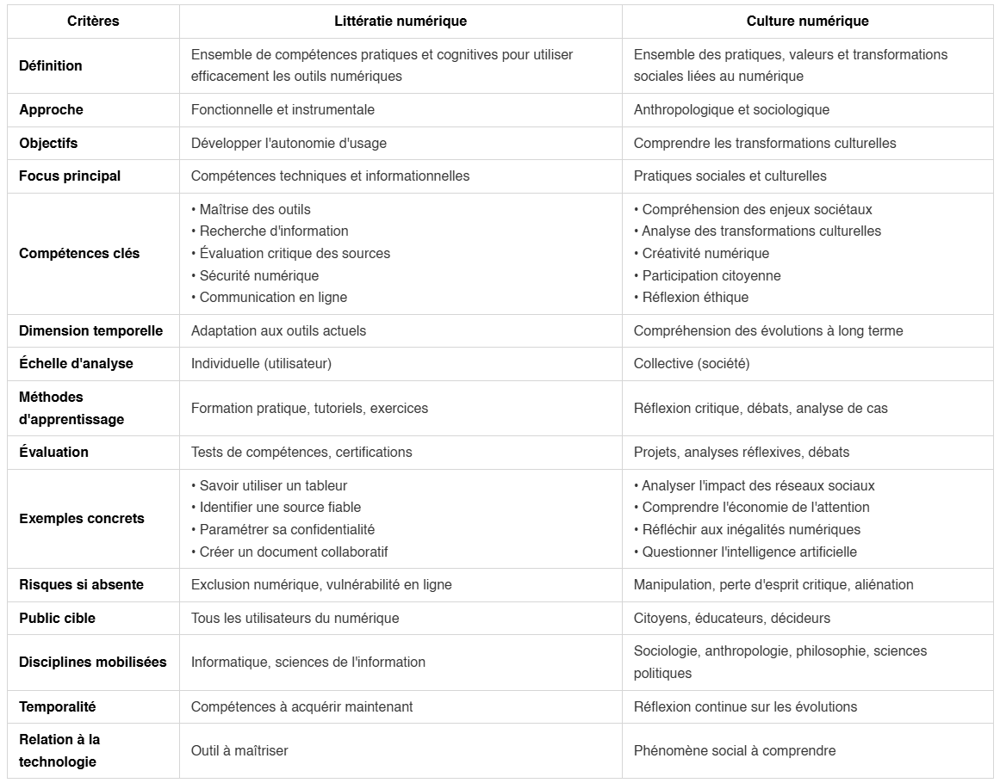

# 📰 Newsletter Portfolio - 30/06/2025

## Récits visuels, horizons numériques : Un voyage entre créativité et innovation 🚀

---

### 📌 🦙🤖 Ollama, un petit LLM en local

#### 🦙🤖 Ollama, un petit LLM en local

[🦙🤖 Ollama, un petit LLM en local](#)

#### 📱Développer sa présence en ligne

Face au constat que nos présences sur les réseaux sociaux constituent aujourd'hui une compétence de <strong>littératie numérique</strong> au même titre qu'un enjeu <strong>de gestion de son identité numérique</strong>,  la question finale demeure encore et toujours de <strong>savoir comment gérer tout cela ?!</strong>

Notre projet personnel d'<strong>automatiser nos publications LinkedIn</strong> partait de ce questionnement et du temps que l'on pouvait y passer : à notre avis, trop pour ce qu'il en est, du fait de la <strong>captation de notre attention</strong> sur ces plateformes, de l'investissement sur notre <strong>image professsionnelle</strong> qui demande des compétences nouvelles, mais aussi en termes de <strong>coûts</strong>, si l'on veut utiliser des services payants ou comptabiliser le temps investi.

Ainsi, depuis une newsletter hebdomadaire HTML publiée en ligne, nous avons eu l'idée d'en <strong>extraire les contenus comme série de posts programmés</strong> sur notre compte LinkedIn tout au long de la semaine.

Rien de très nouveau si ce n'est que cette automatisation permet d'exécuter des <strong>actions concrètes</strong>.

#### La différence entre "analyser" et "faire"

Nous pensons que nous sommes dans cette tendance des outils de création d'interfaces vers des plateformes d'automatisation intelligente où <strong>l'IA peut réellement "faire" le travail, pas seulement l'analyser</strong>.

Toute proportion gardée, à notre échelle, ce basculement s'observe clairement même sur un petit projet où l'on peut monter <strong>sa propre logique d'automatisation</strong>.

Et comme nous l'a suggéré un agent conversationnel qui a bien pris en compte la probabilité contextuelle du sujet (!), notre objectif sera de transformer cette application en <strong>microservice autonome</strong>.

#### Ollama, un LLM local

Nous avions testé, dans un premier temps, des librairires Python connues dans le traitement du langage naturel mais les capacités génératives des LLM sont nettement plus performantes pour notre tâche de resumé.

Le traitement s'effectue sur des données non-structurées sans preprocessing complexe et pas de datasets d'entraînement. Pour des taches de compréhension textuelle, il n'y a plus à douter de l'efficacité des LLM.

Les moins sont que comme tous les LLM, ils sont moins prévisibles, la latence, la consommation de mémoire et d'énergie sont plus importantes : la <strong>supervision humaine</strong> s'impose comme un gage de <strong>fiabilité</strong> et de <strong>responsabilité</strong>.

#### La nécessité de garder le contrôle sur son contenu

Notre tâche est simple : réduire le contenu de notre newsletter HTML pour l'adapter au format de publication des posts sur LinkedIn.

Finalement, il s'agit d'appliquer des <strong>templates</strong> que nous avons prédéfinis selon les catégories de notre Newsletter : Actualités, Pédagogie, Développement web, Culture numérique, Infographie et Lecture.

Ainsi chaque résumé est "stylisé" selon sa catégorie avec en plus une accroche et ses émojis rattachés à sa classe.

<strong>On garde la main sur son contenu, car on gagne du temps</strong> : appliqué sur notre post de vendredi dernier, nous reconnaissons volontiers que cela a été un effort en moins de ne pas avoir à se replonger dans un billet qui remontait à la semaine dernière !

#### Conclusion

A ce stade de notre projet, <strong>le temps investi est clairement sur les contenus de notre Newsletter</strong> : notre chaîne de publication est structurée de l'écriture à la publication du contenu.

Certains pourraient dire que la <strong>frontière</strong> entre contenu authentique et synthétique s'estompe dangereusement, mais dans ce cas le résumé est déjà une tromperie! 😅

Par notre démarche, <strong>nous écrivons comme nous l'entendons</strong> dans un format <strong>markdown</strong> qui se convertit ensuite facilement en d'autres, nous pouvons assurer notre <strong>veille</strong> par cette Newsletter en HTML, garder le contrôle sur nos contenus sans nous soucier du format de publication sur les réseaux sociaux, et le tout stocké dans un dossier sur notre ordinateur.

Nous développons <strong>un outil à notre échelle</strong> qui répond d'abord à nos besoins, tout en étant intégré au système global et globalisé des publications numériques en ligne.

Il faut penser et déployer sur toutes ces <strong>échelles</strong> à la fois, en privilégier une plus qu'une autre devient actuellement signe d'une inadapation où l'on retrouve en première ligne les questions de <strong>la littératie numérique</strong> et de <strong>l'accessibilité</strong>.

[Retour en haut](#)

---

### 🎭 Qu'est-ce que la culture numérique?

#### Qu'est-ce que la culture numérique?

La culture numérique désigne l'ensemble des connaissances, compétences, pratiques et valeurs liées à <strong>l'usage des technologies numériques</strong> dans notre société. Elle englobe plusieurs dimensions qui sont liées entre elles.

Au niveau des <strong>compétences techniques</strong>, elle inclut la maîtrise des outils informatiques, la navigation sur internet, l'utilisation des réseaux sociaux, la création de contenus numériques, et la compréhension des mécanismes de base du fonctionnement des systèmes informatiques.

La dimension <strong>cognitive</strong> comprend la capacité à rechercher, évaluer et traiter l'information en ligne, à développer un esprit critique face aux contenus numériques, et à comprendre les enjeux de la désinformation et des algorithmes.

L'aspect <strong>social et communicationnel</strong> concerne les codes et pratiques de communication en ligne, l'usage des plateformes collaboratives, la gestion de son identité numérique, et la compréhension des dynamiques communautaires virtuelles.

La culture numérique implique aussi une <strong>conscience éthique et citoyenne</strong> : comprendre les enjeux de protection des données personnelles, de vie privée, de propriété intellectuelle, et développer une réflexion sur l'impact sociétal du numérique.

Elle se manifeste enfin par une <strong>capacité d'adaptation</strong> aux évolutions technologiques constantes et par le développement d'une approche créative et innovante dans l'usage des outils numériques.

Cette culture n'est pas innée mais s'acquiert et se développe tout au long de la vie, constituant aujourd'hui un enjeu majeur d'éducation et d'inclusion sociale.

#### Culture numérique et litteratie numérique

Ces deux concepts sont complémentaires mais la <strong>culture numérique</strong> privilégie une perspective <strong>anthropologique et sociale</strong>, tandis que la <strong>littératie numérique</strong> se concentre sur les <strong>compétences pratiques et cognitives</strong> nécessaires pour utiliser efficacement les outils numériques : c'est une approche <strong>fonctionnelle</strong> qui vise <strong>l'autonomie</strong> dans l'usage des technologies.

#### Tableau comparatif : Culture numérique vs Littératie numérique

| <strong>Critères</strong> | <strong>Littératie numérique</strong> | <strong>Culture numérique</strong> |
|--------------|---------------------------|------------------------|
| <strong>Définition</strong> | Ensemble de compétences pratiques et cognitives pour utiliser efficacement les outils numériques | Ensemble des pratiques, valeurs et transformations sociales liées au numérique |
| <strong>Approche</strong> | Fonctionnelle et instrumentale | Anthropologique et sociologique |
| <strong>Objectifs</strong> | Développer l'autonomie d'usage | Comprendre les transformations culturelles |
| <strong>Focus principal</strong> | Compétences techniques et informationnelles | Pratiques sociales et culturelles |
| <strong>Compétences clés</strong> | • Maîtrise des outils • Recherche d'information • Évaluation critique des sources • Sécurité numérique • Communication en ligne | • Compréhension des enjeux sociétaux • Analyse des transformations culturelles • Créativité numérique • Participation citoyenne • Réflexion éthique |
| <strong>Dimension temporelle</strong> | Adaptation aux outils actuels | Compréhension des évolutions à long terme |
| <strong>Échelle d'analyse</strong> | Individuelle (utilisateur) | Collective (société) |
| <strong>Méthodes d'apprentissage</strong> | Formation pratique, tutoriels, exercices | Réflexion critique, débats, analyse de cas |
| <strong>Évaluation</strong> | Tests de compétences, certifications | Projets, analyses réflexives, débats |
| <strong>Exemples concrets</strong> | • Savoir utiliser un tableur • Identifier une source fiable • Paramétrer sa confidentialité • Créer un document collaboratif | • Analyser l'impact des réseaux sociaux • Comprendre l'économie de l'attention • Réfléchir aux inégalités numériques • Questionner l'intelligence artificielle |
| <strong>Risques si absente</strong> | Exclusion numérique, vulnérabilité en ligne | Manipulation, perte d'esprit critique, aliénation |
| <strong>Public cible</strong> | Tous les utilisateurs du numérique | Citoyens, chercheurs, éducateurs, décideurs |
| <strong>Disciplines mobilisées</strong> | Informatique, sciences de l'information | Sociologie, anthropologie, philosophie, sciences politiques |
| <strong>Temporalité</strong> | Compétences à acquérir maintenant | Réflexion continue sur les évolutions |
| <strong>Relation à la technologie</strong> | Outil à maîtriser | Phénomène social à comprendre |

#### Synthèse

La <strong>littératie numérique</strong> répond à la question : <em>"Comment utiliser efficacement le numérique ?"</em>

La <strong>culture numérique</strong> répond à la question : <em>"Comment le numérique transforme-t-il notre société et comment nous y situer ?"</em>

#### Conclusion

Ces deux approches sont complémentaires et nécessaires pour <strong>une éducation numérique complète qui forme des citoyens à la fois compétents et critiques.</strong>

La littératie numérique fournit les fondations techniques nécessaires, quand la culture numérique apporte la dimension réflexive et critique indispensable pour naviguer dans notre société numérisée.

[Retour en haut](#)

---

### 📌 Contexte & conscience dans les biais algorithmiques

#### Contexte & conscience dans les biais algorithmiques

[Contexte & conscience dans les biais algorithmiques](#)

Dans ce billet, nous posons qu'<strong>un algorithme est la représentation partagée d'une pensée mathématique</strong>, et en ce sens, il s'agit d'une <strong>situation de communication.</strong>

De ce point de vue, sans <strong>contexte</strong>, on peut facilement comprendre comment une situation de <strong>communication</strong> peut recouvrir une multitude d'<strong>interprétations</strong> selon la <strong>conscience</strong> de ceux qui observent mais aussi selon ceux qui font cette situation (...du vaudeville en puissance!😄)

Cette <strong>ambiguïté interprétative</strong> pourrait prêter à rire si ces représentations comme les <strong>biais algorithmiques</strong> dans les modèles de langage (LLM) n'avaient pas <strong>d'impacts réels</strong> conduisant à des résultats inéquitables, discriminatoires ou incorrects pour certains groupes ou situations.

En effet, ce processus statistique dit stochastique pondère des milliers de possibilités selon leur probabilité contextuelle. Il peut donc influencer ce que nous pensons.

A travers ces quelques ressources (nous n'avons absolument pas la prétention à l'exhaustivité tant le sujet nous dépasse, mais refus d'une totalisation unifiée), nous posons des jalons de réflexions sur cette situation de <strong>la continuité, l'authenticité, la reproductibilité d'une pensée.</strong>

Le tableau de René Magritte <strong>La Condition humaine (1933)</strong> ouvre ce questionnement où il s'en expliquait à André Breton en écrivant :

« On peut supposer que derrière le tableau le spectacle soit différent de ce que l’on voit, mais l’essentiel était de supprimer la différence qu’il y avait entre une vue que l’on voit de l’extérieur et l’intérieur d’une chambre." (Sylvester D., Magritte, Paris, Actes Sud, 2009, p. 386.)

[On the Dangers of Stochastic Parrots | Proceedings of the 2021 ACM Conference on Fairness, Accountability, and Transparency](https://dl.acm.org/doi/10.1145/3442188.3445922)

[On the Dangers of Stochastic Parrots | Proceedings of the 2021 ACM Conference on Fairness, Accountability, and Transparency](https://dl.acm.org/doi/10.1145/3442188.3445922)

[Podcast : This Is Not A Pipe Podcast](https://youtu.be/WGE_Q47HaJ0?si=mamPwUYS0zBev2wB), au sujet du livre de Ed Finn, What Algorithms Want: Imagination in the Age of Computing, MIT Press, 2017.

[Podcast : This Is Not A Pipe Podcast](https://youtu.be/WGE_Q47HaJ0?si=mamPwUYS0zBev2wB)

[Implications philosophiques de l'IA - Claudine Tiercelin (2024-2025)](https://www.youtube.com/@Lettres-Arts-Langage-Philo-CdF/videos)

[Implications philosophiques de l'IA - Claudine Tiercelin (2024-2025)](https://www.youtube.com/@Lettres-Arts-Langage-Philo-CdF/videos)

[Retour en haut](#)

---

### 📊 Est-ce la pénurie des Data Scientists pousse vers l'automatisation ?

#### Est-ce la pénurie des Data Scientists pousse vers l'automatisation ?

[Est-ce la pénurie des Data Scientists pousse vers l'automatisation ?](#)

<strong>Est-ce que la pénurie de data scientists a crée un contexte économique favorable au développement d'outils d'automatisation ?</strong>

#### La prédiction américaine

Notre interrogation commence en lisant cette prédiction  datant de 2017 du cabinet américain GARTNER qui annonçait que <strong>40% des tâches de Data Science seront automatisées à l'horizon 2030</strong>
[cabinet américain GARTNER (source indirecte) - "Predicts 2017: Analytics Strategy and Technology", mais notons que la prédiction originale était : 40% des tâches de data science seraient automatisées d'ici 2020 (pas 2030)]

L'idée défendue était que face à <strong>la démocratisation des outils de l'analytique</strong>, un utilisateur averti et éclairé peut créer ou générer des modèles sans pour autant avoir ni les compétences ou une fonction dans le domaine des statistiques et de l'analyse de données.

Selon Gartner encore, cette démocratisation de la data science résiderait dans l'automatisation qui permet donc à des <strong>profils moins spécialisés de manipuler des données</strong>, sans pour autant remettre en cause le savoir-faire d'un Data Scientist.

On est bien dans du <strong>marketing de contenu</strong> par cet exemple, car ils ont su parfaitement <strong>cerner ce phénomène de démocratisation des données par un storytelling maîtrisé,</strong> et partagé tout aussi bien par des cabinets comme McKinsey, Deloitte, BCG etc.

Avec leur méthode respective, <strong>tous reconnaissent un besoin de démocratisation de la data science, avec l'automatisation comme un des moyens d'y parvenir.</strong>

#### Les technologies facilitatrices

Prenons l'exemple des <strong>outils No-Code / Low-Code</strong> et toute la pléthore de <strong>plateformes d'analytiques avancées</strong> comme Power BI pour ne citer que l'une des plus populaires.

Qui aujourd'hui remet en cause leur usage ?

<em>...Oui nous avons suivi ces commentaires désamparés (vers 2019) sur des archives de blogs de ces Data Scientist se sentant réduits à du "Excel amélioré", au lieu d'utiliser leur compétences en data science.</em>

On peut comprendre leur frustration, mais au prix d'un Data Scientist pour (peut-être) des tâches de BI de base, est-ce que cela se justifie ?

Et actuellement, force est de constater que <strong>la réduction des coûts de l'analytique</strong> est un cadre de travail.

↪️ Car plus besoin de savoir coder pour faire des "drag and drop", des data pipleines ainsi que des modèles pré-construits avec des outils tels que Dataiku par exemple !

Et <strong>la technique de l'intelligence artificielle</strong> n'est pas venue remettre en question cette nouvelle pratique de l'automatisation (démocratisante 😅).

↪️ Voyez vos interfaces intuitives et vos outils analytiques en self-service qui vous connectent aux insights en temps réel grâce aux capacités des métadonnées et de l'IA !

Au final, ces outils n'empêchent pas ce travail d'être (bien) fait, puisque ces non-techniciens amènent généralement leur propre expertise mais sans les compétences techniques du Data Scientist : ces profils ne peuvent pas les remplacer.

...Alors où est le problème, s'il y en un ?

#### L'alignement entre Automatisation et Démocratisation

Nous voyons 2 faits qui caractérisent cette situation dans un contexte plus global qu'est <strong>l'IPA (Intelligent Process Automation = Automatisation Intelligente des Processus)</strong>

- Une pénurie confirmée de Data Scientists : 250k data scientists manquants d'ici 2024
- Un marché AutoML (Automated Machine Learning) en explosion : CAGR 40-50% (= Taux de Croissance Annuel Composé), mais avec une adoption récente en cours, limitée par d'autres facteurs (sensibilisation, formation, gouvernance)
Ces concepts d'<strong>automatisation</strong> (en tant que gestion des tâches techniques complexes) et <strong>démocratisation</strong> (pour l'accès aux outils analytiques) ont tendance à se chevaucher et la distinction n'est pas toujurs aisée car elle pointe la <strong>prise de décision</strong> accordée et donc la <strong>responsabilité</strong> engagée.

#### Références - Sources vérifiables

✅ Croissance Marché AutoML (6 Rapports Convergents)

1. P&S Intelligence (2024)
Titre : "Automated Machine Learning (AutoML) Market Report"
URL : https://www.psmarketresearch.com/market-analysis/automated-machine-learning-market
Données : 866,3 millions USD (2023), CAGR 52,8% (2024-2030)
Citation dans mes recherches : Document index 56-1

1. Grand View Research (2024)
Titre : "Automated Machine Learning Market Size Report, 2030"
URL : https://www.grandviewresearch.com/industry-analysis/automated-machine-learning-market-report
Données : 2,658.9 millions USD (2023) → 21,969.7 millions USD (2030), CAGR 42,2%
Citation dans mes recherches : Document index 57-1

1. Zion Market Research (2024)
Titre : "Automated Machine Learning (AutoML) Market Size, Share, Growth 2032"
URL : https://www.zionmarketresearch.com/report/automated-machine-learning-automl-market
Données : 2,54 milliards USD (2023) → 58,95 milliards USD (2032), CAGR 41,82%
Citation dans mes recherches : Document index 58-1

1. ResearchAndMarkets.com (Juillet 2024)
Titre : "Global Automated Machine Learning (AutoML) Business Analysis Report 2024-2030"
Source : Globe Newswire
URL : https://www.globenewswire.com/news-release/2024/07/15/2912882/28124/en/Global-Automated-Machine-Learning-AutoML-Business-Analysis-Report-2024-2030
Données : 1,1 milliard USD (2023) → 10,9 milliards USD (2030), CAGR 39,3%
Citation dans mes recherches : Document index 59-1

1. Market.us (Mars 2025)
Titre : "Automated Machine Learning Market Size | CAGR at 48.30%"
URL : https://market.us/report/automated-machine-learning-market/
Données : 4,5 milliards USD (2024) → 231,54 milliards USD (2034), CAGR 48,30%
Citation dans mes recherches : Document index 62-1

1. Global Market Insights (2024)
Titre : "Automated Machine Learning Market Size, Growth Analysis 2032"
URL : https://www.gminsights.com/industry-analysis/automated-machine-learning-market
Données : 1,4 milliard USD (2023), CAGR 30%+ (2024-2032)
Citation dans mes recherches : Document index 63-1

✅ Pénurie Data Scientists
1. Adastra Corporation (2024)

Titre : "Data Professionals Market Survey Forecast 2024"
Données : 76% des professionnels de la data aux États-Unis confirment que la pénurie de talents en data science va continuer tout au long de 2024
Source secondaire : Fortune Business Insights AutoML report
Citation dans mes recherches : Document index 65-1

1. Indeed (Octobre 2022)
Type : Données salariales
Données : Salaires moyens des data scientists : près de 145 000 USD aux États-Unis
Source secondaire : TechTarget definition "Citizen Data Scientist"
Citation dans mes recherches : Document index 41-1

[Retour en haut](#)

---

### 📌 Les défis éthiques de l'IA générative moderne.

#### Les défis éthiques de l'IA générative moderne.

[Les défis éthiques de l'IA générative moderne.](#)

#### Les dangers des "Stochastic Parrots"

Les travaux de Timnit GEBRU font partis de ces lanceurs d'alerte sur <strong>les dérives des algorithmes d'apprentissage automatique</strong>.

Ancienne salariée de chez GOOGLE avec Maragaret MITCHELL, elles ont co-dirigé l'équipe IA éthique de 2018 à 2021 alertant sur les conséquences des biais induits dans les algorithmes.

Renvoyées suite aux révélations sur les inégalités dans les équipes de développement pour M.MITCHELL et à un article devenu célèbre par T.GEBRU, co-écrit avec Emily Bender et Angelina McMillan-Major, où elles introduisent le concept de "perroquet stochastique" pour décrire les grands modèles de langage.

L'article présente quatre risques principaux des grands modèles de langage : coûts environnementaux et financiers, opacité menant à des biais dangereux inconnus, potentiel de tromperie, et incapacité à comprendre les concepts sous-jacents.

Ces femmes sont des figures de proue sur <strong>l'IA ethique</strong> et l'actualité brûlante de ce sujet s'explique par les défis que porte cette technologie dans un domaine complexe et évolutif.

#### Les défis éthiques de l'IA générative moderne

<strong>Tout pose problème dans l'IA générative</strong>, mais plus personne ne remet en question son <strong>intégration</strong> : il faudra développer cette technologie de manière <strong>éthique</strong>, <strong>inclusive</strong> et <strong>transparente.</strong>

➡️ Synthèse de ces enjeux (générée par une IA 😅) :

<strong>Biais et représentation</strong>
L'IA générative hérite des biais présents dans ses données d'entraînement - textes internet, images, conversations - qui reflètent les inégalités sociétales. Elle peut ainsi perpétuer ou amplifier des stéréotypes sur le genre, la race, la culture, créant des contenus discriminatoires ou excluant certaines communautés.

<strong>Désinformation et manipulation</strong>
La capacité à générer du texte, des images et même des vidéos ultra-réalistes pose des risques majeurs : deepfakes, fausses informations indétectables, manipulation de l'opinion publique. La frontière entre contenu authentique et synthétique s'estompe dangereusement.

<strong>Droits d'auteur et propriété intellectuelle</strong>
Les modèles sont entraînés sur des œuvres protégées sans consentement explicite des créateurs. Quand l'IA génère du contenu "inspiré" d'œuvres existantes, qui détient les droits ? Les artistes, écrivains, développeurs voient leur travail potentiellement dévalorisé.

<strong>Impact environnemental</strong>
L'entraînement et l'utilisation de ces modèles consomment des quantités colossales d'énergie. Chaque requête a une empreinte carbone non négligeable, soulevant des questions sur la durabilité de cette technologie.

<strong>Conditions de travail</strong>
Derrière l'IA "propre" se cachent souvent des travailleurs exploités - modérateurs de contenu exposés à des images traumatisantes, annotateurs sous-payés dans des pays en développement. L'industrie externalise ses coûts humains.

<strong>Concentration du pouvoir</strong>
Quelques entreprises technologiques contrôlent le développement de l'IA générative, créant des monopoles de fait sur l'accès à ces outils transformateurs. Cette concentration pose des questions démocratiques fondamentales.

<strong>Responsabilité et transparence</strong>
Comment attribuer la responsabilité quand une IA génère du contenu problématique ? Les "boîtes noires" algorithmiques rendent difficile la compréhension et la régulation de ces systèmes.

On comprend d'autant mieux pourquoi il y a <strong>urgence</strong> à se tenir informer et à se former sur les modèles de langage !

Les applications d'IA à fort impact social (santé, justice, police, emploi, RH, médias et information etc.) sont celles qui affectent directement la vie des individus et peuvent avoir des conséquences majeures sur leur bien-être, leurs droits et leurs opportunités.

[Retour en haut](#)

---

### 📌 Biais en apprentissage automatique

#### Biais en apprentissage automatique

[Biais en apprentissage automatique](#)

Une infographie basée sur la pensée de <strong>Timnit Gebru</strong> spécialiste des biais algorithmiques, nous citons ses travaux majeurs :

Gender Shades Buolamwini, J., &amp; Gebru, T. (2018). Gender Shades: Intersectional Accuracy Disparities in Commercial Gender Classification. Proceedings of Machine Learning Research, 81:1–15. ➤ [Lire l’article sur le site du MIT Media Lab ➤ Projet Gender Shades – Algorithmic Justice League](https://www.media.mit.edu/publications/gender-shades-intersectional-accuracy-disparities-in-commercial-gender-classification/)

[Lire l’article sur le site du MIT Media Lab ➤ Projet Gender Shades – Algorithmic Justice League](https://www.media.mit.edu/publications/gender-shades-intersectional-accuracy-disparities-in-commercial-gender-classification/)

Datasheets for Datasets Gebru, T., Morgenstern, J., Vecchione, B., Vaughan, J. W., Wallach, H., Daumé III, H., &amp; Crawford, K. (2018). Datasheets for Datasets. arXiv preprint arXiv:1803.09010. ➤[Version PDF sur arXiv ➤ Version hébergée par ](https://ai.stanford.edu/~tgebru/papers/datasheets.pdf)

[Version PDF sur arXiv ➤ Version hébergée par ](https://ai.stanford.edu/~tgebru/papers/datasheets.pdf)

On the Dangers of Stochastic Parrots Bender, E. M., Gebru, T., McMillan-Major, A., &amp; Shmitchell, S. (2021). On the Dangers of Stochastic Parrots: Can Language Models Be Too Big? Proceedings of the 2021 ACM Conference on Fairness, Accountability, and Transparency (FAccT ’21). [➤ Texte complet sur Internet Archive](https://archive.org/details/stochastic-parrots-3442188.3445922)  [➤ Version PDF directe(https://s10251.pcdn.co/pdf/2021-bender-parrots.pdf)]

[➤ Texte complet sur Internet Archive](https://archive.org/details/stochastic-parrots-3442188.3445922)

[Retour en haut](#)

---

## 💡 Philosophie de l'Innovation

> "L'innovation naît à l'intersection des disciplines, là où la créativité rencontre la technologie."

## 📱 Restons connectés !

**Envie d'explorer de nouveaux horizons numériques ?**

— [Portfolio Complet](https://portfolio-af-v2.netlify.app/)  
— [Me Contacter sur LinkedIn](https://www.linkedin.com/in/alexiafontaine)

#Innovation #TechCreative #Data #DigitalTransformation #CreativeTech

© 2025 Alexia Fontaine - Tous droits réservés