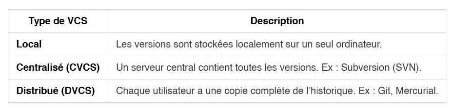
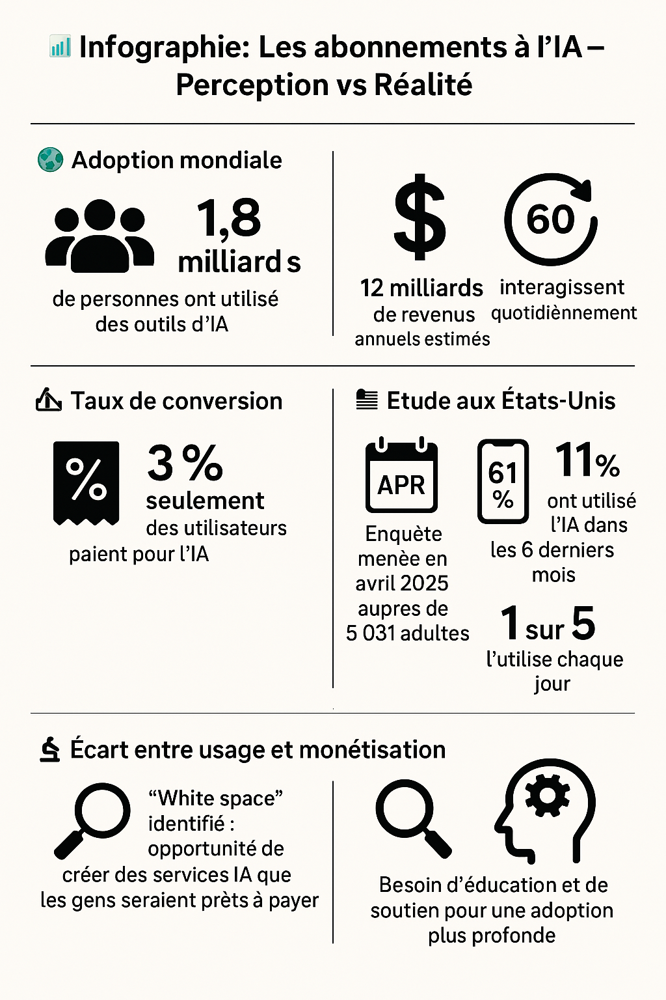
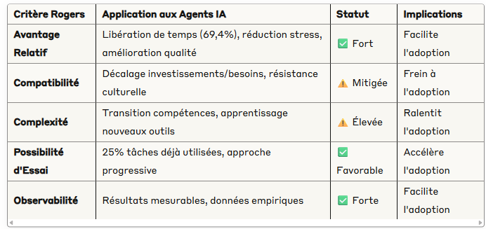

# 📰 Newsletter Portfolio - 09/07/2025

## Récits visuels, horizons numériques : Un voyage entre créativité et innovation 🚀

---

### 📌 Le contrôle de version

#### Le contrôle de version

Un <strong>système de contrôle de version</strong> (ou <strong>VCS</strong> pour <em>Version Control System</em>) est un outil essentiel en développement logiciel et en gestion de projets collaboratifs.

Il permet de suivre l’évolution des fichiers (souvent du code source), de collaborer efficacement à plusieurs, et de revenir à des versions antérieures si nécessaire.

#### 🧠 Pourquoi utiliser un VCS ?

- 🔄 Historique des modifications : chaque changement est enregistré avec un horodatage, l’auteur, et un message de description.
- 👥 Travail collaboratif : plusieurs personnes peuvent travailler sur les mêmes fichiers sans écraser le travail des autres.
- 🛠️ Restauration facile : possibilité de revenir à une version antérieure en cas d’erreur.
- 🌿 Branches : permet de développer des fonctionnalités ou corriger des bugs sans impacter la version principale du projet.

| Type de VCS       | Description                                                                 |
|-------------------|-----------------------------------------------------------------------------|
| <strong>Local</strong>         | Les versions sont stockées localement sur un seul ordinateur.               |
| <strong>Centralisé (CVCS)</strong> | Un serveur central contient toutes les versions. Ex : Subversion (SVN).     |
| <strong>Distribué (DVCS)</strong> | Chaque utilisateur a une copie complète de l’historique. Ex : Git, Mercurial. |

Git est aujourd’hui le VCS le plus utilisé dans le monde. Il est :

- 🔧 Distribué : chaque développeur a une copie complète du projet.
- ⚡ Rapide : les opérations locales sont très rapides.
- 🔀 Flexible : permet de gérer facilement les branches et les fusions.
👉 Plateformes populaires utilisant Git : <strong>GitHub</strong>, <strong>GitLab</strong>, <strong>Bitbucket</strong>.

<code>bash
git init           # Initialise un dépôt Git
git clone URL      # Clone un dépôt distant
git status         # Affiche les fichiers modifiés
git add fichier    # Ajoute un fichier à l’index
git commit -m "msg" # Enregistre les modifications
git push           # Envoie les changements vers le dépôt distant
git pull           # Récupère les changements du dépôt distant</code>

#### ⏰ Qu'est-ce qu'un commit ?

Un commit Git, c’est comme une <strong>photo instantanée</strong> de ton projet à un moment donné 📸.

Un <strong>commit</strong> est une opération qui enregistre les modifications apportées aux fichiers dans un dépôt Git. Il permet de :

- Garder une trace de l’évolution d’un projet
- Revenir à un état antérieur si besoin
- Collaborer avec d’autres en voyant qui a changé quoi et quand
- Un identifiant unique (SHA-1) : une suite de caractères qui identifie le commit
- Un message : écrit par le développeur pour décrire les modifications
- L’état des fichiers à ce moment-là
- Des métadonnées : auteur, date, etc.
<code>bash
git commit -m "Ajout de la page d'accueil"</code>

Le <code>-m</code> signifie « message », suivi d’une description entre guillemets.

Une fois qu'un commit est crée, il est enregistré localement et plusieurs actions sont possibles :

- Le pousser sur un serveur distant (git push)
- Le voir dans l’historique (git log)
- Comparer les changements (git diff)
<strong>Référence Git</strong> (ou <em>Git refs</em> au pluriel) est un concept fondamental pour comprendre le fonctionnement interne de Git.

Une <strong>référence</strong> est un <strong>pointeur symbolique</strong> vers un commit. Plutôt que de manipuler directement les empreintes SHA-1 (longues et peu lisibles), Git utilise des noms conviviaux pour représenter ces commits.

#### 📂 Où sont stockées les références ?

Les références sont stockées dans le dossier <code>.git/refs</code> de votre dépôt local. On y trouve :

- .git/refs/heads/ : contient les branches locales (ex : main, develop)
- .git/refs/tags/ : contient les tags (versions figées)
- .git/refs/remotes/ : contient les branches distantes (ex : origin/main)

#### 🔄 Types de références

| Type de référence | Description |
|-------------------|-------------|
| <strong>Branche</strong>       | Pointeur vers le dernier commit d’une ligne de développement |
| <strong>Tag</strong>           | Référence immuable vers un commit spécifique (souvent pour les versions) |
| <strong>HEAD</strong>          | Référence spéciale pointant vers la branche actuellement active |

#### 🛠️ Commandes utiles liées aux références

<code>bash
git show-ref             # Affiche toutes les références
git update-ref &lt;ref&gt; &lt;sha1&gt;  # Met à jour une référence manuellement
git rev-parse &lt;ref&gt;      # Résout une référence en son SHA-1
git symbolic-ref HEAD    # Affiche la branche actuelle</code>

#### 📘 Pour aller plus loin

Pour explorer en détail le fonctionnement des références dans Git sur ces ressources :

- Git - Références Git (git-scm.com)
- Réfs Git : ce que vous devez savoir (Atlassian)
[Git - Références Git (git-scm.com)](https://git-scm.com/book/fr/v2/Les-tripes-de-Git-R%C3%A9f%C3%A9rences-Git)

[Réfs Git : ce que vous devez savoir (Atlassian)](https://www.atlassian.com/fr/git/tutorials/refs-and-the-reflog)

[Retour en haut](#)

---

### 📌 C'est quoi l'écoconception?

#### C'est quoi l'écoconception?

L'<strong>écoconception</strong> est une approche de conception qui vise à <strong>réduire</strong> l'impact environnemental d'un produit, service ou système tout au long de son cycle de vie, tout en conservant ses qualités d'usage et ses performances.

Elle repose sur <strong>une analyse du cycle de vie</strong> (ACV) qui examine l'impact environnemental depuis l'extraction des matières premières jusqu'à la fin de vie du produit, en passant par la production, la distribution, l'utilisation et le recyclage.

Les objectifs principaux incluent :

- Réduction de la consommation d'énergie et de ressources
- Diminution des émissions polluantes
- Minimisation des déchets
- Optimisation de la durabilité et de la réparabilité
- Facilitation du recyclage
Il s'agit donc de trouver un <strong>compromis</strong> entre les caractéristiques des ressources utilisées, les exigences techniques du produit et les avantages pour l'environnement.

#### Triangle de la soutenabilité

On rentre dans une version de l'<strong>économie circulaire</strong> avec 3 notions piliers:

- Sobriété : Réduction de la consommation et des besoins, éviter le gaspillage, adopter des modes de vie plus durables
- Circularité : Optimisation des flux de matières, réutilisation, recyclage, économie de la fonctionnalité, allongement de la durée de vie
- Innocuité : Utilisation de substances et procédés non toxiques pour la santé humaine et l'environnement, écoconception, chimie verte
<strong>Sobriété</strong> : Réduction de la consommation et des besoins, éviter le gaspillage, adopter des modes de vie plus durables

<strong>Circularité</strong> : Optimisation des flux de matières, réutilisation, recyclage, économie de la fonctionnalité, allongement de la durée de vie

<strong>Innocuité</strong> : Utilisation de substances et procédés non toxiques pour la santé humaine et l'environnement, écoconception, chimie verte

Les applications sont concrètes dans le domaine de l'industrie, le numérique et l'architecture ; nous ne verrons ici que l'aspect numérique.

#### 🧭 Écoconception des services numériques

Selon le Référentiel général d'écoconception de services numériques (RGESN) - 2024, l'écoconception des services numériques peut se résumer ainsi :

<strong>🎯 Objectifs</strong>
    🔋 Réduire la consommation énergétique et l’empreinte carbone
    🧑‍💻 Lutter contre l’obsolescence des équipements numériques
    🌐 Promouvoir des services utiles et durables

<strong>🧩 Domaines couverts</strong>
    🧠 Stratégie : évaluer l’utilité réelle du service
    🏗️ Architecture : limiter les ressources techniques
    🎨 UX/UI : design sobre et accessible
    📦 Contenus : formats légers, compression
    🖥️ Frontend / Backend : code optimisé
    ☁️ Hébergement : infrastructures écoresponsables
    🧮 Algorithmie : éviter les calculs inutiles

<strong>📋 Méthodologie</strong>
    ✅ 78 critères sous forme de questions
    📊 Outils d’évaluation disponibles en Excel et OpenDocument
    📄 Déclaration d’écoconception recommandée

Ce document de référence donne le cadre d'application de cette démarche globale d'écoconception qui vise à limiter l'ingénierie excessive.

#### Conclusion

Levier de la transisition écologique des entreprises (et des territoires), l'enjeu de l'écoconcpetion est aussi de réduire les coûts de production, favoriser l'innovation de produit, voire répondre aux attentes environnementales.

Bien que les mesures écologiques soient net recul aujourd'hui, cette démarche participe à la prise de responsabilité environnementale : il s'agit de partir du besoin de l'utilisateur et d'être en mesure de proposer de multiples conditions d'usages d'un produit.

La variabilité du produit - ou le recyclage de matière - est finalement une conception très ancienne, expérimentée depuis très longtemps par les Hominidés !

Cette conscience environnementale n'est donc pas une conséquence de l'industrialisation mais propre à notre condition d'humain.

REFERENCES
Maîtriser les impacts écologiques de l'offre culturelle numérique avec l'écoconception : https://www.culture.gouv.fr/thematiques/transition-ecologique/maitriser-les-impacts-ecologiques-de-l-offre-culturelle-numerique-avec-l-ecoconception
Référentiel général d'écoconception de services numériques (RGESN) - 2024 : https://ecoresponsable.numerique.gouv.fr/publications/referentiel-general-ecoconception/

[Retour en haut](#)

---

### 📌 Est-ce que l'IA est rentable ?

#### Est-ce que l'IA est rentable ?

[Est-ce que l'IA est rentable ?](#)

#### Les abonnements à l’IA – Perception vs Réalité

Une question que l'on ne se pose certainement pas mais <strong>est-ce que l'IA est bon investissement ?</strong> L'article de Tiernan RAY pour ZDNET relaye justement ce sujet et les conclusions nous laissent quelque peu perplexe sur l'adoption de cette innovation.

Il commente une enquête menée en avril dernier, sur un panel de 5 031 adultes américains, pour Menlo Ventures par la société Morning Consult concernant la <strong>rentabilité</strong> des abonnements des IA.

On retiendra que cette étude a été généré en partie par un LLM (!)
et le décalage entre perception et réalité du phénomène IA : beaucoup d'emballement et des réalités qui freinent cette adoption technologique.

Voilà les chiffres et principaux résultats relevés par ce journaliste (...résumé par un LLM de notre côté 😅) :

🌍 <strong>Adoption mondiale</strong>
    👥 1,8 milliard de personnes ont utilisé des outils d’IA
    🔁 600 millions interagissent quotidiennement

💸 <strong>Revenus générés</strong>
    💰 12 milliards $ de revenus annuels estimés
    🏢 OpenAI représente la majorité de ces revenus

📉 <strong>Taux de conversion</strong>
    🧾 Seulement 3 % des utilisateurs paient pour l’IA
    📉 Un des plus faibles taux de conversion du secteur tech

🇺🇸 <strong>Étude aux États-Unis</strong>
    📅 Enquête menée en avril 2025 auprès de 5 031 adultes
    📱 61 % ont utilisé l’IA dans les 6 derniers mois
    📆 1 sur 5 l’utilise chaque jour

⚖️ <strong>Écart entre usage et monétisation</strong>
    🔍 “White space” identifié : opportunité de créer des services IA que les gens seraient prêts à payer
    🧠 Besoin d’éducation et de soutien pour une adoption plus profonde

#### En clair

Le <strong>décalage</strong> entre les investissements actuels et les besoins réels des travailleurs est particulièrement souligné mettant en avant la nécessité d'un <strong>réalignement de ces investissements</strong>.

Cela rejoint d'ailleurs les conclusions de l'audit mené par Standford au sujet de l'adoption des agents IA au travail qui élargit ses recommandations.

↪️ voir notre billet dans cette Newsletter : <em>" Future of Work with AI Agents (étude de Standford) : 'You may not take interest in AI, but AI will take interest in you.'</em> 😅 "

Le sujet de <strong>l'intégration des agents IA</strong> est un enjeu crucial dans l'adoption de cette <strong>innovation</strong> qui modifie en profondeur notre rapport au travail : ce n'est pas tant la technique que les aspects culturels et orgnisationnels que reposent cette adoption technologique.

#### REFERENCES

- L'article ZDNET de Tiernan RAY, Are AI subscriptions worth it? Most people don't seem to think so, according to this study : https://www.zdnet.com/article/are-ai-subscriptions-worth-it-most-people-dont-seem-to-think-so-according-to-this-study/
- Le rapport, « 2025 : L'état de l'IA grand public », rédigé par Shawn Carolan, Amy Wu, CC Gong, Sam Borja : https://menlovc.com/perspective/2025-the-state-of-consumer-ai/
L'article ZDNET de Tiernan RAY, <em>Are AI subscriptions worth it? Most people don't seem to think so, according to this study</em> : https://www.zdnet.com/article/are-ai-subscriptions-worth-it-most-people-dont-seem-to-think-so-according-to-this-study/

Le rapport, <em>« 2025 : L'état de l'IA grand public »</em>, rédigé par Shawn Carolan, Amy Wu, CC Gong, Sam Borja : https://menlovc.com/perspective/2025-the-state-of-consumer-ai/

[Retour en haut](#)

---

### 📌 La rentabilité des IA

#### La rentabilité des IA

[La rentabilité des IA](#)

La <strong>rentabilité des IA</strong> est remise en question par une société de capital-risque américaine Menlo Ventures.

Cette récente enquête menée en avril dernier aux États-Unis, par la société Morning Consult, a été réalisée sur un panel de 5 031 adultes américains.

L'infographie porte sur l'article publié en ligne par ZDNET de Tiernan RAY :

"Are AI subscriptions worth it? Most people don't seem to think so, according to this study" : https://www.zdnet.com/article/are-ai-subscriptions-worth-it-most-people-dont-seem-to-think-so-according-to-this-study/

Vous pouvez accéder aussi à l'étude « 2025 : L'état de l'IA grand public », rédigé par Shawn Carolan, Amy Wu, CC Gong, Sam Borja : https://menlovc.com/perspective/2025-the-state-of-consumer-ai/

{witdh="50%"}</img>

[Retour en haut](#)

---

### 📌 Assistant d'aide à la décision géographique basé sur l'IA : intérêt?

#### Assistant d'aide à la décision géographique basé sur l'IA : intérêt?

[Assistant d'aide à la décision géographique basé sur l'IA : intérêt?](#)

#### Vers un agent IA

Dans un précendent billet, nous avions voulu illustrer la notion d'inférence, concept souvent utilisé en apprentissage automatique, par une visualisation d'un jeu de données archéologiques sur Paris.

➡️ <strong>Référentiel archéologique de Paris (1811 enregistrements)</strong> : https://parisdata.opendatasoft.com/explore/dataset/referentiel-archeologique-de-paris/information/?disjunctive.code_postal&amp;disjunctive.date_operation&amp;disjunctive.nature_operation&amp;disjunctive.responsable_operation&amp;disjunctive.prehistoire&amp;disjunctive.protohistoire&amp;disjunctive.antiquite&amp;disjunctive.moyen_age&amp;disjunctive.temps_modernes&amp;disjunctive.epoque_contemporaine

Ainsi, notre second prototype vise à générer des parcours archéologiques personnalisés avec une analyse dite "intelligente"(c'est à dire une analyse sémantique basée sur le LLM Ollama) selon le mode choisi (inductif, déductif et abductif), le tout avec des métriques pour évaluer la qualité et la pertinence des résultats.

🎯 Modes d'inférence distincts
🧠 Modèle: llama3.2
🔥 Analyse sémantique des synthèses archéologiques
🎭 Génération de narratives

Ainsi la "logique" appliquée est la suivante :

<strong>FLUX DE TRAVAIL
demande prompt + mode d'inférence → 1. filtre sites → 2. tri géographique → 3. LLM analyse synthèses → 4. Mapbox optimise parcours</strong>

Le principe est de suggérer une sélection automatique "intelligente" de sites archéologiques.

#### Penser l'ingénierie

En nous penchant sur la question, il faut admettre que notre solution n'est pas si intelligente, coûte en termes de consommation énergétique et de temps de calcul pour un résultat mitigé.

Toutefois, même si ce croisement des données et la génération automatique des narratives sont approximatifs, ils sont souvent d'intêret.

↪️ Pour tenter une comparaison, nous pourrions évaluer qu'un bon nombre de ces réponses automatiques auraient pu être données par une personne non-experte du domaine !

💡 Voilà où nous trouvons le sujet novateur, car il s'agit bien d'être en mesure de <strong>penser correctement le problème</strong>, la technique est en mesure de répondre.

🎯 La justification d'un agent IA se pose concrètement : quelle finalité pour quel besoin ?

Cela semble revenir à parler de bon sens, mais nous y voyons plutôt la nécessaire application des principes de l'ecoconception.

En effet, sans réponses automatisées, il est parfaitement possible de générer des parcours personnalisés. Alors pourquoi est-ce intéressant?

#### L'alterité nécessaire questionnement

Le besoin centré sur l'utilisateur est une démarche qui aide à cadrer une ingénierie encore trop souvent excessive, renforcée par l'arrivée des IA souvent perçues à tort comme accessibles et gratuites !

Partant de notre application qui devait aider à faire découvrir un patrimoine par exemple, la question d'un agent IA en tant qu'assistant d'aide à la décision a posé ouvertement <strong>le caractère de ce qui est autre</strong>.

...Et je mentirai de dire que cela n'est pas intéressant !

L'adoption de cette innovation est en cours et nous butons (cela n'engage que l'auteur 😅) sur des aspects culturels et d'organisation plutôt que techniques.

<strong>"L'altérité est le concept le plus antipathique au 'bon sens'"</strong> disait Roland BARTHES, encore une fois.

[Retour en haut](#)

---

### 📌 Future of Work with AI Agents (étude de Standford) : 'You may not take interest in AI, but AI will take interest in you.' 😅

#### Future of Work with AI Agents (étude de Standford) : 'You may not take interest in AI, but AI will take interest in you.' 😅

[Future of Work with AI Agents (étude de Standford) : 'You may not take interest in AI, but AI will take interest in you.' 😅](#)

#### L'Adoption des Agents IA au Travail

L'intelligence artificielle s'impose aujourd'hui comme l'une des transformations technologiques les plus profondes de notre époque.

Une récente étude menée par l'Université de Stanford auprès de 1 500 travailleurs dans 104 professions offre un éclairage intéressant sur cette mutation.

En appliquant le modèle de <strong>diffusion des innovations</strong> d'Everett ROGERS, développé en 1962, nous pouvons mieux comprendre les mécanismes d'<strong>adoption des agents IA</strong> dans le monde professionnel.

↪️ Les résultats et article sont disponibles sur ce <strong>site de présentation</strong> :

<strong>Future of Work with AI Agents - Auditing Automation and Augmentation Potential across the U.S. Workforce : https://futureofwork.saltlab.stanford.edu/</strong>

Leur approche permet de saisir à un instant "t" la diffusion de cette innovation.

Ainsi, leur cadre d'audit se présente comme un nouveau management <strong>externalisé</strong> avec une refonte complète de la <strong>gestion de projet</strong>.

#### Les Fondements du Modèle Rogers Appliqué à l'IA

Everett Rogers identifiait cinq phases dans l'adoption d'une innovation : la connaissance, la persuasion, la décision, l'implémentation et la confirmation. Chaque étape révèle des dynamiques spécifiques que l'on retrouve aujourd'hui dans l'adoption des agents IA.

La phase de <strong>connaissance</strong> correspond parfaitement à la situation actuelle où 70 millions de travailleurs américains sont sur le point de faire face à leur plus grande transformation professionnelle due aux agents IA. Cette prise de conscience s'accompagne d'une utilisation déjà active des outils IA pour au moins 25% des tâches dans 36% des professions, marquant une transition entre connaissance théorique et expérience pratique.

La <strong>persuasion</strong> s'illustre par le fait que 46,1% des tâches reçoivent une attitude positive des travailleurs envers l'automatisation IA. Cette adhésion s'appuie sur des motivations concrètes : "libérer du temps pour un travail à haute valeur ajoutée" constitue la motivation principale dans 69,4% des cas, suivie par la réduction de la répétitivité (46,6%) et l'amélioration de la qualité (46,6%).

La phase de <strong>décision</strong> révèle cependant des résistances significatives. Le manque de confiance domine les préoccupations (45%), suivi par la peur du remplacement d'emploi (23%) et l'absence de touche humaine (16,3%). Ces craintes se manifestent de manière particulièrement marquée dans certains secteurs : dans les Arts, Design et Médias, seulement 17,1% des tâches ont reçu des évaluations positives.

Cette résistance sectorielle illustre l'importance de la <strong>compatibilité</strong> dans le modèle Rogers. Les innovations doivent s'harmoniser avec les valeurs et pratiques existantes pour être adoptées. Or, l'étude révèle un décalage préoccupant : 41,0% des entreprises Y Combinator sont concentrées dans la Zone de Faible Priorité et la Zone "Feu Rouge" d'Automatisation, suggérant un mauvais alignement entre les investissements technologiques et les besoins réels des travailleurs.

#### Mais une intervention humaine exigée

Comme nous l'avions constaté à notre échelle, même sur un petit projet d'automatisation, <strong>l'intervention humaine</strong> reste un critère majeur dans l'adoption de cette technologie car perçue comme gage de <strong>fiabilité</strong> :  nous utilisons les agents IA comme des <strong>amplificateurs cognitifs</strong>.

La phase d'<strong>implémentation</strong> des agents IA révèle donc, de la même manière, dans cette étude, que les travailleurs veulent conserver un contrôle et utilisent principalement cette technologie dans une démarche collaborative.

➡️ Le niveau souhaité est H3 selon leur échelle "Agence Humaine", c'est à dire un partenariat égal plutôt que le tout automatisé.

Techniquement faisable mais non désirée, l'adoption technologique ne suit pas une logique d'efficacité maximale.

Enfin la phase de <strong>confirmation</strong> n'est pas encore réalisée.

Nous laisson volontairement les catégories d'adoptants selon la typologie de Rogers et abordons plutôt les caractéristiques de l'innovation IA à travers ce tableau synthétique :

De ce constat synthétique sur l'adoption des agents IA, les deux critères de friction (Comptabilité et Complexité) permettent d'appuyer leurs recommandations stratégiques qui s'appuient à la fois sur un <strong>réalignement des investissements</strong>, le développement de <strong>l'approche collaborative</strong> et la préparation de la <strong>transition des compétences</strong> qui va vers des compétences interpersonnelles et organisationnelles.

#### Conclusion

Par ce modèle de diffusion des innovations d'Everett ROGERS, nous appréhendons d'autant mieux le phénomène des agents IA, complexe et différenciée selon les secteurs.

<strong>Culture numérique</strong> et <strong>littératie numérique</strong> deviennent tout aussi importantes que savoir lire et écrire, et la frontière entre <strong>démocratisation et automatisation de l'analytique</strong> exigera de plus en plus de <strong>clarification</strong>.

L'intégration réussie des agents IA dépendra surtout du <strong>respect</strong> qui sera établi entre besoins/valeurs humaines et performance technologique.

Une approche centrée sur l'humain et la collaboration semble être la clé d'une adoption réussie et durable.

#### REFERENCES

Rogers, E. M. (2003). <em>Diffusion of Innovations</em> (5th ed.). New York: Free Press. ISBN : 978-0743258234

[Retour en haut](#)

---

## 💡 Philosophie de l'Innovation

> "L'innovation naît à l'intersection des disciplines, là où la créativité rencontre la technologie."

## 📱 Restons connectés !

**Envie d'explorer de nouveaux horizons numériques ?**

— [Portfolio Complet](https://portfolio-af-v2.netlify.app/)  
— [Me Contacter sur LinkedIn](https://www.linkedin.com/in/alexiafontaine)

#Innovation #TechCreative #Data #DigitalTransformation #CreativeTech

© 2025 Alexia Fontaine - Tous droits réservés