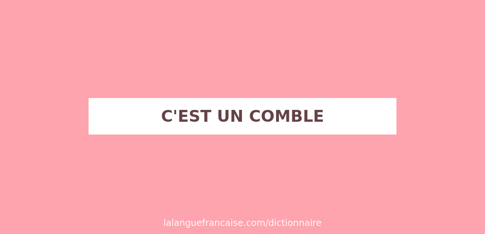

# 📰 Newsletter Portfolio - 15/07/2025

## Récits visuels, horizons numériques : Un voyage entre créativité et innovation 🚀

---

### 📌 🤖⚖️'The impossibility of fair LLM'

#### 🤖⚖️'The impossibility of fair LLM'

[🤖⚖️'The impossibility of fair LLM'](#)

#### "We develop the stronger claim: fairness in the rigorous sense defined by these frameworks for narrow use, even on a single nontrivial metric, is intractable with general-purpose LLMs."

<em>Nous développons une affirmation plus forte : l'équité, au sens rigoureux défini par ces cadres pour une utilisation restreinte, même sur une seule mesure non triviale, est intraitable avec des LLM à usage général.</em>

Leur affirmation peut sembler péremptoire mais leur démonstration est juste. Pour nous, leur démarche est pertinente sur les points suivants :

- L'équité comme critère d'analyse pose avec clairvoyance les possibilités et limites des LLMs et nous permettent de nous positionner sur ce type d'outil.
- Le cadre sociotechnique comme support de cette analyse définit ce que produisent ces LLM, c'est à dire des aliud pas des alter, c'est à dire "objet qui existe pour moi dans une altérité générale en attente d'une identification." (DESCOLA, 2005: 205)
<strong>L'équité comme critère d'analyse</strong> pose avec clairvoyance les <strong>possibilités</strong> et <strong>limites</strong> des LLMs et nous permettent de nous <strong>positionner</strong> sur ce type d'outil.

<strong>Le cadre sociotechnique comme support de cette analyse</strong> définit ce que produisent ces LLM, c'est à dire des <strong><em>aliud</em></strong> pas des <em>alter</em>, c'est à dire <strong>"objet qui existe pour moi dans une altérité générale en attente d'une identification."</strong> (DESCOLA, 2005: 205)

Article en ligne

Jacy Anthis, Kristian Lum, Michael Ekstrand and others, ‘The Impossibility of Fair LLMs’, 2025 [https://arxiv.org/abs/2406.03198](https://arxiv.org/abs/2406.03198)

[https://arxiv.org/abs/2406.03198](https://arxiv.org/abs/2406.03198)

#### Identifier pour comprendre

🎯 <strong>Les limites de données non-structurées, obsolescentes, multi-contextes et non-composables</strong> empêchent d'appliquer ce principe d'équité de manière générale.

Ce problème pourrait ressembler à un <strong>jeu de tri</strong> mais où il n'y aurait plus qu'une seule entrée dans la boîte, tandis que les pièces, elles, sont toujours diverses.

↪️ Par cette image, vous comprenez de suite qu'il sera plus simple d'adapter le couvercle que les éléments !

Et les piste d'amélioration envisagées vont d'ailleus dans ce sens, en modifiant l'outil (la boîte) pour mieux tenir compte des données (les pièces) :

<strong>Solution 1: Responsabilité des Développeurs</strong>
• Standards de transparence obligatoires
• Documentation des données d'entraînement
• Design participatif avec stakeholders
• Audits tiers réguliers
<strong>Solution 2: Évaluations Contextuelles</strong>
• Abandon des tests génériques
• Focus sur cas d'usage spécifiques
• Connexion préjudices réels
• Métriques adaptées au contexte
<strong>Solution 3: Méthodes Évaluatives</strong>
• RLHF avec cadres techniques
• LLM-as-a-judge pour équité
• Outils d'interprétabilité participatifs
• IA pour évaluer l'IA (avec prudence)

<strong>L'équité générale est impossible pour les LLMs</strong>, même si l'équité reste un objectif important, par honnêté intellectuelle, il était <strong>nécessaire de l'énoncer clairement</strong>.

<strong>La démarche scientifique</strong> exposée dans cet article rend compte ainsi à ce <strong>paradigme LLM</strong> et à tous ceux qui le construisent.

<strong>La prise de responsabilité de ces préconisations</strong> demande à présent de mettre en place des <strong>standards stricts</strong>, des <strong>évaluations contextuelles en continu</strong> avec des <strong>méthodes adaptatives</strong>.

REFERENCE
Jacy Anthis, Kristian Lum, Michael Ekstrand and others, ‘The Impossibility of Fair LLMs’, 2025 [https://arxiv.org/abs/2406.03198](https://arxiv.org/abs/2406.03198)

[https://arxiv.org/abs/2406.03198](https://arxiv.org/abs/2406.03198)

[Retour en haut](#)

---

### 📌 L'IA va-t-elle tuer le métier de traducteur ?

#### L'IA va-t-elle tuer le métier de traducteur ?

[L'IA va-t-elle tuer le métier de traducteur ?](#)

#### L'IA va-t-elle tuer le métier de traducteur ? Eve CHARRIN Alternatives Economiques, N° 459 juin 2025

Un article particulièrement révélateur des tensions et inquiétudes inhérentes au sujet des <strong>IA génératives concernant les artistes-auteurs</strong>, menée dans une enquête journalistique claire et factuelle. On aime.

➡️ Comme le rappelle le philosophe Gilbert SIMONDON, l'objet technique n'est pas déconnecté de son environnement, bien au contraire, il existe toujours dans <strong>un réseau complexe</strong> dont il transforme à la fois son environnement qui lui-même transforme l'objet technique et avec lequel ce dernier évolue avec les humains.

Cette <strong>co-évolution</strong> est bien tracée dans cet article qui évite l'écueil de la technique "aliénante" (trop facilement relayée dans les médias), si ce n'est dans la mauvaise application de cette relation par ce constat de <em>"l'engrenage de la déqualification"</em> : cette pratique consiste à traduire les textes générés automatiquement du fait de leur qualité médiocre !

<strong>Face à un problème de productivité/rentabilité</strong>, on peut légitimement comprendre pourquoi ces professionnels sont vent debout : il est évident que ce ne sont pas aux artistes-auteurs de payer ces <strong>stratégies à court-termes</strong>. Il ne s'agit pas d'interdire la rentabilité (?!) ou d'interdire ces outils IA, ces professionnels demandent juste que leur travail soit reconnu.

<strong>Mais quel intérêt de lire de la traduction littérale?</strong> Personne ne peut sérieusement dire qu'une oeuvre littéraire traduite par un modèle LLM (usage professionnel et commercial) est au niveau d'un traducteur humain, aujourd'hui ou demain.

⚠️ <strong>L'investissement dans l'implémentation des cas d'usages</strong> (juste traduire les <strong>intentions de l'auteur</strong>, je vous laisse réfléchir à tout ce que cela implique 😰) : les coûts en énergie, en suivi et évaluation (biais d'ancrage), <strong>une dépense plus qu'un gain</strong> de passer par cette technologie pour ce type de tâche cognitive !

🤔 <strong>Pourquoi lire une oeuvre traduite par un modèle LLM</strong>, si vous ne pouvez plus exercer votre <strong>imagination</strong>, votre capacité propre de traduction ? C'est quand même tout ce que vous <strong>offre</strong> un traducteur humain (monnayant l'achat de l'oeuvre généralement) à travers toutes ses <strong>expériences vécues</strong> que vous devez à votre tour traduire, en plus de celles de l'auteur.

↪️ <strong>Cette pratique du monde singulière</strong> dont chacun d'entre nous est porteur : rendez-vous compte <em>(pour revenir à du pratico-pratique)</em> de tout ce qu'il faudrait implementer dans un modèle pour arriver à en esquisser correctement les contours pour une seule personne !

↪️ <strong>Les niveaux de lecture</strong> ne sont pas uniquement des compétences liées à une grille d'évaluation : lire est une aptitude liée à notre cognition humaine. Nous avons tous un cerveau.

↪️ <strong>Cette capacité de l'expérience non-vécue</strong> nous l'avons tous, ensuite chacun en fait ce qu'il veut/peut.

#### Défendre concrètement le droit d'auteur

⚠️⚠️ <strong>Rappelons qu'un modèle mathématique (à la différence d'une loi mathématique) varie selon les données entrées !</strong>

🎯 <strong>Lire est toujours une proposition</strong>. On peut pousser le vice en disant qu'en variant les données ce seront d'autant plus de traductions possibles 😈 ! Mais ce type de représentation (la traduction en est une autre) se base sur une <strong>illusion de sens</strong> : il ne s'agit pas de choisir ce que me dit l'oeuvre avant de la lire, j'accepte d'abord de lire l'oeuvre de l'auteur et/ou sa traduction, avec laquelle je ne serai peut-être pas d'accord ensuite.

🤔 <strong>Quoi comprendre sur ce que je lis, puisque un modèle ne réfléchit pas</strong> : sans information sur <strong>comment le modèle est construit</strong>, comment puis-je évaluer la qualité du contenu ? (Lire aussi notre billet Actualités !)

{width="40%}</img>

<strong>Limiter le champ d'action</strong> de ces outils IA n'est pas les interdire (ce n'est pas ce que demande cette profession) : autrement dit, ce n'est pas parce que vous avez une voiture que cela vous autorise à rouler comme bon vous semble !

<strong>Défendre le droit d'auteur</strong> en interdisant effectivement l'entraînement des robots linguistiques sur des textes d'auteurs aiderait à reconnaître ce qui relève des automatismes de la réflexion.

<strong>Poser des contraintes</strong> à ces modèles LLM exige déjà d'accepter de les poser. Tout est encore à faire, mais le droit est bien le <strong>cadre</strong> qu'il faut pour donner toute sa place à cette innovation et protéger les artistes-auteurs.

#### Conclusion

Notre relation à l'écrit est bien malmenée et des illusions se créent de toute part : la sincérité est exigeante, cela n'a rien de nouveau, et ne dépend pas d'un élitisme, d'une authenticité de l'oeuvre (les artises de la Renaissance nous prendraient vraiment pour des fous...) ou pire de vérité, mais d'une <strong>forme de reconnaissance</strong>.

Le modèle LLM n'est pas sincère, il est neutre et il est évident que c'est tout sauf ce que l'on recherche dans une traduction ! Clairement, leur artefact est avant tout un <strong>aliud</strong> : <strong>un objet qui existe pour moi dans une altérité générale en attente d'une identification.</strong>

Le glissement entre cette reconnaissance et cette identification est tentant mais là encore on tomberait dans une certaine forme de facilité (consummériste) ; les contraintes, les limites sont des gardes-fou : <strong>nous percevons des réalités, pas le réel.</strong> Certains pourraient ou voudraient nous le faire croire, danger !

Toute la portée de ces deux références bibilographiques ci-après portent sur cette clairvoyance nécessaire au piège courant de <em>“ce qui est c’est ce qui doit être”</em> : l’outil induit faussement "une connaissance universelle" sur une altérité en devenir.

#### REFERENCES

<strong>SIMONDON Gilbert</strong>, Du Mode d'existence des objets techniques, Paris, Aubier, 1958 (rééd. 2012).

Une réflexion fondamentale sur la relation entre l'humain et la technique qui éclaire les enjeux de maîtrise et d'aliénation technologique au cœur du débat libre/propriétaire.

<strong>DESCOLA Philippe</strong>, Par-delà nature et culture, Paris, Gallimard, 2005.

Une anthropologie qui questionne nos catégories de pensée.

[Retour en haut](#)

---

### 📊 📊 Visualisation de données : 'Future of Work with AI Agents'

#### 📊 Visualisation de données : 'Future of Work with AI Agents'

[ 📊 Visualisation de données : 'Future of Work with AI Agents'](#)

Preuve de l'évolution de la <strong>communication scientifique</strong>, la mise en ligne par ce site de présentation de l'étude de Standford sur <strong>l'adoption des agents IA au travail</strong> : la possibilité de <strong>visualiser</strong> directement les résultats de leur audit rend leur propos d'autant plus <strong>percutant</strong> et confirme tout l'intérêt de ce type de représentation graphique.

[Retour en haut](#)

---

### 📌 🤗 Hugging Face 'le GitHub du machine learning'

#### 🤗 Hugging Face 'le GitHub du machine learning'

[🤗 Hugging Face 'le GitHub du machine learning'](#)

#### 🚀 L'Open-source : vitrine de tous les développeurs

A l'heure où le paysage de l'intelligence artificielle est déjà largement dominé par les Big Tech, il nous paraît important de montrer que parallèlement et même conjointement se développent toujours les projets de l'Open-source.

Véritable vivier de nos futurs produits et service numériques, ce domaine professionnel sert très souvent de tremplin aux futurs start-up, et maintient aussi des pratiques collaboratives importantes dans le domaine informatique.

#### Hugging-Face 🇫🇷🐓🥖 projet français

La page de Wikipedia [Hugging Face]() décrit notamment comment Clément Delangue, Julien Chaumond et Thomas Wolf ont développé une plateforme collaborative de <strong>modèles pré-entraînés</strong> et de <strong>datasets</strong> nécessaires à l'apprentissage automatique, permettant éventuellement, du même coup, à l'entraînement de nouveaux modèles.

[Hugging Face]()

💪 La force de Hugging Face réside dans sa position de <em>"GitHub du machine learning"</em> - une plateforme neutre où chercheurs et entreprises partagent librement leurs travaux.

La valorisation de Hugging Face (90x les revenus, c'est à dire valorisé à 90 fois ses revenus annulels) reflète son potentiel de croissance énorme, bien que ses revenus actuels (50M$) restent modestes comparés aux solutions cloud établies.

#### Hugging Face et ses concurrents - Tableau synthétique

| <strong>Plateforme</strong> | <strong>Type</strong> | <strong>Valorisation/Taille</strong> | <strong>Points forts</strong> | <strong>Modèle économique</strong> |
|----------------|----------|-------------------------|------------------|----------------------|
| <strong>Hugging Face</strong> | Hub open source | 4,5 Mds $ | • 1M+ modèles • Communauté forte • Standard NLP | Freemium + Enterprise |
| <strong>H2O.ai</strong> | Concurrent direct | Non coté | • AutoML • Solutions entreprise | SaaS entreprise |
| <strong>OpenAI</strong> | IA propriétaire | ~80 Mds $ | • GPT-4 • Innovation IA | API payante |
| <strong>Google Vertex AI</strong> | Cloud ML | Part de Google | • Intégration GCP • Scale entreprise | Pay-as-you-go |
| <strong>AWS SageMaker</strong> | Cloud ML | Part d'Amazon | • Écosystème AWS • MLOps complet | Pay-as-you-go |
| <strong>Azure ML</strong> | Cloud ML | Part de Microsoft | • Intégration Azure • Interface drag-drop | Pay-as-you-go |

| <strong>Critères</strong> | <strong>Hugging Face</strong> | <strong>Concurrents directs</strong> | <strong>Géants du Cloud</strong> |
|--------------|------------------|-------------------------|---------------------|
| <strong>Approche</strong> | Open source | Mixte | Propriétaire |
| <strong>Communauté</strong> | 1,2M+ utilisateurs | Limitée | Écosystème captif |
| <strong>Modèles disponibles</strong> | Tous types | Sélection limitée | Principalement internes |
| <strong>Coût d'entrée</strong> | Gratuit | Variable | Élevé |
| <strong>Flexibilité</strong> | Maximale | Moyenne | Liée au cloud |
| <strong>Support entreprise</strong> | ✓ | ✓✓✓ | ✓✓✓ |

| <strong>Segment</strong> | <strong>Hugging Face</strong> | <strong>Leader alternatif</strong> | <strong>Part du leader</strong> |
|-------------|------------------|-----------------------|-------------------|
| NLP &amp; Text Analytics | 34,9% | GitHub Copilot | 13,4% |
| IA générale | 1,11% | Grok | 51,4% |
| Modèles open source | Leader incontesté | - | - |
| MLOps entreprise | ~5% | AWS/Azure/GCP | ~70% combinés |

| <strong>Indicateur</strong> | <strong>Hugging Face</strong> | <strong>Moyenne concurrents</strong> |
|----------------|------------------|------------------------|
| <strong>Revenus annuels</strong> | ~50M $ | 100-800M $ |
| <strong>Croissance utilisateurs</strong> | +60%/an | +20-30%/an |
| <strong>Modèles hébergés</strong> | 1M+ | &lt;10k |
| <strong>Clients entreprise</strong> | 1000+ | Variable |
| <strong>Ratio valorisation/CA</strong> | 90x | 10-20x |

#### Un essor considérable mais des risques d'usage bien réels et connus

Comme tous services Open-source, gratuits et mis à disposition de tous, cela ne devrait pas enlever l'évaluation avant l'usage : les modèles malveillants existent aussi dans le "monde" de l'apprentissage automatique.

Pour rappel, il s'agit de <strong>référentiels de dépôts</strong> mais pouvant contenir du code malveillant dans le modèle exploité.

📢 Article qui a relevé ces failles de sécurité :
[Data Scientists Targeted by Malicious Hugging Face ML Models with Silent Backdoor de la société JFrog, Février 2024](https://jfrog.com/blog/data-scientists-targeted-by-malicious-hugging-face-ml-models-with-silent-backdoor/)

[Data Scientists Targeted by Malicious Hugging Face ML Models with Silent Backdoor de la société JFrog, Février 2024](https://jfrog.com/blog/data-scientists-targeted-by-malicious-hugging-face-ml-models-with-silent-backdoor/)

🛡️ Depuis des corrections ont bien été apportées mais cela a permis aussi à cette société (en cybersécurité) de pointer le peu de sécurité encore des modèles d'apprentissage automatique.

L'ecosystème IA est loin d'être stabilisé, la nécessité d'un cadre, des normes de responsabilité des développeurs, de formation des utilisateurs etc. sont des sujets actuels.

#### Tout pour un "bounty" 🥥🍫...de bug

Cette article souligne aussi le lien sur une <strong>pratique courante</strong> dans l'industrie tech : le <strong>"bug bounty"</strong>, c'est à dire la "prime" ou "récompense" pour trouver des bugs.

...et oui cela est un moyen efficace de renforcer la sécurité en mobilisant une communauté mondiale de chercheurs. Moins coûteux qu'une équipe de sécurité interne en permanence, cette pratique permet de découvrir des failles avant qu'elles ne soient exploitées malicieusement.

😂 <em>Dans cette coïncidence amusante, il s'agit bien d'un usage littéral du terme "bounty" ; où rien n'empêche de pratiquer le bug bounty en mangeant des bounty!</em>

#### Un changement de rapport au produits et services

Le but est de pouvoir assurer un <strong>niveau élévé de sécurité</strong>, en testant dans des conditions réelles ; aujourd'hui, des plateformes comme HackerOne, Bugcrowd ou YesWeHack facilitent la mise en relation entre entreprises et chercheurs en sécurité. Des géants comme Google, Facebook, Microsoft ou Apple ont d'ailleurs leurs propres programmes de "bug bounty" très actifs.

C'est ici un processus d'<strong>amélioration continue</strong> propre au domaine de la cybersécurité.

Finalement, rien de nouveau puisque le <strong>"beta perpétuel"</strong> ('perpetual beta' en anglais) ou le <strong>"produit perpétuellement beta"</strong> est devenu un <strong>modèle économique</strong> à part entière : vous avez déjà dû constater sur des voitures Tesla reçevant des mises à jour OTA ('Over The Air'), des jeux vidéo avec leurs <em>"day one patches"</em>, les smartphones qui changent radicalement avec les mises à jour OS, ou même les assistants IA comme vos LLM habituels qui évoluent constamment.

C'est un changement profond du rapport au produit : on n'achète plus un objet fini mais un "service évolutif". Les attentes vis-à-vis des modèles d'apprentissage automatique vont aussi dans cet ordre d'idée orientées plutôt vers une <strong>évaluation spécifique liée aux contextes et de manière continue</strong>, finalement de la transparence pour créer de la confiance.

[Retour en haut](#)

---

### 📌 🦙🤖 AGENT D'AIDE À LA DÉCISION ARCHÉOLOGIQUE avec RAG et LLM - épisode 2

#### 🦙🤖 AGENT D'AIDE À LA DÉCISION ARCHÉOLOGIQUE avec RAG et LLM - épisode 2

[🦙🤖 AGENT D'AIDE À LA DÉCISION ARCHÉOLOGIQUE avec RAG et LLM - épisode 2](#)

#### Agent-archeo version 2.0

Confiante en <strong>l'expérience pratique</strong>, nous continuons de déconstruire le fonctionnement de notre agent "cognitif" qui s'assemble et de désassemble comme un jeu de Légo.

🎯 Le but est toujours de générer des parcours archéologiques automatisés selon une demande de l'utilisteur.

🤔 Notre version précédente ressemblait surtout à une coquille vide et nous tentons à présent de la "remplir" et pour ce faire, <strong>la méthode RAG associée à une base de données vectorielles</strong> enrichit le système.

#### Choisir une stratégie d'inférence

Depuis une interface, l'utilisateur choisit un mode (déductif/abductif/inductif) où l'Agent IA devra décider COMMENT "raisonner" :

✅ Déductif → "validation_directe" : vérifier l'hypothèse
✅ Abductif → "anomalie_contextuelle" : trouver des explications surprenantes
✅ Inductif → "pattern_local" : découvrir des règles générales

L'Agent devient donc le "cerveau" qui comprend ce que veut l'utilisateur et coordonne tous les outils pour produire la meilleure réponse possible. C'est lui qui décide :

- Quoi chercher dans la base
- Comment utiliser le LLM
- Comment optimiser le parcours
- Comment présenter les résultats
C'est un agent logiciel <strong>"autonome"</strong> (les analogies aident à la compréhension mais peuvent aussi fausser la réalité de ce que font ces objets techniques, le modèle traite uniquement nos données entrées)

#### 💡 Comment le RAG enrichit le LLM ?

Il faut concevoir :

- Sans RAG : Le LLM n'a que la demande brute, problème que nous évoquions dans notre précédent billet sur cet Agent IA :
- Sites pré-filtrés et scorés
- Contexte peu en relation avec le graphe
- Avec RAG : Le LLM reçoit :
- Sites pré-filtrés et scorés
- Contexte du graphe (relations, périodes)
- Patterns détectés
- Métadonnées enrichies
[notre précédent billet sur cet Agent IA](https://siasia-dev.github.io/portfolio-newsletter/latest.html#project-agent-parcours-archeo-2025)

Contexte peu en relation avec le graphe

<strong>Avec RAG :</strong> Le LLM reçoit :

Sites pré-filtrés et scorés

➡️ Le LLM peut faire du <strong>raisonnement informé</strong> plutôt que de "deviner".

⚠️ <strong>Ce type d'anthropomorphisme crée de la confusion</strong>, il n'y a aucun "raisonnement" dans cet agent logiciel mais une manière de traiter l'information que nous avons identifié par des <strong>modes d'inférence</strong>.

La nouvelle architecture implémentée reprend donc les bases de la version précédente avec ces nouvelles fonctionnalités.

🚀 <em>En cours de développement...</em>

[Retour en haut](#)

---

### 🎭 🧭 Développer son esprit citique avec 'Le Lama déchaîné' d'APRIL ! Guide pratique pour développer une culture du Libre en 5 étapes

#### 🧭 Développer son esprit citique avec 'Le Lama déchaîné' d'APRIL ! Guide pratique pour développer une culture du Libre en 5 étapes

[🧭 Développer son esprit citique avec 'Le Lama déchaîné' d'APRIL ! Guide pratique pour développer une culture du Libre en 5 étapes](#)

{width="60%"}</img>

#### Guide pratique pour développer une culture du Libre en 5 étapes

<em>Avec 'Le Lama déchaîné' d'April comme fil conducteur pédagogique</em>

Pour la plupart d'entre nous, il semble assez évident de reconnaître cette <strong>réalité hybride</strong> entre libre et propriétaire : l'exemple de <strong>Hugging Face</strong> (voir billet Culture numérique) est un cas concret de ces <strong>frontières</strong> de plus en plus <strong>floues</strong>, entre ce qui apparaît aujourd'hui comme un combat d'arrière-garde tant ces deux "mondes" convergent (Linux dans Windows, contributions open source des GAFAM, etc.)

🔥 Mais cela n'enlève en rien toute l'actualité de <strong>savoir défendre un esprit critique</strong> et le journal du 'Le Lama déchaîné' offre cette latitude avec un ton ascéré, clairement militant, qui peut déplaîre.

Toutefois, un <strong>contre-pouvoir</strong> est toujours bénéfique dans n'importe quel système, si l'on veut qu'il soit pérenne.

#### 🦙 Introduction : Pourquoi 'Le Lama déchaîné' ?

Le Lama déchaîné de [l'association April]() symbolise parfaitement <strong>l'esprit critique</strong> et <strong>la liberté de pensée</strong> que nous devons cultiver.

[l'association April]()

↪️ Après soyons pragmatiques, chacun fait au mieux comme il peut ou veut ! ...Alors je vous laisse sur cette <em>info hypra-sourcée</em> avant de passer aux choses concrètes : <strong>cultivez son Lama déchaîné intérieur réduirait le vieillissement, vous aurez meilleure mine !</strong>

😜 <em>Comme cet animal réputé pour son caractère indépendant et sa capacité à "cracher" sur ce qui ne lui convient pas, nous devons apprendre à questionner, analyser voire rejeter certaines solutions propriétaires, et aussi être en mesure de critiquer les solutions libres.</em>

{width="60%"}</img>

#### 🎯 Étape 1 : Éveiller la curiosité critique

<strong>Objectif :</strong> Développer le réflexe de questionnement face aux technologies

<strong>Actions concrètes :</strong>

- Posez-vous les bonnes questions : "Qui contrôle cette technologie ?", "Puis-je comprendre comment elle fonctionne ?", "Que se passe-t-il avec mes données ?"
- Analysez vos outils quotidiens : listez les logiciels que vous utilisez et identifiez lesquels sont libres ou propriétaires
- Créez des moments de réflexion : organisez des "pauses tech" pour questionner collectivement les choix technologiques
<strong>Exercice pratique :</strong> Comme le lama qui scrute attentivement avant d'agir, prenez 5 minutes par jour pour analyser un outil numérique que vous utilisez.

#### 🧠 Étape 2 : Comprendre les enjeux dans un monde numérique en mutation

<strong>Objectif :</strong> Maîtriser les concepts clés dans un écosystème en transformation

<strong>Analogie mécanique - Le libre comme contre-pouvoir :</strong>
Imaginez deux approches pour réparer votre voiture :

- Approche propriétaire : Vous devez aller exclusivement chez le concessionnaire officiel, utiliser uniquement leurs pièces brevetées, payer leurs tarifs imposés, et vous n'avez pas le droit d'ouvrir le capot sous peine d'annuler la garantie
- Approche libre : Vous pouvez choisir votre garagiste, acheter des pièces compatibles, consulter les schémas techniques, apprendre à réparer vous-même, et même modifier le moteur selon vos besoins (dans l'idéal toute le monde n'est pas mécano! Mais si vous le souhaitez, c'est possible)
Le logiciel libre fonctionne comme un <strong>contre-pouvoir</strong> face aux monopoles technologiques. Il restaure votre capacité de choix, de compréhension et d'action.

<strong>Concepts essentiels réactualisés :</strong>

- Les 4 libertés fondamentales : utiliser, étudier, modifier, redistribuer
- Différence entre gratuit et libre : "free as in freedom, not free beer" ("libre comme liberté, pas libre comme bière gratuite") - une voiture d'occasion gratuite reste votre propriété, contrairement à une location "gratuite" avec conditions
- Enjeux de souveraineté numérique : indépendance technologique dans un monde interconnecté - comme maintenir des compétences de réparation locales
- Coexistence pragmatique : savoir évaluer quand privilégier le libre, quand accepter le propriétaire
<strong>Nouvelles réalités à intégrer :</strong>

- Convergence des modèles : Microsoft avec Linux, Google avec Kubernetes, Apple avec des composants open source - comme les constructeurs qui ouvrent certaines spécifications techniques
- Open source d'entreprise : comprendre les motivations économiques derrière les contributions - comme les constructeurs qui libèrent des brevets pour créer des standards
- Écosystèmes mixtes : Docker sur Windows, Android (libre) avec Play Store (propriétaire) - comme une voiture hybride avec moteur libre et électronique propriétaire
- Stratégies d'adoption : migration progressive plutôt que rupture totale
<strong>Méthode d'apprentissage :</strong> et pourquoi pas ne pas organiser des sessions de découverte où chaque participant analyse un exemple concret de coexistence libre/propriétaire, comme le lama qui observe les changements de son environnement.

#### 🛠️ Étape 3 : Expérimenter dans un écosystème hybride

<strong>Objectif :</strong> Maîtriser l'art de faire cohabiter libre et propriétaire

<strong>Réalité contemporaine :</strong>
Les frontières entre libre et propriétaire s'estompent progressivement. Microsoft intègre Linux dans Windows (WSL), Google contribue massivement à l'open source, et de nombreuses entreprises adoptent des modèles hybrides. Le Lama déchaîné doit savoir évoluer dans cet écosystème mixte.

<strong>Approche pragmatique de coexistence</strong>

<strong>Niveau débutant - Hybridation douce :</strong>

- Utilisez Firefox sur Windows/macOS
- Intégrez LibreOffice dans votre suite bureautique existante
- Adoptez Signal tout en gardant WhatsApp pour certains contacts
<strong>Niveau intermédiaire - Coexistence maîtrisée :</strong>

- Exploitez WSL (Windows Subsystem for Linux) sur Windows
- Utilisez des outils libres dans des environnements propriétaires (VS Code avec extensions libres)
- Mixez services cloud : Google Drive pour le partage, Nextcloud pour le privé
<strong>Niveau avancé - Orchestration hybride :</strong>

- Développez en open source tout en utilisant des plateformes propriétaires (GitHub)
- Intégrez des solutions libres dans l'infrastructure propriétaire de votre entreprise
- Contribuez à des projets libres soutenus par des entreprises propriétaires
<strong>Conseil du lama :</strong> Comme l'animal qui s'adapte à différents terrains, apprenez à tirer parti des deux mondes sans compromis sur vos valeurs fondamentales.

#### 🌱 Étape 4 : Cultiver l'esprit de communauté

<strong>Objectif :</strong> Créer un écosystème favorable au Libre

<strong>Stratégies communautaires :</strong>

- Partagez vos découvertes : créez des moments d'échange sur vos expériences
- Organisez des ateliers pratiques : installations collectives, formations mutuelles
- Rejoignez des communautés locales : groupes d'utilisateurs Linux, FabLabs, associations
- Sensibilisez votre entourage : sans prosélytisme, par l'exemple et la discussion
<strong>Activité groupe :</strong> Organisez un "Café Libre" mensuel où chacun présente une découverte, comme les lamas qui se regroupent pour échanger.

#### 🚀 Étape 5 : Devenir acteur du changement

<strong>Objectif :</strong> Influencer positivement son écosystème

<strong>Leviers d'action :</strong>

<strong>Dans la sphère personnelle :</strong>

- Conseiller des alternatives libres à vos proches
- Organiser des événements de sensibilisation
- Contribuer financièrement aux projets que vous utilisez
<strong>Dans la sphère professionnelle :</strong>

- Proposer des solutions libres dans votre entreprise
- Argumenter les bénéfices : coûts, sécurité, pérennité
- Former vos collègues aux outils libres
<strong>Dans la sphère citoyenne :</strong>

- Interpeller les élus sur l'usage du Libre dans l'administration
- Soutenir les initiatives comme celles d'April
- Participer aux consultations publiques sur le numérique

#### 🧭 Développer l'esprit critique : Les réflexes du lama déchaîné dans un monde hybride

1. Transparence : "Puis-je comprendre comment cela fonctionne ?"
1. Contrôle : "Qui décide des évolutions de cet outil ?"
1. Dépendance : "Que se passe-t-il si ce service disparaît ?"
1. Éthique : "Quelles sont les valeurs portées par cette technologie ?"
1. Alternatives : "Existe-t-il des solutions plus respectueuses ?"
1. Coexistence : "Comment cette solution libre/propriétaire s'intègre-t-elle dans mon écosystème ?"
- Observer : identifier les signaux d'alerte ET les opportunités de convergence
- Questionner : creuser les motivations économiques derrière les choix open source d'entreprises propriétaires
- Comparer : évaluer les alternatives en tenant compte des contraintes de compatibilité
- Décider : choisir en conscience selon ses valeurs ET ses besoins pratiques
- Agir : mettre en œuvre des solutions pragmatiques et partager son expérience
- Évaluer l'authenticité : distinguer l'engagement open source du "washing" marketing
- Gérer les dépendances croisées : comprendre les implications d'un écosystème mixte
- Anticiper les évolutions : les frontières bougent, les stratégies aussi

#### 📚 Ressources pour approfondir

- April.org : association de promotion du logiciel libre
- Framasoft : services libres et éthiques
- CNLL : Conseil National du Logiciel Libre
- LinuxFr.org : actualités et communauté francophone

#### 🎯 Conclusion : Le lama déchaîné, marcheur de la transition numérique

Développer une culture du Libre aujourd'hui n'est plus une question de rupture totale, mais de <strong>progression intelligente dans un écosystème en mutation</strong>.

Comme Le Lama déchaîné d'April qui <strong>s'adapte</strong> aux nouveaux territoires tout en préservant son <strong>indépendance</strong>, nous devons apprendre à faire <strong>coexister</strong> libre et propriétaire de manière <strong>éclairée</strong>.

<strong>La réalité contemporaine :</strong> Les frontières s'estompent. Linux tourne dans Windows, les GAFAM contribuent massivement à l'open source, et les entreprises adoptent des modèles hybrides. Cette évolution ne dilue pas les valeurs du Libre, elle les rend plus <strong>accessibles</strong> et <strong>pragmatiques</strong>.

<strong>L'esprit critique reste essentiel :</strong> Dans ce monde hybride, notre <strong>capacité</strong> à analyser, questionner et choisir devient encore plus cruciale. Il faut savoir distinguer l'engagement authentique du marketing, comprendre les implications à long terme, et maintenir notre autonomie de décision.

<strong>Stratégie d'adaptation :</strong> Privilégions une approche <strong>progressive</strong> et <strong>pragmatique</strong>. Utilisons les outils libres là où ils excellent, acceptons les solutions propriétaires quand elles sont nécessaires, mais toujours en gardant à l'esprit nos valeurs fondamentales et en préparant les transitions futures.

Le Libre nous offre les outils pour reprendre le contrôle de notre environnement numérique et construire une société plus démocratique et respectueuse des libertés individuelles - même dans un monde où les modèles convergent.

<strong>Alors, prêt à déchaîner votre lama hybride ?</strong> 🦙⚡🔄

<em>Ce guide est lui-même un exemple de création libre adaptée aux réalités contemporaines : partagez-le, modifiez-le, améliorez-le, et utilisez-le dans vos environnements mixtes !</em>

[Retour en haut](#)

---

## 💡 Philosophie de l'Innovation

> "L'innovation naît à l'intersection des disciplines, là où la créativité rencontre la technologie."

## 📱 Restons connectés !

**Envie d'explorer de nouveaux horizons numériques ?**

— [Portfolio Complet](https://portfolio-af-v2.netlify.app/)  
— [Me Contacter sur LinkedIn](https://www.linkedin.com/in/alexiafontaine)

#Innovation #TechCreative #Data #DigitalTransformation #CreativeTech

© 2025 Alexia Fontaine - Tous droits réservés