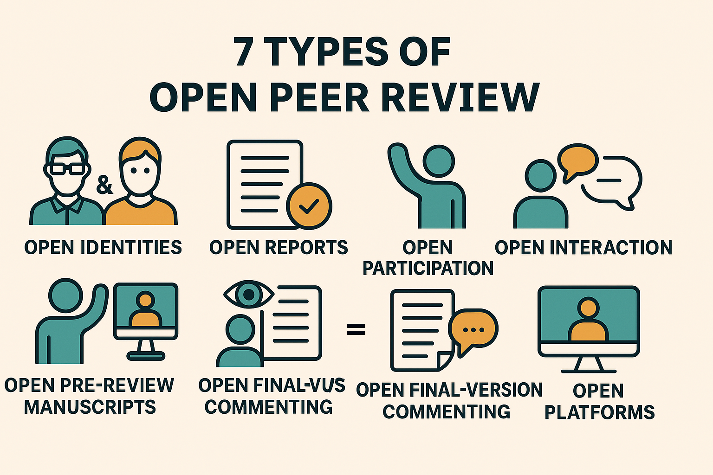

# 📰 Newsletter Portfolio - 21/07/2025

## Récits visuels, horizons numériques : Un voyage entre créativité et innovation 🚀

---

### 📌 📊 Rapport sur le référentiel des usages numériques 2025 de l'ARCEP


#### 📊 Rapport sur le référentiel des usages numériques 2025 de l'ARCEP

[📊 Rapport sur le référentiel des usages numériques 2025 de l'ARCEP](#)

Nous assumons ce "partage de base" des données clés de ce référentiel, mais leur infographie (pdf) est claire et présente <em>"une vision globale sur les différentes pratiques numériques"</em> : il s'agit de données agrégées pour fournir des élements chiffrés sur notre environnement numérique selon diverses thématiques et tendances.

➡️ L'<strong>ARCOM</strong> est l'Autorité publique française de régulation de la communication audiovisuelle et numérique. A ce titre, elle suit les évolutions en ligne aussi bien côté citoyen que professionnel.

...Bien sûr on appréciera des analytics nous permettant de croiser ces données du <strong>référentiel des usages</strong>, à venir certainement 😊


#### REFERENCES

‘Usages numériques en France’, Arcep, 7 July 2025 [https://www.arcep.fr/actualites/actualites-et-communiques/detail/n/usages-numeriques-en-france-070725.html](https://www.arcep.fr/actualites/actualites-et-communiques/detail/n/usages-numeriques-en-france-070725.html) [accessed 19 July 2025]

[https://www.arcep.fr/actualites/actualites-et-communiques/detail/n/usages-numeriques-en-france-070725.html](https://www.arcep.fr/actualites/actualites-et-communiques/detail/n/usages-numeriques-en-france-070725.html)

[Retour en haut](#)


---

### 📌 💡 Processeurs photoniques, technologie émergente pour traiter l'information


#### 💡 Processeurs photoniques, technologie émergente pour traiter l'information

[💡 Processeurs photoniques, technologie émergente pour traiter l'information](#)


#### Un processeur basé sur la lumière

Un article qui pourrait nous faire croire que nous nageons en pleine SF mais non, les <strong>processeurs à base de lumière</strong> (photons -&gt; photonique) sont en train de rivaliser avec l'électronique moderne, voire même la dépasser : c'est en tout cas l'engagement pris par cette levée de fonds de près de 72 millions de dollars par la société Q.ANT que nous annonce cet article du siliconANGLE !

📢 Article siliconANGLE : https://siliconangle.com/2025/07/17/photonics-processor-maker-q-ant-raises-72m-transform-ai-computing/


#### Technologie photonique

...C'est peu dire que cette technologie est en train de changer la donne : des calculs ultra-rapides (de l'ordre d'une demi-nanoseconde) pour une plus faible consommation d'energie (le photon ne génère pas de chaleur lors de son déplacement) !

Les <strong>gains de performance</strong> annoncés dans le domaine de l'IA, notamment le deep-learning, sont plus que considérables, mais là où le combat va être tout aussi révolutionnaire est bien celui qui se joue entre <strong>processeur photonique classique</strong> et <strong>processeurs photoniques quantiques</strong> utilisant des qubits.

➡️ Les qubits (quantum bits) sont les unités fondamentales d'information de l'informatique quantique, équivalents aux quantiques des bits classiques. La clé de voûte d'une révolution informatique en marche...

Cette poussée d'innovations techniques est une véritable locomotive et il est clair que cette <strong>technologie photonique</strong> est la véritable lame de fond de l'IA et bien plus encore.

Autrement dit, les <strong>applications</strong> de cette technologie photonique vont aller des centres de données, à l'IA comme aux services de télécommunications : actuellement, nous sommes déjà entrain d'assister à <strong>l'adoption de ces processeurs photoniques pour l'intelligence artificielle</strong>.

Un changement de paradigme. Non, on vous dit, une révolution.


#### REFERENCES

‘Photonics Processor Maker Q.ANT Raises $72M to Transform AI Computing’, Infra, SiliconANGLE, 17 July 2025 [https://siliconangle.com/2025/07/17/photonics-processor-maker-q-ant-raises-72m-transform-ai-computing/](https://siliconangle.com/2025/07/17/photonics-processor-maker-q-ant-raises-72m-transform-ai-computing/) [accessed 19 July 2025]

[https://siliconangle.com/2025/07/17/photonics-processor-maker-q-ant-raises-72m-transform-ai-computing/](https://siliconangle.com/2025/07/17/photonics-processor-maker-q-ant-raises-72m-transform-ai-computing/)

[Retour en haut](#)


---

### 📌 🔍'Measuring the Impact of Early-2025 AI on Experienced Open-Source Developer Productivity'


#### 🔍'Measuring the Impact of Early-2025 AI on Experienced Open-Source Developer Productivity'

[🔍'Measuring the Impact of Early-2025 AI on Experienced Open-Source Developer Productivity'](#)


#### METER

Une étude de METR (prononcer ‘meter’), organisation issue du projet « The Audacious Project » (hébergée par TED), concernant le sujet <strong>des procédures d'évaluation préalables au déploiement des IA</strong>, envisagées ici à l'étape du développement pour l'examen des modèles, les facteurs de risques et voire même de la gouvernance de ces projets.

↪️ Révélateur de la rapide structuration de l'écosytème IA, tout le monde s'accorde sur l'importance du <strong>pilotage</strong> de ces mêmes systèmes et chacun propose sa démarche.

Celle-ci a retenu notre attention à la fois pour <strong>le résultat proposé</strong> et pour la nécessité des <strong>évaluations contextuelles</strong>.

[📢 METR - Juillet 2025 : Measuring the Impact of Early-2025 AI on Experienced Open-Source Developer Productivity](https://metr.org/blog/2025-07-10-early-2025-ai-experienced-os-dev-study/)

[📢 METR - Juillet 2025 : Measuring the Impact of Early-2025 AI on Experienced Open-Source Developer Productivity](https://metr.org/blog/2025-07-10-early-2025-ai-experienced-os-dev-study/)


#### Un ralentissement de la productivité

Cette enquête randomisée traite de <strong>l'impact des outils IA sur la productivité</strong> auprès de développeurs expérimentés, entre janvier et juin 2025.

🔥 Leur constat, celui d'un <strong>ralentissement de la productivité</strong>, est finalement cohérent avec l'adoption d'une nouvelle technologie : selon eux, <strong>19% de temps supplémentaire dans la résolution de problèmes</strong>, ce qui contredit le principal argument pour l'usage des outils IA et les prédictions des économistes (39 % plus court) ou des experts en Machine Learning (38 % plus court).


#### Résultats et perspectives

Nous comprenons grâce à leur méthdologie qu'il ne peut absolument pas y avoir, d'une part, d'outil IA universel. Comprendre les <strong>capacités des modèles</strong> reste l'un des principaux enjeux de ces évaluations. Il faut donc prendre en compte, d'autre part, dans la rentabilité de ces outils IA leur <strong>contexte d'usages</strong> comme la pratique du développeur à ce sujet, l'envergure et le niveau d'exigence sur les normes de qualité du projet.

La liste des facteurs favorisants le ralentissement de la productivité explicite la notion d'<strong>appropiation</strong> de ces outils IA qui demandent <strong>une période d'adaptation</strong>.

🤔 Est-ce que cette période va être un frein ou un accélérateur de leur intégration dans nos modes d'organisation ?


#### REFERENCES

‘Measuring the Impact of Early-2025 AI on Experienced Open-Source Developer Productivity’, METR Blog, 10 July 2025 [https://metr.org/blog/2025-07-10-early-2025-ai-experienced-os-dev-study/](https://metr.org/blog/2025-07-10-early-2025-ai-experienced-os-dev-study/) [accessed 19 July 2025]

[https://metr.org/blog/2025-07-10-early-2025-ai-experienced-os-dev-study/](https://metr.org/blog/2025-07-10-early-2025-ai-experienced-os-dev-study/)

[Retour en haut](#)


---

### 📌 Open Peer Review, une plateforme d'évaluation des pairs ouverte



#### Open Peer Review, une plateforme d'évaluation des pairs ouverte

[Open Peer Review, une plateforme d'évaluation des pairs ouverte](#)


#### Open Peer Review (OPR), un mode d'évaluation par les pairs ouvert

Dans le système de publication des revues scientifiques, <strong>l'évaluation par les pairs</strong> est la démarche de validation qui permet aux éditeurs de choisir les articles à publier.

Aujourd'hui, ce processus est de plus en plus décrié pour de multiples raisons : délai trop long, biais systématiques, peu de reconnaissance pour les relecteurs ; favorisant ainsi l'émergence de nouvelles approches comme <strong>la révision ouverte (Open Review)</strong>.

Celle-ci appartient au mouvement mondial plus vaste de <strong>l'Open Science</strong> qui tend à rendre les processus de recherche et leurs données produites <em>accessibles à tous et dans tous les niveaux de la société... [considérés] comme un "bien commun".</em> (Wikipedia)

📢 Présentation de l'Open Peer Review : https://youtu.be/aEMLEZ-FKIc

Au lieu de sélectionner des relecteurs, il est possible sous réserve que l'article soit librement accessible de déposer une évaluation ouverte à tous, de pouvoir accéder à leurs rapports et éventuellement de divulguer leur identité là où, dans le processus traditionnel, celle-ci demeure anonyme, procédant d'une lecture en simple ou en double aveugle.

↪️ C'est une forme de <strong>processus qualité</strong> qui doit garantir ce principe d'échanges et de débat intellectuel dans <strong>la transmission des savoirs</strong>.

Raison pour laquelle les interactions entre auteurs et relecteurs peuvent être directs, quand traditionnellement un éditeur sert d'intermédiaire, avec aussi des possibilités de commenter les prépublications ou les post-publications, éventuellement sur des plateformes ouvertes où révision et publication sont gérées par deux entités différentes.


⚠️ Les modalités de l'OPR sont donc très diverses et s'ancrent dans les nouvelles pratiques de recherche qui intègrent <strong>des processus informatiques à l'aide de flux de travail</strong>.

Ces changements sont considérables, témoignant à la fois du changement profond qu'ont amené <strong>la démocratisation des outils de communication liés à l'avènement du Web</strong> et de ces nouvelles <strong>compétences en littératie numérique</strong>.


#### Architecture de l'OpenReview, plateforme de publication OPR

L'architecture globale est celle du Client-Serveur : OpenReview utilise une interface web couplée à une API REST.

C'est donc <strong>une plateforme web moderne classique</strong> avec une architecture client-serveur RESTful, et non un système distribué peer-to-peer !

Il n'y a donc <strong>pas de communication directe entre reviewers</strong>, tous les clients communiquent avec <strong>un serveur central</strong>, le stockage des données est centralisé sur les serveurs d'OpenReview, avec un protocole HTTP/HTTPS standard.


#### Infrastucture technique

<code>code
┌─────────────────┐     ┌─────────────────┐
│   Navigateur    │     │  Client Python  │
│   (React App)   │     │ (openreview-py) │
└────────┬────────┘     └────────┬────────┘
         │ HTTP/HTTPS            │
         ▼                       ▼
┌─────────────────────────────────────────┐
│          Serveur Next.js                │
│            (Port 3030)                  │
└────────────────┬────────────────────────┘
                 │
                 ▼
┌─────────────────────────────────────────┐
│         API REST OpenReview             │
│   ┌─────────────┐  ┌─────────────┐     │
│   │   API v1    │  │   API v2    │     │
│   │ (Port 3000) │  │ (Port 3001) │     │
│   └─────────────┘  └─────────────┘     │
└─────────────────────────────────────────┘
                 │
                 ▼
         ┌───────────────┐
         │  Base de      │
         │  données      │
         └───────────────┘</code>

Il faut comprendre qu'Open Review est un exemple d'application de ce principe de l'OPR, d'autres plateformes suivent ce modèle comme :

- F1000Research
- PeerJ
- eLife
- PubPeer (post-publication)
↪️ Chacune développe pour ses besoins son mode d'évaluation et nous avons choisi de présenter <strong>Open Review</strong> car on y retrouve des <strong>conférences ML/AI</strong>.


#### Les défis de la Science Ouverte

Cette nouvelle approche du <strong>processus de révision scientifique</strong> a pour but de rendre la démarche <strong>transparente</strong> et <strong>accessible</strong>, contrairement au système traditionnel où les révisions sont anonymes et confidentielles.

Après un peu plus d'une décennie, les évaluations sur ce mode de révision mettent en lumière <strong>les impacts de cette démocratisation du savoir</strong>.

Les avantages sont bien là :

- Transparence : Tout le processus est visible
- Qualité : Les reviewers font des critiques plus constructives
- Apprentissage : Les jeunes chercheurs peuvent apprendre du processus
- Reconnaissance : Le travail de révision est valorisé
- Collaboration : Participation et interaction ouverte
Et les inconvénients aussi :

- Coûts de révision élevés appelés APC (Article Processing Charges) marginalisant les chercheurs les moins dotés en ressources
- Défis d'équité dans la réutilisation des données (les barrières d'infrastructures, de ressources et les compétences techniques)
- Risques éthiques de ré-identification dans le partage de données (données anonymisées re-identifiées par le croisement avec d'autres sources de données, réutilisation des données pour d'autres objectifs sans acquérir le consentement des participants originaux, ou encore la question du colonialisme des données et comment elles sont utilisées)
Ce système de Science Ouverte remet en lumière des problèmes déjà connus au-delà de la simple accessibilité technique, mais pour <strong>considérer les dimensions éthiques et sociales du partage et de la réutilisation des données</strong> : les défis sont de taille, on aurait vraiment à tort de considérer ces questions comme des "problèmes de scientifiques".

On peut alors comprendre la farouche opposition de certains avec lesquels nous avons déjà eu l'occasion d'échanger (lors d'un groupe de réflexion sur le sujet à Montpellier), et même si certaines réticences sont justifiées comme <strong>la protection des participants</strong> (confidentialité, autonomie, non-malfaisance), il ne faudrait ni l'ignorer ni compromettre <strong>l'ouverture scientifique</strong>.

➡️ Accepter de voir pour qui ce type de système remet en question leur position habituelle et/ou traditionnelle permettra dans un premier temps de rassurer chacun sur ses prérogatives qui demandent à être revus dans le contexte actuel ; sans préjudicier de <strong>l'accessibilité de la recherche</strong> ou empêcher <strong>la libre circulation des savoirs</strong>.

Mais s'opposer à ces nouvelles pratiques de flux de travail ressemblerait à refuser l'utilisation du microscope pour prôner la supériorité d'une observation directe, débat d'un autre temps, car ce changement d'échelle est (là encore) une réalité : le <strong>partage des données</strong> est devenu pratiquement une norme (et pas uniquement dans le monde académique), évidemment pas à n'importe quelle condition, et les <strong>nouvelles technologies</strong> (IA, réseaux sociaux, base de données publiques etc.) ont accru certains <strong>risques</strong>.


#### La question est donc de savoir développer des cadres éthiques robustes pour ce partage de données, et non plus d'être dans des considérations "pour" ou "contre" puisque nous y participons déjà (avec ou sans notre consentement 😅).


#### REFERENCES

Klebel, Thomas, and others, ‘The Academic Impact of Open Science: A Scoping Review’, preprint, OSF, 1 March 2025, doi:10.31235/osf.io/ptjub_v2
‘L’explicabilité de l’IA : Un Problème Renouvelé Par Le Succès Du Deep Learning [1/3] | Linc’, n.d. [https://linc.cnil.fr/lexplicabilite-de-lia-un-probleme-renouvele-par-le-succes-du-deep-learning-13](https://linc.cnil.fr/lexplicabilite-de-lia-un-probleme-renouvele-par-le-succes-du-deep-learning-13) [accessed 19 July 2025]

[https://linc.cnil.fr/lexplicabilite-de-lia-un-probleme-renouvele-par-le-succes-du-deep-learning-13](https://linc.cnil.fr/lexplicabilite-de-lia-un-probleme-renouvele-par-le-succes-du-deep-learning-13)

‘OpenReview’, n.d. [https://openreview.net/about](https://openreview.net/about) [accessed 20 July 2025]

[https://openreview.net/about](https://openreview.net/about)

‘Pros and Cons of Open Peer Review’, Nature Neuroscience, 2.3 (1999), pp. 197–98, doi:10.1038/6295

Ross-Hellauer, Tony, ‘What Is Open Peer Review? A Systematic Review’, 6:588, preprint, F1000Research, 31 August 2017, doi:10.12688/f1000research.11369.2

[Retour en haut](#)


---

### 📌 🎯 Passer du portfolio à un écosytème automatisé !


#### 🎯 Passer du portfolio à un écosytème automatisé !

[🎯 Passer du portfolio à un écosytème automatisé !](#)


#### Du portfolio à un écosystème automatisé


#### Un projet automatisé

Lors de la refonte de notre portfolio devenu (au bout de quelque mois) un site monolithique, nous avons pu appliquer et vérifier que l'architecture modulaire permettait une évolution rapide et sans impact sur notre <strong>workflow de publication</strong>.

[📌 Lien vers blog scientifique : architecture modulaire](https://archnum.hypotheses.org/1786)

[📌 Lien vers blog scientifique : architecture modulaire](https://archnum.hypotheses.org/1786)

De cette manière, nous conservons à la fois :

- Le contenu tandis que la forme évolue
- Une archive propre grâce aux commit Git
- La possibilité de migrer sur d'autres plateformes sans perte
A cela s'ajoute les différents référentiels crées pour ce flux de travail. Notre approche visait plusieurs points :

- Séparation claire : Contenu / Automation / Publication
- Versioning : Historique Git sur chaque partie
- GitHub Pages : Hébergement gratuit des newsletters
- Modularité : Chaque repo a sa fonction

#### Workflow Complet

```code
Portfolio (MD) → GitHub Issues → Validation → Newsletter HTML → LinkedIn → Archives
````

De cette manière, nous avons pu développer des outils pour nous faciliter la gestion de contenu et de publication en ligne, dans l'idée d'assurer cette présence numérique :

📝🔄 <strong>Newsletter Generator</strong> : Portfolio MD → Newsletter HTML (Github)

✅ <strong>Content Validator</strong> : GitHub Issues pour validation (Github)

📰 <strong>LinkedIn Manager</strong> : Newsletter → Posts LinkedIn (Gestionnaire de publication automatisé)

Mais notre dépôt GitHub PORTFOLIO n'est pas une API au sens technique du terme. Voici pourquoi :


#### Ce qu'est une API

Une <strong>API (Application Programming Interface)</strong> est une interface qui permet à des applications de communiquer entre elles via des protocoles standardisés (HTTP, REST, GraphQL, etc.). Elle expose des endpoints avec des méthodes définies (GET, POST, PUT, DELETE) et retourne généralement des données structurées (JSON, XML).


#### Ce que fait mon dépôt PORTFOLIO

D'après mon workflow, mon dépôt PORTFOLIO est plutôt :

- Un dépôt de données/contenu qui stocke les informations de mes projets
- Une source de données que mon script Python lit directement via le système de fichiers Git
Dans mon cas, GitHub est utilisé comme un système de stockage de fichiers que mon générateur de newsletter consomme, ce qui est une approche tout à fait valide mais différente d'une API traditionnelle.

````code

PORTFOLIO (dépôt source)
    ↓
newsletter_generator.py (lit les .md)
    ↓
portfolio-newsletter (dépôt séparé) 
    ├── newsletter_2025-01-15.html
    ├── latest.html
    └── archives.html
    ↓
GitHub Pages (hébergement)

````

Pour l'instant, architecture répond parfaitement à nos besoins car nous avons pu :

- Améliorer le site vitrine avec les newsletter (API Github)
- Enrichir d'une visualisation de données dynamiques (avec D3.js) pour une analyse thématique des contenus par catégories de newseltter
- Automatiser des tâches de planification, d'éditorialisation et de publication avec des scripts Python (prototype de gestionnaire automatisé avec Streamlit)
Il y a donc à envisager plutôt l'ajout :

- Des analytics croisées
- Des widgets interactifs
Et l'API sera utile si besoin de :

- Centraliser la logique métier
- Systèmes externes (app mobiles consomment mes données, autres sites qui affichent projets ou services tiers )
- Cache/performance (pour éviter de re-parser les .md)
😅 Nous n'en sommes pas là pour un projet personnel qui nous a permis en quelque mois d'appliquer des principes d'automatisation et de comprendre comment ces flux de travail peuvent être mis en place.


#### Résultats et perspectives

🤖 Plutôt sceptique dans son application à notre échelle, nous acceptons aujoud'hui le fait que nous serons tous impliqués, de plus en plus, dans ce type de <strong>processus</strong>, à travers ces <strong>flux de travail automatisés</strong>.

🔧 <strong>Prototyper</strong> n'est pas non plus un signe de sous-niveau : cette <strong>démarche</strong> permet de partir réellement de ses besoins pour obtenir ce qui nous convient et voir si cela fonctionne. Elle participe comme <strong>un levier de transformation digitale</strong> dans l'organisation du travail.

↪️ Passer par une solution payante (et beaucoup plus aboutie) est une option toujours utile quand elle est adaptée aux besoins.

↪️Dans notre cas, cela nous aurait amputé de toute la démarche de compréhension et d'apprentissage qui nous semble nécessaire à l'adoption de nouveaux outils.

⚠️ La <strong>formation</strong> et de <strong>l'enseignement</strong> sont toujours des <strong>leviers de transformation majeurs</strong>, des priorités urgentes. Plus personne ne se pose ici le pourquoi mais bien le comment !

Cela ne fait pas de nous une experte (?!) mais se sentir concerner pas des outils qui modèlent considérablement nos modes de vie et nos manières de penser sont, au même titre que notre alimentation, des préoccupations majeures.

[Retour en haut](#)


---

### 📌 🤩 Algorithmes artistiques : Simulations interactives de physarum/organiques


#### 🤩 Algorithmes artistiques : Simulations interactives de physarum/organiques

[ 🤩 Algorithmes artistiques : Simulations interactives de physarum/organiques](#)


#### Les algorithmes peuvent être artistiques !

Des <strong>simulations visuelles</strong> particulièrement esthétiques et intéressantes dans cette approche agentique : l'observation de ces comportements simulés grâce à des curseurs contrôlables rend l'expérience particulièrement hypnotique.

Les explications et références données, notamment celles sur le travail de <strong>Jeff Jones</strong> (auteur de cet algorithme sur la forme de ces motifs , foncer voir son travail!), permettent de rentrer dans cet univers plutôt étrange, voire quelque peu <em>"unheimlich"</em> : cette <strong>dissonnance cognitive</strong> n'est pas marquée car nous y voyons malgré tout une forme vivante (algorithme inspiré du Pysarum, le magnifique  blob) nous permettant d'appréhender <strong>une de ces nombreuses réalités spatiales</strong>.

➡️ Merci à @gmie du réseau PIAILLE (MASTODON) pour ce joli partage.


#### REFERENCES

‘Algorithms for Making Interesting Organic Simulations’, n.d. [https://bleuje.com/physarum-explanation/](https://bleuje.com/physarum-explanation/) [accessed 19 July 2025]
Ghosh, Sourangshu, ‘Mathematical Foundations of Deep Learning’, preprint, Engineering Archive, 7 April 2025, doi:10.31224/4355

[https://bleuje.com/physarum-explanation/](https://bleuje.com/physarum-explanation/)

Jones, Jeff, ‘Characteristics of pattern formation and evolution in approximations of physarum transport networks’, Artificial Life, 16.2 (2010), doi:10.1162/artl.2010.16.2.16202

[Retour en haut](#)


---

## 💡 Philosophie de l'Innovation

> "L'innovation naît à l'intersection des disciplines, là où la créativité rencontre la technologie."

## 📱 Restons connectés !

**Envie d'explorer de nouveaux horizons numériques ?**

— [Portfolio Complet](https://portfolio-af-v2.netlify.app/)  
— [Me Contacter sur LinkedIn](https://www.linkedin.com/in/alexiafontaine)

#Innovation #TechCreative #Data #DigitalTransformation #CreativeTech

© 2025 Alexia Fontaine - Tous droits réservés