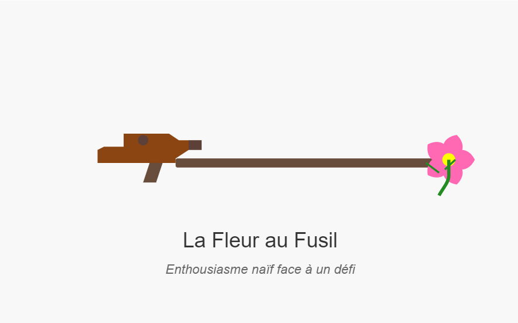
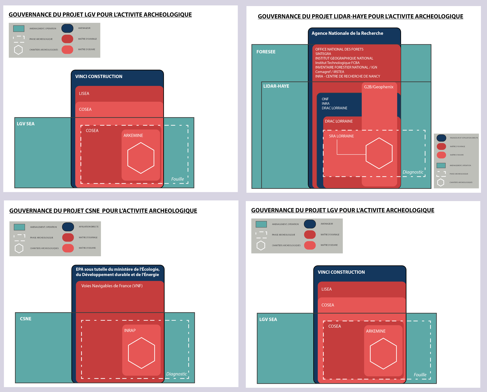

# 📰 Newsletter Portfolio - 07/04/2025

## Récits visuels, horizons numériques : Un voyage entre créativité et innovation 🚀

---

### 📌 restiction-contenus

#### restiction-contenus

#### NEWSLETTER d'Alexia Fontaine

[NEWSLETTER d'Alexia Fontaine](/company/www-linkedin-com-in-alexiafontaine/)

3 avril 2025

une image générée par ChatGPT pour évoquer la fleur au fusil

Je me suis récemment lancée dans cette idée de maintenir ma présence sur les réseaux sociaux en générant une newsletter hébergée sur GitHub avec comme "source" de contenus mon portfolio : l'objectif d'une <em>réutilisation optimisée,</em> selon le principe COPE.

Processus d'éditorialisation de contenus

Une manière de <strong>recycler ce que l'on produit sur le web</strong> , et plus particulièrement les réseaux sociaux, ces questions me semblent assez pertinentes <em>(un contenu a une durée de vue d'1 heure environ...)</em>, alors voyez votre intérêt : <strong>vous y passerez moins de temps ! </strong><em>(...peut-être pas au début </em>🥲 <em>)</em>

Workflow de ce processus d'éditorialisation

Le dispositif est opérationnel de bout en bout : pour GitHub tant que c'est public, il valide, et les plateformes LinkedIn - GitHub sont parfaitement interopérables. Par contre, les restrictions des API, c'est une autre danse : on ne lutte pas face à la restriction des doublons !!

Disons plus simplement que leur politique de contenus considère mon action comme du SPAM... Me voilà bien...

- Au début, je me suis dit (magnifique photo au passage) :

La Jeune Fille à la Fleur (1967) de Marc RIBOUD

- Et puis après :

Game over World 😜

Que ce soit en changeant le fichier d'appel html, les contenus ou en re-re-changeant le Token (et il semblerait que le problème vienne à présent plutôt de là!) : mon processus d'éditorialisation reste partiellement automatisé à ce stade... <em>"Et 'Michalak en attendant ..."</em>

[  ](https://kroki.io/mermaid/svg/eNqFVs1u4zYQvvcpCCwW3QBMkQ3gQ12gRbBJmgDONtgmuQg50NLI5pomXf7YCeJ9gLxFj_W9b6AX6_BHohQnWwO2KXK-mfnmj6qF2pRzpi25Of2B4MdYfPhw2uymzpLKkY3SixqFDsjh4a_Eaj6bgX7C81KALOewBGm_BWT4ef-eXOEZk9wswZAKSDUQDUJJi9e4PXFWLZnlfzkYkxvlDBGIE05W3JDmb_LzfEtKrWRxLVBpzUuUVZLMYVohrmJcw_33lZ6sdPOPIbNmJ5udjnAJGyPAWtBbsoHpXKlF0TyvUSR4SX7n9sJN9xVfMelAbMkS_5kohmEIuyDuczS84yFuKFEulIv0k8H9g6h1f7-NbPNs2SpGFTntViyyiaYSoPiUFihlfPBXzb_W3AelFaxMcSkxxULEOLQyICsmSzDRdy8XAGsmeMUs3KgFyOIuPgWcI9bvkQmXC6guZQQO5DOPiSoXxR0GP-cPFaxBa-VeyWRLd6JmPoOebpTl6PYMBojM3RsJJrnxS6h8kX7FClq5qeDNjpQ-38TAknEJv8WabWVDcv9wfEtqpUsIMXw690ty7eFmTlhpORbIa8DPSiKQy-qcCyi-APqj8etJIuE5x-JBDrnmIs1sKVvHamIyhOszSqpHT7cLVUxia-c1HcERYFo8nj1wW5xI6VKiD32ae9EYRvq6V03eVcGiXJnrqzUbfEClYOxT_PtpbpeCwAM3tg1rPMi0nIFJ2CpuLcdo9gx1Gu5fIruoYkCxu16PKzq0Ejg0kIAX6tHKyFiIGlD1rRbFJ5TNDvx4-2USyWKpRXjn7RDYb-u0FQQwcAYukEFx9mC1L5O2sZTEiYOLi5urSVTdyQYkRPlTZtkAi83FrQZKfC9R7HX1Fax5kbKcn64Jw1lPaXQv1m_RBxinX3RukkpD_vGOac6kNcWZMYyHMc7rGjsYw4mE1vE4jiKc8wbrtB2WHTY145-uxMFinvr2MQPOGN6WS-qoJNnrhhDn0A69pH1ncgx1YAFRUir0UzqErXyKm92WaMheJoLMYbw7WlFZXyzoGxHUZNGLNRJfsodttvcWjeACixeQxaEM8XrLerDCGRehW5tnP8f222-Y93MuWdtBvWLspp9Qs-RAcSY1zLArdbyd3lCcAQFv4voD2hkTf4CuH2QPuuEShRd85R-i9OVMKkzT3qyJ8JZnHGL44DREXCR-MJz9zW6GlxIQsPhK8pjGXSmYMadQt15ikwsxflce10flMUWmeO-M3x3Vo7Q-3PDKzsfHq4dfhvhkP-E9uoevR_-Lx5Yc2K8-1kcdfjSqh_iPe_gKSm58NScHRgMCNTt6Q0HW0oaA5vzTXirTac9sy5l2iUgbfZn2LYL6VwA6uM5pewPQbojR3qyhaYLQ3gSg3XVGu5lK81ym3Rylg15Lwe37ld7BaHvt0nzx0Xhl0Nx4bXC9gv8Ags3IqQ) Diagramme du processus d'éditorialisation de contenus

[  ](https://kroki.io/mermaid/svg/eNqFVs1u4zYQvvcpCCwW3QBMkQ3gQ12gRbBJmgDONtgmuQg50NLI5pomXf7YCeJ9gLxFj_W9b6AX6_BHohQnWwO2KXK-mfnmj6qF2pRzpi25Of2B4MdYfPhw2uymzpLKkY3SixqFDsjh4a_Eaj6bgX7C81KALOewBGm_BWT4ef-eXOEZk9wswZAKSDUQDUJJi9e4PXFWLZnlfzkYkxvlDBGIE05W3JDmb_LzfEtKrWRxLVBpzUuUVZLMYVohrmJcw_33lZ6sdPOPIbNmJ5udjnAJGyPAWtBbsoHpXKlF0TyvUSR4SX7n9sJN9xVfMelAbMkS_5kohmEIuyDuczS84yFuKFEulIv0k8H9g6h1f7-NbPNs2SpGFTntViyyiaYSoPiUFihlfPBXzb_W3AelFaxMcSkxxULEOLQyICsmSzDRdy8XAGsmeMUs3KgFyOIuPgWcI9bvkQmXC6guZQQO5DOPiSoXxR0GP-cPFaxBa-VeyWRLd6JmPoOebpTl6PYMBojM3RsJJrnxS6h8kX7FClq5qeDNjpQ-38TAknEJv8WabWVDcv9wfEtqpUsIMXw690ty7eFmTlhpORbIa8DPSiKQy-qcCyi-APqj8etJIuE5x-JBDrnmIs1sKVvHamIyhOszSqpHT7cLVUxia-c1HcERYFo8nj1wW5xI6VKiD32ae9EYRvq6V03eVcGiXJnrqzUbfEClYOxT_PtpbpeCwAM3tg1rPMi0nIFJ2CpuLcdo9gx1Gu5fIruoYkCxu16PKzq0Ejg0kIAX6tHKyFiIGlD1rRbFJ5TNDvx4-2USyWKpRXjn7RDYb-u0FQQwcAYukEFx9mC1L5O2sZTEiYOLi5urSVTdyQYkRPlTZtkAi83FrQZKfC9R7HX1Fax5kbKcn64Jw1lPaXQv1m_RBxinX3RukkpD_vGOac6kNcWZMYyHMc7rGjsYw4mE1vE4jiKc8wbrtB2WHTY145-uxMFinvr2MQPOGN6WS-qoJNnrhhDn0A69pH1ncgx1YAFRUir0UzqErXyKm92WaMheJoLMYbw7WlFZXyzoGxHUZNGLNRJfsodttvcWjeACixeQxaEM8XrLerDCGRehW5tnP8f222-Y93MuWdtBvWLspp9Qs-RAcSY1zLArdbyd3lCcAQFv4voD2hkTf4CuH2QPuuEShRd85R-i9OVMKkzT3qyJ8JZnHGL44DREXCR-MJz9zW6GlxIQsPhK8pjGXSmYMadQt15ikwsxflce10flMUWmeO-M3x3Vo7Q-3PDKzsfHq4dfhvhkP-E9uoevR_-Lx5Yc2K8-1kcdfjSqh_iPe_gKSm58NScHRgMCNTt6Q0HW0oaA5vzTXirTac9sy5l2iUgbfZn2LYL6VwA6uM5pewPQbojR3qyhaYLQ3gSg3XVGu5lK81ym3Rylg15Lwe37ld7BaHvt0nzx0Xhl0Nx4bXC9gv8Ags3IqQ)

...Rétropédalage certes, mais le fait d'avoir <strong>modularisé le projet</strong> rend les modifications beaucoup plus aisées et donne une flexibilité à laquelle je n'avais pas pensé : séparer la génération de la newsletter et son stockage en deux dépôts distincts, finalement en extrapolant la séparation entre le fond et la forme à l'échelle des plateformes.

Deux formats de sortie pour répondre aux exigences de la plateforme de publication, LinkedIn aura de toute façon toujours le dernier mot, puisque j'utilise sa plateforme.

#### 📰 Newsletter Portfolio

[📰 Newsletter Portfolio](https://siasia-dev.github.io/newsletter-portfolio/latest.html)

[Retour en haut](#)

---

### 📌 Architecture Modulaire à Base de Contenu

#### Architecture Modulaire à Base de Contenu

L'<strong>Architecture Modulaire à Base de Contenu</strong> (ou "Content-Driven Modular Architecture") représente une approche moderne et flexible pour concevoir des sites web et des applications. Cette méthodologie place le contenu au centre du processus de développement, en le séparant strictement de la présentation.

<strong>Mots-clés:</strong> développement, architecture, contentdriven, méthodologie, applications

#### Principes fondamentaux

Cette architecture repose sur plusieurs principes clés qui la rendent particulièrement efficace pour les sites riches en contenu comme les portfolios et les blogs :

<strong>Mots-clés:</strong> architecture, portfolios, principes, plusieurs

Le contenu est stocké dans des fichiers indépendants (souvent au format Markdown) avec des métadonnées standardisées (frontmatter), complètement séparés du code HTML, CSS et JavaScript qui définit leur présentation. Cette séparation permet à chaque aspect d'évoluer indépendamment.

<strong>Mots-clés:</strong> standardisées, indépendance, présentation

Les sections et composants peuvent être facilement réutilisés, réorganisés ou recombinés pour créer de nouvelles pages ou expériences. Cette flexibilité permet d'assembler rapidement différentes vues à partir des mêmes éléments de base.

<strong>Mots-clés:</strong> expériences, réorganisation, flexibilité

Modifier un contenu n'exige pas de toucher au code HTML principal. Les rédacteurs de contenu peuvent se concentrer uniquement sur les fichiers Markdown pertinents, sans risquer d'altérer la structure ou le fonctionnement du site.

<strong>Mots-clés:</strong> fonctionnement, pertinents, concentrer, uniquement, rédacteurs

Ajouter une nouvelle section est aussi simple que de créer un nouveau fichier Markdown. Cette approche réduit considérablement la friction pour enrichir le site avec de nouveaux contenus.

<strong>Mots-clés:</strong>  contenus

#### Implémentation pratique

Pour les composants simples, le Markdown pur suffit généralement. Cependant, pour les composants plus complexes comme les grilles de compétences, les cartes de services, ou les processus multi-étapes, l'HTML embarqué dans Markdown offre le meilleur compromis :

Cette approche hybride permet de préserver le rendu visuel des composants complexes tout en profitant pleinement de la modularité du système.

<strong>Mots-clés:</strong> multiétapes, compétences, composants, markdown, modularité, composants, complexes

#### Avantages à long terme

Au-delà des bénéfices immédiats, cette architecture offre des avantages substantiels sur le long terme :

- Transitions technologiques facilitées - Le contenu peut être conservé même si le framework ou la technologie de présentation change
- Versionning efficace - Les modifications de contenu sont clairement visibles dans les commits Git
- Possibilités de migration accrues - Le contenu peut être facilement exporté vers d'autres systèmes
- Optimisation du workflow - Les designers et développeurs peuvent travailler sur l'interface pendant que les rédacteurs créent le contenu
Cette architecture représente une évolution naturelle des systèmes de gestion de contenu traditionnels, offrant davantage de flexibilité tout en conservant une structure claire et organisée.

<strong>Mots-clés:</strong> architecture, flexibilité

#### 1. Séparation du contenu et de la présentation

Le contenu est stocké dans des fichiers indépendants (souvent au format Markdown) avec des métadonnées standardisées (frontmatter), complètement séparés du code HTML, CSS et JavaScript qui définit leur présentation. Cette séparation permet à chaque aspect d'évoluer indépendamment.

<strong>Mots-clés:</strong> indépendance, standardisés, présentation

#### 2. Composabilité

Les sections et composants peuvent être facilement réutilisés, réorganisés ou recombinés pour créer de nouvelles pages ou expériences. Cette flexibilité permet d'assembler rapidement différentes vues à partir des mêmes éléments de base.

<strong>Mots-clés:</strong> flexibilité

#### 3. Maintenabilité

Modifier un contenu n'exige pas de toucher au code HTML principal. Les rédacteurs de contenu peuvent se concentrer uniquement sur les fichiers Markdown pertinents, sans risquer d'altérer la structure ou le fonctionnement du site.

<strong>Mots-clés:</strong> pertinents, rédacteurs

#### 4. Évolutivité

Ajouter une nouvelle section est aussi simple que de créer un nouveau fichier Markdown. Cette approche réduit considérablement la friction pour enrichir le site avec de nouveaux contenus.

<strong>Mots-clés:</strong> enrichir, contenus

[Retour en haut](#)

---

### 🤖 avatar-lartet

#### avatar-lartet

#### Avatar Edouard Lartet : Agent Conversationnel Historique

#### Présentation du Projet

Un agent conversationnel basé sur un personnage historique, démontrant l'application des techniques de traitement du langage naturel (NLP) pour créer des expériences interactives et éducatives.

#### Objectifs

- Créer une expérience de médiation culturelle innovante
- Utiliser l'IA pour rendre l'histoire accessible
- Permettre des interactions immersives avec un personnage historique

#### Technologies Utilisées

- Intelligence Artificielle
- NLP (Traitement du Langage Naturel)
- Personnalisation
- Python

#### Capture d'Écran

#### Lien du Projet

[Interagir avec l'Avatar Edouard Lartet](https://avatar-lartet.streamlit.app/)

[Interagir avec l'Avatar Edouard Lartet](https://avatar-lartet.streamlit.app/)

#### Concept

Exploration des possibilités de l'IA générative dans :
- La médiation culturelle
- L'apprentissage personnalisé
- La transmission de connaissances historiques

#### Fonctionnalités Principales

- Conversation contextuelle basée sur l'histoire de Edouard Lartet
- Réponses adaptatives et personnalisées
- Capacité à partager des informations historiques détaillées

#### Compétences Mises en Œuvre

- Développement d'agents conversationnels
- Modélisation de personnalités historiques
- Techniques avancées de NLP
- Conception d'expériences interactives éducatives
[Retour en haut](#)

---

### 📊 parcours-data-communication

#### parcours-data-communication

#### Parcours Data & Communication Digitale

#### Image Représentative

#### Évolution Professionnelle

Un parcours caractérisé par une convergence constante entre compétences analytiques et créatives.

#### Dimensions Professionnelles

#### Formation et Expertise

- Systèmes d'Information
- Gestion de Données
- Communication Digitale

#### Compétences Clés

#### Data Visualization

- Conversion de données brutes en visualisations
- Création de représentations intuitives
- Narration visuelle complexe

#### Gestion de Systèmes d'Information

- Structuration des flux de données
- Analyse des systèmes complexes
- Amélioration des processus informationnels

#### Vulgarisation Technique

- Transformation de concepts complexes
- Rendre l'technique accessible
- Médiation technologique

#### Intelligence Collective

- Approche collaborative
- Insight-Driven
- Coordination interdisciplinaire

#### Approche Professionnelle

#### Convergence Créative et Analytique

- Combinaison de rigueur technique
- Créativité narrative
- Perspective holistique

#### Outils et Méthodes

- Analyse de données avancée
- Visualisation interactive
- Communication stratégique
- Design thinking

#### Philosophie Professionnelle

"La communication digitale efficace est l'art de transformer la complexité en clarté."

#### Compétences Transversales

- Analyse stratégique
- Communication multicanale
- Design de l'information
- Gestion de projets innovants

#### Lien Professionnel

[Profil LinkedIn](https://www.linkedin.com/in/alexiafontaine)

[Profil LinkedIn](https://www.linkedin.com/in/alexiafontaine)

#### Impact et Vision

- Démystifier les technologies
- Rendre l'information accessible
- Créer des ponts entre technique et humain
[Retour en haut](#)

---

### 📊 data-storytelling-culturel

#### data-storytelling-culturel

#### Data Storytelling : Exploration Narrative et Culturelle

#### Transformation des Données en Récits Vivants

#### Essence de l'Approche

Le data storytelling dépasse la simple présentation de chiffres pour devenir un art de révélation et de compréhension.

#### Dimensions de l'Exploration

#### 1. Au-delà des Statistiques

- Révéler les dynamiques cachées
- Donner vie aux données
- Transformer l'abstrait en concret

#### 2. Analyse Culturelle Approfondie

- Décoder les systèmes de valeurs
- Comprendre les interactions humaines
- Révéler les dynamiques organisationnelles

#### 3. Contextualisation Narrative

- Ancrer les données dans des récits humains
- Explorer les sous-textes culturels
- Comprendre les évolutions sociétales

#### Méthodologie

#### Approche Interdisciplinaire

- Croisement des disciplines
- Dialogue entre quantitatif et qualitatif
- Intégration des perspectives multiples

#### Techniques d'Analyse

- Analyse statistique avancée
- Ethnographie des données
- Interprétation contextuelle
- Narration scientifique

#### Compétences Mobilisées

#### Analytiques

- Traitement de données complexes
- Identification de tendances
- Analyse systémique
- Rigueur scientifique

#### Narratives

- Storytelling
- Écriture créative
- Communication stratégique
- Vulgarisation

#### Culturelles

- Sensibilité interculturelle
- Compréhension des dynamiques sociales
- Exploration des systèmes de signification
- Empathie analytique

#### Principes Fondamentaux

#### 1. Clarté

- Rendre l'information accessible
- Simplifier sans appauvrir
- Traduire la complexité

#### 2. Engagement

- Créer une connexion émotionnelle
- Susciter la curiosité
- Impliquer le lecteur

#### 3. Impact

- Faciliter la compréhension
- Éclairer les prises de décision
- Transformer la perception

#### Philosophie

"Chaque donnée est un fragment d'histoire, chaque récit est un assemblage de données."

#### Applications Concrètes

- Rapports d'entreprise
- Études sociologiques
- Projets de recherche
- Communications stratégiques
- Médiations culturelles

#### Résultats Attendus

- Compréhension approfondie
- Insights novateurs
- Connexion humaine
- Perspective enrichie
[Retour en haut](#)

---

### 📌 archaedyn-article-md

#### archaedyn-article-md

#### ARCHAEDYN : 7 millénaires de dynamiques territoriales

#### Contexte du Projet

Le projet ARCHAEDYN s'inscrit dans une recherche ambitieuse visant à comprendre les dynamiques territoriales sur une période de 7 millénaires, du Néolithique au Moyen Âge. Cette étude innovante propose une analyse approfondie des modèles d'établissement, de production et d'échanges commerciaux.

#### Objectifs Scientifiques

Les principaux objectifs du projet étaient de :

- Cartographier l'évolution des implantations humaines
- Analyser les systèmes de production
- Comprendre les réseaux d'échanges commerciaux
- Étudier les dynamiques territoriales sur le long terme

#### Méthodologie

La recherche a combiné plusieurs approches méthodologiques :

- Analyse cartographique détaillée
- Études archéologiques comparatives
- Modélisation des données spatiales
- Utilisation de systèmes d'information géographique (SIG)

#### Résultats Principaux

Les résultats ont mis en lumière :

- L'évolution complexe des établissements humains
- Les transformations des systèmes de production
- Les réseaux d'échanges et leurs mutations
- Les dynamiques territoriales sur 7 millénaires

#### Signification

ARCHAEDYN représente une avancée significative dans la compréhension des dynamiques territoriales, offrant une perspective unique sur l'évolution des sociétés humaines à travers une période historique longue.

<em>Source originale : [Hypothèses - ARCHAEDYN](https://archnum.hypotheses.org/175)</em>

[Hypothèses - ARCHAEDYN](https://archnum.hypotheses.org/175)

<em>Conférence finale : Dijon, 23-25 juin 2008</em>

[Retour en haut](#)

---

## 💡 Philosophie de l'Innovation

> "L'innovation naît à l'intersection des disciplines, là où la créativité rencontre la technologie."

## 📱 Restons connectés !

**Envie d'explorer de nouveaux horizons numériques ?**

— [Portfolio Complet](https://portfolio-af-v2.netlify.app/)  
— [Me Contacter sur LinkedIn](https://www.linkedin.com/in/alexiafontaine)

#Innovation #TechCreative #DataScience #DigitalTransformation #CreativeTech

© 2025 Alexia Fontaine - Tous droits réservés