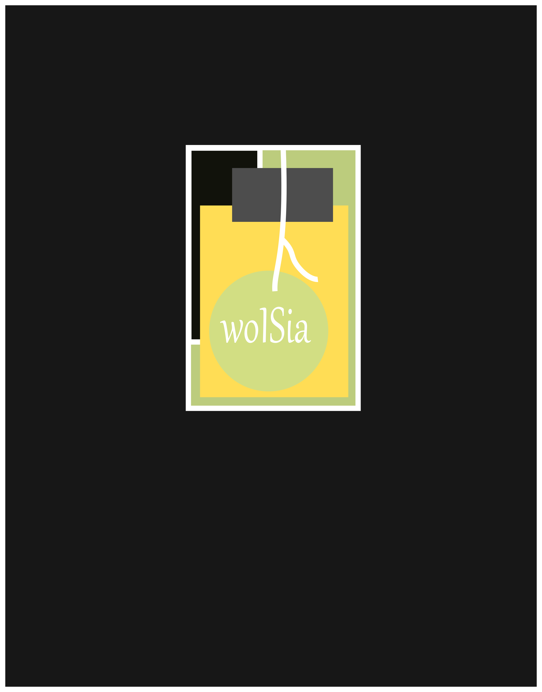
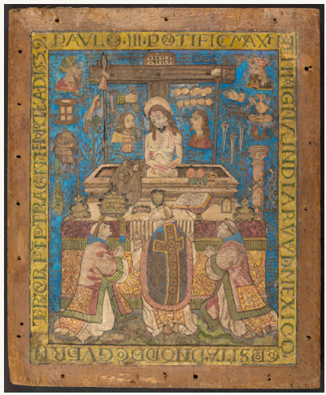
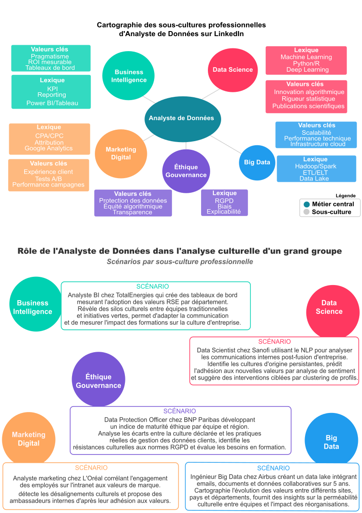

# 📰 Newsletter Portfolio - 07/04/2025

## Récits visuels, horizons numériques : Un voyage entre créativité et innovation 🚀

---

### 📊 data-visualisation

#### data-visualisation

#### Data & Visualisation

#### Exploration et Analyse de Données

#### Image de Référence

#### Approche Analytique

Une méthodologie qui va au-delà de la simple manipulation de chiffres, transformant les données brutes en récits intelligibles et stratégiques.

#### Méthodologie Intégrée

1. Collecte & Préparation
1. Nettoyage des données
1. Structuration des jeux de données
1. Exploration approfondie
1. Analyse Statistique
1. Utilisation de méthodes avancées
1. Extraction de tendances significatives
1. Analyse contextuelle
1. Visualisation
1. Création de représentations visuelles éloquentes
1. Conception de dashboards intuitifs
1. Traduction des insights complexes
1. Narration
1. Contextualisation des données
1. Création de récits compréhensibles
1. Mise en perspective stratégique
Exploration approfondie

<strong>Analyse Statistique</strong>

Analyse contextuelle

<strong>Visualisation</strong>

Traduction des insights complexes

<strong>Narration</strong>

#### Processus d'Analyse

Chaque ensemble de données raconte une histoire. L'approche consiste à :
- Écouter les récits sous-jacents
- Comprendre les nuances
- Identifier les implications culturelles

Au-delà des chiffres, recherche des connexions entre :
- Données
- Expériences humaines
- Dynamiques organisationnelles
- Évolutions sociétales

Chaque donnée est située dans son écosystème :
- Professionnel
- Culturel
- Historique

#### Compétences Techniques

- Python (Pandas, NumPy, Scikit-learn)
- R (Tidyverse, ggplot2)
- SQL & Bases de données
- Machine Learning
- NLP
- Visualisation de données complexes
- Power BI & Tableau

#### Outils et Frameworks

- Analyse statistique avancée
- Algorithmes de machine learning
- Traitement du langage naturel
- Création de dashboards interactifs
- Visualisation de données complexes

#### Applications Pratiques

- Optimisation des réseaux de transport
- Suivi pédagogique
- Analyse de systèmes documentaires
- Exploration de données historiques

#### Philosophie de la Data Science

Transformer des données brutes en insights stratégiques, racontant des histoires cachées derrière les chiffres.

[Retour en haut](#)

---

### 🎨 approche-integree-creation

#### approche-integree-creation

#### Une Approche Intégrée de Création de Contenus

#### Image Représentative

#### Concept Fondamental

Une démarche de création qui transcende les frontières traditionnelles entre différents médias et disciplines.

#### Principes Directeurs

#### Synergie Multidisciplinaire

- Fusion de différentes disciplines
- Création de contenus riches et cohérents
- Décloisonnement des approches créatives

#### Dimensions de l'Intégration

#### 1. Convergence des Médias

- Combinaison de :
- Texte
- Image
- Vidéo
- Modèles 3D
- Design interactif

#### 2. Approche Holistique

- Chaque média enrichit les autres
- Création d'expériences immersives
- Narration transmédia

#### Stratégies de Création

#### Interdisciplinarité

- Croisement des compétences
- Dialogue entre différents domaines
- Innovation par la diversité

#### Processus Créatif

1. Conceptualisation
1. Exploration multisensorielle
1. Intégration des perspectives
1. Raffinement itératif

#### Compétences Mobilisées

#### Techniques

- Design graphique
- Développement web
- Photographie
- Modélisation 3D
- Traitement multimédia

#### Créatives

- Storytelling
- Narration visuelle
- Design thinking
- Communication transmedia

#### Exemples de Projets

- wolSia (projet IA et data-driven)
- Trésor d'Eauze (patrimoine numérique)
- Séries photographiques
- Projets de médiation culturelle

#### Philosophie de Création

"La créativité naît à l'intersection des disciplines, là où les frontières deviennent floues et les possibilités infinies."

#### Impact et Vision

- Création de contenus innovants
- Expériences utilisateur immersives
- Narration riche et multidimensionnelle
- Dépassement des approches traditionnelles

#### Outils et Technologies

- Suite Adobe
- Outils de modélisation 3D
- Plateformes de développement web
- Logiciels de traitement multimédia

#### Conclusion

Une approche qui transforme la création de contenus en un écosystème dynamique et interconnecté.

[Retour en haut](#)

---

### 📌 messe-saint-gregoire

#### messe-saint-gregoire

#### Patrimoine Numérique : La Messe Saint Grégoire

#### Présentation du Projet

Un projet de valorisation du patrimoine culturel associant photographie, rédaction de contenus historiques et conception d'expériences interactives pour rendre accessibles des trésors culturels.

#### Objectifs

- Préservation et médiation culturelle
- Création de ponts entre tradition et innovation
- Exploration numérique du patrimoine historique

#### Technologies Utilisées

- Modélisation 3D
- Recherche Historique
- Médiation Culturelle

#### Capture d'Écran

#### Lien du Projet

[Consulter La Messe Saint Grégoire](https://messe-st-gregoire.netlify.app/)

#### Description Détaillée

Cette initiative démontre comment les technologies numériques peuvent servir la préservation et la médiation culturelle, en transformant un élément patrimonial en une expérience interactive et accessible.

#### Approche

- Documentation visuelle approfondie
- Contextualisation historique
- Création d'une expérience numérique immersive

#### Compétences Mises en Œuvre

- Photographie documentaire
- Recherche historique
- Conception d'expériences interactives
- Médiation culturelle numérique
[Retour en haut](#)

---

### 🤖 avatar-lartet

#### avatar-lartet

#### Avatar Edouard Lartet : Agent Conversationnel Historique

#### Présentation du Projet

Un agent conversationnel basé sur un personnage historique, démontrant l'application des techniques de traitement du langage naturel (NLP) pour créer des expériences interactives et éducatives.

#### Objectifs

- Créer une expérience de médiation culturelle innovante
- Utiliser l'IA pour rendre l'histoire accessible
- Permettre des interactions immersives avec un personnage historique

#### Technologies Utilisées

- Intelligence Artificielle
- NLP (Traitement du Langage Naturel)
- Personnalisation
- Python

#### Capture d'Écran

#### Lien du Projet

[Interagir avec l'Avatar Edouard Lartet](https://avatar-lartet.streamlit.app/)

#### Concept

Exploration des possibilités de l'IA générative dans :
- La médiation culturelle
- L'apprentissage personnalisé
- La transmission de connaissances historiques

#### Fonctionnalités Principales

- Conversation contextuelle basée sur l'histoire de Edouard Lartet
- Réponses adaptatives et personnalisées
- Capacité à partager des informations historiques détaillées

#### Compétences Mises en Œuvre

- Développement d'agents conversationnels
- Modélisation de personnalités historiques
- Techniques avancées de NLP
- Conception d'expériences interactives éducatives
[Retour en haut](#)

---

### 📊 ecriture-datastorytelling

#### ecriture-datastorytelling

#### Écriture et Data Storytelling

#### Analyse Culturelle et Narration de Données

#### Vue d'Ensemble

L'écriture est un outil de transformation des données complexes en récits captivants, révélant les insights cachés derrière les chiffres et les tendances.

#### Image de Référence

#### Approche Méthodologique

- Transformation de données complexes en récits accessibles
- Révélation des dynamiques culturelles sous-jacentes
- Contextualisation approfondie des données

#### Principes Fondamentaux

1. Clarté : Rendre l'information complexe immédiatement compréhensible
1. Engagement : Créer une connexion émotionnelle avec les données
1. Impact : Faciliter la prise de décision et la compréhension stratégique

#### Dimensions Clés

- Analyse rigoureuse statistique
- Contextualisation narrative
- Visualisation éloquente
- Communication stratégique

#### Citation Inspirante

« Les données sont des récits en attente d'être déchiffrés, des fragments d'une histoire plus large qui ne demandent qu'à être racontée. »

#### Compétences Principales

- Rédaction de contenus analytiques
- Data Storytelling
- Analyse de données
- Vulgarisation technique
- Communication visuelle

#### Approche de l'Analyse Culturelle

L'analyse culturelle dans le data storytelling va au-delà de l'interprétation statistique traditionnelle. Elle cherche à comprendre comment les données reflètent :
- Les interactions humaines
- Les sous-cultures professionnelles
- Les transformations sociétales

#### Méthodologie Intégrée

1. Décorticage statistique précis des jeux de données
1. Ancrage des données dans un récit humain
1. Traduction des insights en représentations visuelles
1. Adaptation du récit aux différents publics

#### Domaines d'Expertise

- Articles de fond
- Contenus web
- Optimisation SEO
- Narration de marque
- Récits immersifs
- Data Visualization
[Retour en haut](#)

---

### 🌸 fleurs-documentation-narrative

#### fleurs-documentation-narrative

#### Les Fleurs : Étoiles de la Terre

#### Capture d'Écran

#### Prélude Botanique

Dans le vaste théâtre de la nature, les fleurs émergent comme des constellations terrestres, points lumineux parsemant les prairies, les jardins et les sous-bois. Chacune raconte une histoire unique, un fragment de poésie végétale suspendu entre le sol et le ciel.

#### Anatomie d'une Constellation Florale

Comme les étoiles qui ponctuent le firmament nocturne, les fleurs possèdent leur propre géométrie complexe :

- Pétales : Analogues aux rayonnements stellaires, irradiant couleurs et formes
- Étamines : Structures centrales, tels les noyaux des systèmes planétaires
- Pistil : Cœur générateur, source de vie et de reproduction

#### Symphonie Chromatique

Chaque fleur devient un astre unique :
- L'orchidée mauve, mystérieuse comme une nébuleuse lointaine
- Le pavot écarlate, explosion de lumière intense
- L'alstroemeria aux tons pastels, constellation délicate

#### Cycles et Métamorphoses

À l'image des étoiles qui naissent, brillent et s'éteignent, les fleurs suivent un cycle cosmique :
1. <strong>Germination</strong> : Émergence timide, comme une étoile naissante
2. <strong>Floraison</strong> : Apogée lumineuse, zénith de l'expression
3. <strong>Déclin</strong> : Dispersion, retour à la terre, promesse de renaissance

#### Écologie et Interconnexion

Les fleurs ne sont pas simplement des objets statiques, mais des systèmes dynamiques en interaction constante :
- <strong>Pollinisateurs</strong> : Tels des vaisseaux spatiaux, transportant la vie
- <strong>Réseau écologique</strong> : Trame complexe, comparable aux connexions galactiques

#### Métaphore Cosmique

"Les fleurs sont les étoiles de la Terre" transcende la simple comparaison poétique. C'est une vérité scientifique et philosophique : elles sont des systèmes complexes de communication, d'adaptation et de vie, miniatures de l'univers dans leur capacité à transformer l'énergie, à rayonner et à maintenir des écosystèmes entiers. Chaque fleur est un microcosme de la complexité cosmique, un point de rencontre entre la matière et la vie, entre l'invisible et le visible, entre l'infiniment petit et l'infiniment grand.

[Retour en haut](#)

---

## 💡 Philosophie de l'Innovation

> "L'innovation naît à l'intersection des disciplines, là où la créativité rencontre la technologie."

## 📱 Restons connectés !

**Envie d'explorer de nouveaux horizons numériques ?**

— [Portfolio Complet](https://portfolio-af-v2.netlify.app/)  
— [Me Contacter sur LinkedIn](https://www.linkedin.com/in/alexiafontaine)

#Innovation #TechCreative #DataScience #DigitalTransformation #CreativeTech

© 2025 Alexia Fontaine - Tous droits réservés