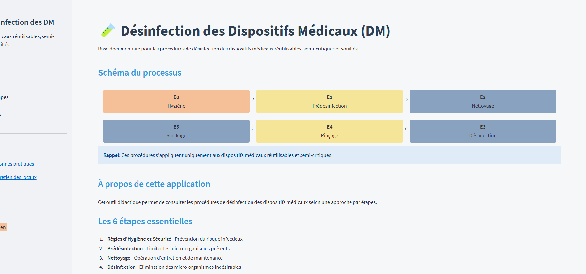

# 📰 Newsletter Portfolio - 07/04/2025

## Récits visuels, horizons numériques : Un voyage entre créativité et innovation 🚀

---

### 📌 Architecture Modulaire à Base de Contenu

#### Architecture Modulaire à Base de Contenu

L'<strong>Architecture Modulaire à Base de Contenu</strong> (ou "Content-Driven Modular Architecture") représente une approche moderne et flexible pour concevoir des sites web et des applications. Cette méthodologie place le contenu au centre du processus de développement, en le séparant strictement de la présentation.

<strong>Mots-clés:</strong> développement, architecture, contentdriven, méthodologie, applications

#### Principes fondamentaux

Cette architecture repose sur plusieurs principes clés qui la rendent particulièrement efficace pour les sites riches en contenu comme les portfolios et les blogs :

<strong>Mots-clés:</strong> architecture, portfolios, principes, plusieurs

Le contenu est stocké dans des fichiers indépendants (souvent au format Markdown) avec des métadonnées standardisées (frontmatter), complètement séparés du code HTML, CSS et JavaScript qui définit leur présentation. Cette séparation permet à chaque aspect d'évoluer indépendamment.

<strong>Mots-clés:</strong> standardisées, indépendance, présentation

Les sections et composants peuvent être facilement réutilisés, réorganisés ou recombinés pour créer de nouvelles pages ou expériences. Cette flexibilité permet d'assembler rapidement différentes vues à partir des mêmes éléments de base.

<strong>Mots-clés:</strong> expériences, réorganisation, flexibilité

Modifier un contenu n'exige pas de toucher au code HTML principal. Les rédacteurs de contenu peuvent se concentrer uniquement sur les fichiers Markdown pertinents, sans risquer d'altérer la structure ou le fonctionnement du site.

<strong>Mots-clés:</strong> fonctionnement, pertinents, concentrer, uniquement, rédacteurs

Ajouter une nouvelle section est aussi simple que de créer un nouveau fichier Markdown. Cette approche réduit considérablement la friction pour enrichir le site avec de nouveaux contenus.

<strong>Mots-clés:</strong>  contenus

#### Implémentation pratique

Pour les composants simples, le Markdown pur suffit généralement. Cependant, pour les composants plus complexes comme les grilles de compétences, les cartes de services, ou les processus multi-étapes, l'HTML embarqué dans Markdown offre le meilleur compromis :

Cette approche hybride permet de préserver le rendu visuel des composants complexes tout en profitant pleinement de la modularité du système.

<strong>Mots-clés:</strong> multiétapes, compétences, composants, markdown, modularité, composants, complexes

#### Avantages à long terme

Au-delà des bénéfices immédiats, cette architecture offre des avantages substantiels sur le long terme :

- Transitions technologiques facilitées - Le contenu peut être conservé même si le framework ou la technologie de présentation change
- Versionning efficace - Les modifications de contenu sont clairement visibles dans les commits Git
- Possibilités de migration accrues - Le contenu peut être facilement exporté vers d'autres systèmes
- Optimisation du workflow - Les designers et développeurs peuvent travailler sur l'interface pendant que les rédacteurs créent le contenu
Cette architecture représente une évolution naturelle des systèmes de gestion de contenu traditionnels, offrant davantage de flexibilité tout en conservant une structure claire et organisée.

<strong>Mots-clés:</strong> architecture, flexibilité

#### 1. Séparation du contenu et de la présentation

Le contenu est stocké dans des fichiers indépendants (souvent au format Markdown) avec des métadonnées standardisées (frontmatter), complètement séparés du code HTML, CSS et JavaScript qui définit leur présentation. Cette séparation permet à chaque aspect d'évoluer indépendamment.

<strong>Mots-clés:</strong> indépendance, standardisés, présentation

#### 2. Composabilité

Les sections et composants peuvent être facilement réutilisés, réorganisés ou recombinés pour créer de nouvelles pages ou expériences. Cette flexibilité permet d'assembler rapidement différentes vues à partir des mêmes éléments de base.

<strong>Mots-clés:</strong> flexibilité

#### 3. Maintenabilité

Modifier un contenu n'exige pas de toucher au code HTML principal. Les rédacteurs de contenu peuvent se concentrer uniquement sur les fichiers Markdown pertinents, sans risquer d'altérer la structure ou le fonctionnement du site.

<strong>Mots-clés:</strong> pertinents, rédacteurs

#### 4. Évolutivité

Ajouter une nouvelle section est aussi simple que de créer un nouveau fichier Markdown. Cette approche réduit considérablement la friction pour enrichir le site avec de nouveaux contenus.

<strong>Mots-clés:</strong> enrichir, contenus

[Retour en haut](#)

---

### 🎨 approche-analyse-donnees

#### approche-analyse-donnees

#### Une Approche de l'Analyse de Données

#### Transformation des Données Brutes en Récits Intelligibles

#### Image Représentative

#### Philosophie Fondamentale

Transformer les données brutes en récits stratégiques, révélant les insights cachés derrière les chiffres.

#### Méthodologie Intégrée

#### 1. Collecte & Préparation

- Nettoyage méticuleux des données
- Structuration des jeux de données
- Préparation pour l'analyse approfondie
- Gestion des valeurs manquantes
- Normalisation
- Prétraitement avancé

#### 2. Analyse Statistique

- Méthodes statistiques avancées
- Extraction de tendances significatives
- Analyse multidimensionnelle
- Python (Pandas, NumPy)
- R (Tidyverse)
- Techniques de machine learning
- Analyses prédictives

#### 3. Visualisation

- Création de représentations visuelles éloquentes
- Transformation des données complexes
- Design d'information intuitif
- Datavisualisation
- Design UX
- Narration visuelle
- Communication graphique

#### 4. Narration Stratégique

- Transformation des données en récits
- Mise en perspective stratégique
- Création de sens
- Contexte organisationnel
- Dynamiques culturelles
- Implications stratégiques

#### Processus d'Analyse Approfondie

#### Lecture des Contextes

- Écouter les récits des données
- Comprendre les nuances
- Identifier les implications cachées

#### Tissage des Narratifs

- Au-delà des chiffres
- Connexion avec les expériences humaines
- Exploration des dynamiques organisationnelles

#### Interprétation Contextuelle

- Situation des données dans leur écosystème
- Perspective professionnelle
- Dimension culturelle
- Contexte historique

#### Compétences Clés

- Analyse statistique avancée
- Programmation
- Visualisation de données
- Communication stratégique
- Pensée critique

#### Impact et Résultats

- Insights stratégiques
- Aide à la décision
- Compréhension approfondie
- Transformation organisationnelle

#### Citation Inspirante

"Les données sont des miroirs qui reflètent les histoires invisibles de nos organisations et sociétés."

#### Conclusion

Une approche qui fait plus que analyser : elle raconte, révèle et inspire.

[Retour en haut](#)

---

### 📊 data-storytelling-culturel

#### data-storytelling-culturel

#### Data Storytelling : Exploration Narrative et Culturelle

#### Transformation des Données en Récits Vivants

#### Essence de l'Approche

Le data storytelling dépasse la simple présentation de chiffres pour devenir un art de révélation et de compréhension.

#### Dimensions de l'Exploration

#### 1. Au-delà des Statistiques

- Révéler les dynamiques cachées
- Donner vie aux données
- Transformer l'abstrait en concret

#### 2. Analyse Culturelle Approfondie

- Décoder les systèmes de valeurs
- Comprendre les interactions humaines
- Révéler les dynamiques organisationnelles

#### 3. Contextualisation Narrative

- Ancrer les données dans des récits humains
- Explorer les sous-textes culturels
- Comprendre les évolutions sociétales

#### Méthodologie

#### Approche Interdisciplinaire

- Croisement des disciplines
- Dialogue entre quantitatif et qualitatif
- Intégration des perspectives multiples

#### Techniques d'Analyse

- Analyse statistique avancée
- Ethnographie des données
- Interprétation contextuelle
- Narration scientifique

#### Compétences Mobilisées

#### Analytiques

- Traitement de données complexes
- Identification de tendances
- Analyse systémique
- Rigueur scientifique

#### Narratives

- Storytelling
- Écriture créative
- Communication stratégique
- Vulgarisation

#### Culturelles

- Sensibilité interculturelle
- Compréhension des dynamiques sociales
- Exploration des systèmes de signification
- Empathie analytique

#### Principes Fondamentaux

#### 1. Clarté

- Rendre l'information accessible
- Simplifier sans appauvrir
- Traduire la complexité

#### 2. Engagement

- Créer une connexion émotionnelle
- Susciter la curiosité
- Impliquer le lecteur

#### 3. Impact

- Faciliter la compréhension
- Éclairer les prises de décision
- Transformer la perception

#### Philosophie

"Chaque donnée est un fragment d'histoire, chaque récit est un assemblage de données."

#### Applications Concrètes

- Rapports d'entreprise
- Études sociologiques
- Projets de recherche
- Communications stratégiques
- Médiations culturelles

#### Résultats Attendus

- Compréhension approfondie
- Insights novateurs
- Connexion humaine
- Perspective enrichie
[Retour en haut](#)

---

### 📌 faq-desinfection

#### faq-desinfection

#### FAQ Interactive Intelligente sur la Désinfection des Dispositifs Médicaux

#### Présentation du Projet

Une base de connaissances intelligente et interrogeable dans le domaine spécifique de la désinfection des dispositifs médicaux.

#### Caractéristiques Principales

- Référence instantanée sans connexion Internet
- Base de connaissances contrôlée et validée
- Facilité d'extension et de maintenance

#### Technologies Utilisées

- UX Design
- NLP (Traitement du Langage Naturel)
- E-learning

#### Capture d'Écran

#### Lien du Projet

[Accéder à l'Application FAQ](https://faq-desinfection.onrender.com/)

[Accéder à l'Application FAQ](https://faq-desinfection.onrender.com/)

#### Contexte

Ce projet vise à simplifier l'accès à l'information technique sur la désinfection des dispositifs médicaux, en proposant une solution interactive et facile à utiliser.

[Retour en haut](#)

---

### 📊 ecriture-datastorytelling

#### ecriture-datastorytelling

#### Écriture et Data Storytelling

#### Analyse Culturelle et Narration de Données

#### Vue d'Ensemble

L'écriture est un outil de transformation des données complexes en récits captivants, révélant les insights cachés derrière les chiffres et les tendances.

#### Image de Référence

#### Approche Méthodologique

- Transformation de données complexes en récits accessibles
- Révélation des dynamiques culturelles sous-jacentes
- Contextualisation approfondie des données

#### Principes Fondamentaux

1. Clarté : Rendre l'information complexe immédiatement compréhensible
1. Engagement : Créer une connexion émotionnelle avec les données
1. Impact : Faciliter la prise de décision et la compréhension stratégique

#### Dimensions Clés

- Analyse rigoureuse statistique
- Contextualisation narrative
- Visualisation éloquente
- Communication stratégique

#### Citation Inspirante

« Les données sont des récits en attente d'être déchiffrés, des fragments d'une histoire plus large qui ne demandent qu'à être racontée. »

#### Compétences Principales

- Rédaction de contenus analytiques
- Data Storytelling
- Analyse de données
- Vulgarisation technique
- Communication visuelle

#### Approche de l'Analyse Culturelle

L'analyse culturelle dans le data storytelling va au-delà de l'interprétation statistique traditionnelle. Elle cherche à comprendre comment les données reflètent :
- Les interactions humaines
- Les sous-cultures professionnelles
- Les transformations sociétales

#### Méthodologie Intégrée

1. Décorticage statistique précis des jeux de données
1. Ancrage des données dans un récit humain
1. Traduction des insights en représentations visuelles
1. Adaptation du récit aux différents publics

#### Domaines d'Expertise

- Articles de fond
- Contenus web
- Optimisation SEO
- Narration de marque
- Récits immersifs
- Data Visualization
[Retour en haut](#)

---

### 📊 parcours-data-communication

#### parcours-data-communication

#### Parcours Data & Communication Digitale

#### Image Représentative

#### Évolution Professionnelle

Un parcours caractérisé par une convergence constante entre compétences analytiques et créatives.

#### Dimensions Professionnelles

#### Formation et Expertise

- Systèmes d'Information
- Gestion de Données
- Communication Digitale

#### Compétences Clés

#### Data Visualization

- Conversion de données brutes en visualisations éloquentes
- Création de représentations intuitives
- Narration visuelle complexe

#### Gestion de Systèmes d'Information

- Structuration des flux de données
- Analyse des systèmes complexes
- Amélioration des processus informationnels

#### Vulgarisation Technique

- Transformation de concepts complexes
- Rendre l'technique accessible
- Médiation technologique

#### Intelligence Collective

- Approche collaborative
- Insight-Driven
- Coordination interdisciplinaire

#### Approche Professionnelle

#### Convergence Créative et Analytique

- Combinaison de rigueur technique
- Créativité narrative
- Perspective holistique

#### Outils et Méthodes

- Analyse de données avancée
- Visualisation interactive
- Communication stratégique
- Design thinking

#### Philosophie Professionnelle

"La communication digitale efficace est l'art de transformer la complexité en clarté."

#### Compétences Transversales

- Analyse stratégique
- Communication multicanale
- Design de l'information
- Gestion de projets innovants

#### Lien Professionnel

[Profil LinkedIn](https://www.linkedin.com/in/alexiafontaine)

[Profil LinkedIn](https://www.linkedin.com/in/alexiafontaine)

#### Impact et Vision

- Démystifier les technologies
- Rendre l'information accessible
- Créer des ponts entre technique et humain
[Retour en haut](#)

---

## 💡 Philosophie de l'Innovation

> "L'innovation naît à l'intersection des disciplines, là où la créativité rencontre la technologie."

## 📱 Restons connectés !

**Envie d'explorer de nouveaux horizons numériques ?**

— [Portfolio Complet](https://portfolio-af-v2.netlify.app/)  
— [Me Contacter sur LinkedIn](https://www.linkedin.com/in/alexiafontaine)

#Innovation #TechCreative #DataScience #DigitalTransformation #CreativeTech

© 2025 Alexia Fontaine - Tous droits réservés