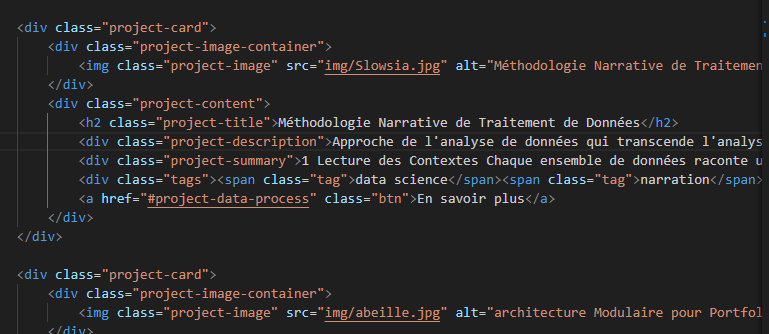
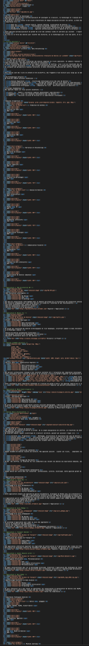
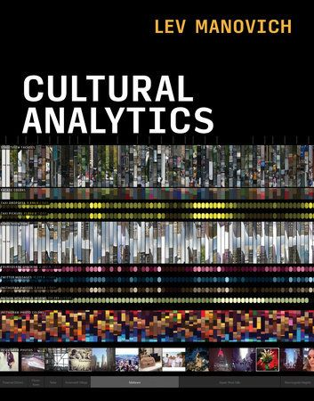

# 📰 Newsletter Portfolio - 11/04/2025

## Récits visuels, horizons numériques : Un voyage entre créativité et innovation 🚀

---

### 📌 Méthodologie Narrative de Traitement de Données


*Résumé de la section du PORTFOLIO : Une Approche de l'Analyse de Données*

#### Méthodologie Narrative de Traitement de Données

Chaque ensemble de données raconte une histoire. Mon approche consiste à écouter ces récits, à comprendre leurs nuances et leurs implications culturelles sous-jacentes.

Au-delà des chiffres, je recherche les fils conducteurs qui relient les données aux expériences humaines, aux dynamiques organisationnelles et aux évolutions sociétales.

Chaque donnée est située dans son écosystème : professionnel, culturel, historique. Cette approche permet de révéler des insights qui dépassent l'analyse statistique traditionnelle.

[Retour en haut](#)

---

### 🎨 architecture Modulaire pour Portfolio Digital - Une Approche Basée sur le Markdown




#### Introduction

La gestion d'un portfolio digital peut rapidement devenir complexe lorsque le contenu s'enrichit et se diversifie. L'architecture traditionnelle où le contenu est directement intégré dans le HTML pose des problèmes de maintenance et d'évolutivité. Cet article présente une approche modulaire basée sur le contenu (Content-Driven Modular Architecture) qui sépare clairement la présentation du contenu, offrant ainsi une solution élégante pour les portfolios riches en contenu.


#### Le problème du contenu monolithique

Imaginez un portfolio comme celui-ci :



Ce fichier HTML devient rapidement surchargé, mélangeant structure, présentation et contenu. Chaque modification nécessite d'intervenir dans le code HTML, rendant la maintenance fastidieuse et source d'erreurs.

#### Solution : Architecture Modulaire à Base de Contenu

L'architecture modulaire à base de contenu propose de séparer le contenu (texte, images, liens) de sa présentation (HTML, CSS), en utilisant Markdown comme format de contenu.

#### Principe fondamental

La séparation contenu/présentation s'articule autour de trois composants :

1. Fichiers Markdown (.md) : Contiennent uniquement le contenu avec métadonnées (frontmatter)
1. Template HTML unique : Définit la structure et la mise en page
1. Script de chargement : Intègre dynamiquement le contenu Markdown dans le HTML

#### Structure de fichiers

portfolio/
├── index.html            # Template principal avec la structure
├── css/
│   └── styles.css        # Styles CSS 
├── js/
│   └── main.js           # Scripts JavaScript (optionnel)
├── content/              # Dossier des contenus en Markdown
│   ├── about.md          # Section "À propos"
│   ├── skills.md         # Section "Compétences"
│   ├── projects/         # Sous-dossier pour les projets
│   │   ├── project1.md
│   │   └── project2.md
│   └── ...
└── img/                  # Images</code>

#### Les fichiers Markdown avec frontmatter

Voici un exemple de fichier Markdown pour la section "À propos" :

#### ```markdown

title: "À Propos"
subtitle: "Présentation"
image: "/img/abeille.jpg"

#### Une Approche Intégrée : HTML modularisé

Le fichier HTML devient un simple template qui charge dynamiquement le contenu :

```html
<section class="section about" id="about">
    <div class="container">
        <div class="section-title-container">
            <p class="section-subtitle" id="about-subtitle"></p>
            <h2 class="section-title" id="about-title"></h2>
        </div>
        <div class="about-content">
            <div class="about-image">
                
            </div>
            <div class="about-text" id="about-content">
                <!-- Le contenu Markdown sera inséré ici -->
            </div>
        </div>
    </div>
</section>


#### Script de chargement JavaScript

Un script JavaScript charge dynamiquement le contenu Markdown, le convertit en HTML et l'insère dans la page :

<code>``javascript
async function loadMarkdownContent(filePath, targetElementId, imageId, titleId, subtitleId) {
    // Chargement du fichier Markdown
    const response = await fetch(</code>content/${filePath}.md`);
    const mdContent = await response.text();

}

// Chargement des sections
document.addEventListener('DOMContentLoaded', function() {
    loadMarkdownContent('about', 'about-content', 'about-image', 'about-title', 'about-subtitle');
    // Chargement des autres sections...
});
```


#### Automatisation du processus

Pour simplifier encore davantage la gestion du contenu, un script Python a été développé pour :

1. Extraire la structure d'un fichier Markdown (titres, images, liens)
1. Générer un frontmatter YAML complet avec métadonnées
1. Créer des versions résumées des contenus
1. Transformer des paragraphes en listes de mots-clés
Cet outil permet de traiter les fichiers Markdown de manière cohérente et d'extraire automatiquement les métadonnées pertinentes.


#### Avantages de cette architecture

Cette approche présente de nombreux avantages :

1. Séparation du contenu et de la présentation - Le contenu est stocké indépendamment du code de l'interface
1. Composabilité - Les sections peuvent être réutilisées ou réorganisées facilement
1. Maintenabilité - Modifier un contenu n'exige pas de toucher au code HTML principal
1. Évolutivité - Ajouter une nouvelle section est aussi simple que de créer un nouveau fichier
1. Versionning efficace - Les modifications de contenu sont clairement visibles dans les commits Git
1. Workflow optimisé - Les designers peuvent travailler sur l'interface pendant que les rédacteurs créent le contenu

#### Mise en pratique

Pour mettre en place cette architecture dans votre propre portfolio :

1. Convertissez vos contenus en fichiers Markdown avec frontmatter
1. Créez un template HTML avec des conteneurs identifiés pour chaque section
1. Implémentez le script de chargement JavaScript
1. Utilisez des outils d'automatisation pour faciliter la gestion du contenu

#### Conclusion

L'architecture modulaire à base de contenu représente une évolution naturelle pour les portfolios digitaux riches en contenu. En séparant clairement le contenu de la présentation, cette approche simplifie considérablement la maintenance et l'évolution de votre portfolio, tout en offrant une grande flexibilité pour personnaliser chaque aspect de votre présence en ligne.

Cette méthode s'inscrit parfaitement dans la philosophie "Create Once, Publish Everywhere" (COPE), permettant de réutiliser le contenu sur différentes plateformes et dans différents formats sans duplication d'effort.

[Retour en haut](#)


---

### 🤖 Optimisation d'un avatar conversationnel pour l'archéologie préhistorique


#### Optimisation d'un avatar conversationnel pour l'archéologie préhistorique


#### Introduction

Cet article résume un processus d'amélioration d'un système d'IA conversationnel nommé "Lartet", conçu pour simuler les interactions avec Édouard Lartet, un paléontologue et préhistorien français du 19ème siècle. Le système utilise une architecture d'apprentissage automatique pour générer des réponses informées à partir de passages de l'ouvrage "Reliquiae Aquitanicae".


#### Défis identifiés

L'analyse des logs et des réponses générées a permis d'identifier plusieurs défis:

1. Répétition de contenus: Le système intégrait le même passage dans différentes sections
1. Problèmes de traduction: La traduction automatique anglais-français produisait des textes incohérents
1. Hallucinations et substitutions inappropriées: Les noms propres étaient systématiquement remplacés par "mon collègue"
1. Absence d'utilisation de l'ontologie et de la méréologie: Malgré des structures de données riches, ces éléments n'étaient pas intégrés
1. Réponses non adaptées à certaines questions sensibles: Le système ne traitait pas correctement les questions sur Henry Christy

#### Solutions développées


#### 1. Amélioration de l'extraction d'informations

La fonction <code>extract_structured_info</code> a été optimisée pour éviter les doublons entre catégories:

```python


#### Éviter les doublons entre catégories

all_items = set()
for category in list(info.keys()):
    unique_items = []
    for item in info[category]:
        item_hash = hash(item)
        if item_hash not in all_items:
            all_items.add(item_hash)
            unique_items.append(item)
    info[category] = unique_items
```


#### 2. Gestion des questions sensibles

Une fonction spécifique a été implémentée pour traiter les questions sur Henry Christy:

<code>python
def get_christy_collaboration_response(self):
    """Fournit une réponse prédéfinie sur la collaboration avec Christy"""
    if self.language == "fr":
        return """
Je préfère ne pas m'étendre sur mes relations personnelles ou professionnelles...
"""</code>


#### 3. Restructuration du générateur de questions suggérées

La fonction <code>get_default_question</code> a été entièrement réécrite pour offrir des suggestions pertinentes sans mentionner Henry Christy:

```python
def get_default_question(self, user_input: str) -&gt; str:
    """Retourne une question par défaut basée sur la requête utilisateur."""
    query_lower = user_input.lower()

```


#### 4. Amélioration de la cohérence linguistique

Le système a été modifié pour présenter clairement les extraits en anglais tout en maintenant une structure en français:

```python


#### Note explicative sur la langue

response_parts.append("## Note sur la langue")
response_parts.append("Bien que mes publications scientifiques fussent rédigées en anglais, je vous présente ici une synthèse en français de mes travaux.")
```


#### 5. Intégration de l'ontologie et de la méréologie

Des fonctions ont été ajoutées pour exploiter les structures ontologiques et méréologiques:

<code>python
def initialize_knowledge_base(self):
    """Charge et structure l'ontologie et la méréologie"""
    self.structured_ontology = {}
    self.structured_mereology = {}
    # Traitement des données...</code>


#### Résultats

Les modifications ont permis d'obtenir:

1. Des réponses plus cohérentes et sans répétitions
1. Une meilleure présentation des extraits originaux
1. Une gestion appropriée des questions sensibles
1. Une exploitation plus riche des connaissances structurées

#### Conclusion

Ce processus d'optimisation illustre les défis spécifiques de la création d'avatars historiques utilisant le RAG. Il souligne l'importance d'une adaptation fine des mécanismes de génération et de vérification pour produire des interactions authentiques et informatives.

L'amélioration de ce système démontre comment les techniques d'IA contemporaines peuvent être adaptées pour préserver et transmettre le patrimoine scientifique historique de manière interactive et engageante.

[Retour en haut](#)


---

### 🎭 Résumé // Lev MANOVTICH, *The Science of Culture ?* in *Cultural Analysis*



L'analyse culturelle s'intéresse aux modèles qui peuvent être dérivés de l'analyse de vastes ensembles de données culturelles.
[Lien vers l'ouvrage en ligne : Cultural Analysis](https://direct.mit.edu/books/monograph/4966/Cultural-Analytics)


<strong>#analyse_quantitative #big_data #medias</strong>

<em>"L'idée qu'un groupe ou une personne a des comportements et des goûts culturels cohérents avait du sens dans les sociétés anciennes et modernes. Mais avec les nombreux choix culturels disponibles aujourd'hui, nous pourrions découvrir que l'idée d'un goût stable ou d'une « personnalité culturelle » stable est une illusion."</em>

➡️l'illusion du goût
➡️la classification n'est toujours pas l'explication
➡️Nouveau paradigme? D'où l'importance "<em>And here the concepts and methods of sampling, feature extraction, and exploratory data analysis are more important than data size"</em>


#### Structures cognitives & structures sociales

Nos structures cognitives sont celles de nos structures sociales (La distinction, 1979)


Pour reprendre R.MOURIEUX, <em>"Entre réalisme populaire et l'idéalisme bourgeois se situe le goût moyen des couches moyennes, fait de refus des extrêmes et de mimétisme de l'immédiat supérieur"</em> 1.https://www.persee.fr/doc/sotra_0038-0296_1980_num_22_4_1655_t1_0475_0000_2

<iframe width="560" height="315" src="https://www.youtube.com/embed/sf5ZGiqW7NI?si=FHGqM68HN5XPgqk6" title="YouTube video player" frameborder="0" allow="accelerometer; autoplay; clipboard-write; encrypted-media; gyroscope; picture-in-picture; web-share" referrerpolicy="strict-origin-when-cross-origin" allowfullscreen></iframe>


#### Les séries de Claude Monet (1840-1926)

<em>Du 22 septembre 2010 au 24 janvier 2011 - Paris, Galeries nationales du Grand Palais</em>

➡️ Notons aussi le rapport entre <em>expérience sensible &amp; image</em> (<strong>une image est une densité de probabilités dans un espace de plus grande dimension</strong>) Remarquez que dès le potron-minet, la lumière sur la pierre d'une façade de cathédrale reste une expérience sensible comparable à l'image - les séries de MONET ça ne fait pas de mal non plus ! 🙂

<em>Posté sur Linkedin du 28 mars 2025</em>

[Retour en haut](#)


---

### 📌 apprentissage automatique


#### apprentissage automatique


#### Apprentissage automatique

Les systèmes d'apprentissage automatique (machine learning) sont des technologies qui permettent aux ordinateurs d'apprendre à partir de données et d'améliorer leurs performances sur des tâches spécifiques sans être explicitement programmés.

Voici un aperçu des concepts clés et des types de systèmes d'apprentissage automatique :


#### 1. Types d'Apprentissage


#### 2. Algorithmes Courants


#### 3. Étapes de Développement d'un Système d'Apprentissage Automatique


#### 4. Applications


#### 5. Défis

Les systèmes d'apprentissage automatique sont en constante évolution et trouvent des applications dans de nombreux domaines, transformant la manière dont nous traitons et analysons les données.

[Retour en haut](#)


---

### 📌 Architecture Modulaire à Base de Contenu


#### Architecture Modulaire à Base de Contenu

L'<strong>Architecture Modulaire à Base de Contenu</strong> (ou "Content-Driven Modular Architecture") représente une approche moderne et flexible pour concevoir des sites web et des applications. Cette méthodologie place le contenu au centre du processus de développement, en le séparant strictement de la présentation.

<strong>Mots-clés:</strong> développement, architecture, contentdriven, méthodologie, applications


#### Principes fondamentaux

Cette architecture repose sur plusieurs principes clés qui la rendent particulièrement efficace pour les sites riches en contenu comme les portfolios et les blogs :

<strong>Mots-clés:</strong> architecture, portfolios, principes, plusieurs

Le contenu est stocké dans des fichiers indépendants (souvent au format Markdown) avec des métadonnées standardisées (frontmatter), complètement séparés du code HTML, CSS et JavaScript qui définit leur présentation. Cette séparation permet à chaque aspect d'évoluer indépendamment.

<strong>Mots-clés:</strong> standardisées, indépendance, présentation

Les sections et composants peuvent être facilement réutilisés, réorganisés ou recombinés pour créer de nouvelles pages ou expériences. Cette flexibilité permet d'assembler rapidement différentes vues à partir des mêmes éléments de base.

<strong>Mots-clés:</strong> expériences, réorganisation, flexibilité

Modifier un contenu n'exige pas de toucher au code HTML principal. Les rédacteurs de contenu peuvent se concentrer uniquement sur les fichiers Markdown pertinents, sans risquer d'altérer la structure ou le fonctionnement du site.

<strong>Mots-clés:</strong> fonctionnement, pertinents, concentrer, uniquement, rédacteurs

Ajouter une nouvelle section est aussi simple que de créer un nouveau fichier Markdown. Cette approche réduit considérablement la friction pour enrichir le site avec de nouveaux contenus.

<strong>Mots-clés:</strong>  contenus


#### Implémentation pratique

Pour les composants simples, le Markdown pur suffit généralement. Cependant, pour les composants plus complexes comme les grilles de compétences, les cartes de services, ou les processus multi-étapes, l'HTML embarqué dans Markdown offre le meilleur compromis :

Cette approche hybride permet de préserver le rendu visuel des composants complexes tout en profitant pleinement de la modularité du système.

<strong>Mots-clés:</strong> multiétapes, compétences, composants, markdown, modularité, composants, complexes


#### Avantages à long terme

Au-delà des bénéfices immédiats, cette architecture offre des avantages substantiels sur le long terme :

- Transitions technologiques facilitées - Le contenu peut être conservé même si le framework ou la technologie de présentation change
- Versionning efficace - Les modifications de contenu sont clairement visibles dans les commits Git
- Possibilités de migration accrues - Le contenu peut être facilement exporté vers d'autres systèmes
- Optimisation du workflow - Les designers et développeurs peuvent travailler sur l'interface pendant que les rédacteurs créent le contenu
Cette architecture représente une évolution naturelle des systèmes de gestion de contenu traditionnels, offrant davantage de flexibilité tout en conservant une structure claire et organisée.

<strong>Mots-clés:</strong> architecture, flexibilité


#### 1. Séparation du contenu et de la présentation

Le contenu est stocké dans des fichiers indépendants (souvent au format Markdown) avec des métadonnées standardisées (frontmatter), complètement séparés du code HTML, CSS et JavaScript qui définit leur présentation. Cette séparation permet à chaque aspect d'évoluer indépendamment.

<strong>Mots-clés:</strong> indépendance, standardisés, présentation


#### 2. Composabilité

Les sections et composants peuvent être facilement réutilisés, réorganisés ou recombinés pour créer de nouvelles pages ou expériences. Cette flexibilité permet d'assembler rapidement différentes vues à partir des mêmes éléments de base.

<strong>Mots-clés:</strong> flexibilité


#### 3. Maintenabilité

Modifier un contenu n'exige pas de toucher au code HTML principal. Les rédacteurs de contenu peuvent se concentrer uniquement sur les fichiers Markdown pertinents, sans risquer d'altérer la structure ou le fonctionnement du site.

<strong>Mots-clés:</strong> pertinents, rédacteurs


#### 4. Évolutivité

Ajouter une nouvelle section est aussi simple que de créer un nouveau fichier Markdown. Cette approche réduit considérablement la friction pour enrichir le site avec de nouveaux contenus.

<strong>Mots-clés:</strong> enrichir, contenus

[Retour en haut](#)


---

## 💡 Philosophie de l'Innovation

> "L'innovation naît à l'intersection des disciplines, là où la créativité rencontre la technologie."

## 📱 Restons connectés !

**Envie d'explorer de nouveaux horizons numériques ?**

— [Portfolio Complet](https://portfolio-af-v2.netlify.app/)  
— [Me Contacter sur LinkedIn](https://www.linkedin.com/in/alexiafontaine)

#Innovation #TechCreative #DataScience #DigitalTransformation #CreativeTech

© 2025 Alexia Fontaine - Tous droits réservés