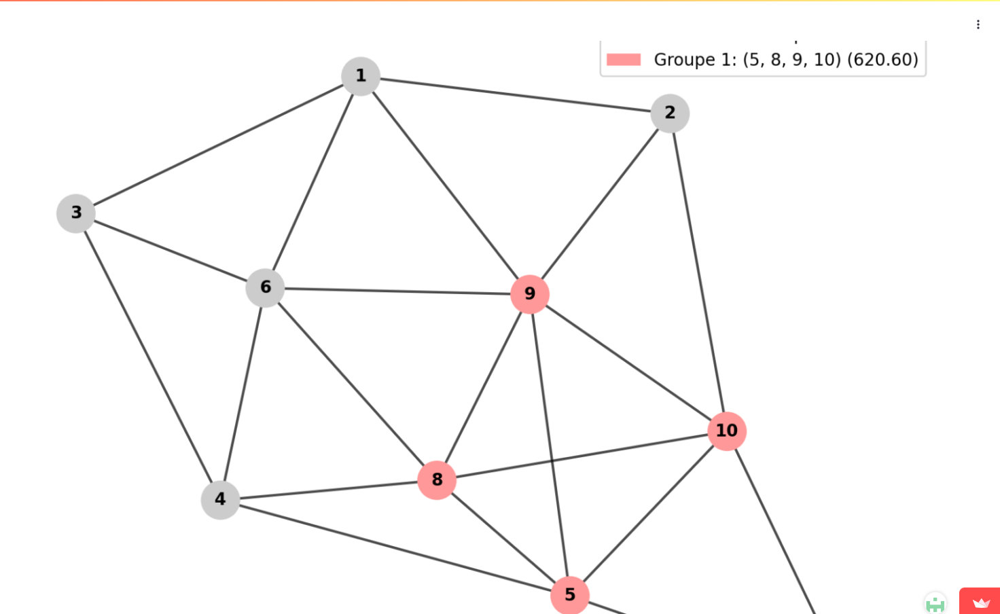

# 📰 Newsletter Portfolio - 11/04/2025

## Récits visuels, horizons numériques : Un voyage entre créativité et innovation 🚀

---

### 📊 ecriture-datastorytelling

#### ecriture-datastorytelling

#### Écriture et Data Storytelling

#### Analyse Culturelle et Narration de Données

#### Vue d'Ensemble

L'écriture est un outil de transformation des données complexes en récits captivants, révélant les insights cachés derrière les chiffres et les tendances.

#### Image de Référence

#### Approche Méthodologique

- Transformation de données complexes en récits accessibles
- Révélation des dynamiques culturelles sous-jacentes
- Contextualisation approfondie des données

#### Principes Fondamentaux

1. Clarté : Rendre l'information complexe immédiatement compréhensible
1. Engagement : Créer une connexion émotionnelle avec les données
1. Impact : Faciliter la prise de décision et la compréhension stratégique

#### Dimensions Clés

- Analyse rigoureuse statistique
- Contextualisation narrative
- Visualisation éloquente
- Communication stratégique

#### Citation Inspirante

« Les données sont des récits en attente d'être déchiffrés, des fragments d'une histoire plus large qui ne demandent qu'à être racontée. »

#### Compétences Principales

- Rédaction de contenus analytiques
- Data Storytelling
- Analyse de données
- Vulgarisation technique
- Communication visuelle

#### Approche de l'Analyse Culturelle

L'analyse culturelle dans le data storytelling va au-delà de l'interprétation statistique traditionnelle. Elle cherche à comprendre comment les données reflètent :
- Les interactions humaines
- Les sous-cultures professionnelles
- Les transformations sociétales

#### Méthodologie Intégrée

1. Décorticage statistique précis des jeux de données
1. Ancrage des données dans un récit humain
1. Traduction des insights en représentations visuelles
1. Adaptation du récit aux différents publics

#### Domaines d'Expertise

- Articles de fond
- Contenus web
- Optimisation SEO
- Narration de marque
- Récits immersifs
- Data Visualization
[Retour en haut](#)

---

### 📌 optimisation-transport

#### optimisation-transport

#### Optimisation des Réseaux de Transport

#### Présentation du Projet

Une application interactive explorant les algorithmes de sectorisation et d'optimisation des réseaux de transport, démontrant comment l'analyse de données peut résoudre des problèmes complexes de logistique.

#### Objectifs

- Modélisation des réseaux de transport
- Optimisation des parcours et de la distribution
- Application des techniques avancées de traitement de graphes

#### Technologies Utilisées

- Algorithmes d'optimisation
- Théorie des graphes
- Analyse de données spatiales
- Python

#### Capture d'Écran

#### Lien du Projet

[Explorer l'Application d'Optimisation des Réseaux](https://sectorisation-reseaux.streamlit.app/)

[Explorer l'Application d'Optimisation des Réseaux](https://sectorisation-reseaux.streamlit.app/)

#### Approche Technique

Utilisation de techniques avancées de traitement de graphes pour:
- Analyser les flux de transport
- Optimiser les itinéraires
- Minimiser les coûts et maximiser l'efficacité

#### Fonctionnalités Principales

- Visualisation des réseaux de transport
- Simulation de différents scénarios de sectorisation
- Analyse comparative des performances

#### Compétences Mises en Œuvre

- Algorithmes complexes
- Modélisation mathématique
- Analyse spatiale
- Développement d'outils d'aide à la décision
[Retour en haut](#)

---

### 📌 voyages

#### voyages

#### Voyages et Découvertes

#### Sources d'Inspiration et Explorations Culturelles

#### Philosophie des Voyages

Les voyages comme sources inépuisables d'inspiration, de découvertes et de compréhension interculturelle.

#### Approche

- Exploration attentive aux détails culturels
- Développement d'une sensibilité interculturelle
- Éveil de tous les sens

#### Projets et Séries

- Thème: Motifs traditionnels balinais
- Technique: Réinterprétation contemporaine
- Objectif: Fusion de l'héritage ancestral avec une esthétique moderne
[Vidéo Bali Inspirations](https://player.vimeo.com/video/1067021067)

[Vidéo Bali Inspirations](https://player.vimeo.com/video/1067021067)

- Concept: La dégustation comme exploration culturelle
- Approche: Combinaison de :
- Connaissances techniques
- Sensibilité perceptive
- Contexte historique
- Observer
- Sentir
- Goûter
- Écouter
- Toucher
[Vidéo Voyage Sensoriel](https://player.vimeo.com/video/1067021012)

[Vidéo Voyage Sensoriel](https://player.vimeo.com/video/1067021012)

- Contenu:
- Notes
- Croquis
- Photographies
- Technique: Méthode mixte
- Illustrations
- Collages
- Annotations personnelles
[Vidéo Carnets de Voyage](https://player.vimeo.com/video/1067021037)

[Vidéo Carnets de Voyage](https://player.vimeo.com/video/1067021037)

#### Dimensions des Voyages

- Culturelle: Immersion dans les traditions locales
- Artistique: Capture des nuances visuelles
- Personnelle: Transformation et croissance individuelle

#### Techniques de Documentation

- Photographie
- Illustration
- Écriture
- Enregistrements sonores
- Collecte d'objets et de matériaux

#### Principes Directeurs

1. Observation profonde
1. Respect des cultures
1. Ouverture à l'inattendu
1. Transformation par l'expérience

#### Impact

- Enrichissement personnel
- Développement d'une perspective globale
- Inspiration pour projets créatifs
- Compréhension interculturelle approfondie

#### Citation Inspirante

Les voyages sont des fragments de rêves cousus ensemble par la curiosité et l'émerveillement.

[Retour en haut](#)

---

### 📌 photographie

#### photographie

#### Photographie

#### Exploration Visuelle et Patrimoniale

#### Image de Référence

#### Blog Scientifique : ARCHAEDYN

- Analyse des dynamiques territoriales sur 7 millénaires
- Du Néolithique au Moyen Âge
- Techniques de pointe en analyse spatiale

#### Compétences Clés

- Analyse cartographique détaillée
- Études archéologiques comparatives
- Modélisation des données spatiales
- Systèmes d'Information Géographique (SIG)

#### Lien du Projet

[Article complet sur ArchNum](https://archnum.hypotheses.org/175)

[Article complet sur ArchNum](https://archnum.hypotheses.org/175)

#### Photogrammétrie : Modélisation 3D

#### Qu'est-ce que la Photogrammétrie ?

Technique de création de modèles 3D détaillés à partir de photographies.

#### Processus de Création

- Prises de vue multi-angles
- Attention à l'éclairage
- Couverture complète de l'objet
- Alignement des photos
- Détection des points communs
- Génération d'un nuage de points dense
- Création du maillage 3D
- Application des textures
- Nettoyage du modèle
- Simplification
- Export dans différents formats
- Publication sur des plateformes de partage

#### Exemples de Réalisations

- Type: Objet ethnologique
- Objectif: Médiation culturelle
- Technique: Numérisation 3D
- Type: Artefact archéologique
- Projet: Trésor d'Eauze
- Technique: Photogrammétrie
- Type: Objet historique
- Projet: Documentation patrimoniale
- Technique: Modélisation 3D

#### Séries Photographiques

- Style: Noir et Blanc
- Thème: Exploration de la petite enfance
- Technique: Documentation créative
- Style: Archéologie industrielle
- Thème: Transformation et passage du temps
- Technique: Photographie documentaire

#### Technologies et Logiciels

- Agisoft Metashape
- Reality Capture
- Blender
- Photoshop
- Techniques avancées de traitement d'image

#### Philosophie Photographique

Capturer l'essence des moments, des objets et des espaces, en révélant leurs histoires cachées à travers l'image.

[Retour en haut](#)

---

### 📌 messe-saint-gregoire

#### messe-saint-gregoire

#### Patrimoine Numérique : La Messe Saint Grégoire

#### Présentation du Projet

Un projet de valorisation du patrimoine culturel associant photographie, rédaction de contenus historiques et conception d'expériences interactives pour rendre accessibles des trésors culturels.

#### Objectifs

- Préservation et médiation culturelle
- Création de ponts entre tradition et innovation
- Exploration numérique du patrimoine historique

#### Technologies Utilisées

- Modélisation 3D
- Recherche Historique
- Médiation Culturelle

#### Capture d'Écran

#### Lien du Projet

[Consulter La Messe Saint Grégoire](https://messe-st-gregoire.netlify.app/)

[Consulter La Messe Saint Grégoire](https://messe-st-gregoire.netlify.app/)

#### Description Détaillée

Cette initiative démontre comment les technologies numériques peuvent servir la préservation et la médiation culturelle, en transformant un élément patrimonial en une expérience interactive et accessible.

#### Approche

- Documentation visuelle approfondie
- Contextualisation historique
- Création d'une expérience numérique immersive

#### Compétences Mises en Œuvre

- Photographie documentaire
- Recherche historique
- Conception d'expériences interactives
- Médiation culturelle numérique
[Retour en haut](#)

---

### 📌 Architecture Modulaire à Base de Contenu

#### Architecture Modulaire à Base de Contenu

L'<strong>Architecture Modulaire à Base de Contenu</strong> (ou "Content-Driven Modular Architecture") représente une approche moderne et flexible pour concevoir des sites web et des applications. Cette méthodologie place le contenu au centre du processus de développement, en le séparant strictement de la présentation.

<strong>Mots-clés:</strong> développement, architecture, contentdriven, méthodologie, applications

#### Principes fondamentaux

Cette architecture repose sur plusieurs principes clés qui la rendent particulièrement efficace pour les sites riches en contenu comme les portfolios et les blogs :

<strong>Mots-clés:</strong> architecture, portfolios, principes, plusieurs

Le contenu est stocké dans des fichiers indépendants (souvent au format Markdown) avec des métadonnées standardisées (frontmatter), complètement séparés du code HTML, CSS et JavaScript qui définit leur présentation. Cette séparation permet à chaque aspect d'évoluer indépendamment.

<strong>Mots-clés:</strong> standardisées, indépendance, présentation

Les sections et composants peuvent être facilement réutilisés, réorganisés ou recombinés pour créer de nouvelles pages ou expériences. Cette flexibilité permet d'assembler rapidement différentes vues à partir des mêmes éléments de base.

<strong>Mots-clés:</strong> expériences, réorganisation, flexibilité

Modifier un contenu n'exige pas de toucher au code HTML principal. Les rédacteurs de contenu peuvent se concentrer uniquement sur les fichiers Markdown pertinents, sans risquer d'altérer la structure ou le fonctionnement du site.

<strong>Mots-clés:</strong> fonctionnement, pertinents, concentrer, uniquement, rédacteurs

Ajouter une nouvelle section est aussi simple que de créer un nouveau fichier Markdown. Cette approche réduit considérablement la friction pour enrichir le site avec de nouveaux contenus.

<strong>Mots-clés:</strong>  contenus

#### Implémentation pratique

Pour les composants simples, le Markdown pur suffit généralement. Cependant, pour les composants plus complexes comme les grilles de compétences, les cartes de services, ou les processus multi-étapes, l'HTML embarqué dans Markdown offre le meilleur compromis :

Cette approche hybride permet de préserver le rendu visuel des composants complexes tout en profitant pleinement de la modularité du système.

<strong>Mots-clés:</strong> multiétapes, compétences, composants, markdown, modularité, composants, complexes

#### Avantages à long terme

Au-delà des bénéfices immédiats, cette architecture offre des avantages substantiels sur le long terme :

- Transitions technologiques facilitées - Le contenu peut être conservé même si le framework ou la technologie de présentation change
- Versionning efficace - Les modifications de contenu sont clairement visibles dans les commits Git
- Possibilités de migration accrues - Le contenu peut être facilement exporté vers d'autres systèmes
- Optimisation du workflow - Les designers et développeurs peuvent travailler sur l'interface pendant que les rédacteurs créent le contenu
Cette architecture représente une évolution naturelle des systèmes de gestion de contenu traditionnels, offrant davantage de flexibilité tout en conservant une structure claire et organisée.

<strong>Mots-clés:</strong> architecture, flexibilité

#### 1. Séparation du contenu et de la présentation

Le contenu est stocké dans des fichiers indépendants (souvent au format Markdown) avec des métadonnées standardisées (frontmatter), complètement séparés du code HTML, CSS et JavaScript qui définit leur présentation. Cette séparation permet à chaque aspect d'évoluer indépendamment.

<strong>Mots-clés:</strong> indépendance, standardisés, présentation

#### 2. Composabilité

Les sections et composants peuvent être facilement réutilisés, réorganisés ou recombinés pour créer de nouvelles pages ou expériences. Cette flexibilité permet d'assembler rapidement différentes vues à partir des mêmes éléments de base.

<strong>Mots-clés:</strong> flexibilité

#### 3. Maintenabilité

Modifier un contenu n'exige pas de toucher au code HTML principal. Les rédacteurs de contenu peuvent se concentrer uniquement sur les fichiers Markdown pertinents, sans risquer d'altérer la structure ou le fonctionnement du site.

<strong>Mots-clés:</strong> pertinents, rédacteurs

#### 4. Évolutivité

Ajouter une nouvelle section est aussi simple que de créer un nouveau fichier Markdown. Cette approche réduit considérablement la friction pour enrichir le site avec de nouveaux contenus.

<strong>Mots-clés:</strong> enrichir, contenus

[Retour en haut](#)

---

## 💡 Philosophie de l'Innovation

> "L'innovation naît à l'intersection des disciplines, là où la créativité rencontre la technologie."

## 📱 Restons connectés !

**Envie d'explorer de nouveaux horizons numériques ?**

— [Portfolio Complet](https://portfolio-af-v2.netlify.app/)  
— [Me Contacter sur LinkedIn](https://www.linkedin.com/in/alexiafontaine)

#Innovation #TechCreative #DataScience #DigitalTransformation #CreativeTech

© 2025 Alexia Fontaine - Tous droits réservés