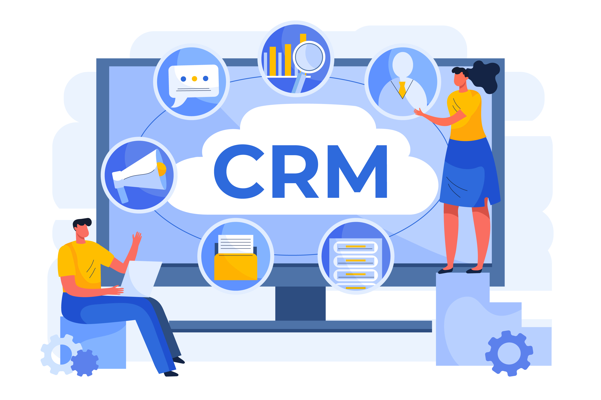

# 📰 Newsletter Portfolio - 25/04/2025

## Récits visuels, horizons numériques : Un voyage entre créativité et innovation 🚀

---

### 📌 Comment lire... la citrouille de Cendrillon

#### Comment lire... la citrouille de Cendrillon

#### L'identité du lecteur

Le petit buzz autour de Cluely ([voir post "Cluely : de ton entretien d'embauche à ton rancard!"]()) renvoie à des problématiques identitaires marquées et très actuelles, à travers la promotion d'un produit IA censé "tricher sur tout" ! Et bien que cette vidéo reste dans un modèle <em>"mâle, (blanc), de culture standard"</em>, ce télescopage entre marketing &amp; litterature se tente.

[voir post "Cluely : de ton entretien d'embauche à ton rancard!"]()

Dans la critique littéraire contemporaine, la lecture impersonnelle fondée sur des critères esthétiques objectifs est rejetée au profit d'une approche qui valorise l'identité du lecteur.
Cette lecture de William Marx du travail d'Elaine Castillo ("How to read now", 2022) met en perspective toute cette complexité identitaire américaine, mais aussi les projections associées à toutes formes de domination.

Cela faisait alors écho à un échange avec une de mes élèves de 3eme qui lisait un passage des <em>Misérables</em> et transposait sur le même plan injustice sociale et colonisation en Nouvelle-Calédonie : pour elle, la farine sur le visage du boulanger était le symbole de la domination.

Son explication était comme la citrouille d'Elaine Castillo, parfaitement cohérente avec sa réalité, et ne toujours pas tenir compte de ses réalités est très justement ce que reproche cette auteur ; même si son point de vue m'apparaît excessif, il reste très drôle (j'aurai aimé ajouté pertinent mais je ne l'ai pas encore lue)

Heureusement, l'écriture permet cette liberté et reste un moteur de changements. Je vous en laisse juge.

#### La citrouille de Cendrillon

<em>Professeur : William Marx
Chaire Littératures comparées</em>

<em>Dans le régime de lecture contemporain d’inspiration progressiste et décoloniale, jamais le lecteur ne saurait oublier qui il est et d’où il lit. On assiste à la fin de l’idée d’une lecture impersonnelle des œuvres, qui dominait la critique littéraire formaliste, à savoir une lecture fondée sur des critères esthétiques objectivables, sur des paramètres formels universalisables, généralisables à toutes les cultures. La dépersonnalisation du lecteur est désormais considérée comme l’ultime subterfuge du « suprémacisme blanc » (Castillo) pour asseoir sa domination et maintenir dans la soumission les populations racisées. Pour la critique décoloniale, en effet, le lecteur idéal prévu par les grands textes canoniques européens, le « lector in fabula » (Eco), est un lecteur blanc, mâle, hétérosexuel, de culture standard.</em>

[Retour en haut](#)

---

### 📌 Prototype CRM Relations Entreprises

#### Prototype CRM Relations Entreprises

#### Présentation

Une application de démonstration pour la gestion de la relation client (CRM), spécialement conçue pour le suivi des partenariats avec les entreprises, offrant une interface intuitive et des fonctionnalités complètes d'analyse et de reporting.

#### Fonctionnalités Principales

- Gestion centralisée des entreprises partenaires et prospects
- Suivi détaillé des interactions et communications
- Planification et gestion d'événements professionnels
- Publication et suivi des offres d'emploi, stages et alternances
- Tableaux de bord analytiques et rapports personnalisables

#### Technologies Utilisées

- Python (Streamlit)
- Pandas pour la manipulation des données
- Plotly et Matplotlib pour les visualisations
- Stockage de données CSV (extensible à des bases de données)
- Interface responsive avec CSS personnalisé

#### Lien du Projet

[Explorer Démo CRM Relations Entreprises](https://crm-relations.streamlit.app/)

[Explorer Démo CRM Relations Entreprises](https://crm-relations.streamlit.app/)

[Retour en haut](#)

---

### 📌 Match'Emploi - Mission Locale

#### Match'Emploi - Mission Locale

#### Présentation

Il s'agit d'un prototype (!!) de mise en relation entre candidats et offres d'emploi, développée avec une interface intuitive et des algorithmes de matching.

#### Fonctionnalités Principales

- Algorithme de matching basé sur les compétences et préférences
- Gestion complète des profils jeunes et des offres d'emploi
- Suivi des mises en relation et des candidatures
- Tableaux de bord statistiques et analytiques
- Système de filtres multicritères avancés

#### Technologies Utilisées

- Python (Streamlit)
- Pandas pour la gestion des données
- Plotly et Matplotlib pour les visualisations
- Algorithmes de calcul de similarité (cosinus)
- CSS personnalisé pour l'interface utilisateur

#### Lien du Projet

[Explorer l'Application Match'Emploi](https://app-matching-emploi.streamlit.app/)

[Explorer l'Application Match'Emploi](https://app-matching-emploi.streamlit.app/)

[Retour en haut](#)

---

### 📌 Mini-buzz avec Cluely

#### Mini-buzz avec Cluely

#### Cluely : de ton entretien d'embauche à ton rancard !

La vidéo présente ce jeune entrepreneur, Roy Lee, qui fait le buzz actuellement pour avoir triché sur des entretiens d'embauche, et qui se met ici en scène, se faisant mousser auprès de son <em>date</em> du moment grâce à son outil <em>Cluely</em> : un outil IA pour <em>“cheat on everything.”</em> [<em>"tricher sur tout"</em> - leur slogan (?!)]

<em>lien dans l'image</em>

L'histoire fait sourire... alala ces Américains (ou les hommes en général), l'autodérison dont fait preuve la nouvelle génération est plus qu'appréciable, bien que <em>sous la blague le pavé</em> : son bluff interpelle car son outil IA reste basé sur de l'apprentissage automatique, rien de révolutionnaire, mais le principe assumé de tricher pour réussir pose question ou devrait poser question.

Notre propos n'est pas de philosopher sur le caractère ethique de la tricherie, <strong>tout le monde triche dans la vie</strong>.

La <em>vraie vie</em>, c'est d'ailleurs ce que démontre magistralement Roy Lee dans sa vidéo de teasing avec son rancard : <strong>l'IA est finalement parfaitement intégrable à <em>la vie normale</em> (jolie projection pour sa promotion de produit!)</strong>

...Ces tours de <em>hold-up mental</em> sont fascinants.

Mais c'est en tombant sur l'historique de [l'association AURORE](https://www.aurore.asso.fr/association) qui aide les personnes les plus fragiles, et privées de <em>vie normale</em>, que la démarche m'a semblé plus difficile, dans les deux cas.

[l'association AURORE](https://www.aurore.asso.fr/association)

Fondée en 1872 à Paris et reconnue d'utilité publique en 1875, les statuts de cette association sont ainsi définis :

[ref](https://www.aurore.asso.fr/historique)

Là où je veux en venir... bien que cabossée, notre consicence sociétale (notre pacte social) se fonde aussi sur ces principes d'honnêteté et de labeur, depuis au moins le 19ème siècle.

Même si je me base d'un point de vue "vieux continent", les Etats-Unis partage aussi ces mêmes principes.

Alors prolongeons cette lecture vers la période trouble que traverse actuellement ce pays dans sa recherche identitaire : <strong>dans un système plombé par un racisme dit systémique, finalement pourquoi être honnête et dans l'effort? Dans ce cas, on doit aussi en déduire que, dans sa logique, la fin justifie les moyens.</strong>

...C'est un pari à 5.3 millions de dollars et cet étudiant vient de Columbia. Et on comprend aussi pourquoi il a été suspendu par son université.

Les forces idéologiques que font émerger les outils IA sont conséquents, ces crises identitaires ne sont pas propres aux Etats-Unis, nos repères peuvent sembler modifiés, on aurait tort de les voir uniquement comme de simples produits en plus dans notre panoplie.

Roy Lee compare d'ailleurs son outil à la calculatrice ou au correcteur orthographique (<em>c'est déjà moins glamour!</em>) mais il a raison sur ce point : nous déléguons ces tâches cognitives à des machines et plus personne aujourd'hui n'y voit à redire (...dans une vie normale)

Conclusion : l'outil IA n'est vraiment pas un problème dans nos vies.

[Retour en haut](#)

---

### 📌 Journal d'Apprentissage - Recherche d'Emploi

#### Journal d'Apprentissage - Recherche d'Emploi

#### Présentation

Une demo pour du suivi personnalisé dans l'accompagnement des chercheurs d'emploi dans leur parcours d'apprentissage et de développement professionnel, offrant un espace structuré pour documenter leur progression et optimiser leur démarche.

#### Fonctionnalités Principales

- Journal d'apprentissage réflexif et structuré
- Suivi détaillé des candidatures et entretiens
- Évaluation et progression des compétences clés
- Gestion d'objectifs et plans d'action personnalisés
- Profil professionnel complet et évolutif
- Accès à des ressources et conseils ciblés

#### Technologies Utilisées

- Python (Streamlit)
- Pandas pour l'analyse de données
- Plotly pour les visualisations interactives
- Stockage JSON pour les données utilisateur
- Interface responsive avec CSS personnalisé

#### Lien du Projet

[Explorer l'Application Journal d'Apprentissage](https://app-atelier-emploi.streamlit.app/)

[Explorer l'Application Journal d'Apprentissage](https://app-atelier-emploi.streamlit.app/)

[Retour en haut](#)

---

### 📌 Les animaux n'ont pas besoin de chef

#### Les animaux n'ont pas besoin de chef

#### Concept d'auto-organisation

Dans l'idée d'une décision, on associe souvent une notion d'intention et de choix.

Le primatologue Cédric Sueur fait parti de ceux qui remettent en question cela à travers des notions d'intelligence collective et d'auto-organisation dans une perspective de recherches actuelles, c'est à dire <strong>l'autonomie des systèmes</strong>.

On y retrouve des notions d'efficacité et d'optimisation avec notamment des principes de sommes de règles simples.

Dans un contexte IA, l'auto-organisation est un concept important dans l'apprentissage des réseaux de neurones.

Cette vidéo est une bonne introduction indirecte au sujet.

[Retour en haut](#)

---

## 💡 Philosophie de l'Innovation

> "L'innovation naît à l'intersection des disciplines, là où la créativité rencontre la technologie."

## 📱 Restons connectés !

**Envie d'explorer de nouveaux horizons numériques ?**

— [Portfolio Complet](https://portfolio-af-v2.netlify.app/)  
— [Me Contacter sur LinkedIn](https://www.linkedin.com/in/alexiafontaine)

#Innovation #TechCreative #DataScience #DigitalTransformation #CreativeTech

© 2025 Alexia Fontaine - Tous droits réservés