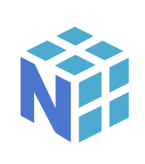

# 📰 Newsletter Portfolio - 09/05/2025

## Récits visuels, horizons numériques : Un voyage entre créativité et innovation 🚀

---

### 🎨 architecture Modulaire pour Portfolio Digital - Une Approche Basée sur le Markdown


#### architecture Modulaire pour Portfolio Digital - Une Approche Basée sur le Markdown


#### Introduction

La gestion d'un portfolio digital peut rapidement devenir complexe lorsque le contenu s'enrichit et se diversifie. L'architecture traditionnelle où le contenu est directement intégré dans le HTML pose des problèmes de maintenance et d'évolutivité. Cet article présente une approche modulaire basée sur le contenu (Content-Driven Modular Architecture) qui sépare clairement la présentation du contenu, offrant ainsi une solution élégante pour les portfolios riches en contenu.


#### Le problème du contenu monolithique

Imaginez un portfolio comme celui-ci :

```html

Présentation


#### À Propos


#### Mon Univers Créatif et Analytique

Bienvenue dans mon portfolio multidisciplinaire où convergent la créativité, la technologie et l'analyse de données. Mon approche combine des compétences en data science, storytelling, design et documentation créative pour créer des expériences narratives riches et significatives.


#### Solution : Architecture Modulaire à Base de Contenu

L'architecture modulaire à base de contenu propose de séparer le contenu (texte, images, liens) de sa présentation (HTML, CSS), en utilisant Markdown comme format de contenu.


#### Principe fondamental

La séparation contenu/présentation s'articule autour de trois composants :

1. Fichiers Markdown (.md) : Contiennent uniquement le contenu avec métadonnées (frontmatter)
1. Template HTML unique : Définit la structure et la mise en page
1. Script de chargement : Intègre dynamiquement le contenu Markdown dans le HTML

#### Structure de fichiers

<code>portfolio/
├── index.html            # Template principal avec la structure
├── css/
│   └── styles.css        # Styles CSS 
├── js/
│   └── main.js           # Scripts JavaScript (optionnel)
├── content/              # Dossier des contenus en Markdown
│   ├── about.md          # Section "À propos"
│   ├── skills.md         # Section "Compétences"
│   ├── projects/         # Sous-dossier pour les projets
│   │   ├── project1.md
│   │   └── project2.md
│   └── ...
└── img/                  # Images</code>


#### Les fichiers Markdown avec frontmatter

Voici un exemple de fichier Markdown pour la section "À propos" :


#### ```markdown

title: "À Propos"
subtitle: "Présentation"
image: "/img/abeille.jpg"


#### Une Approche Intégrée

Ma démarche s'articule autour d'une vision transversale où chaque discipline enrichit les autres...
```


#### HTML modularisé

Le fichier HTML devient un simple template qui charge dynamiquement le contenu :

```html


#### 


#### Script de chargement JavaScript

Un script JavaScript charge dynamiquement le contenu Markdown, le convertit en HTML et l'insère dans la page :

<code>``javascript
async function loadMarkdownContent(filePath, targetElementId, imageId, titleId, subtitleId) {
    // Chargement du fichier Markdown
    const response = await fetch(</code>content/${filePath}.md`);
    const mdContent = await response.text();

}

// Chargement des sections
document.addEventListener('DOMContentLoaded', function() {
    loadMarkdownContent('about', 'about-content', 'about-image', 'about-title', 'about-subtitle');
    // Chargement des autres sections...
});
```


#### Automatisation du processus

Pour simplifier encore davantage la gestion du contenu, un script Python a été développé pour :

1. Extraire la structure d'un fichier Markdown (titres, images, liens)
1. Générer un frontmatter YAML complet avec métadonnées
1. Créer des versions résumées des contenus
1. Transformer des paragraphes en listes de mots-clés
Cet outil permet de traiter les fichiers Markdown de manière cohérente et d'extraire automatiquement les métadonnées pertinentes.


#### Avantages de cette architecture

Cette approche présente de nombreux avantages :

1. Séparation du contenu et de la présentation - Le contenu est stocké indépendamment du code de l'interface
1. Composabilité - Les sections peuvent être réutilisées ou réorganisées facilement
1. Maintenabilité - Modifier un contenu n'exige pas de toucher au code HTML principal
1. Évolutivité - Ajouter une nouvelle section est aussi simple que de créer un nouveau fichier
1. Versionning efficace - Les modifications de contenu sont clairement visibles dans les commits Git
1. Workflow optimisé - Les designers peuvent travailler sur l'interface pendant que les rédacteurs créent le contenu

#### Mise en pratique

Pour mettre en place cette architecture dans votre propre portfolio :

1. Convertissez vos contenus en fichiers Markdown avec frontmatter
1. Créez un template HTML avec des conteneurs identifiés pour chaque section
1. Implémentez le script de chargement JavaScript
1. Utilisez des outils d'automatisation pour faciliter la gestion du contenu

#### Conclusion

L'architecture modulaire à base de contenu représente une évolution naturelle pour les portfolios digitaux riches en contenu. En séparant clairement le contenu de la présentation, cette approche simplifie considérablement la maintenance et l'évolution de votre portfolio, tout en offrant une grande flexibilité pour personnaliser chaque aspect de votre présence en ligne.

Cette méthode s'inscrit parfaitement dans la philosophie "Create Once, Publish Everywhere" (COPE), permettant de réutiliser le contenu sur différentes plateformes et dans différents formats sans duplication d'effort.

[Retour en haut](#)


---

### 📌 Méthodologie Narrative de Traitement de Données


#### Méthodologie Narrative de Traitement de Données

Chaque ensemble de données raconte une histoire. Mon approche consiste à écouter ces récits, à comprendre leurs nuances et leurs implications culturelles sous-jacentes.

Au-delà des chiffres, je recherche les fils conducteurs qui relient les données aux expériences humaines, aux dynamiques organisationnelles et aux évolutions sociétales.

Chaque donnée est située dans son écosystème : professionnel, culturel, historique. Cette approche permet de révéler des insights qui dépassent l'analyse statistique traditionnelle.

[Retour en haut](#)


---

### 📌 OPENEDITION : carnet HYPOTHESES - Blog scientifique Archnum


#### OPENEDITION : carnet HYPOTHESES - Blog scientifique Archnum


#### OpenEdition, le portail de la communication scientifique en SHS

<em><strong>OpenEdition</strong> est un portail de ressources électroniques en sciences humaines et sociales.</em>
[Pour en savoir plus](https://www.openedition.org/)

[Pour en savoir plus](https://www.openedition.org/)

Il s'agit d'une <em>vaste librairie en ligne</em>, regroupant <strong>en accès libre des ressources numériques de communication scientifique.</strong>
<em>A une époque où la défiance systématique (et souvent justifiée) envers les médias pose de vrais problèmes d'accès à l'information et de démocratie, </em><em>ce dispositif est <u>une bouffée d'oxygène</u></em><em>.</em>

<strong>Hypothèses</strong> constitue l'une de ses plateformes avec pour finalité la publication en ligne : il s'agit de mettre à disposition au plus grand nombre les recherches, les avancées, les questionnements scientifiques actuels, et gratuitement!


#### Présentation de la plateforme de publication Hypothèses

Par sa vocation de publication en ligne, [Hypothèses](https://hypotheses.org) utilise le [BLOG](https://fr.wikipedia.org/wiki/Blog) pour rendre compte d'<strong>un très grand nombre d'actualités scientifiques</strong> :

[Hypothèses](https://hypotheses.org)

[BLOG](https://fr.wikipedia.org/wiki/Blog)

Elle est ouverte prioritairement à la recherche académique mais la recherche indépendante y a aussi sa place, ce qui en fait <strong>un espace de reflexions riches et diversifiés</strong>.

Nous espérons participer à <strong>ce mouvement de partage des savoirs et des connaissances</strong> par notre petit blog <strong>ARCHNUM</strong> dont le but au départ était de rendre compte des pratiques numériques en archéologie ; et qui a évolué aujourd'hui vers la thématique Data et ses applications.

[VISITER LE BLOG ARCHNUM](https://archnum.hypotheses.org/)

[VISITER LE BLOG ARCHNUM](https://archnum.hypotheses.org/)

[Retour en haut](#)


---

### 🤖 Comment lire Reliquiae Aquitanicae ? Avatar Edouard Lartet : Agent Conversationnel Historique


#### Comment lire Reliquiae Aquitanicae ? Avatar Edouard Lartet : Agent Conversationnel Historique


#### Présentation du Projet "Avatar Lartet"

 <em>Un agent conversationnel basé sur un personnage historique, démontrant l'application des techniques de traitement du langage naturel (NLP) pour </em><em>créer une expérience interactive et éducative sur une oeuvre litteraire ancienne.</em>**

<em>Reliquiae Aquitanicae</em> est une oeuvre majeure en archéolgie préhistorique (et en paléontologie), d'une part, elle démontre la préhistoire comme une discipline scientifique rigoureuse et, d'autre part, elle participe à interroger les origines de l'homme, à une époque où celles-ci se fondent d'abord sur un texte religieux comme la Bible.

Cette publication, dirigée par Édouard Lartet et Henry Christy, dans les années 1865-1875, représente donc l'une des premières études scientifiques systématiques des vestiges préhistoriques du Périgord et des régions avoisinantes du sud de la France.


#### Objectifs

Le but est bien d'interroger <strong>notre manière de lire face à des oeuvres anciennes</strong> : notre rapport à la lecture a été particulièrement modifié par le numérique, et bien qu'il ne soit jamais simple de les aborder, perdre cette <em>"confrontation"</em> entre cet objet médiatisé que représente ici l'ouvrage scientifique et ceux qui le lisent serait préjudiciable, à mon sens, à <strong>notre capacité à transmettre.</strong>

Autrement dit, la lecture et son pendant l'esprit critique sont <strong>des formes de <em>mise en présence</em></strong> : il s'agit soit d'une proposition, soit d'une nécessité, d'exercer sa pensée. (<em>Vaste débat que la mise en présence du texte...</em>)

Il nous a semblé alors intéressant de créer cette sorte d'affontement (intellectuel et pacifiste!) à travers ces objectifs :

- Créer une expérience de médiation culturelle basée sur une partie du texte de Reliquiae Aquitanicae,
- Utiliser l'IA pour rendre cette histoire accessible à travers un apprentissage personnalisé,
- Permettre des interactions immersives avec un personnage historique, représenté par cet avatar, dans une notion de transmission de connaissances historiques.

#### Cadre de l'analyse

Au même titre que n'importe quelle analyse, celle-ci se base sur une méthodologie pour répondre à une problématique.

Nous avons fait appel à différents outils conceptuels comme <strong>l'ontologie et l'analyse méréologique pour organiser les informations du texte original.</strong>

<strong>L'objectif principal était une intégration explicite de l'ontologie et de la méréologie dans le processus de génération des réponses proposées par le modèle d'apprentissage.</strong>

Pourquoi ? <strong>Notre hypothèse de travail était de tester à une petite échelle si ces structures de contrôle pouvaient limiter les hallucinations (incohérences et anachronismes) en encadrant la "créativité" du modèle.</strong>

Si cette démarche vous intéresse, je vous renvoie vers mon carnet HYPOTHESES sur la plateforme OpenEdition à l'article suivant : [Architecture conceptuelle d’un avatar historique : analyse textuelle intégrant une ontologie et analyse méréologique](https://archnum.hypotheses.org/1432)

[Architecture conceptuelle d’un avatar historique : analyse textuelle intégrant une ontologie et analyse méréologique](https://archnum.hypotheses.org/1432)


#### Technologies Utilisées

- Traitement du Langage Naturel
- Python
- Streamlit

#### Lien du Projet

Il s'agit d'un prototype pour tester la création d'une base de connaissances à partir de fichiers d'ontologie et de méréologie, celui-ci sera amené à encore évoluer.

[Interagir avec l'Avatar Edouard Lartet](https://avatar-lartet.streamlit.app/)

[Interagir avec l'Avatar Edouard Lartet](https://avatar-lartet.streamlit.app/)

<em>Note: il faut un compte STREAMLIT et le temps de chargement peut être assez long.</em>


#### Fonctionnalités Principales

- Conversation contextuelle basée sur l'ouvrage d'Edouard Lartet et Henry Christy
- Réponses adaptatives et personnalisées (personnalisation contextuelle)
- Capacité à partager des informations historiques détaillées

#### Compétences mises en oeuvre

Il y a aussi de notre part l'idée d'une exploration des possibilités de l'IA générative dans ces outils :

- Développement d'agents conversationnels
- Modélisation de personnalités historiques
- Techniques avancées de NLP
- Conception d'expériences interactives éducatives

#### Référence

Lartet &amp; Christy 1865-1875, Lartet É., Christy H., Reliquiae Aquitanicae: being contributions to the archaeology and palaeontology of Perigord and the adjoining provinces of southern France; edited by Thomas Rupert Jones, London/Paris/Leipzig, Williams &amp; Norgate/J.B. Baillière/A. Brockhaus, 1865-1875, 204 p., 79 pl. h.-t.

[Retour en haut](#)


---

### 📊 Quiz Interactif NumPy : Apprentissage interactif en Data Science



#### Quiz Interactif NumPy : Apprentissage interactif en Data Science


#### Présentation du Projet "Quiz Numpy"


Un quiz interactif conçu pour tester et approfondir les connaissances en manipulation de données avec NumPy, illustrant une approche innovante d'apprentissage technologique.

La librairie NumPy est un incontournable des sciences de données, impossible de ne pas connaître : <strong>projet open-source</strong>, <u>cela implique que vous être libres d'utiliser cet outil comme bon vous semble</u> (<em>petit rappel sur les fondements de l'informatique, partage &amp; liberté</em>)

Notre propos se veut donc très modeste : développer une application qui génère les questions et réponses basées sur la documentation de Numpy.


#### Objectifs

- Tester les compétences en manipulation de données
- Fournir un apprentissage ludique et interactif
- Renforcer la compréhension des concepts NumPy

#### Technologies Utilisées

- Python
- NumPy
- Modèle d'apprentissage
- E-learning
- Interfaces interactives

#### Lien du Projet

[Tester Vos Compétences avec le Quiz NumPy](https://quiz-numpy.streamlit.app/)

[Tester Vos Compétences avec le Quiz NumPy](https://quiz-numpy.streamlit.app/)


#### Concept Pédagogique

Combinaison de l'apprentissage ludique avec des concepts techniques avancés de manipulation de données.


#### Fonctionnalités Principales

- Questions interactives sur NumPy
- Feedback immédiat
- Progression adaptative
- Couverture complète des concepts clés

#### Approche Pédagogique

- Apprentissage par l'interaction
- Mise en pratique immédiate des concepts
- Adaptation du niveau de difficulté
- Engagement actif de l'apprenant

#### Compétences Mises en Œuvre

- Développement d'outils éducatifs interactifs
- Conception d'interfaces pédagogiques
- Maîtrise technique de NumPy
- Conception de systèmes d'apprentissage adaptatifs

#### Référence

[Retour en haut](#)


---

### 📌 L'Art des Mots et des Données


#### L'Art des Mots et des Données


#### Transformation des Données en Récits


#### Concept Fondamental

L'écriture comme un outil alchimique de transformation des données complexes en récits captivants et accessibles.


#### Dimensions de la Transformation


#### 1. Décryptage

- Analyser les couches cachées des données
- Identifier les narrations sous-jacentes
- Extraire les insights significatifs

#### 2. Contextualisation

- Ancrer les données dans des réalités humaines
- Révéler les contextes sociaux et culturels
- Donner du sens aux chiffres

#### 3. Narration

- Construire des récits fluides et engageants
- Traduire le technique en accessible
- Créer des connexions émotionnelles

#### Processus Méthodologique


#### Analyse Rigoureuse

- Décorticage statistique précis
- Identification des tendances
- Exploration des corrélations complexes

#### Contextualisation Narrative

- Intégration des dimensions humaines
- Mise en perspective historique
- Exploration des implications culturelles

#### Visualisation Éloquente

- Transformation graphique des données
- Création de représentations intuitives
- Design d'information performant

#### Communication Stratégique

- Adaptation aux différents publics
- Vulgarisation scientifique
- Transmission claire et impactante

#### Compétences Clés


#### Techniques

- Analyse de données avancée
- Rédaction scientifique
- Visualisation de données
- Traitement statistique

#### Créatives

- Storytelling
- Narration interdisciplinaire
- Design de l'information
- Communication visuelle

#### Philosophie

"Les données sont des mots en attente, les mots sont des données vivantes."


#### Applications

- Rapports analytiques
- Articles de recherche
- Présentations stratégiques
- Contenus de médiation scientifique

#### Impact

- Rendre l'information accessible
- Démocratiser la compréhension complexe
- Inspirer par la clarté
[Retour en haut](#)


---

## 💡 Philosophie de l'Innovation

> "L'innovation naît à l'intersection des disciplines, là où la créativité rencontre la technologie."

## 📱 Restons connectés !

**Envie d'explorer de nouveaux horizons numériques ?**

— [Portfolio Complet](https://portfolio-af-v2.netlify.app/)  
— [Me Contacter sur LinkedIn](https://www.linkedin.com/in/alexiafontaine)

#Innovation #TechCreative #DataScience #DigitalTransformation #CreativeTech

© 2025 Alexia Fontaine - Tous droits réservés