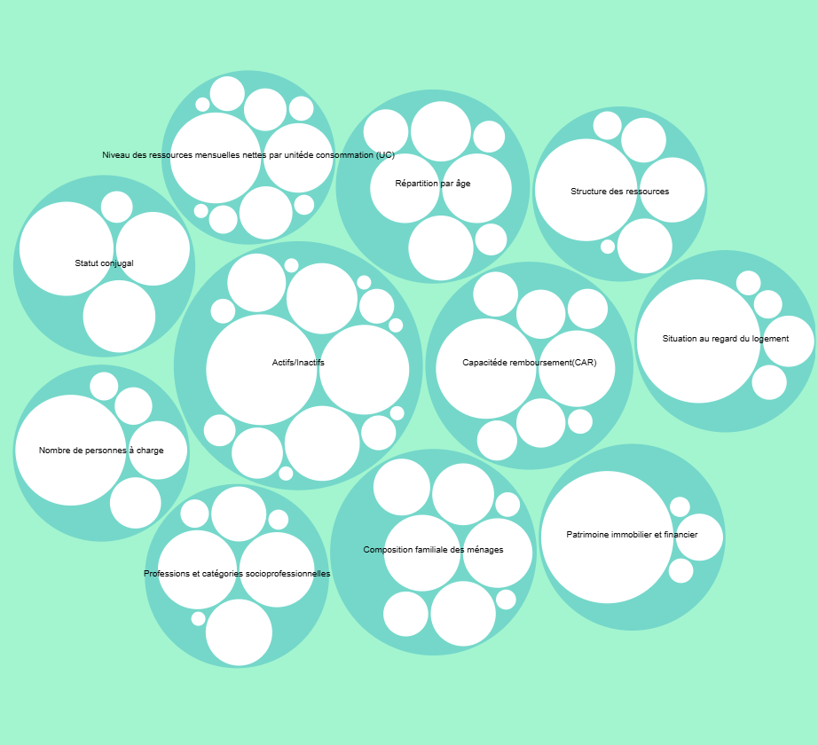
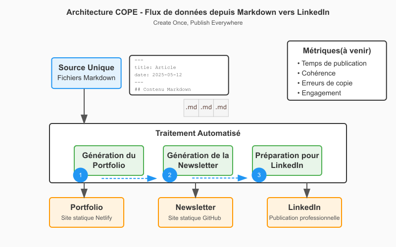
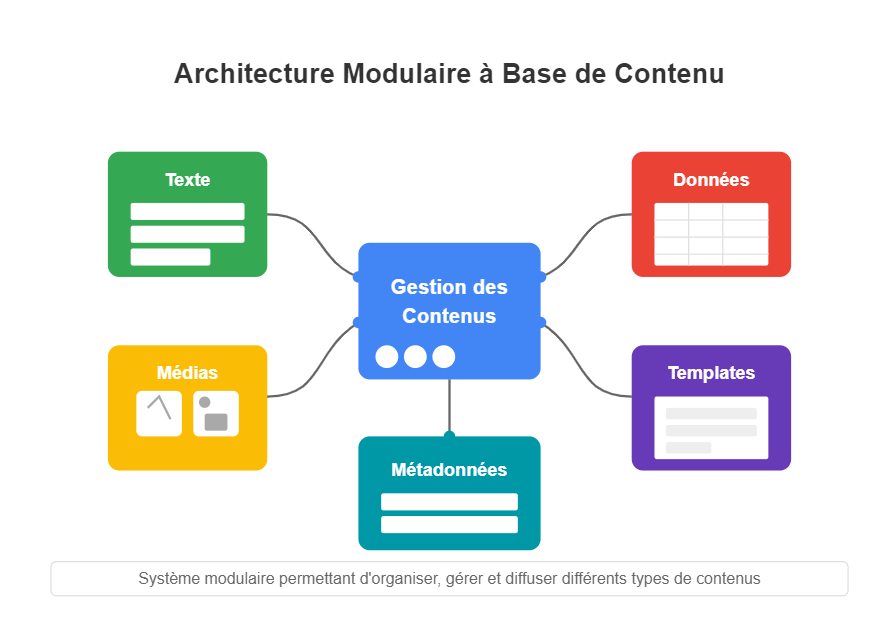

# 📰 Newsletter Portfolio - 30/05/2025

## Récits visuels, horizons numériques : Un voyage entre créativité et innovation 🚀

---

### 📌 La théorie des types, de Russell aux assistants à la démonstration


#### La théorie des types, de Russell aux assistants à la démonstration

[La théorie des types, de Russell aux assistants à la démonstration](#)

Les cours du Collège de France restent <strong>des lieux de partage des savoirs</strong>, ils sont <strong>un bien commun</strong> des plus nécessaires !

Cette leçon inaugurale du 13 mars dernier de Thierry COQUAND (professeur en informatique) est un état de l'art du raisonnement mathématique, selon la théorie des types de Russell (1925) et de ses apports fondamentaux à la discpline, à la fois dans :

- le formalisme mathématique
- le développement de la logique moderne
- et sur les langages de programmation typés commme les assistants à la démonstration.
...Je n'irai pas jusqu'à dire que j'ai tout compris : mon manque de culture mathématique s'est vite exprimé ! 😅

Par contre, je suis capable - comme tout à chacun - de prolonger ses perspectives (clairement axées vers la recherche fondamentale) qui en recherche appliquée donnent actuellement <strong>des techniques de vérification, entre assistants de preuves et modèles IA, des plus prometteuses et convergentes</strong> : on citera pour le plus médiatisé AlphaProof (de Google Deep Mind), mais des outils comme LeanDojo, ReProver ou encore Lean Copilot démontrent tout l'engouement de ces synergies.

En termes d'applications pratiques, on comprend de suite ce que cela implique de :

- Garantir qu'un modèle résiste aux attaques
- Sur des systèmes critiques comme les voitures autonomes ou le diagnostic médical
- Ou encore en certification avec des preuves formelles de sécurité
...On parle même de <em>mathématique augmentée</em> pour cette nouvelle forme de collaboration entre humain et IA en recherche !

Oui, nous participons à <em>"la nécessaire culturalisation des sciences cognitives"</em> (Rastier, 1991) car s'intéresser à des sujets qui sont entrain de transformer en profondeur nos modes de vie et pas seulement, notre rapport à la mémoire notamment, font que même si l'on n'est pas "expert", cela nous semble important et sérieux : c'est l'invitation de cette présentation de Thierry Coquand au Collège de France.

[Retour en haut](#)


---

### 📌 Transformation des Données en Récits



#### Transformation des Données en Récits

[Transformation des Données en Récits](#)


#### 1. Idée de départ

<em>L'écriture est un outil de transformation des données complexes en récits accessibles.</em>

Oui, mais <em>une image vaut mieux que des mots</em> dit l'adage, c'est le principe de <strong>la visualisation des données</strong>.

Autrement dit, quoi comprendre de <strong>la représentation d'une situation</strong> ?


#### 2. Un notebook comme support


#### Notebook ObservableHQ

Un notebook est une environnement de développement géré par le navigateur, selon la [programmation  lettrée](https://fr.wikipedia.org/wiki/Programmation_lettr%C3%A9e) : il s'agit de combiner langage naturel et langage de programmation, à partir d'un fichier source.

[programmation  lettrée](https://fr.wikipedia.org/wiki/Programmation_lettr%C3%A9e)

Mike Bostock du <em>New York Times</em> (créateur de D3.js) en a développé un sous langage Javascript, appelé ObservableHQ. Orienté Dataviz, il permet à son tour de travailler collaborativement sur des données et de créer des récits interactifs particulièrement percutants ; on entre dans le domaine du journalisme de données...

...Mais ces outils sont ouverts à tous, l'un des plus connus étant Jupyter, et ils se sont imposés comme d'incontournables outils pédagogiques pour quiconque veut apprendre la data-science ou même plus largement la progammation.


#### Open data-flow

Là encore, il s'agit de faire <strong>converger des technologies</strong> pour retrouver ce principe de <strong>l'open data-flow</strong> : <em>"des flux de données, de traitements et d’enseignements qu’un lecteur saisit pour créer à son tour de la connaissance."</em> ([citation article 14/12/2020 de Icem7](https://www.icem7.fr/open-data-flow/open-data-flows-sur-le-web-cest-fou-ce-quun-navigateur-moderne-sait-faire-1-2/))

[citation article 14/12/2020 de Icem7](https://www.icem7.fr/open-data-flow/open-data-flows-sur-le-web-cest-fou-ce-quun-navigateur-moderne-sait-faire-1-2/)


#### 3. Visualisation sur le surendettement en France

Nous avons alors traité certaines données du surendettement en France, d'après le rapport de la Banque de France en 2023 ; à chacun son glamour, et il s'agit bien de présenter un tableau de données complexes de manière visuelle.

Notre choix s'est porté sur l'utilisation d'un <em>"Fork of Zoomable circle packing"</em> (c'est à dire une copie d'un type de projet de visualisation de données depuis ObservableHQ, qui propose d'ailleurs une gallerie gratuite de visualisations).

L'intérêt ici est de pouvoir comprendre ses données en combinant tout un récit avec la visualisation, une manière moderne et élégante de parler, par exemple, d'un sujet de société totalement invisibilisé par les médias.


#### 4. Décryptage de cette visualisation de données

Nous n'avons pas poussé très loin l'analyse car le sujet du surdentellement en France est loin de se résumer à une visualisation... mais ces graphiques ont une puissance visuelle indéniables, combinés à l'interactivité qu'offre un langage comme Js : on saisit en un seul coup d'oeil les facteurs et les échelles du phénomène observé.

Dans cette visualisation, nous avons voulu montrer les variables mesurées du surendettement et d'en saisir la répartition au sein de chacun des facteurs identifiés.

[](https://observablehq.com/embed/@wolsia/visualisation-surendettement-france?cells=chart)
<em>lien dans l'image</em>

[](https://observablehq.com/embed/@wolsia/visualisation-surendettement-france?cells=chart)

iframe?

Credit: [Zoomable: une visualisation sur le surendettement en France by wolSia](https://observablehq.com/@wolsia/visualisation-surendettement-france)

[Zoomable: une visualisation sur le surendettement en France by wolSia](https://observablehq.com/@wolsia/visualisation-surendettement-france)

<link href="https://cdn.jsdelivr.net/npm/@observablehq/inspector@5/dist/inspector.css" rel="stylesheet"/>


#### 5. Design de l'information

Pour conclure, dans cette <strong>communication stratégique</strong>, il s'agira bien en ce qui nous concerne en une :

- Adaptation à différents publics ou secteurs
- Vulgarisation scientifique
- Transmission claire et impactante
On constate aussi que ces applications sont utiles dans différentes publications (numériques et papier) :

- Rapports analytiques
- Articles de recherche
- Présentations stratégiques
- Contenus de médiation scientifique
Enfin, l'impact de ces visualisations devrait répondre principalement à :

- Rendre l'information accessible
- Démocratiser la compréhension complexe
- Inspirer de la clarté
[Visualisation sur le surendettement en France par wolSia]("https://observablehq.com/@wolsia/visualisation-surendettement-france)

[Visualisation sur le surendettement en France par wolSia]("https://observablehq.com/@wolsia/visualisation-surendettement-france)

[Retour en haut](#)


---

### 📌 Sobriété numérique et désengagement systémique


#### Sobriété numérique et désengagement systémique

[Sobriété numérique et désengagement systémique ](#)


#### 1. L'invisibilité structurelle du problème numérique


#### Dissociation cognitive organisée

Contrairement à d'autres pollutions environnementales, le problème numérique est cognitivement invisible, ce qui explique en partie cette indifférence apparente.

| Type de pollution | Visibilité | Immédiateté | Lien cause-effet |
|-------------------|------------|-------------|------------------|
| <strong>Plastique</strong> | Visible, tactile | Immédiate | Direct |
| <strong>Automobile</strong> | Bruit, odeur, embouteillages | Immédiate | Direct |
| <strong>Numérique</strong> | Infrastructure cachée | Différée | Dilué |

On parle <strong>d'une dillution de responsabilité</strong>.


#### Le piège de la responsabilité diffuse

Entreprises tech :
<em>"Nous donnons aux utilisateurs ce qu'ils veulent"
"C'est aux politiques de réguler si nécessaire"
"Nous investissons dans l'efficacité énergétique"</em>

Décideurs politiques :
<em>"C'est aux entreprises d'innover"
"Les citoyens doivent changer leurs comportements"
"La régulation ne doit pas freiner l'innovation</em>"

Utilisateurs :
<em>"Mon impact individuel est négligeable"
"Je n'ai pas le choix, c'est imposé"
"Les vrais responsables sont ailleurs"</em>

➡️ Mais dans quel contexte s'inscrit ce problème?


#### 2. Économie de l'attention vs. sobriété numérique


#### Qu'est-ce que l'économie de l'attention ?

L'économie de l'attention est un modèle économique où l'attention humaine devient la ressource rare à capturer, mesurer et monétiser.

La finalité économique est simple :

- Capturer le maximum de temps d'attention
- Le revendre aux annonceurs publicitaires
- Plus d'attention = plus de revenus
Mécanismes de base :

- Attirer l'utilisateur sur la plateforme (contenu gratuit)
- Le garder le plus longtemps possible (interfaces addictives)
- Mesurer son attention (analytics, tracking)
- Vendre cette attention à des annonceurs
- Réinvestir les profits dans l'amélioration de la captation

#### Pourquoi cela s'oppose structurellement à la sobriété

<strong>La sobriété numérique nécessite :</strong>
- <strong>Conscience</strong> de sa consommation
- <strong>Délibération</strong> avant action
- <strong>Modération</strong> dans l'usage
- <strong>Qualité</strong> plutôt que quantité

<strong>L'économie de l'attention optimise pour :</strong>
- <strong>Inconscience</strong> (automatismes, habitudes)
- <strong>Impulsivité</strong> (clics immédiats)
- <strong>Maximisation</strong> du temps passé
- <strong>Quantité</strong> d'interactions

Autrement dit, il s'agit d'une <strong>contradiction fondamentale :</strong>

| Économie de l'attention | Sobriété numérique |
|------------------------|-------------------|
| <strong>Objectif</strong> : Maximiser le temps d'écran | <strong>Objectif</strong> : Optimiser la valeur/temps |
| <strong>Moyens</strong> : Captation automatique | <strong>Moyens</strong> : Choix conscients |
| <strong>Mesure</strong> : Engagement, rétention | <strong>Mesure</strong> : Utilité, impact |
| <strong>Design</strong> : Addiction, urgence | <strong>Design</strong> : Efficacité, sérénité |
| <strong>Modèle</strong> : Attention = produit vendu | <strong>Modèle</strong> : Attention = ressource à préserver |

<strong>Impossible coexistence :</strong>
- <strong>Revenus publicitaires</strong> proportionnels au temps capté
- <strong>Toute réduction</strong> d'usage = perte directe de chiffre d'affaires
- <strong>Optimisation financière</strong> vs. optimisation environnementale = objectifs opposés

<strong>Données comportementales :</strong>
- <strong>85%</strong> des interactions numériques sont automatiques/habituelles
- <strong>Temps de décision</strong> moyen : &lt; 2 secondes pour la plupart des clics
- <strong>Budget cognitif</strong> déjà saturé par les choix quotidiens


#### Echec des stratégies de sensibilisation ou des solutions alternatives

Et il faut bien admettre que les stratégies actuelles de sensibilisation sont plutôt des échecs :

- les "eco-gestes" culpabilisent sans donner de pouvoir d'action réel et déresponsabilisent les acteurs industriels et politiques
- l'injonction morale est inefficace par la résistance psychologique de l'obligation qu'elle crée (réactance), on oppose moralisation à plaisir immédiat dans des systèmes conçus pour l'excès (la chaire est faible... 😂 on comprend mieux comment certain.e.s partent en vrille ou en guerre)
- le registre technique est incompréhensible : les calculs d'empreinte carbone ou l'unité "X kg CO2eq", franchement, qui y comprend quelque chose???
<strong>les "eco-gestes"</strong> culpabilisent sans donner de pouvoir d'action réel et déresponsabilisent les acteurs industriels et politiques

<strong>l'injonction morale</strong> est inefficace par la résistance psychologique de l'obligation qu'elle crée (réactance), on oppose moralisation à plaisir immédiat dans des systèmes conçus pour l'excès <em>(la chaire est faible...</em> 😂 <em>on comprend mieux comment certain.e.s partent en vrille ou en guerre)</em>

<strong>le registre technique</strong> est incompréhensible : les calculs d'empreinte carbone ou l'unité "X kg CO2eq", franchement, qui y comprend quelque chose???

Les effets sont assez contre-productifs et détournent l'attention des enjeux systémiques de ces cercles vicieux technologiques car il n'y a pas non plus de récit mobilisateur contrairement à d'autres luttes environnementales (l'invisibilité du problème numérique).


#### Données → personnalisation → addiction

C'est une spirale d'optimisation comportementale et la résistance individuelle est de plus en plus difficile puisque nous confions de plus en plus de nos données à ces services.

<strong>L'écoconception</strong> reste une pratique marginale, et les applications "sobres" sont moins attractives que les "mainstream" : <em>on "Big Love" le clinquant, même si on porte des chemises de bucheron ou un bonnet.</em>

Et puis il y a une <strong>acceptabilité</strong> sociale de la surconsommation numérique <em>(moi la prem's!</em>)
<em>Même ceux dans la permaculture bio sont coupables, ils font les deux.</em>


#### Conclusion : L'impasse de la responsabilité individuelle

<strong>Le désengagement systémique</strong> face à la sobriété numérique n'est pas un défaut moral ou une ignorance, mais la <strong>réponse rationnelle</strong> à un système structurellement organisé contre la sobriété :

1. Invisibilité du problème par design
1. Capture attentionnelle industrialisée
1. Absence d'alternatives viables
1. Contraintes sociales et professionnelles
1. Modèles économiques dépendants de la surconsommation

#### Implications

<strong>Impossible</strong> de résoudre par changements comportementaux individuels un problème systémique où :
- <strong>Infrastructure économique</strong> pousse à la surconsommation
- <strong>Interfaces</strong> sont optimisées contre la conscience
- <strong>Bénéfices</strong> sont privatisés et <strong>coûts</strong> externalisés


#### Nécessité de changement de paradigme

<strong>De</strong> : "Comment convaincre les individus d'être sobres ?"
<strong>Vers</strong> : "Comment organiser un système numérique structurellement sobre ?"

<strong>La sobriété numérique</strong> ne peut être un choix individuel conscient dans un système industriel organisé pour l'inconscience collective. Elle nécessite une <strong>transformation systémique</strong> des modèles économiques, des interfaces et de la gouvernance du numérique.

<strong>Sources principales :</strong>
- Festinger, L. "A Theory of Cognitive Dissonance" (1957)
- The Shift Project. "Pour une sobriété numérique" (2018)
- Données empiriques : Médiamétrie, ARCEP, IEA (2023-2024)

[Retour en haut](#)

---

### 📌 La restriction des contenus sur LinkedIn ?


#### La restriction des contenus sur LinkedIn ?

[La restriction des contenus sur LinkedIn ?](#)

*Mise à jour : Article publié sur LinkedIn le 03 avril dernier, à ce moment, nous ne pouvions pas publier sur LinkedIn automatiquement le contenu de notre Newsletter et je m'en expliquais en présentant notre première version du workflow automatisé appliquant le principe COPE.*

Tout cela nous a servi pour mieux connaître **l'API Management** (discipline générale de gestion des APIs) en nous intéressant à cette **automatisation de publication**.

Ce ne sont pas des analytics marketing poussées mais cela permet **un suivi opérationnel** de nos publications professionnelles ; et nous maintenons que les gains (à notre échelle) sont probants en terme de rationnalisation de la démarche, d'audience et de structuration du contenu.

C'est **moins de stress car mieux planifié et, sur la charge mentale, on réduit sa saturation informationnelle quotidienne.**

Il est vrai que nous nous plaçons toujours plus facilement dans une approche constructiviste avec ce focus *"solutions"* plus que sur la critique d'un système.

A cette échelle, c'est "jouable" mais cela ne peut pas résoudre le problème de l'infobésité ou de la surcharge informationnelle.

Il manque encore cet échelon intermédiaire dans le numérique de pouvoir créer ce qui nous sert, afin de mieux nous responsabiliser aussi dans nos usages numériques : cela rejoint finalement les problématiques de **la sobriété numérique** ou encore de **l'écoconception**, sur lesquels nous sommes encore tous dans l'impasse.


#### NEWSLETTER d'Alexia Fontaine
3 avril 2025


*une image générée par ChatGPT pour évoquer la fleur au fusil*

Je me suis récemment lancée dans cette idée de maintenir ma présence sur les réseaux sociaux en générant une newsletter hébergée sur GitHub avec comme "source" de contenus mon portfolio : l'objectif d'une *réutilisation optimisée*, selon le principe COPE....

**Suite du post :** [Lire l'article complet sur LinkedIn](https://www.linkedin.com/pulse/la-restriction-des-contenus-sur-linkedin-awqje/?trackingId=tMGE%2Fu3tTwZcACMHfHJoXA%3D%3D)

[Retour en haut](#)

---

### 📌 Pourquoi un script d'automatisation de publication ?



#### Pourquoi un script d'automatisation de publication ?

[Pourquoi un script d'automatisation de publication ?](#)

#### 1. Automatiser la diffusion de son contenu

Les bénéfices sont concrets d'**automatiser la diffusion de son contenu** : on élimine des tâches répétitives de copier-coller vers les réseaux sociaux tout en gardant un suivi, on réduit son temps à la publication sociale en maintenant une présence constante sans (trop) effort quotidien, et on investit plus sur la valeur de son contenu.

Voilà à quoi ressemble notre suivi automatisé des publications LinkedIn : rien de nouveau, un simple tableur pour avoir une vue d'ensemble de notre planification :


#### 2. ...Mais pas tout

Ne pas à avoir à remplir manuellement ce genre de tableau et pouvoir juste se concentrer sur le texte à publier, c'est plutôt agréable...[🤖 *l'idée de tout automatiser m'a évidemment traversé l'esprit*🤦‍♀️]

Mais la validation est un processus très important dans la qualité d'une chaîne de publication, d'autant plus sur un petit projet comme le nôtre qui utilise des scripts hébergés sur GITHUB.

#### 3. Changement de posture

Ce que nous trouvons intéressant dans ce type de démarche est de ne plus être seulement utilisateur de la plateforme, mais aussi **d'être à l'inititative d'un outil pour utiliser ce réseau social.**

Notre application ne prétend pas réinventer ce que d'autres commercialisent déjà depuis longtemps mais nous tentons de développer ce qu'il nous fallait : **une convergence entre plusieurs outils de communication.**


#### 4. Chaîne de publication de contenus hybride

Nous pensons que notre chaîne de publication illustre ces nouvelles formes de convergence entre CMS, KM et PAO et surtout, répond à notre objectif : **automatiser la diffusion de nos publications sociales avec la possibilité de réutiliser nos contenus sous différents formats.**

**Aspects CMS**
- Gestion de contenu web : Publication automatisée vers LinkedIn et sites web
- Workflow de publication : Pipeline automatisé "Create Once, Publish Everywhere"
- (Multi-canal : Possibilité de diffusion simultanée sur plusieurs plateformes digitales)

**Aspects KM**
- Source unique de vérité : Les fichiers Markdown centralisent la connaissance
- Structuration des savoirs : Organisation cohérente du contenu avec métadonnées
- Réutilisabilité : Un même contenu expert génère plusieurs formats
- Traçabilité : Versioning et suivi des modifications

**Aspects PAO**
- Adaptation multi-format : Transformation automatique en différents layouts (portfolio, newsletter, LinkedIn)
- Mise en forme contextuelle : Chaque sortie respecte les codes visuels de sa plateforme
- (Production éditoriale : Possibilité de générer des supports de communication professionnels)

**L'intérêt de cette approche**

Cette architecture dépasse selon nous les silos traditionnels :
- Efficacité : Élimination de la ressaisie et des erreurs de copie
- Cohérence : Message uniforme mais adapté à chaque canal
- Automatisation : Réduction drastique du travail manuel
- Évolutivité : Ajout facile de nouveaux canaux de diffusion

Notre projet est un simple exemple de **convergence technologique** où les frontières entre gestion documentaire, publication web et production éditoriale s'estompent au profit d'une approche intégrée et automatisée.

[Retour en haut](#)

---
### 📌 Architecture Modulaire à Base de Contenu



#### Architecture Modulaire à Base de Contenu

[Architecture Modulaire à Base de Contenu](#)

L'**Architecture Modulaire à Base de Contenu** (ou "Content-Driven Modular Architecture") représente une approche flexible pour concevoir des sites web et des applications. Cette méthodologie place le contenu au centre du processus de développement, en le séparant strictement de la présentation.

#### A. Principes fondamentaux

Cette architecture repose sur plusieurs principes clés qui la rendent particulièrement efficace pour les sites riches en contenu comme les portfolios et les blogs :

#### B. Séparation du contenu et de la présentation

Le contenu est stocké dans des fichiers indépendants (souvent au format Markdown) avec des métadonnées standardisées (frontmatter), complètement séparés du code HTML, CSS et JavaScript qui définit leur présentation. Cette séparation permet à chaque aspect d'évoluer indépendamment.

#### C. Composabilité

Les sections et composants peuvent être facilement réutilisés, réorganisés ou recombinés pour créer de nouvelles pages ou expériences. Cette flexibilité permet d'assembler rapidement différentes vues à partir des mêmes éléments de base.

#### D. Maintenabilité

Modifier un contenu n'exige pas de toucher au code HTML principal. Les rédacteurs de contenu peuvent se concentrer uniquement sur les fichiers Markdown pertinents, sans risquer d'altérer la structure ou le fonctionnement du site.

#### E. Évolutivité

Ajouter une nouvelle section est aussi simple que de créer un nouveau fichier Markdown. Cette approche réduit considérablement la friction pour enrichir le site avec de nouveaux contenus.

**Implémentation pratique**

Pour les composants simples, le Markdown pur suffit généralement. Cependant, pour les composants plus complexes comme les grilles de compétences, les cartes de services, ou les processus multi-étapes, l'HTML embarqué dans Markdown offre le meilleur compromis :

```markdown
---
title: "Mes compétences"
subtitle: "Expertise technique"
---

**Vue d'ensemble de mes compétences**

<div class="skill-category">
    <h3><i class="fas fa-code"></i> Développement</h3>
    <div class="skill-item">
        <div class="skill-name">
            <span>JavaScript</span>
            <span>90%</span>
        </div>
        <div class="skill-bar">
            <div class="skill-progress" style="width: 90%"></div>
        </div>
    </div>
</div>
```

Cette approche hybride permet de préserver le rendu visuel exact des composants complexes tout en profitant pleinement de la modularité du système.

**Avantages à long terme**

Au-delà des bénéfices immédiats, cette architecture offre des avantages substantiels sur le long terme :
    - **Transitions technologiques facilitées** - Le contenu peut être conservé même si le framework ou la technologie de présentation change
    - **Versionning efficace** - Les modifications de contenu sont visibles dans les commits Git
    - **Possibilités de migration accrues** - Le contenu peut être facilement exporté vers d'autres systèmes
    - **Optimisation du workflow** - Les designers et développeurs peuvent travailler sur l'interface pendant que les rédacteurs créent le contenu

Cette architecture représente une évolution naturelle des systèmes de gestion de contenu, offrant davantage de flexibilité tout en conservant une structure claire et organisée.

[voir aussi la NEWSLETTER du 11/04/2025 : Architecture Modulaire pour Portfolio Digital](https://siasia-dev.github.io/portfolio-newsletter/newsletter_20250411.html)


---

## 💡 Philosophie de l'Innovation

> "L'innovation naît à l'intersection des disciplines, là où la créativité rencontre la technologie."

## 📱 Restons connectés !

**Envie d'explorer de nouveaux horizons numériques ?**

— [Portfolio Complet](https://portfolio-af-v2.netlify.app/)  
— [Me Contacter sur LinkedIn](https://www.linkedin.com/in/alexiafontaine)

#Innovation #TechCreative #DataScience #DigitalTransformation #CreativeTech

© 2025 Alexia Fontaine - Tous droits réservés