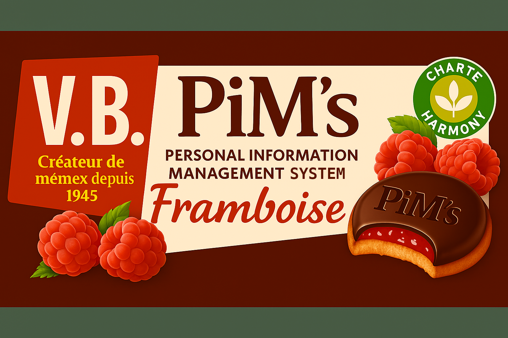
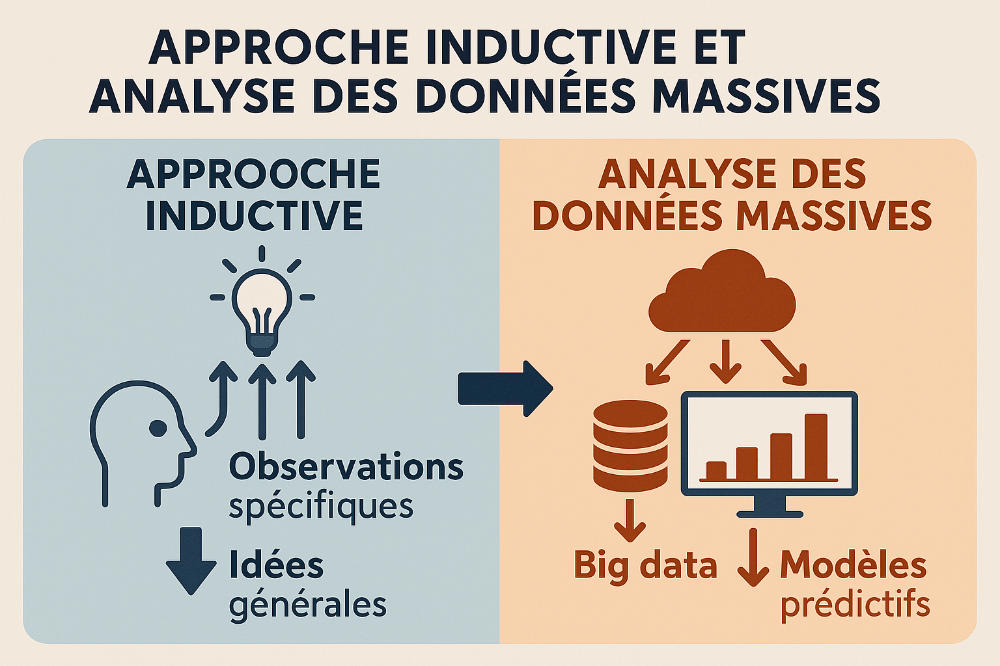
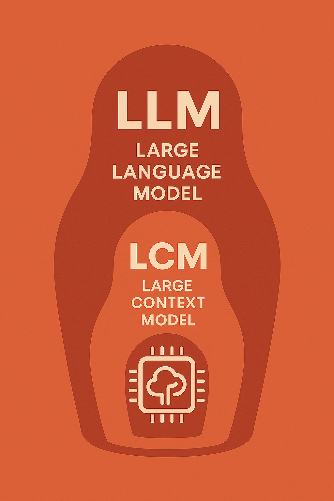
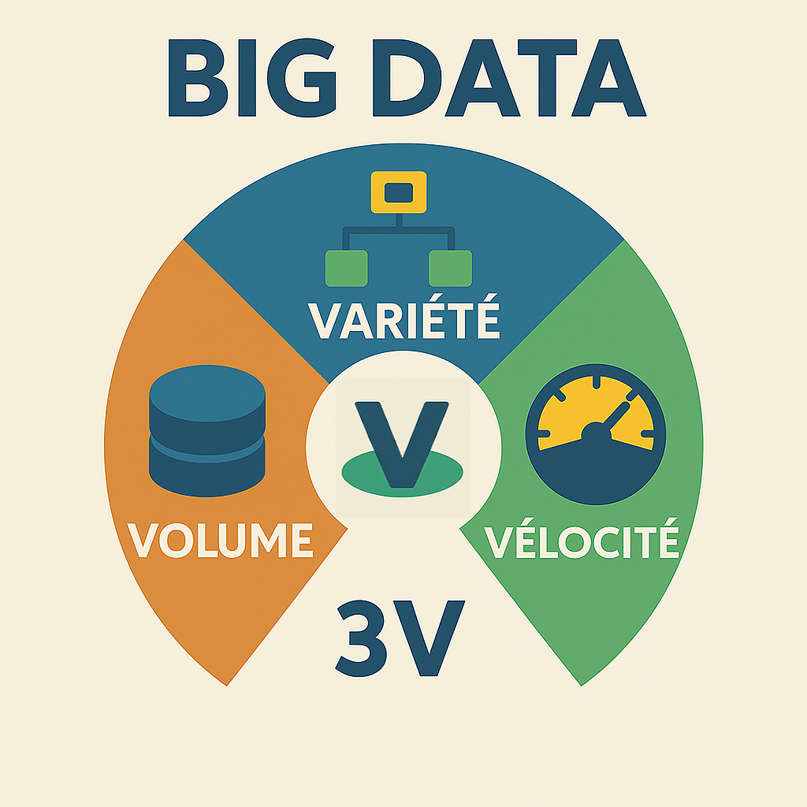
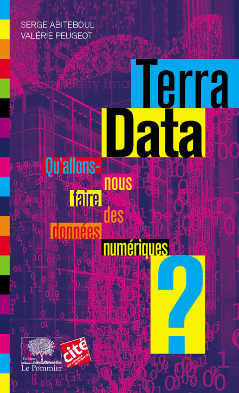

# 📰 Newsletter Portfolio - 06/06/2025

## Récits visuels, horizons numériques : Un voyage entre créativité et innovation 🚀

---

### 📌 Modèles de gestion de données numériques

#### Modèles de gestion de données numériques

[Modèles de gestion de données numériques](#)

A l'insu de notre plein gré <strong>le sujet des données personnelles</strong> est récurrent, important et pourtant, difficile à comprendre : à la fois par le monopole des plateformes privées qui finit par invisibiliser le sujet, et par cette responsabilité qui nous incombe de plus en plus.

Les <strong>Systèmes de Gestion d'Informations Personnelles</strong> (SGPIP) sont régulièrement cités comme des alternatives à ce problème pour disposer de nos donnnées non plus sous un format propriétaire, mais par <strong>loyauté et portabilité.</strong> (1)

💡Le texte de Vannevar Bush, ingénieur américain, est particulièrement éclairant sur cette notion:

"<em>Consider a future device for individual use, which is a sort of mechanized private file and library. It needs a name, and, to coin one at random, “memex” will do. A memex is a device in which an individual stores all his books, records, and communications, and which is mechanized so that it may be consulted with exceeding speed and flexibility. It is an enlarged intimate supplement to his memory.</em>" (2)

[Imaginez un futur appareil à usage individuel, une sorte de bibliothèque et de fichier privé mécanisé. Il lui faut un nom, et, pour en citer un au hasard, « memex » fera l'affaire. Un memex est un appareil dans lequel un individu stocke tous ses livres, documents et communications, et qui est mécanisé pour pouvoir être consulté avec une rapidité et une flexibilité exceptionnelles. C'est un complément intime et élargi à sa mémoire.]

...Il anticipe déjà l'idée du stockage en ligne que nous connaissons actuellement, mais il le conçoit pour un usage personnel !

L'enjeu est donc la possibilité de pouvoir <strong>disposer de nos données personnelles quelque soit la plateforme utilisée</strong> : un lieu de stockage central de nos données qui nous serait propre et dont la diffusion, le partage, le retrait, etc. nous serait aussi propre. De cette manière, nous choississons et décidons, de manière transparente, de nos données personnelles.(1)

#### 🧠 Une extension de notre mémoire

Pour Vannevar Bush, le problème à résoudre était surtout celui de savoir <strong>comment créer des index associatifs qui reflèteraient la façon dont notre cerveau connecte les idées</strong> : les prémices du World Wide Web par sa logique d'hypertexte...

<em>"The difficulty seems to be, not so much that we publish unduly in view of the extent and variety of present day interests, but rather that publication has been extended far beyond our present ability to make real use of the record. The summation of human experience is being expanded at a prodigious rate, and the means we use for threading through the consequent maze to the momentarily important item is the same as was used in the days of square-rigged ships."</em>

[La difficulté ne semble pas tant provenir d'une surproduction compte tenu de l'ampleur et de la diversité des intérêts actuels, mais plutôt du fait que la publication a dépassé de loin notre capacité actuelle à exploiter pleinement les archives. La somme de l'expérience humaine s'accroît à une vitesse prodigieuse, et les moyens que nous utilisons pour nous frayer un chemin à travers le labyrinthe qui en résulte jusqu'à l'élément momentanément important sont les mêmes qu'à l'époque des navires à gréement carré.]

...Et dire que le texte date de 1945! 😅

Mais en y réfléchissant un peu, vous constaterez que <strong>ces supports de mémoire sont propre à notre cognition.</strong>

Le grand changement est bien <strong>l'accessibilité à nos données dans un système donné</strong> ; et le texte de [Vannevar Bush - As we may Think -](https://cdn.theatlantic.com/media/archives/1945/07/176-1/132407932.pdf) n'a pas perdu en pertinence de ce point de vue.

[Vannevar Bush - As we may Think -](https://cdn.theatlantic.com/media/archives/1945/07/176-1/132407932.pdf)

Prenez comparativement, par exemple, la grotte Chauvet (-45 000 ans av. JC) dont la mémoire se perpétue sur plus de 20 000 ans, puisque pendant cette longue période des hommes y reviennent régulièrement pour y inscrire des signes similaires.

....Et voyez comment lire aujourd'hui une disquette ou un programme informatique peut juste devenir impossible à ouvrir ou incompréhensible !

Nos supports de mémoire ont certes gagné en rapiditié, en flexibilité, en taille mais au prix d'une dépendance et d'une fragilité accrue.

C'est le défi des SGIP.

#### Références

- (1) "Terra data, qu'allons-nous faire des données numériques ?" in chapitre 13: La reconquête des données personnelle de Serge Abiteboul et Valérie Peugeot - Collection Le collège de la cité (2017, 338 pages, éditions Le Pommier)
- (2) "As we may Think" de Vannear Bush (publié au journal "The Atlantic Monthly", juillet 1945.
(1) ["Terra data, qu'allons-nous faire des données numériques ?" in chapitre 13: La reconquête des données personnelle de Serge Abiteboul et Valérie Peugeot - Collection Le collège de la cité (2017, 338 pages, éditions Le Pommier)](https://archive.org/embed/isbn_9782746512412)

["Terra data, qu'allons-nous faire des données numériques ?" in chapitre 13: La reconquête des données personnelle de Serge Abiteboul et Valérie Peugeot - Collection Le collège de la cité (2017, 338 pages, éditions Le Pommier)](https://archive.org/embed/isbn_9782746512412)

(2) ["As we may Think" de Vannear Bush (publié au journal "The Atlantic Monthly", juillet 1945.](https://cdn.theatlantic.com/media/archives/1945/07/176-1/132407932.pdf)

["As we may Think" de Vannear Bush (publié au journal "The Atlantic Monthly", juillet 1945.](https://cdn.theatlantic.com/media/archives/1945/07/176-1/132407932.pdf)

[Retour en haut](#)

---

### 📌 Induction vs Déduction : quand debugger devient philosophique

#### Induction vs Déduction : quand debugger devient philosophique

[Induction vs Déduction : quand debugger devient philosophique](#)

Cette semaine, en debuggant un script Python qui ne publiait pas mon post LinkedIn à l'heure (ironie du sort : il s'agissait de "Transformation des Données en Récits"😅), j'ai réalisé que j'utilisais <strong>une approche inductive pour résoudre le problème</strong>.

Mon processus de debug "inductif" a été le suivant:

✅ Observer les données réelles du CSV
✅ Identifier les patterns (posts en retard, formats de dates incohérents)
✅ Découvrir que "03/06/2025 09:38" ne parsait pas avec "%d/%m/%Y %H:%M"
✅ Généraliser : "Le parsing des dates françaises pose problème"

L'alternative déductive aurait été :

- Hypothèse : "Si un post est en retard, le token LinkedIn a expiré"
- Test de l'hypothèse
- Validation/réfutation
- Nouvelle hypothèse si échec

#### 🔍 Pourquoi l'induction était-elle plus efficace ici ?

Mon observation se base sur des données en production (publications réelles sur LinkedIn) et le debugging nécessite l'observation avant la théorisation.

...J'me suis alignée sur la logique actuelle de l'analyse des données! 😅 Assistée aussi par un système IA (tâche mineure), cela m'a laissé à penser sur <strong>l'interprétabilité du modèle utilisé</strong>.

<code>Accumuler données → Observer les données→ Dégager les "patterns" → Elaborer hypothèse</code>

...Cela ne vous rappelle pas Big Data 😉? Les prédictions issues de l'analyse de données massives suivent justement cette <strong>démarche inductive</strong> ([ref. Terra Data : 112](https://archive.org/details/isbn_9782746512412))

[ref. Terra Data : 112](https://archive.org/details/isbn_9782746512412)

#### 🧠 Vers l'interprétabilité des modèles

Cela ouvre notre problème de debug à de vrais questions epistémologiques : <strong>comprendre pourquoi le modèle donne cette réponse particulière et anticiper comment le modèle va se comporter dans différentes situations</strong>, plutôt que de le traiter comme une "boîte noire" mystérieuse.

Il s'agit de permettre un usage plus sûr et contrôlé, donc de choix méthodologiques.

Dans notre cas, la meilleure stratégie a été de partir des données réelles pour trouver une solution, ce qui a justifié cette démarche inductive au lieu de déductive. Mais l'une ne surpasse pas l'autre, elle doit surtout répondre à un contexte.

#### 🎯 Au-delà du code : des choix méthodologiques

Cette expérience de débug démontre que le développement ne se résume pas à une écriture ou une génération du code : <strong>le développement adopte des démarches d'analyse par sa façon de penser le problème et la façon de coder la solution.</strong>

Nos "problèmes techniques" révèlent souvent des choix méthodologiques sur notre façon de produire de la connaissance.

#### Référence

- Terra data, qu'allons-nous faire des données numériques ? Serge Abiteboul et Valérie Peugeot - Collection Le collège de la cité (2017, 338 pages, éditions Le Pommier)
[Retour en haut](#)

---

### 📌 LLM & LCM

#### LLM & LCM

[LLM & LCM](#)

Pas une semaine sans l'annonce d'un nouveau modèle d'apprentissage automatique... le rythme est affolant, amplifié par les réseaux sociaux (rappelons que dans une économie de l'attention, cela est "normal"), générant souvent de la frustration, faute de pouvoir tout ingérer dans cet emballement permanent.

Il est préférable de garder en tête qu'il s'agit de "tendances", générées au final par des algorithmes, et qu'en aucun cas cette croissance rapide des modèles impliquerait une réalité immédiate ou une relation d'inférence : c'est un <strong>"effet de décalage" entre ces outils et leur communication.</strong>

#### 📈 Visualisation des évolutions LLM

Voici une visualisation interactive des différentes évolutions des LLM :

#### 🧠 Graphe interactif des évolutions LLM

Visualisation D3.js avec nœuds manipulables

[
        Ouvrir le graphe →
    ](https://graphe-llm.netlify.app/)

[📊 Voir le graphe interactif](hhttps://graphe-llm.netlify.app/)

[📊 Voir le graphe interactif](hhttps://graphe-llm.netlify.app/)

#### 📊 Analyse du graphe

Les <strong>LLM (Large Language Models)</strong> peuvent être classés en "familles" ; <strong>LCM (Large Context Models)</strong> appartient à celle <strong>des extensions de contexte</strong>.

<code>LLM = Architecture + Paramètres + Capacités linguistiques
LCM = LLM + Fenêtre de contexte étendue</code>

Cela veut dire que <strong>ce modèle LCM est l'une des innovations des LLM</strong> mais comme le démontre le graphe, ce type de modèle est loin d'être le seul.

Les LCM permettent <strong>une fenêtre de contexte plus étendue</strong>, tels les modèles génératifs comme Claude ou ChatGPT, ce sont des <strong>spécialisations des LLM</strong>.

<code>LLM de base
    ├── 📏 Extensions de contexte
    │   ├── LCM (Large Context Models) ← ICI
    │   └── RAG (Retrieval-Augmented)
    │
    ├── 🎯 Spécialisations métier
    ├── 🌍 Multimodalité  
    ├── ⚡ Optimisation performance
    └── 🤖 Agents et actions</code>

#### 🎯 Convergence des modèles

Ce qui nous semble surtout intéressant de relever à travers ce graphe, c'est <strong>la convergence de ces modèles</strong>, afin de toujours mieux répondre aux tâches demandées.

Notre propos n'est donc pas de minimiser ces innovations.

➡️ En ayant eu cette information, <strong>est-on en capacité d'anticiper leur utilisation?</strong>

Cela peut nourrir le sentiment d'anxiété général sur ces technologies, donc mieux vaut prendre cette information pour ce qu'elle est : <strong>apprendre leur existence plus rapidement, mais sans en déduire une relation d'inférence.</strong>

Développer des modèles d'apprentissage automatique spécialisés dans un domaine (ou au au sein des organisations) correspond finalement à ce que l'on attend de ces outils, <strong>une réponse à la transformation numérique</strong>.

[Retour en haut](#)

---

### 📌 Infographie : les 3V

#### Infographie : les 3V

[Infographie : les 3V](#)

<strong>L'anayse des données massives</strong> se définit souvent par ces 3 composants:

<code>- Volume = Grande quantité de données
- Vélocité = Vitesse élevée des données
- Variété = Variété des données</code>

[Retour en haut](#)

---

### 📊 Terra Data. Qu'allons-nous faire des données numériques?

#### Terra Data. Qu'allons-nous faire des données numériques?

[Terra Data. Qu'allons-nous faire des données numériques?](#)

Ce livre rédigé par Serge ABITEBOUL et Valérie PEUGEOT  présente <strong>les différents enjeux sociétaux des données numériques</strong> : à ce moment de bascule par l'IA et cette impression d'accélération, il nous paraît utile de se plonger dans un ouvrage comme celui-ci pour <strong>se redonner un cadre d'application et d'exigence sur ces données numériques.</strong>

Les implications scientifiques sont présentées de manière factuelle, étayées par des exemples de projets concrets : ces questionnements sont replacés dans <strong>le processus global des données massives</strong> ce qui rend le propos tangible.

Par moment, le choix de la clarté nous a semblé éclipser un peu certains aspects, peut-être considérés comme techniques. Mais on peut aborder cela comme autant de <strong>contextes d'intégration de la transformation numérique</strong>.

🚀 De la vulgarisation scientifique qui s'adresse à des personnes désireuses de <strong>connaître ces nouveaux horizons numériques</strong>. Nous en sommes !

#### Référence

- *"Terra data, qu'allons-nous faire des données numériques ?" de Serge Abiteboul et Valérie Peugeot - Collection Le collège de la cité (2017, 338 pages, éditions Le Pommier)
[*"Terra data, qu'allons-nous faire des données numériques ?" de Serge Abiteboul et Valérie Peugeot - Collection Le collège de la cité (2017, 338 pages, éditions Le Pommier)](https://archive.org/embed/isbn_9782746512412)

[Retour en haut](#)

---

### 📌 GUI pour publication Linkedin

#### GUI pour publication Linkedin

[GUI pour publication Linkedin](#)

<strong>GUI = Graphical User Interface</strong> (Interface Utilisateur Graphique)

Très pragmatiquement, cette interface visuelle me permet d'éviter de taper les commandes en mode texte ! 😅

Il s'agit d'une pratique très courante dans le développement : nous associons les démarches <strong>UI (User Interface)</strong> et <strong>UX (User eXperience)</strong> dans ce processus d'automatisation.

💡Après l'extraction des contenus de la Newsletter, je reprends mes posts (après avoir testé le résumé automatique, je préfère rédiger pour valider, mais cela mériterait d'être approfondi) : il est clairement plus confortable de retravailler son texte depuis une interface ergonomique qu'un tableur Excel!

#### 🎯 Fonctions principales

- Ajouter/Modifier des publications à l'avance
- Programmer la date et l'heure de publication
- Voir combien de posts sont publiés/en attente/échoués
- Statistiques de réussite
- Calendrier visuel de vos publications
- Publie automatiquement vos posts à l'heure programmée
- Logs détaillés des succès/échecs
- Vue calendrier des posts
- Modifier/supprimer des publications
- Import/export des données

#### 💡 Cas d'usage concret

🤖 Je dois me connecter manuellement sur LinkedIn chaque jour pour publier.

🚀 Je prépare mes posts (issus de la Newsletter hebdomadaire) et l'application pourra les publier automatiquement selon un planning.

Au final, c'est <strong>un assistant personnel pour LinkedIn !</strong> 😉

[Retour en haut](#)

---

## 💡 Philosophie de l'Innovation

> "L'innovation naît à l'intersection des disciplines, là où la créativité rencontre la technologie."

## 📱 Restons connectés !

**Envie d'explorer de nouveaux horizons numériques ?**

— [Portfolio Complet](https://portfolio-af-v2.netlify.app/)  
— [Me Contacter sur LinkedIn](https://www.linkedin.com/in/alexiafontaine)

#Innovation #TechCreative #DataScience #DigitalTransformation #CreativeTech

© 2025 Alexia Fontaine - Tous droits réservés