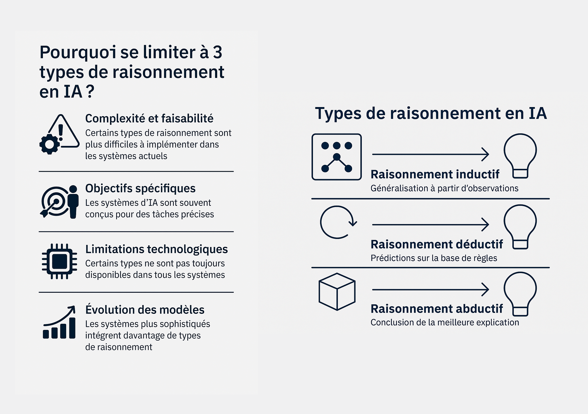
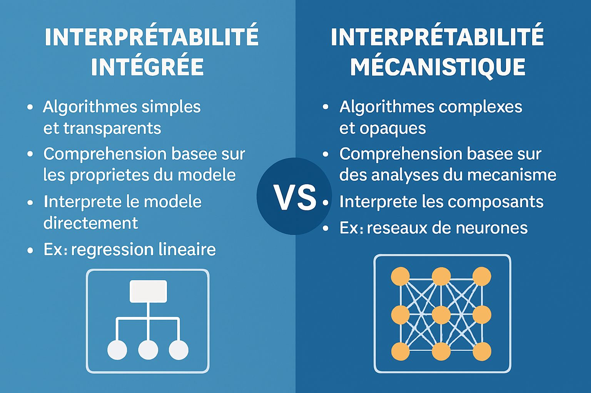
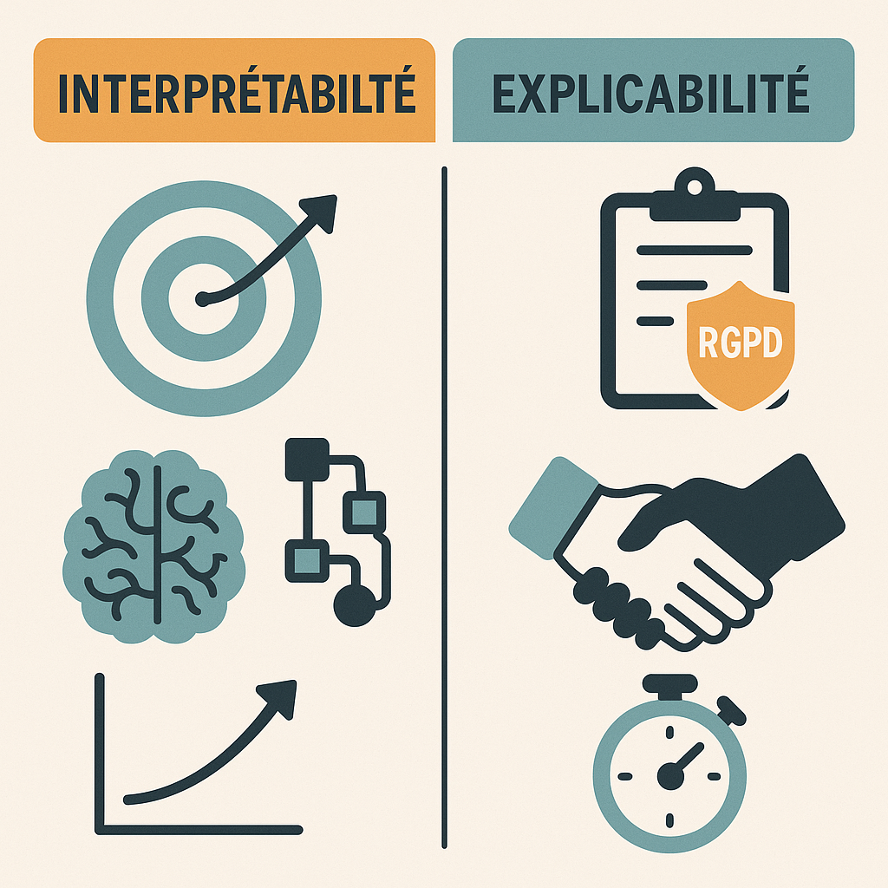

# 📰 Newsletter Portfolio - 13/06/2025

## Récits visuels, horizons numériques : Un voyage entre créativité et innovation 🚀

---

### 📌 La place de LinkedIn en France

#### La place de LinkedIn en France

[La place de LinkedIn en France](#)

#### 📱2ème réseau social en France mais...

LinkedIn décompte moins de membres que Facebook (72,3% des français ont un compte), LinkedIn avec ses 29 millions de membres représente une audience plus restreinte mais qualifiée (professionnels actifs).

C'est pourquoi on ne le retrouve pas dans les classements d'usage mensuel général, mais il reste incontournable dans sa niche professionnelle.

[Retour en haut](#)

---

### 📌 Le binge-watching comme nouvelle forme de 'couch potato'

#### Le binge-watching comme nouvelle forme de 'couch potato'

[Le binge-watching comme nouvelle forme de 'couch potato'](#)

#### 👾Couch potato : objet d'étude comportementale du 'binge-watching'

Dans la culture numérique contemporaine, le terme de 'couch-potato' s'est transformé en une figure de <strong>l'acceptation d'un comportement culturel médiatique typique</strong>, le <strong>"binge-watching"</strong> (le fait de regarder plusieurs épisodes d'une série télévisée d'affilée, souvent pendant des heures)

Le terme vient du verbe anglais "to binge" qui signifie faire quelque chose de manière excessive et compulsive - on l'utilisait déjà pour parler de "binge eating" (frénésie alimentaire) ou "binge drinking" (beuverie) etc.

Le terme "couch potato" a été créé le 15 juillet 1976 par Tom Iacino de Pasadena, en Californie, par jeu de mots entre "boob tuber" (amateur de télé) et "tuber" (tubercule/pomme de terre) [WordfooleryStack Exchange]. Il a été commercialisé pour la première fois le 20 avril 1977 et breveté par Robert Armstrong en 1984, What is the origin of the term "Couch Potato"? [English Language &amp; Usage Stack Exchang]

Il s'agit d'un terme plutôt méprisant, représentant une personne avachie sur un canapé, entourée de snacks, avec une posture ultra détendue. Il symbolise la flemme ou simplement le plaisir de ne rien faire.

En France, il devient <strong>un cheval de troie mainstream</strong> du "journalisme pensif", article de Frédéric JOIGNOT paru au Monde en 2017, où il faut admettre avec l'auteur que <strong>la critique du consumérisme a maintenant disparu de nos champs de pensée ou d'identification.</strong>

Même Jean BAUDRILLARD, pourtant chef de file d'une critique pointue de "l'hédonisme consumériste", est venu à son tour à manquer d'humanité. C'est un comble.

{: width="50%"}</img>

Puis en ce début des années 2000, le terme 'couch potato 'est tombé en désuétude comme le remarque Laurence SCOTT, publiée dans le journal le New-Yorker, qui nous voit transformer finalement en "Apple"(2)

{: width="50%"}</img>

En nous référant à l'évolution du terme 'couch potato' entre 2016 et 2025 sur le web, on peut analyser son usage et ses transformations.

La transformation du terme est notable: d'abord marginalisé voire méprisé, puis amplifié par la pandémie, enfin normalisé comme partie intégrante de <strong>la culture numérique contemporaine</strong>, <strong>le 'couch potato' est réintégré dans un paysage médiatique dominé par le 'streaming' et le 'binge-watching'</strong>.

Reflet des changements technologiques et culturels, ce terme devient malgré lui le témoin de cette <strong>recherche d'ascendance</strong> des plateformes numériques avec les <em>"anciens médiums"</em> démontrant ainsi leur domination et participant à ces <strong>nouvelles formes de mémoire</strong>.

(1){{Cite news| last = Frédéric| first = Joignot| title = JEAN BAUDRILLARD. EN SOUVENIR D’UN MÉCRÉANT RADICAL DISPARU IL Y A DIX ANS| access-date = 2025-06-07| date = 2007-03-06| url = https://www.lemonde.fr/blog/fredericjoignot/2017/03/06/jean-baudrillard-le-mecreant-radical/}}

(2){{Cite web| title = What Ever Happened to the Couch Potato? {{!}} The New Yorker| access-date = 2025-06-07| url = https://www.newyorker.com/tech/annals-of-technology/what-ever-happened-to-the-couch-potato}}

[Retour en haut](#)

---

### 📌 Stratégies de raisonnement en IA

#### Stratégies de raisonnement en IA

[Stratégies de raisonnement en IA](#)

La raison pour laquelle certains modèles ou applications se concentrent sur seulement 3 types de raisonnement est due à différents facteurs comme mentionnés dans l'infographie.

Les raisonnements inductifs, déductifs et abductifs sont les plus couramment utilisés pour analyser des données et faire des prédictions.

Les systèmes actuels intègrent de plus en plus de formes de raisonnement complexes.

[Retour en haut](#)

---

### 📌 L'interprétabilité des LLM : le sacrifice de la compréhension au profit de la performance

#### L'interprétabilité des LLM : le sacrifice de la compréhension au profit de la performance

[L'interprétabilité des LLM : le sacrifice de la compréhension au profit de la performance](#)

Le défi de l'interprétabilité est de <strong>comprendre comment les systèmes d'IA arrivent à une réponse donnée</strong>. Puisqu'ils sont "entraînés" sur de gigantesques corpus de données plutôt que directement programmés par les humains, une grande partie du comportement des systèmes d'IA reste impénétrable même pour leurs créateurs.

D'où <strong>ce paradoxe d'amplification médiatique</strong> (1) : entre célébration et ignorance, nous y voyons avec humour la marque du chat de Schrödinger qui demeure dans un état incertain tant qu'on ne l'examine pas directement.

Cette démarche d'interprétabilité prend cette même place de <strong>l'observateur</strong> en examinant ces systèmes d'apprentissage automatique (ici des LLM).

#### L'interprétatibilité des LLM, deux approches aujourd'hui

#### 🗝️ INTERPRÉTABILITÉ des modèles LLM : enjeux

Il faut comprendre cette démarche comme <strong>un investissement pour l'évolution du domaine</strong> car la responsabilité des décisions algorithmiques consitue un défi scientifique (et démocratique) majeur entre notre besoin d'explication et leur efficacité.

Sans cette confiance, c'est à dire la compréhension scientifique et le cadre d'application, nous ne voyons pas vraiment qui voudrait prendre de tels risques, sauf pour du battage médiatique - appelé judicieusement "AI Hype" par certaine organisation (2)

La tendance majeure 2025 est encore cette <strong>convergence des approches</strong>, qui tend à se compléter plutôt qu'à s'opposer, avec des modèles d'évaluation intégrant nativement plus de transparence et des outils mécanistiques de plus en plus accessibles.

L'objectif est d'avancer toujours plus vers une synergie entre compréhension technique et transparence utilisateur.

Le domaine est très actif au nombre de publications mais c'est un domaine encore jeune qui pose des problèmes de qualité/applicabilité.

<strong>Problème de qualité</strong>
Confondre hypothèses avec conclusions a été courant dans la recherche en interprétabilité mécanistique.

<strong>Biais de publication</strong>
Beaucoup de techniques d'interprétabilité sont principalement évaluées sur de petits modèles "prototypés" et petites tâches, risquant de manquer des phénomènes critiques qui n'émergent que dans des contextes plus réalistes.

Les critères d'explicabilité, de transparence et de fiabilité sont nécessaires, propriétés qu'il est aujourd'hui encore difficile d'établir pour les algorithmes à base d'apprentissage en général et pour les grands modèles en particulier.

#### L'Ironie de notre Révolution IA

Admettons en guise de conclusion que pendant des années la performance des algorithmes primait au détriment de la compréhension, que nous nous enthousiasmons pour des systèmes que nous ne comprenons pas, et que le battage médiatique autour de l'IA s'avère souvent ridicule nous détournant du travail important qui consiste à rendre la technologie fonctionnelle (le QUOI et POURQUOI), donc autant de défis pour passer de la prouesse technique à l'utilité pratique avec fiabilité et sécurité.

(1) La réalité derrière le battage médiatique de l'IA : une étude de l'IFS révèle un manque de préparation organisationnelle
post consulté le 10/06/25 : https://www.actuia.com/actualite/la-realite-derriere-le-battage-mediatique-de-lia-une-etude-de-lifs-revele-un-manque-de-preparation-organisationnelle/

(2) Management bought the AI hype, IFS post consulté le 10/06/25 : (https://www.ifs.com/news/corporate/ifs-ai-research)

[Retour en haut](#)

---

### 📌 Interprétabilité et Explicabilité des systèmes d'IA

#### Interprétabilité et Explicabilité des systèmes d'IA

[Interprétabilité et Explicabilité des systèmes d'IA](#)

| <strong>Aspect</strong>                 | <strong>Interprétabilité</strong>                                                    | <strong>Explicabilité</strong>                                                             |
| -------------------------- | ----------------------------------------------------------------------- | ----------------------------------------------------------------------------- |
| <strong>Objectif principal</strong>     | Comprendre les mécanismes internes d’un modèle                          | Rendre les décisions compréhensibles pour les utilisateurs ou les régulateurs |
| <strong>Orientation temporelle</strong> | Long terme (avancement de la recherche, amélioration des modèles)       | Court terme (prise de décision, conformité, confiance)                        |
| <strong>Symbole utilisé</strong>        | 🎯 (cible), 🧠 (cerveau), 📈 (croissance), 🔄 (structure algorithmique) | 📋 (règlement - RGPD), 🤝 (confiance), ⏱ (temps réel)                         |
| <strong>Usage typique</strong>          | Optimisation scientifique, détection de biais, innovation algorithmique | Communication, obligations légales, transparence pour les utilisateurs        |
| <strong>Acteurs concernés</strong>      | Chercheurs, développeurs IA                                             | Régulateurs, utilisateurs finaux, responsables métier                         |

[Retour en haut](#)

---

### 📌 LLM & LCM

#### LLM & LCM

[LLM & LCM](#)

Pas une semaine sans l'annonce d'un nouveau modèle d'apprentissage automatique... le rythme est affolant, amplifié par les réseaux sociaux (rappelons que dans une économie de l'attention, cela est "normal"), générant souvent de la frustration, faute de pouvoir tout ingérer dans cet emballement permanent.

Il est préférable de garder en tête qu'il s'agit de "tendances", générées au final par des algorithmes, et qu'en aucun cas cette croissance rapide des modèles impliquerait une réalité immédiate ou une relation d'inférence : c'est un <strong>"effet de décalage" entre ces outils et leur communication.</strong>

#### 📈 Visualisation des évolutions LLM

Voici une visualisation interactive des différentes évolutions des LLM :

#### 🧠 Graphe interactif des évolutions LLM

Visualisation D3.js avec nœuds manipulables

[
        Ouvrir le graphe →
    ](https://graphe-llm.netlify.app/)

[📊 Voir le graphe interactif](hhttps://graphe-llm.netlify.app/)

[📊 Voir le graphe interactif](hhttps://graphe-llm.netlify.app/)

#### 📊 Analyse du graphe

Les <strong>LLM (Large Language Models)</strong> peuvent être classés en "familles" ; <strong>LCM (Large Context Models)</strong> appartient à celle <strong>des extensions de contexte</strong>.

<code>LLM = Architecture + Paramètres + Capacités linguistiques
LCM = LLM + Fenêtre de contexte étendue</code>

Cela veut dire que <strong>ce modèle LCM est l'une des innovations des LLM</strong> mais comme le démontre le graphe, ce type de modèle est loin d'être le seul.

Les LCM permettent <strong>une fenêtre de contexte plus étendue</strong>, tels les modèles génératifs comme Claude ou ChatGPT, ce sont des <strong>spécialisations des LLM</strong>.

<code>LLM de base
    ├── 📏 Extensions de contexte
    │   ├── LCM (Large Context Models) ← ICI
    │   └── RAG (Retrieval-Augmented)
    │
    ├── 🎯 Spécialisations métier
    ├── 🌍 Multimodalité  
    ├── ⚡ Optimisation performance
    └── 🤖 Agents et actions</code>

#### 🎯 Convergence des modèles

Ce qui nous semble surtout intéressant de relever à travers ce graphe, c'est <strong>la convergence de ces modèles</strong>, afin de toujours mieux répondre aux tâches demandées.

Notre propos n'est donc pas de minimiser ces innovations.

➡️ En ayant eu cette information, <strong>est-on en capacité d'anticiper leur utilisation?</strong>

Cela peut nourrir le sentiment d'anxiété général sur ces technologies, donc mieux vaut prendre cette information pour ce qu'elle est : <strong>apprendre leur existence plus rapidement, mais sans en déduire une relation d'inférence.</strong>

Développer des modèles d'apprentissage automatique spécialisés dans un domaine (ou au au sein des organisations) correspond finalement à ce que l'on attend de ces outils, <strong>une réponse à la transformation numérique</strong>.

[Retour en haut](#)

---

## 💡 Philosophie de l'Innovation

> "L'innovation naît à l'intersection des disciplines, là où la créativité rencontre la technologie."

## 📱 Restons connectés !

**Envie d'explorer de nouveaux horizons numériques ?**

— [Portfolio Complet](https://portfolio-af-v2.netlify.app/)  
— [Me Contacter sur LinkedIn](https://www.linkedin.com/in/alexiafontaine)

#Innovation #TechCreative #Data #DigitalTransformation #CreativeTech

© 2025 Alexia Fontaine - Tous droits réservés