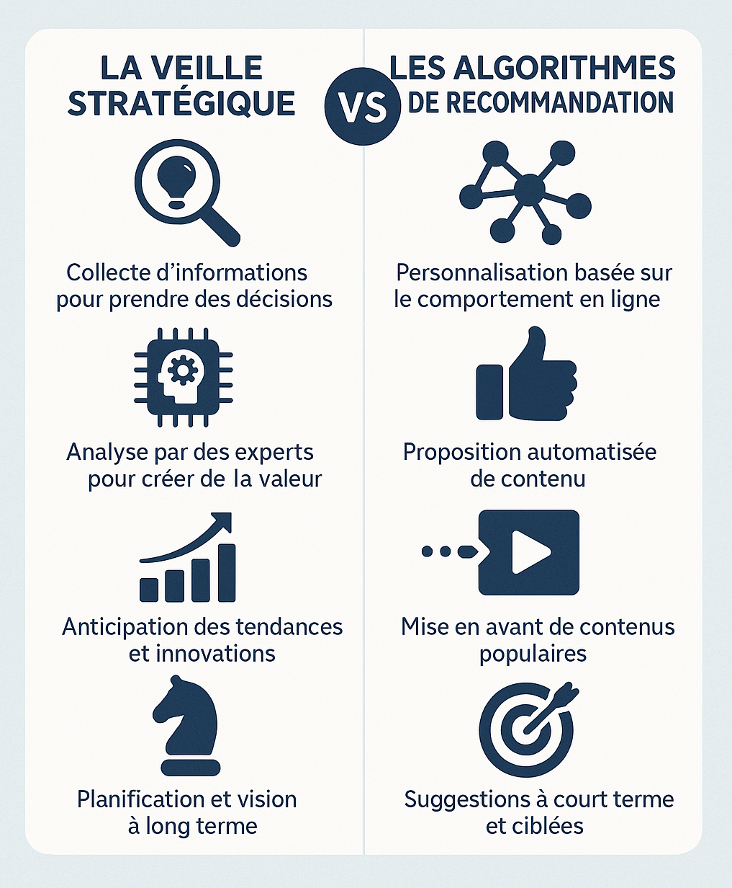

# 📰 Newsletter Portfolio - 22/06/2025

## Récits visuels, horizons numériques : Un voyage entre créativité et innovation 🚀

---

### 📌 Vivatech 2025 - Souverainté IA

#### Vivatech 2025 - Souverainté IA

[Vivatech 2025 - Souverainté IA ](#)

#### Vivatech 2025 à Paris

Pour rappel, le salon VivaTech est le plus grand salon européen dédié à l'innovation et aux start-ups.

A l'image du CES de Las Vegas pour l'Amérique du Nord, ce salon a pour ambition de se positionner comme un lieu de référence de l'innovation mondiale.

Cette 9ème édition a battu son reccord de fréquention avec quelques 180 000 visiteurs en 4 jours, preuve de l'intérêt du sujet.

#### Thématiques principales 2025

- Intelligence artificielle (thème dominant)
- Souveraineté numérique
- Cybersécurité et informatique quantique
- Tech for Good (innovation durable et responsable)
- Robotique et réalité étendue

#### Gouvernance des données : leardership européen sur l'IA

Cette année, le sujet de la gouvernance des données prend un tournant historique avec cette "souvertainté numérique" : les accords entre Mistral et Nvidia permettent aussi à l'UE d'assoir leur leadership sur l'IA et de revendiquer leur souveraineté numérique en accord avec les valeurs européennes.

Une très bonne nouvelle et des perspectives encourageantes sur l'intégration de cette technologie. Car <strong>s'intéresser aux infrastructures s'est s'intéresser aux datas centers</strong>.

La possibilité d'avoir son propre modèle IA par organisation est bien dans <strong>le mouvement de convergence des modèles</strong>.

#### Microservices conteneurisés

De quoi ravir tous les habitués de Docker et autre Kubernetes... NIMs (Nvidia Inference Microservices) <strong>ne veut pas être un nouvel outil d'orchestration mais plutôt un standard de data centers.</strong>

L'article de l'Usine Digitale résume d'ailleurs bien le projet car les besoins de puissance de calcul sont fondamentaux dans le domaine de l'intelligence artificielle, de quoi continuer à structurer l'écosystème.

#### Références

<strong>Articles en ligne :</strong>

L'Usine Digitale. (2025, juin 19). <em>Avec ses NIMs, Nvidia veut donner à chaque entreprise son propre modèle d’IA</em>. https://www.usine-digitale.fr/article/avec-ses-nims-nvidia-veut-donner-a-chaque-entreprise-son-propre-modele-d-ia.N2210398

The Economic Times. (2025, juin 19). <em>What is Nvidia CEO Jensen Huang’s push for ‘Sovereign AI’ that has struck a chord with European leaders</em>. https://economictimes.indiatimes.com/news/international/global-trends/what-is-nvidia-ceo-jensen-huangs-push-for-sovereign-ai-that-has-struck-a-chord-with-european-leaders/articleshow/121909680.cms

Reuters. (2025, juin 16). <em>Nvidia’s pitch for ‘Sovereign AI’ resonates with EU leaders</em>. https://www.reuters.com/business/media-telecom/nvidias-pitch-sovereign-ai-resonates-with-eu-leaders-2025-06-16/

<strong>Vidéo :</strong>

VivaTech. (2025, juin). <em>Nvidia CEO Jensen Huang Speaks at VivaTech 2025 in Paris</em> [Vidéo]. YouTube. https://www.youtube.com/watch?v=85wA4XJ6164

[Retour en haut](#)

---

### 📌 La surcharge informationnelle

#### La surcharge informationnelle

[La surcharge informationnelle](#)

Etudiée depuis les années 70, la <strong>surcharge informationnelle</strong> ou <strong>l'infobésité</strong> sont aujourd'hui des termes souvent confondus pour parler <strong>d'un état de saturation cognitive d'une personne</strong>.

Pourtant, on peut apporter une nuance entre ces deux termes, même s'ils décrivent une <strong>même réalité d'épuisement mental</strong>, ils ne sont pas considérés comme maladie au sens médical mais révélateurs d'un <strong>état de stress lié à nos comportements numériques</strong>.

<em>D'ailleurs le cas japonais des "hikikomori", qui sont des personnes qui s'extraient complètement de la vie extérieure pour une vie virtuelle, pourrait amener à plus de reconnaissance médicale de ces pathologies modernes.</em>

En effet, il n'y a pas de reconnaissance officielle dans aucun tableau de maladies professionnelles en France, ni dans les classifications médicales internationales (DSM-5, CIM-11) même si les conséquences pathologiques sont avérées : stress, anxiété informationnelle, surmenage, burn-out, syndrome de débordement cognitif, syndrome de saturation cognitive, cyberdépendance, désengagement, déficit d'attention, modification de la mémoire à long terme, altération du jugement.

Cette <strong>zone grise</strong> interpelle puisque les symptômes sont réels (fatigue cognitive, troubles attentionnels, stress chronique) mais le statut reste <strong>flou</strong>.

Les médecins traitent donc <strong>les conséquences cognitives de cet excès d'information</strong> (anxiété, troubles du sommeil, épuisement) plutôt que l'infobésité comme entité pathologique autonome.

Et globalement, ce phénomène est traité de la même manière.

#### ... mais alors c'est quoi ?

La nuance à poser entre ces deux concepts tient à leur temporalité : <strong>l'infobésité</strong> évoquera un enjeu de société, un problème à résoudre, une pathologie émergente, tandis que <strong>la surcharge informationnelle</strong> se percevra plus comme un incident technique. Les stratégies pour contrer cela dépendront donc aussi de l'angle choisi :

| Concept                  | Nature de l'état            | Caractéristiques principales                                                            | Analogie                                        |
|--------------------------|-----------------------------|------------------------------------------------------------------------------------------|-------------------------------------------------|
| <strong>Surcharge informationnelle</strong> | Situation ponctuelle       | - Temporaire et mesurable    - Neutre et réversible                                     | "J'ai trop d'infos à traiter"   Comme "j'ai faim" ou "je suis fatigué" |
| <strong>Infobésité</strong>              | Condition chronique         | - Pathologique et installée   - Problématique et persistante                            | "Je suis dans un rapport incontrôlé à l'information"   Comme "je suis obèse" ou "je suis dépressif" |

- État temporaire et mesurable
- Neutre et réversible
➡️ "Là, maintenant, j'ai trop d'infos à traiter"
↪️ Comme dire "j'ai faim" ou "je suis fatigué"
- État pathologique installé
- Problématique et persistante
➡️ "Je suis dans un rapport incontrôlé à l'information"
↪️ Comme dire "je suis obèse" ou "je suis dépressif"

#### Surcharge informationnelle = le phénomène technique

<strong>🧠⚡ Surcharge informationnelle → problème technique à résoudre</strong>

<strong>Plus neutre et descriptif :</strong> Le concept de surcharge informationnelle décrit une situation dans laquelle une personne ne dispose pas des ressources suffisantes (temps, capacité d'attention, d'analyse, de compréhension…) pour répondre aux multiples sollicitations.

<strong>Approche cognitive :</strong> Se concentre sur les limites du traitement de l'information par le cerveau. C'est le terme scientifique, utilisé en ergonomie, psychologie cognitive, neurosciences.

<strong>Vision mécanique :</strong> Votre processeur mental est surchargé, point.

#### Infobésité = la métaphore sociale

<strong>🍔📱 Infobésité → problème de société à dénoncer</strong>

<strong>Plus imagée et critique :</strong> L'analogie alimentaire avec le terme "infobesity" fut inventée par David Shenk en 1993 infobésité — Wiktionnaire, le dictionnaire libre. C'est un mot-valise qui dénonce.

<strong>Dimension pathologique :</strong> L'analogie avec l'obésité sous-entend une surconsommation malsaine, une addiction, un dysfonctionnement du "régime informationnel".

<strong>Charge morale :</strong> Suggère qu'on "s'empiffre" d'infos comme on s'empiffre de malbouffe.

#### Et que dit le droit ?

La charge mentale est un concept défini dans le <strong>droit du travail - article 4121-1</strong> et <strong>ISO 10075-2:1996 - Principes ergonomiques relatifs à la charge de travail mental</strong>, servant à définir de bonnes pratiques.

Plus récemment, on peut citer <strong>la norme ISO 10075-2:2024 - Principes ergonomiques relatifs à la charge de travail mental</strong>.

Dans le Code du Travail, la surcharge informationnelle se rapporte aux risques psychosociaux (RPS), d'où le rôle important de <strong>l'Observatoire de l’infobésité et de la Collaboration Numérique</strong>.

Depuis 2016, la <strong>Loi pour une République numérique</strong> a défini aussi un cadre à travers le "droit à la déconnexion" (Articles L2242-17 et L2242-8) avec l'obligation des entreprises de plus de 50 salariés à négocier des accords sur l'usage des outils numériques.

Cependant, <strong>cette loi reste assez limitée dans sa portée</strong>. Ce problème systémique ne se résout pas à une application juridique.

Faire porter au droit la responsabilité de nos comportements est une impasse qui entretient cette souffrance.

#### ...Et Après?

On peut s'interroger plutôt sur <strong>l'efficacité des stratégies</strong> proposées pour éviter ce phénomène psychosocial.

<strong>Les limites structurelles</strong> de ces stratégies individuelles sont réelles. Les plateformes numériques sont conçues pour capter l'attention avec des algorithmes sophistiqués qui exploitent nos biais cognitifs. Demander aux individus de "résister" seuls à ces mécanismes, c'est un peu comme leur conseiller de nager à contre-courant dans un fleuve en crue.

<strong>L'illusion du contrôle personnel</strong> est particulièrement frappante. Quand votre travail, vos relations sociales et l'accès à l'information passent par les mêmes canaux numériques, "limiter les notifications" ou "prendre des pauses" devient vite impraticable. C'est comme conseiller à quelqu'un de moins respirer dans un environnement pollué.

<strong>Le transfert de responsabilité</strong> est aussi problématique. Ces conseils placent la charge sur l'individu alors que le problème est systémique. Les entreprises technologiques investissent des milliards pour rendre leurs services irrésistibles, mais on attend des utilisateurs qu'ils développent une discipline monastique.

On est plus à un paradoxe près... et toutes ces stratégies soulagent ponctuellement sans résoudre le problème.

Mais pour une solution durable, on pourrait envisager <strong>des régulations plus strictes sur la conception des interfaces, la transparence des algorithmes, et peut-être repenser notre rapport collectif à l'information.</strong>

Voeu pieux... pas vraiment : les chiffres sur <strong>le coût de la surcharge</strong> sont saississants et les études "chocs" de ces dernières années ont démontré l'ampleur du problème (voir références ci-après) : on retient l'étude Basex qui estimait à <strong>près de 900 milliards de dollars</strong> ce coût (2008)

74 % des managers déclarent souffrir de surinformation et d'un sentiment d'urgence généralisé et 94 % pensent que la situation ne peut que se détériorer (rapport du Sénat, 2023).

#### En perspective : vertigineux et inquiétant

<strong>Ces montants dépassent le PIB de la plupart des pays...</strong> L'infobésité coûte plus cher que des secteurs entiers de l'économie.

Plus on investit dans la "digitalisation" pour gagner en efficacité, plus on aggrave le problème. <strong>On paie deux fois : l'investissement tech ET les coûts de l'infobésité qu'elle génère!</strong>

<strong>🎯L'enjeu des Intelligences Artificielles se place aussi là.</strong>

La plupart des entreprises se sont emparées du sujet et utilisent notamment différents outils pour quantifier le problème :

- Analytics des outils collaboratifs
- Métriques RH (burn-out, absentéisme)
- Outils de time-tracking pour mesurer les interruptions
Finalement, est-ce que ces solutions, si elles sont utilisées, sont efficaces ? Le <strong>Knowledge Management</strong> prend place en France ; souvent défini comme une simple tâche supplémentaire rattachée à un ou plusieurs postes de travail, quand une stratégie s'impose. Chacun est juge de sa situation.

Et justement ces situations manquent cruellement de <strong>lisibilité</strong>, même si la partie médicale rend tangible le problème, reconnaissons les tabous qui pèsent encore sur ce qui est <strong>compris comme juste un maillon faible alors qu'il s'agit d'un problème systémique où chacun est bien un maillon de cette chaîne.</strong>

📈 Les métriques clés :

- Dégradation de l'attention (Microsoft, 2015)
- Volume d'emails (Radicati Group)
- Impact des interruptions (DGT, 2012)
🔧 Les outils pratiques :

- Calculateur d'infobésité Basex (drôle d'idée : le calcul du ROI de la "diète informationnelle")
- Méthodologies de gouvernance de l'information
- Techniques de "diète informationnelle"

#### Bibliographie - Infobésité et surcharge informationnelle

Loin d'être exhaustive, nous constatons surtout que le sujet est largement traité et pourtant, les solutions pour contrer ces risques psychosociaux ont peu d'efficience.

#### Ouvrages spécialisés sur l'infobésité

<strong>Carr, N.</strong> (2008). "Is Google Making Us Stupid?", <em>The Atlantic</em>. Traduction française : <em>Internet rend-il bête ?</em>

<strong>Stolze, J.</strong> <em>L'infobésité pourrait être la prochaine épidémie</em>.

<strong>Papp, A.</strong> (2023) "L’infobésité, une épidémie à l’âge des nouvelles technologies de l’information et de la communication ?" Revue de la régulation. Capitalisme, institutions, pouvoirs, (n° 33).

#### Études et rapports récents

<strong>OICN - Observatoire de l'Infobésité et de la Collaboration Numérique</strong> (2023). <em>Référentiel annuel 2023 de la surcharge informationnelle en entreprise</em>.

<strong>Mooncard/IFOP</strong> (2023). <em>Baromètre de la charge mentale professionnelle</em>.

#### Sciences cognitives et neurosciences

<strong>Perrey, S.</strong> "Charge mentale : comment éviter une surchauffe du cerveau ?", <em>The Conversation</em>, Université de Montpellier.
Consulté en ligne le 22/06/2025 : https://theconversation.com/charge-mentale-comment-eviter-une-surchauffe-du-cerveau-222843?utm_source=clipboard&amp;utm_medium=bylinecopy_url_button

#### Sociologie et impact social

#### Ergonomie et psychologie du travail

<strong>ISO 10075-2:1996</strong> - Principes ergonomiques relatifs à la charge de travail mental.

<strong>ISO 10075-2:2024</strong> - Principes ergonomiques relatifs à la charge de travail mental

#### Cadre juridique français

<strong>Loi n° 2016-1321</strong> du 7 octobre 2016 pour une République numérique (Articles sur le droit à la déconnexion).

<strong>Code du travail</strong> - Articles L2242-17 et L2242-8 sur la négociation du droit à la déconnexion.

<strong>Sénat français</strong> (2023). "Explosion des données et surcharge informationnelle : l'Office invite à prévenir le risque de submersion", Communiqué de presse, 26 janvier 2023.

#### Articles de vulgarisation scientifique

<strong>Agence France Presse</strong> (2012). Interview de Caroline Sauvajol-Rialland sur "la pathologie de la surcharge informationnelle".

<strong>Schneider, A.</strong> <em>Travaux sur les différences de genre dans la perception de la charge mentale</em>.

#### Études économiques et coûts

<strong>Spira, J.</strong> (2008). "Information Overload: Now $900 Billion – What is Your Organization's Exposure?", Basex, 19 décembre 2008.

<strong>OICN - Observatoire de l'Infobésité et de la Collaboration Numérique</strong> (2023). <em>Étude sur 1,7 million de métadonnées de réunions et 58 millions de métadonnées d'emails auprès de 9 000 personnes</em>, France.

<strong>Boukef, N.</strong> (2004). <em>Étude sur la surcharge informationnelle chez les managers</em> - 74% déclarent souffrir de surinformation.

<strong>Trontin, C. et al.</strong> (2007). "Le coût du stress professionnel en France en 2007", INRS.

<strong>Microsoft</strong> (2015). <em>Étude EEG sur l'attention</em> - Dégradation de 12 à 8 secondes entre 2000 et 2015.

<strong>DGT - Direction Générale du Travail</strong> (2012). <em>L'Impact des Technologies de l'information et de la communication (TIC) sur les conditions de travail</em>.

<strong>Radicati Group</strong> <em>Statistiques sur les emails professionnels</em> - 88 emails reçus en moyenne par jour.

<strong>CHEQ et Université de Baltimore</strong> (2019). <em>Étude sur le coût des fake news</em> - 78 milliards de dollars de coûts directs.

#### Ressources méthodologiques et outils

<strong>Basex</strong> - "Calculateur d'infobésité" en ligne pour évaluer les coûts organisationnels.

<strong>Knowledge Management</strong> - Méthodologies de gouvernance de l'information.

<strong>Agence européenne pour la sécurité et la santé au travail</strong> - Définitions et métriques du stress lié à l'information.

<strong>Techniques de "diète informationnelle"</strong> - Stratégies individuelles et organisationnelles de limitation.

[Retour en haut](#)

---

### 📊 Visualisation sur 3 types d'inférence

#### Visualisation sur 3 types d'inférence

[Visualisation sur 3 types d'inférence](#)

Sans prétention, par cette visualisation de données, nous voulions simplement illustrer trois types d'inférence couramment utilisés en apprentissage automatique.

Ce sont des modèles basiques mais qui représentent trois types de raisonnement courants et l'application sur un jeu de données archéologiques réels en faisait un bon exemple pédagogique.

Le code actuel est donc une implémentation (très) simpliste qui ne capture pas vraiment la notion de "surprise" archéologique ;idem pour le mode déductif qui illustre surtout la logique de recommandation.

Il applique des règles arbitraires plutôt que de détecter de vraies anomalies contextuelles (cela est réalisable mais étant donné la qualité des données, les résultats deviennent trop superficiels).

[Retour en haut](#)

---

### 📌 Veille et StR

#### Veille et StR

[Veille et StR](#)

Ces deux approches mettent en avant les enjeux de l'automatisation des médias et insiste sur la nécessaire distance critique sur le sujet de <strong>l'analyse des transformations numériques contemporaines.</strong>

Si ces questions de systématisation ou d'hybridation productive vous intéressent :

➡️ Le billet complet sur notre blog scientifique ARCHNUM : https://archnum.hypotheses.org/1726

{: width="70%"}</img>

[Retour en haut](#)

---

### 📌 Comment défendre la candidature d'un emoji auprès du Consortium Unicode ?

#### Comment défendre la candidature d'un emoji auprès du Consortium Unicode ?

[Comment défendre la candidature d'un emoji auprès du Consortium Unicode ? ](#)

📢 Cela vous semble incongru comme question et pourtant, d'où viennent tous nos emojii et autres symboles ?

#### Au “bureau des symboles”

Chaque caractère que nous utilisons sur notre clavier est issue d'une validation par le <strong>Consortium Unicode</strong>.

Rien n'est laissé au hasard.

... alors qu'est ce donc que cette "organisation de l'ombre"🕵️‍♂️? 😄

Cette infrastructure méconnue du web est pourtant incontournable puisqu'elle crée un standard unique pour représenter chaque caractère utilisé dans les langues du monde entier : il s'agit d'<strong>UNICODE</strong>.

Cette organisation à but non lucratif a été fondée en 1991 aux Etats-Unis par des ingénieurs d'Apple et de Xerox qui réfléchissaient à <strong>un système de codage universel des caractères.</strong> Depuis de nombreux acteurs influents comme les GAFAM ou des institutions universitaires y participent.

➡️ Il est parfaitement légitime de se demander pourquoi certains se lancent dans pareilles questionnements ? 🥲

#### Unicode, gardien de l'écriture numérique

...Mais pour éviter <strong>le chaos textuel total</strong> 🌐🧠 mon bon Monsieur !!! Imaginez l'absence d'une codification stable des caractères : nos contenus numériques pris dans un vrai Tartare numérique, avec des pictogrammes en panique, implorant l’ordre syntaxique perdu !!

Marrant au début, impossible au final en ont conclu aussi certainement l'Organisation internationale de normalisation (ISO) 😅

Pour rappel, l'ISO est le plus grand organisme de normalisation au monde et demeure aussi une organisation non gouvernementale. Peut-être pas l'agence la plus funky vu de l'extérieur, mais pilier aussi de l'organisation de <strong>la communication numérique moderne</strong>.

Dans ses missions, l'Unicode a intégré les emojis dans son standard, et ces pictogrammes sont une manière imagée de représenter des symboles identitaires.

#### Objectifs d'Unicode

Mais le Consortium Unicode a aussi des objectifs d'universalité linguistique, d'interopérabilié mondiale, d'accessiblité et d'inclusion et enfin de stabilité et de pérennité.

En réalité, <strong>Unicode façonne notre quotidien connecté et dépasse les frontières du web, l'Internet entier est concerné.</strong>

📢 Des ressources très intéressantes sur l'UNICODE - atelier de formation à l'ENSIB
[Carte heuristique autour d’Unicode](https://unicodeenbibliotheque.wordpress.com/2010/06/17/carte-heuristique-autour-dunicode-2/)

[Carte heuristique autour d’Unicode](https://unicodeenbibliotheque.wordpress.com/2010/06/17/carte-heuristique-autour-dunicode-2/)

#### Candidat à l'Emoji !

Cette année, il est possible de déposer une propostion d'Emoji au Consortium Unicode jusqu'au 31 juillet 2025.

Processus de soumission :

- Vérifiez d'abord la liste des demandes
- Signez l'accord juridique (licence perpétuelle obligatoire)
- Créez votre PDF selon le format exact
- Soumettez via le formulaire officiel
- Réponse avant le 30 novembre 2025
[la liste des demandes](https://unicode.org/emoji/emoji-proposals-status.html)

[le formulaire officiel](https://forms.gle/6vKWABwKDhp4ZGEA6)

...alors l'une des plus importantes agences de l'Internet gère avec un google-sheet les demandes 😂 j'apprécie déjà l'esprit !

Mais ne vous meprénez pas, le dossier pour postuler ne se résume pas à une infographie : il faudra argumenter sur la <strong>validité</strong> de votre proposition selon des <strong>critères stricts</strong> (compatibilité, unicité, diversité, etc.).

Une fois qu’un Emoji est <strong>intégré dans Unicode</strong>, il y reste <strong>indéfiniment</strong> ; cette phrase à elle seule résume ma fascination pour le sujet.

Notre idée de proposition fait sont petit bonhomme de chemin. A suivre.

[Retour en haut](#)

---

### 📌 Et pourquoi ne pas envisager l'IA Open-source ?

#### Et pourquoi ne pas envisager l'IA Open-source ?

[Et pourquoi ne pas envisager l'IA Open-source ? ](#)

#### Bientôt l'ère de 'l'IA Open-source'?

Un article <strong>très pertinent</strong> qui germe dans le sillon des annonces faites au salon Vivatech 2025 à Paris.

Pourquoi ne pas penser l'IA en terme d'Open Source ?

<em>"For AI to be considered Open Source AI, it must offer access not only to the model weights and parameters, but also to the training code, and the data (unless it’s not possible)."</em>

[traduction : l'IA doit offrir un accès non seulement aux pondérations et paramètres du modèle, mais aussi au code d'entraînement et aux données (sauf impossibilité )]

Puisqu'il s'agit de droits relatifs aux données (provenance, transparence ou réglementation) et de leur utilisation éthique (loyauté, biais), le changement est de taille et les questions relatives aux infrastructures de données ont changé forcément d'échelle : certains y voient le même type d'évolution que les infrastructures logicielles comme Linux ou Python.

Soyons plus explicits, il pourrait bien s'agir d'<strong>une option plausible pour reprendre la main sur nos données</strong>, simplifiant la gestion globale de tous ces systèmes ! 😅

Donc plus largement il s'agira aussi de repenser notre rapport au numérique, alors cela mérite de continuer à creuser un peu...

[Article original : Open Source and the future of European AI sovereignty: Insights from Vivatech 2025](https://opensource.org/blog/open-source-and-the-future-of-european-ai-sovereignty-insights-from-vivatech-2025)

[Article original : Open Source and the future of European AI sovereignty: Insights from Vivatech 2025](https://opensource.org/blog/open-source-and-the-future-of-european-ai-sovereignty-insights-from-vivatech-2025)

Bien sûr, Alexia ! Voici une proposition de bibliographie dans le style APA pour les références que tu as fournies :

<strong>Articles en ligne :</strong>

L'Usine Digitale. (2025, juin 19). <em>Avec ses NIMs, Nvidia veut donner à chaque entreprise son propre modèle d’IA</em>. https://www.usine-digitale.fr/article/avec-ses-nims-nvidia-veut-donner-a-chaque-entreprise-son-propre-modele-d-ia.N2210398

The Economic Times. (2025, juin 19). <em>What is Nvidia CEO Jensen Huang’s push for ‘Sovereign AI’ that has struck a chord with European leaders</em>. https://economictimes.indiatimes.com/news/international/global-trends/what-is-nvidia-ceo-jensen-huangs-push-for-sovereign-ai-that-has-struck-a-chord-with-european-leaders/articleshow/121909680.cms

Reuters. (2025, juin 16). <em>Nvidia’s pitch for ‘Sovereign AI’ resonates with EU leaders</em>. https://www.reuters.com/business/media-telecom/nvidias-pitch-sovereign-ai-resonates-with-eu-leaders-2025-06-16/

<strong>Vidéo :</strong>

VivaTech. (2025, juin). <em>Nvidia CEO Jensen Huang Speaks at VivaTech 2025 in Paris</em> [Vidéo]. YouTube. https://www.youtube.com/watch?v=85wA4XJ6164

[Retour en haut](#)

---

## 💡 Philosophie de l'Innovation

> "L'innovation naît à l'intersection des disciplines, là où la créativité rencontre la technologie."

## 📱 Restons connectés !

**Envie d'explorer de nouveaux horizons numériques ?**

— [Portfolio Complet](https://portfolio-af-v2.netlify.app/)  
— [Me Contacter sur LinkedIn](https://www.linkedin.com/in/alexiafontaine)

#Innovation #TechCreative #Data #DigitalTransformation #CreativeTech

© 2025 Alexia Fontaine - Tous droits réservés